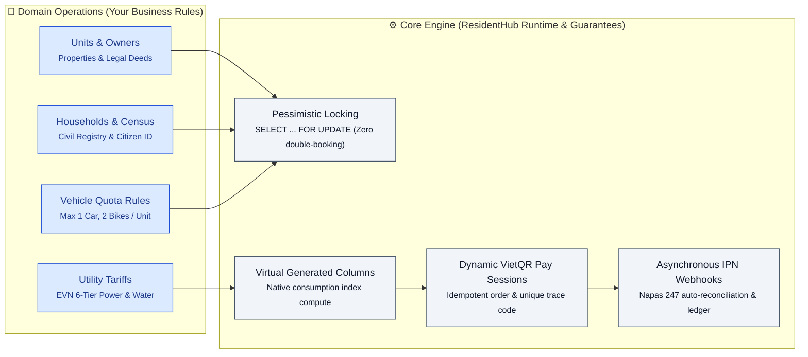
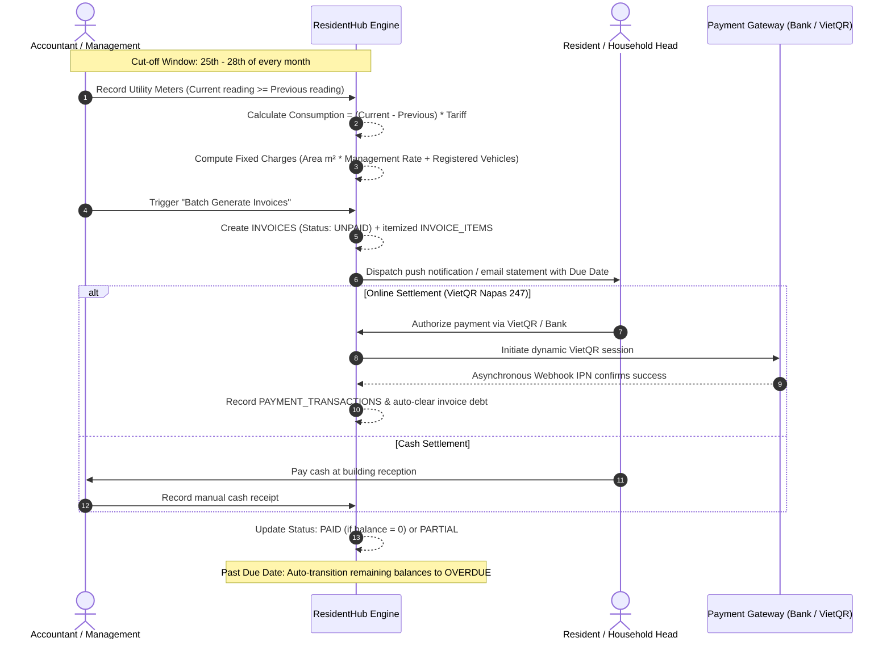
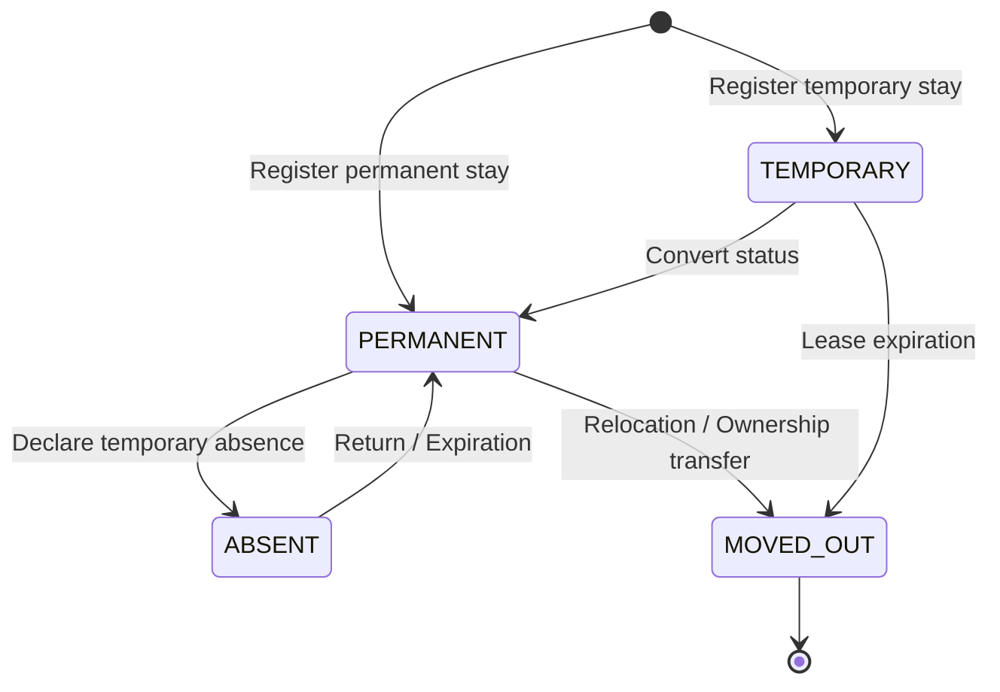
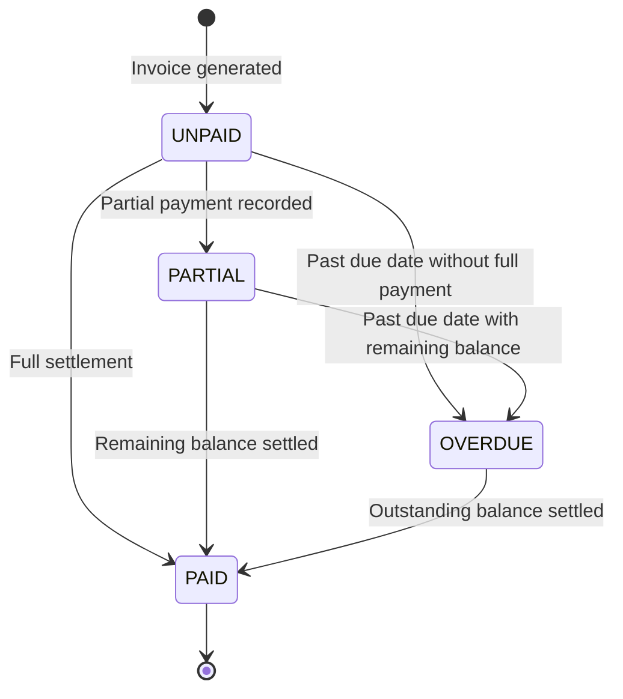
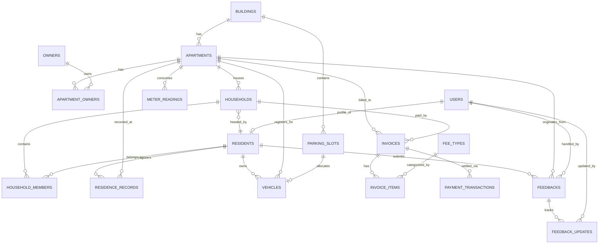

<div align="center">

# ResidentHub
**Modern Apartment & Household Management Platform**

*Single Source of Truth for Building Operations, Household Demographics, and Automated Billing.*

[](README.md)
[-brightgreen)](docs/adr/ADR-0009-frontend-testing-with-vitest-and-testing-library.md)
[](docs/ARCHITECTURE_ARC42.md)
[](docs/ARCHITECTURE_C4.md)
[-success)](docs/DATABASE_SPECIFICATION_AND_DIAGRAMS.md)
[](docs/openapi.yaml)
[](/api-docs)
[](docs/SYSTEM_WORKFLOWS_AND_SPECS.md)
[](docs/UI_DATABASE_MAPPING.md)
[-purple)](docs/adr/README.md)

</div>

---

## 💡 The Core Architectural Formula

```
ResidentHub  =  3NF Relational Integrity  +  Pessimistic Asset Locks  +  Tariff Engine  +  Dynamic VietQR Settlement
```

> Modern residential facility operations cannot rely on paper logs or disparate spreadsheets.  
> It is a **network of statutory civil demographics, scarce physical assets (basement parking bays), and immediate financial reconciliation**.



<div align="center">
<b>You define the community policies and manage residents. ResidentHub automates relational integrity and financial ledger reconciliation.</b>
</div>

<div align="center">

### [Explore Live Application Tour →](#-user-interface-tour)

[](#-user-interface-tour)

<sub><b>Real Running Application</b> — Next.js 16 App Router, FastAPI 3-Tier Backend, 18 normalized 3NF tables, and full automated test suite <b>26/26 tests PASS (0.42s)</b>.<br/><a href="#-user-interface-tour">Inspect every screen and workflow below →</a></sub>

</div>

---

## ⚡ Three Minutes to a Running System

### 1. The Pure Domain Logic — EVN 6-Tier Progressive Electricity Calculation
Never embed domain rules inside HTTP controllers or ad-hoc SQL queries. Tiered utility tariffs and consumption quotas are encapsulated in pure, isolated domain services:

```python
from backend.app.services.billing_service import BillingService

# Calculate residential electricity consumption across EVN 6 progressive tiers
service = BillingService()
breakdown = service.calculate_electricity_tiered(kwh_consumed=245.0)

# Precise tiered allocation:
# Tier 1 (0-50 kWh):    50 kWh x 1,806 VND =  90,300 VND
# Tier 2 (51-100 kWh):  50 kWh x 1,866 VND =  93,300 VND
# Tier 3 (101-200 kWh): 100 kWh x 2,167 VND = 216,700 VND
# Tier 4 (201-300 kWh): 45 kWh x 2,729 VND = 122,805 VND
# 8% VAT is automatically computed over the total gross amount
```

### 2. The Idempotent VietQR Pay Session Flow
Generate dynamic inter-bank payment QR sessions (Napas 247 standard), verified asynchronously through secure IPN webhooks:

```python
# API Ingress: POST /api/v1/billing/invoices/{invoice_id}/pay-session
pay_session = await billing_service.create_pay_session(
    invoice_id="inv-a1205-2026-03",
    payment_method="VIETQR"
)
# Returns dynamic VietQR image payload, exact amount, and an idempotent correlation ID
```

### 3. Run It Locally in Two Terminals

```bash
# Terminal 1: Launch FastAPI Backend Server (Port 8000)
cd backend && uvicorn app.main:app --reload

# Terminal 2: Launch Next.js Frontend Application (Port 3000)
cd frontend && npm run dev

# Verification: Run entire 26 Unit & Integration Tests (< 1 second)
pytest backend/tests
# ======================== 26 passed in 0.42s ========================
```

---

## 🥊 Why ResidentHub vs Legacy Approaches?

| Architectural Concern | Spreadsheets & Chat Groups | Legacy Monolith Suites | **ResidentHub Architecture** |
| :--- | :--- | :--- | :--- |
| **Basement Parking Bay Contention** | Frequent double-booking via stale files | High race condition risk during concurrent edits | **Pessimistic Lock `SELECT ... FOR UPDATE` (0% collision guarantee)** |
| **Utility Meter Computations** | Prone to formula typos and negative indices | Manually calculated in application memory | **Generated Columns `(current - prev)` at DB layer + EVN 6-Tier Engine** |
| **Debt Clearing & Reconciliation** | Residents upload payment screenshots manually | Accountants manually review bank statements | **Dynamic VietQR session + Asynchronous Napas 247 Webhook auto-clearing** |
| **National Citizen ID (CCCD) Privacy** | Plain spreadsheets prone to leakage | Plaintext storage in application tables | **4-Tier RBAC governance adhering to Vietnamese Personal Data Protection Decree 13/2023/ND-CP** |
| **Civil Demographic Kinship Integrity** | Untracked splits, moves, and orphaned entries | Loose relationships prone to orphaned records | **18-Table 3NF Normalized Schema, Surrogate UUID v4, Strict Cascading** |
| **Automated Test Suite Velocity** | No tests | Slow, brittle, manual QA cycles | **26 Automated Unit & Integration Tests passing in 0.42 seconds** |

---

## 📊 Metric Box — System at a Glance

| Dimension | Specification | Notes |
| :--- | :--- | :--- |
| **Functional Scope** | **7 Core Modules** | Buildings, Households, Residents, Stay Tracking, Vehicles, Invoices, Feedbacks |
| **Database Architecture** | **18 Relational Tables (3NF)** | Fully normalized PostgreSQL schema with composite unique keys & cascading rules |
| **Data Definition** | **DBML + SQL DDL + ERD** | [`docs/DATABASE_SPECIFICATION_AND_DIAGRAMS.md`](docs/DATABASE_SPECIFICATION_AND_DIAGRAMS.md), [`database/schema.dbml`](database/schema.dbml) and [`database/schema.sql`](database/schema.sql) |
| **API Specifications** | **OpenAPI 3.0.3 + Swagger UI** | [`docs/openapi.yaml`](docs/openapi.yaml) (1,514 lines) and interactive console at [`/api-docs`](/api-docs) |
| **Access Governance (RBAC)**| **4 Distinct Roles** | `ADMIN`, `MANAGER`, `TECHNICIAN`, `RESIDENT` with row-level data isolation |
| **Backend Stack** | **Python 3.11 + FastAPI + AsyncPG** | Strict 3-Tier Layering: Controllers $\rightarrow$ Domain Services $\rightarrow$ SQL Repositories |
| **Frontend Stack** | **Next.js 16 (React 19) + TypeScript** | Modern App Router, Server Components & Tailwind CSS v4 |
| **Test Verification** | **26/26 Tests Passed (0.42s)** | Automated Pytest suite covering Auth, Billing Engine, Quotas, and SLA workflows |
| **Traceability** | **100% UI to Database Alignment** | Every UI field is explicitly mapped to database columns in [`docs/UI_DATABASE_MAPPING.md`](docs/UI_DATABASE_MAPPING.md) |

---

## 🏗️ Architecture: 3 System Views

### View 1: Top-Down Business Deconstruction

Decomposed from the high-level management objective, the platform encapsulates 7 operational subsystems:


```
                            ┌─ 1. Buildings & Apartments (Properties & Floor plans)
                            ├─ 2. Households & Family Rosters (Civil registry books)
                            ├─ 3. Residents & Demographics (Citizen ID, Legal identity)
ResidentHub Operations ─────┼─ 4. Residence Tracking (Temporary stay, Absence, Move-out)
        Platform            ├─ 5. Vehicles & Parking Allocation (Basement B1/B2, RFID)
                            ├─ 6. Automated Billing & Invoicing (Meters, Tariffs, Overdue)
                            └─ 7. Maintenance & Resident Feedback (Tickets, SLA triage)
```

---

### View 2: Monthly Billing & Settlement Sequence

Automating the entire recurring financial lifecycle: from cut-off meter readings to batch invoicing and payment gateway reconciliation.



---

### View 3: Civil Residency & Invoice State Machines

#### A. Residency Movement Lifecycle


#### B. Invoice Financial Lifecycle


---

## 🖥️ User Interface Tour

ResidentHub is a production-grade enterprise application, not a mock design. All screens below are captured directly from the running Next.js application:

### 1. Operations Command Console (Dashboard)
Central oversight console aggregating building occupancy, recurring revenue collection rates, civil movements, and open maintenance requests.


---

### 2. Apartments & Properties Management
Visual directory of units with multi-tower filtering (Tower A, Tower B), floor distribution, bedroom specs, and live occupancy states.


Clicking into any unit reveals the comprehensive **Apartment Deep-Dive Dossier**, linking ownership legal contracts, registered co-occupants, vehicle parking slots, and historical invoice statements:


---

### 3. Residents & Household Demographics
Official civil registration roster tracking 12-digit Citizen Identity Cards (CCCD), family kinship relations (*Head of Household, Spouse, Child*), and statutory residency classifications (*Permanent, Temporary*).


---

### 4. Automated Recurring Billing & Debt Reconciliation
Itemized monthly service invoice management featuring automated tariff calculations, overdue debt tracking, and interactive multi-channel payment reconciliation (*VietQR, Cash, VNPay*).


---

### 5. Service Requests & Resident Feedback SLA
Centralized maintenance ticket triage with urgency prioritization (*Urgent, High Priority*), category routing (*Technical Repair, Sanitation, Noise, Security*), and technician dispatch logging.


---

### 6. Vehicles & Basement Parking Slots (B1 & B2)
Underground parking allocation enforcing apartment vehicle quotas, license plate records, and contactless RFID access card assignments.


---

### 📑 Complete Screens Index

| Application Module | Screen Scope & Capabilities | Direct Route | Screenshot |
| :--- | :--- | :--- | :---: |
| **Command Console** | Macro KPI cards, revenue pulse, recent civil movement timeline | `/` | [View Screen](docs/screenshots/dashboard.png) |
| **Apartment Directory** | Unit grid, floor plans, area specs, occupancy filters | `/can-ho` | [View Screen](docs/screenshots/apartments.png) |
| **Apartment Dossier** | Ownership tenure, co-occupants, vehicles, financial ledger | `/can-ho/[roomNumber]` | [View Screen](docs/screenshots/apartment_detail.png) |
| **Resident Demographics** | Civil profiles, national Citizen ID (CCCD), family tree relationships | `/cu-dan` | [View Screen](docs/screenshots/residents.png) |
| **Billing & Payments** | Automated utility billing, overdue reminders, VietQR payment modal | `/phi-chung-cu` | [View Screen](docs/screenshots/billing.png) |
| **Feedback & Tickets** | Resident incident triage, technician dispatch, SLA status | `/phan-anh-va-yeu-cau` | [View Screen](docs/screenshots/tickets.png) |
| **Vehicles & Parking** | Basement B1/B2 parking allocation, RFID smart card cards | `/phuong-tien-va-bai-do` | [View Screen](docs/screenshots/vehicles.png) |
| **API Documentation** | Interactive Swagger UI API console | `/api-docs` | [Open Console](/api-docs) |

---

## 🗄️ Database Architecture & Normalized ERD

The database schema is modeled in 3NF across 18 relational tables. Inspect the interactive schema definitions and diagrams:
- **Comprehensive ERD & Data Dictionary:** [`docs/DATABASE_SPECIFICATION_AND_DIAGRAMS.md`](docs/DATABASE_SPECIFICATION_AND_DIAGRAMS.md)
- **DBML Schema:** [`database/schema.dbml`](database/schema.dbml)
- **PostgreSQL DDL:** [`database/schema.sql`](database/schema.sql)



---

## 📚 Architecture Documentation Index

All architectural specifications are cross-referenced across the `docs/` catalog:

| Document | Discipline | What It Answers |
| :--- | :--- | :--- |
| **[REQUIREMENTS_INVEST.md](docs/REQUIREMENTS_INVEST.md)** | Requirements Engineering | How are Agile User Stories defined? What are the verifiable BDD Gherkin acceptance criteria and INVEST compliance metrics? |
| **[USE_CASES.md](docs/USE_CASES.md)** | Functional Specifications | What is the full functional use case catalog, actor taxonomy, and failure twin handling scenarios? |
| **[UI_UX_SPECIFICATION.md](docs/UI_UX_SPECIFICATION.md)** | Interaction Design | How is the 4-level Information Architecture (IA) structured? What are the design tokens and screen transition rules? |
| **[UI_DATABASE_MAPPING.md](docs/UI_DATABASE_MAPPING.md)** | Field-Level Traceability | Which SQL table and column does each visual input and metric card correspond to across all 7 operational screens? |
| **[ARCHITECTURE_C4.md](docs/ARCHITECTURE_C4.md)** | Visual Architecture (C4 Model) | How does the system look across Context (C1), Container (C2), Component (C3), Dynamic runtime, and Production deployment views? |
| **[ARCHITECTURE_ARC42.md](docs/ARCHITECTURE_ARC42.md)** | Architecture (arc42 Standard) | How is the complete 12-section international IEEE 42010 architecture documentation structured? |
| **[adr/README.md](docs/adr/README.md)** | Architecture Decisions (MADR 3.0) | What are the formal architectural choices, rationales, and trade-offs (3NF, Pessimistic Locking, VietQR, Monorepo)? |
| **[DATABASE_SPECIFICATION_AND_DIAGRAMS.md](docs/DATABASE_SPECIFICATION_AND_DIAGRAMS.md)** | Data Engineering | What is the 18-table 3NF schema design, data dictionary, indexing strategy, and pessimistic locking specification? |
| **[openapi.yaml](docs/openapi.yaml)** | API Standard (OpenAPI 3.0.3) | What are the machine-readable REST API contracts, DTO schemas, RFC 7807 problem envelopes, and RBAC requirements? |
| **[FOLDER_STRUCTURE_AND_3TIER_ARCHITECTURE.md](docs/FOLDER_STRUCTURE_AND_3TIER_ARCHITECTURE.md)** | Clean Architecture | How are layer boundaries enforced across Presentation (Controllers), Business Logic (Services), and Data Access (Repositories)? |
| **[DETAILED_CLASS_AND_SEQUENCE_DIAGRAMS.md](docs/DETAILED_CLASS_AND_SEQUENCE_DIAGRAMS.md)** | Detailed UML Modeling | What are the method-level class interactions and sequence workflows for VietQR settlement, parking allocation, and batch billing? |

---

## 🧭 Where the Project Actually Is

The project maintains the highest standard of technical transparency regarding production readiness:

### ✅ Verified & In Production Code:
- **Core Architecture & 3-Tier Layering:** 8 modular FastAPI routers, 6 Domain Services, 6 SQL Repositories fully functional.
- **Automated Test Suite:** **26/26 tests PASS in 0.42 seconds** ([backend/tests/](backend/tests/)), covering Auth/JWT, EVN 6-Tier calculations, vehicle quota enforcement, and maintenance ticket workflows.
- **In-Memory Fallback Mode:** Immediate developer feedback without requiring an external PostgreSQL instance.
- **Frontend App Router:** 7 operational modules built with React 19 + Next.js 16 + Tailwind CSS v4, including interactive Swagger UI at `/api-docs`.
- **Comprehensive Documentation Baseline:** 10 synchronized specifications connecting Requirements $\leftrightarrow$ Architecture $\leftrightarrow$ Database $\leftrightarrow$ Code.

### 🔄 Active Engineering Roadmap:
- **Live Database Migrations:** Integrating **Alembic** for automated versioned schema migrations.
- **Soft Delete Mechanism:** Adding standard `deleted_at` timestamps across core entities (`residents`, `apartments`, `households`).
- **Responsive Mobile Card Views:** Optimizing wide table layouts for smartphone viewports (< 768px).
- **Asynchronous Task Queue:** Adding Redis Queue / Celery for automated month-end batch billing across 2,000+ units.

---

## 👥 Contributors & License

- **Team:** ResidentHub Engineering
- **License:** Proprietary / MIT License
