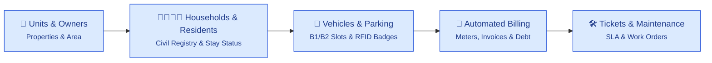
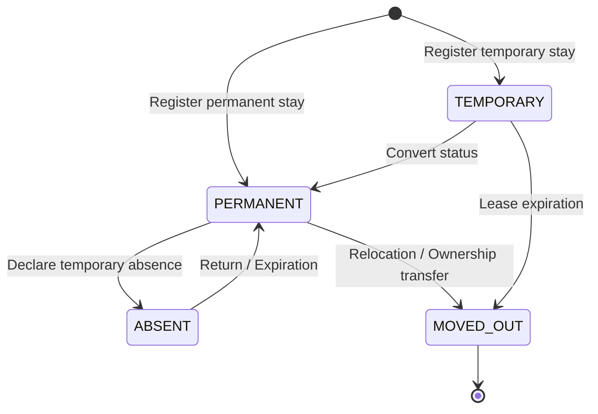
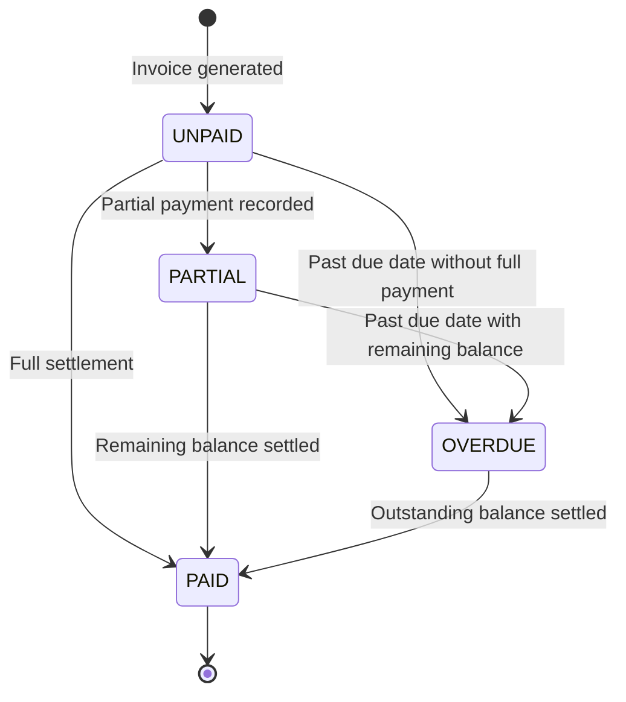
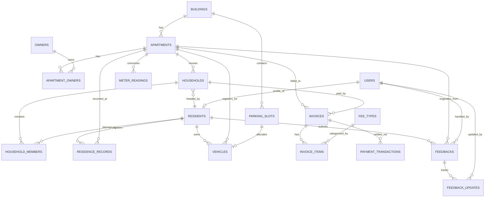

<div align="center">

# ResidentHub
**Modern Apartment & Household Management Platform**

*Single Source of Truth for Building Operations, Household Demographics, and Automated Billing.*

[](README.md)
[](docs/ARCHITECTURE_ARC42.md)
[](docs/ARCHITECTURE_C4.md)
[-success)](database/schema.dbml)
[](docs/API_DOCUMENTATION.md)
[](docs/SYSTEM_WORKFLOWS_AND_SPECS.md)
[](docs/UI_DATABASE_MAPPING.md)
[](https://stitch.withgoogle.com/projects/16326783556633031011?pli=1)

</div>



<div align="center">

### [Explore Live Application Tour →](#-user-interface-tour)

[](#-user-interface-tour)

<sub><b>Real Running Application</b> — Next.js App Router, 7 operational modules, 14 normalized tables, and full RBAC governance.<br/><a href="#-user-interface-tour">Inspect every screen and workflow below →</a></sub>

</div>

---

## 📊 Metric Box — System at a Glance

| Dimension | Specification | Notes |
| :--- | :--- | :--- |
| **Functional Scope** | **7 Core Modules** | Buildings, Households, Residents, Stay Tracking, Vehicles, Invoices, Feedbacks |
| **Database Architecture** | **14 Relational Tables (3NF)** | Fully normalized PostgreSQL schema with composite unique keys & cascading rules |
| **Data Definition** | **DBML + SQL DDL** | [`database/schema.dbml`](database/schema.dbml) and [`schema.sql`](schema.sql) |
| **Access Governance (RBAC)**| **4 Distinct Roles** | `ADMIN`, `MANAGER`, `TECHNICIAN`, `RESIDENT` with row-level data isolation |
| **Frontend Stack** | **Next.js (React 19) + TypeScript** | Modern App Router, Server Components & Tailwind CSS |
| **Traceability** | **100% UI to Database Alignment** | Every UI field is explicitly mapped to database columns in [`docs/UI_DATABASE_MAPPING.md`](docs/UI_DATABASE_MAPPING.md) |
| **UI/UX Prototype** | **[Interactive Stitch Prototype](https://stitch.withgoogle.com/projects/16326783556633031011?pli=1)** | High-fidelity interactive design system |

---

## 🏗️ Architecture: 3 System Views

### View 1: Top-Down Business Deconstruction

Decomposed from the high-level management objective, the platform encapsulates 7 operational subsystems:


```
                            ┌─ 1. Buildings & Apartments (Properties & Floor plans)
                            ├─ 2. Households & Family Rosters (So ho khau)
                            ├─ 3. Residents & Demographics (CCCD, Legal identity)
ResidentHub Operations ─────┼─ 4. Residence Tracking (Temporary stay, Absence, Move-out)
        Platform            ├─ 5. Vehicles & Parking Allocation (Basement B1/B2, RFID)
                            ├─ 6. Automated Billing & Invoicing (Meters, Tariffs, Overdue)
                            └─ 7. Maintenance & Resident Feedback (Tickets, SLA triage)
```

---

### View 2: Monthly Billing & Settlement Sequence

Automating the entire recurring financial lifecycle: from cut-off meter readings to batch invoicing and payment gateway reconciliation.


---

### View 3: Civil Residency & Invoice State Machines

#### A. Residency Movement Lifecycle


#### B. Invoice Financial Lifecycle


---

## 🖥️ User Interface Tour

ResidentHub is a production-grade enterprise application, not a mock design. All screens below are captured directly from the running Next.js application:

### 1. Operations Command Console (Dashboard)
Central oversight console aggregating building occupancy, recurring revenue collection rates, civil movements, and open maintenance requests.


---

### 2. Apartments & Properties Management
Visual directory of units with multi-tower filtering (Tower A, Tower B), floor distribution, bedroom specs, and live occupancy states.


Clicking into any unit reveals the comprehensive **Apartment Deep-Dive Dossier**, linking ownership legal contracts, registered co-occupants, vehicle parking slots, and historical invoice statements:


---

### 3. Residents & Household Demographics
Official civil registration roster tracking 12-digit Citizen Identity Cards (CCCD), family kinship relations (*Chủ hộ, Vợ, Con*), and statutory residency classifications (*Thường trú, Tạm trú*).


---

### 4. Automated Recurring Billing & Debt Reconciliation
Itemized monthly service invoice management featuring automated tariff calculations, overdue debt tracking, and interactive multi-channel payment reconciliation (*VietQR, Cash, VNPay*).


---

### 5. Service Requests & Resident Feedback SLA
Centralized maintenance ticket triage with urgency prioritization (*Khẩn cấp, Ưu tiên cao*), category routing (*Kỹ thuật, Vệ sinh, Tiếng ồn, An ninh*), and technician dispatch logging.


---

### 6. Vehicles & Basement Parking Slots (B1 & B2)
Underground parking allocation enforcing apartment vehicle quotas, license plate records, and contactless RFID access card assignments.


---

### 📑 Complete Screens Index

| Application Module | Screen Scope & Capabilities | Direct Route | Screenshot |
| :--- | :--- | :--- | :---: |
| **Command Console** | Macro KPI cards, revenue pulse, recent civil movement timeline | `/` | [View Screen](docs/screenshots/dashboard.png) |
| **Apartment Directory** | Unit grid, floor plans, area specs, occupancy filters | `/can-ho` | [View Screen](docs/screenshots/apartments.png) |
| **Apartment Dossier** | Ownership tenure, co-occupants, vehicles, financial ledger | `/can-ho/[roomNumber]` | [View Screen](docs/screenshots/apartment_detail.png) |
| **Resident Demographics** | Civil profiles, national CCCD, family tree relationships | `/cu-dan` | [View Screen](docs/screenshots/residents.png) |
| **Billing & Payments** | Automated utility billing, overdue reminders, payment modal | `/phi-chung-cu` | [View Screen](docs/screenshots/billing.png) |
| **Feedback & Tickets** | Resident incident triage, technician dispatch, SLA status | `/phan-anh-va-yeu-cau` | [View Screen](docs/screenshots/tickets.png) |
| **Vehicles & Parking** | Basement B1/B2 parking allocation, RFID smart card cards | `/phuong-tien-va-bai-do` | [View Screen](docs/screenshots/vehicles.png) |

---

## 🎯 UI to Database Traceability Matrix

ResidentHub guarantees architectural cohesion between the user interface and the underlying database schema. Detailed field-by-field mapping is available in [docs/UI_DATABASE_MAPPING.md](docs/UI_DATABASE_MAPPING.md).

| Application Screen | Route | Target Database Tables | Key Entities & Columns |
| :--- | :--- | :--- | :--- |
| **Apartments Management** | `/can-ho`, `/can-ho/[roomNumber]` | `apartments`, `buildings`, `owners`, `apartment_owners` | `room_number`, `floor`, `area`, `status`, `full_name`, `citizen_id` |
| **Resident Directory** | `/cu-dan` | `residents`, `households`, `household_members` | `full_name`, `citizen_id`, `resident_status`, `household_code`, `is_head` |
| **Stay Tracking & History**| `/cu-tru`, `/lich-su-cu-tru` | `residence_records` | `record_type`, `start_date`, `end_date`, `police_verified_code`, `status` |
| **Vehicles & Parking** | `/phuong-tien-va-bai-do` | `vehicles`, `parking_slots` | `license_plate`, `vehicle_type`, `rfid_card_number`, `slot_code`, `floor` |
| **Billing & Payments** | `/phi-chung-cu` | `invoices`, `invoice_items`, `meter_readings`, `payment_transactions` | `invoice_code`, `billing_month`, `total_amount`, `paid_amount`, `status` |
| **Service Tickets** | `/phan-anh-va-yeu-cau` | `feedbacks`, `feedback_updates` | `title`, `category`, `priority`, `status`, `assigned_to` |
| **Identity & Users** | `/nguoi-dung` | `users` | `username`, `role` (`ADMIN`, `MANAGER`, `TECHNICIAN`, `RESIDENT`), `is_active` |

---

## 🗄️ Database Architecture & Normalized ERD

The database schema is modeled in 3NF across 14 relational tables. Inspect the interactive schema definitions:
- **DBML Schema:** [`database/schema.dbml`](database/schema.dbml)
- **PostgreSQL DDL:** [`schema.sql`](schema.sql)



---

## 📚 Documentation Index

| Document | Topic | What it answers |
| :--- | :--- | :--- |
| [docs/README.md](docs/README.md) | Master Documentation Hub | Complete documentation portal, reading paths, and architectural overview |
| [ARCHITECTURE_C4.md](docs/ARCHITECTURE_C4.md) | Visual Architecture (C4 Model) | Context, Container, Component, Code diagrams, Dynamic sequence diagrams, and Deployment |
| [SYSTEM_WORKFLOWS_AND_SPECS.md](docs/SYSTEM_WORKFLOWS_AND_SPECS.md) | Business Logic & RBAC | State machine rules, RBAC permission matrix, and post-DBML roadmap |
| [API_DOCUMENTATION.md](docs/API_DOCUMENTATION.md) | API & Ingress Specification | REST endpoints, Server Actions, RFC 7807 problem details, and VietQR Webhooks |
| [UI_DATABASE_MAPPING.md](docs/UI_DATABASE_MAPPING.md) | UI to Database Traceability | Granular field-by-field mapping between application screens and SQL columns |
| [schema.dbml](database/schema.dbml) | Database Markup Language | Visual, importable DBML schema for dbdocs.io and dbdiagram.io |
| [schema.sql](schema.sql) | PostgreSQL DDL | Complete table definitions, indexes, composite constraints & triggers |
| [docs/screenshots/](docs/screenshots/README.md) | High-Res UI Gallery | Production screenshots across all 7 operational modules |

---

## 🚀 Quick Start

### 1. Install Dependencies

```bash
npm install
```

### 2. Setup Database (PostgreSQL)

Create the PostgreSQL database and import the schema from [schema.sql](schema.sql):

```bash
# Create database
createdb -U postgres resident_hub

# Import schema
psql -U postgres -d resident_hub -f schema.sql
```

### 3. Run Development Server

```bash
npm run dev
```

Open your browser at **[http://localhost:3000](http://localhost:3000)**.
