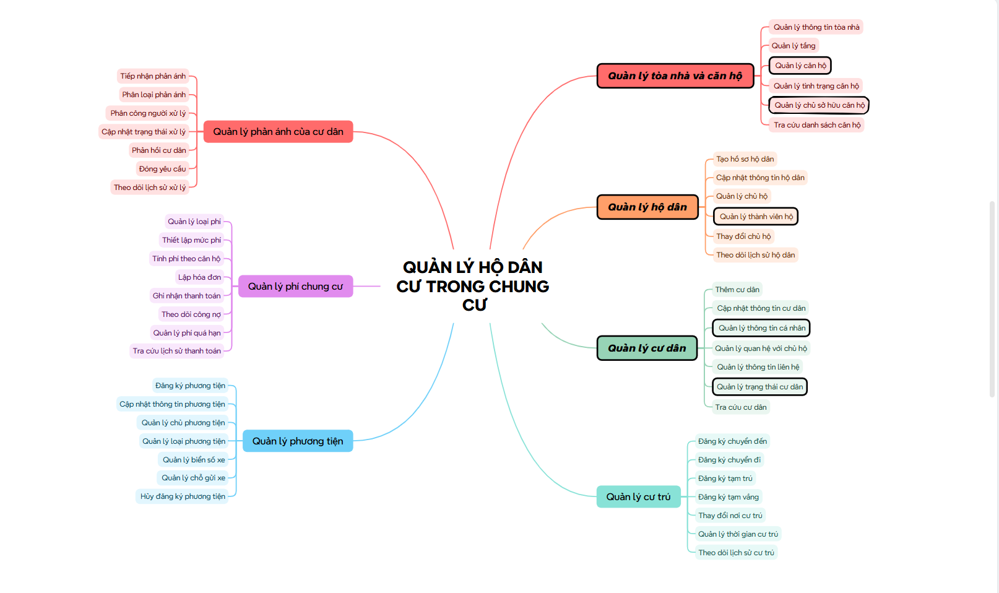

# Apartment Household Management

A simple web application to manage apartments, households, residents, and daily building operations.

---

## System Overview

Here is the functional mindmap of the system:



---

## Main Features

The system comprises 7 functional modules:

### 1. Buildings & Apartments
- **Manage Apartments**: Room number, floor, area, bedroom & bathroom count, and apartment category.
- **Manage Owners**: Ownership legal records, contact details (Citizen ID, phone number, email, property contracts).
- Building and floor management.
- Apartment occupancy status (*vacant, owner-occupied, rented, under renovation*).
- Apartment directory and advanced search (filter by building, floor, and occupancy status).

### 2. Households
- Create and update household registration profiles (*Sổ hộ khẩu*).
- Household head management.
- **Manage Family Members**: Detailed roster of occupants living together and their relationship to the household head.
- **Change of Household Head**: Ownership succession and headship transfer workflows.
- Household audit log (track household splitting, merging, and movement history).

### 3. Residents
- Register and manage resident profiles.
- **Personal Information**: Full legal name, Citizen ID / VNeID, date of birth, gender, and hometown.
- **Resident Status**: Permanent resident (*thường trú*), temporary resident (*tạm trú*), temporary absence (*tạm vắng*), moved out.
- Relationship to household head and primary contact details (phone, email).
- Central resident directory and search.

### 4. Residence & Stay Tracking
- Move-in and move-out registration workflows.
- Temporary residence (*tạm trú*) and absence (*tạm vắng*) declarations with police verification numbers.
- Internal relocation management (transfer between apartments within the complex).
- Stay duration tracking (proactive expiration alerts for temporary stays).
- Comprehensive residence movement history and audit trail.

### 5. Vehicles & Parking
- Vehicle registration and information management.
- Vehicle owner linkage and license plate management.
- Vehicle classification (cars, motorbikes, electric scooters, bicycles).
- RFID card management and dedicated slot allocation across basement levels (Basement B1 & B2).
- Vehicle deregistration and parking slot revocation upon departure.

### 6. Bills & Payments
- Service fee catalog and tariff configuration (management fees per m², parking fees, utilities).
- Automated billing calculation based on apartment floor area and utility meter readings.
- Recurring monthly invoice generation.
- Multi-channel payment recording (Bank transfer, Cash, VNPay, MoMo).
- Receivables and debt tracking, overdue invoice management, and complete transaction history.

### 7. Resident Feedback & Requests
- Service ticket reception and categorization (noise complaints, technical repairs, sanitation, security).
- Technician and building staff assignment.
- Workflow status updates (*Open, In Progress, Resolved, Closed*) with resident communication.
- Comprehensive request resolution history tracking.

---

## Tech Stack

- **Framework**: Next.js (React 19)
- **Language**: TypeScript
- **Styling**: Tailwind CSS
- **Database**: PostgreSQL (v13+)

---

## UI/UX Design

- **Prototype & Design**: [ResidentHub Apartment Management System](https://stitch.withgoogle.com/projects/16326783556633031011?pli=1)

---

## Database Design (ERD)

Normalized Entity-Relationship Diagram (ERD) for the ResidentHub management system:

```mermaid
erDiagram
    %% 1. TÒA NHÀ & CĂN HỘ
    BUILDINGS ||--o{ APARTMENTS : "has"
    BUILDINGS ||--o{ PARKING_SLOTS : "contains"
    APARTMENTS ||--o{ APARTMENT_OWNERS : "has"
    OWNERS ||--o{ APARTMENT_OWNERS : "owns"

    %% 2. HỘ DÂN & CƯ DÂN
    APARTMENTS ||--o{ HOUSEHOLDS : "houses"
    HOUSEHOLDS ||--o{ HOUSEHOLD_MEMBERS : "contains"
    RESIDENTS ||--o{ HOUSEHOLD_MEMBERS : "belongs_to"
    HOUSEHOLDS }o--|| RESIDENTS : "headed_by"

    %% 3. BIẾN ĐỘNG CƯ TRÚ
    RESIDENTS ||--o{ RESIDENCE_RECORDS : "registers"
    APARTMENTS ||--o{ RESIDENCE_RECORDS : "recorded_at"

    %% 4. PHƯƠNG TIỆN & BÃI ĐỖ
    RESIDENTS ||--o{ VEHICLES : "owns"
    APARTMENTS ||--o{ VEHICLES : "registers_for"
    PARKING_SLOTS ||--o| VEHICLES : "allocates"

    %% 5. PHÍ & HÓA ĐƠN
    APARTMENTS ||--o{ METER_READINGS : "consumes"
    APARTMENTS ||--o{ INVOICES : "billed_to"
    HOUSEHOLDS ||--o{ INVOICES : "paid_by"
    INVOICES ||--o{ INVOICE_ITEMS : "has"
    FEE_TYPES ||--o{ INVOICE_ITEMS : "categorized_by"
    INVOICES ||--o{ PAYMENT_TRANSACTIONS : "settled_via"

    %% 6. PHẢN ÁNH & DỊCH VỤ
    RESIDENTS ||--o{ FEEDBACKS : "submits"
    APARTMENTS ||--o{ FEEDBACKS : "originates_from"
    FEEDBACKS ||--o{ FEEDBACK_UPDATES : "tracks"

    %% 7. HỆ THỐNG & TÀI KHOẢN
    USERS ||--o| RESIDENTS : "profile_of"
    USERS ||--o{ FEEDBACKS : "handled_by"
    USERS ||--o{ FEEDBACK_UPDATES : "updated_by"

    %% ==========================================
    %% 1. TÒA NHÀ & CĂN HỘ
    %% ==========================================
    BUILDINGS {
        uuid id PK
        string code "Mã tòa, VD: TOWER_A"
        string name "Tên tòa nhà"
        int total_floors "Số tầng"
        string address "Địa chỉ"
        timestamp created_at
    }

    APARTMENTS {
        uuid id PK
        uuid building_id FK
        string room_number "Số phòng: 1205"
        int floor "Số tầng"
        decimal area "Diện tích m2"
        int bedroom_count "Số phòng ngủ"
        int bathroom_count "Số WC"
        string status "EMPTY, RENTED, OWNER_OCCUPIED"
        timestamp created_at
    }

    OWNERS {
        uuid id PK
        string full_name "Tên chủ sở hữu"
        string citizen_id "Số CCCD"
        string phone "Số điện thoại"
        string email "Email"
        string address "Địa chỉ"
        timestamp created_at
    }

    APARTMENT_OWNERS {
        uuid id PK
        uuid apartment_id FK
        uuid owner_id FK
        string ownership_type "SOLE, CO_OWNER"
        date start_date "Ngày bắt đầu sở hữu"
        date end_date "Ngày chuyển nhượng"
        boolean is_current "Đang sở hữu"
    }

    %% ==========================================
    %% 2. HỘ DÂN & CƯ DÂN
    %% ==========================================
    HOUSEHOLDS {
        uuid id PK
        uuid apartment_id FK
        uuid head_resident_id FK "Chủ hộ"
        string household_code "Mã sổ hộ khẩu"
        date registration_date "Ngày lập sổ"
        string status "ACTIVE, MOVED_OUT"
        timestamp created_at
    }

    RESIDENTS {
        uuid id PK
        string full_name "Họ và tên"
        string citizen_id "Số CCCD"
        date date_of_birth "Ngày sinh"
        string gender "MALE, FEMALE, OTHER"
        string phone "Số điện thoại"
        string email "Email"
        string hometown "Quê quán"
        string resident_status "PERMANENT, TEMPORARY, ABSENT, MOVED"
        timestamp created_at
    }

    HOUSEHOLD_MEMBERS {
        uuid id PK
        uuid household_id FK
        uuid resident_id FK
        string relationship_to_head "Quan hệ với chủ hộ"
        date joined_date "Ngày nhập hộ"
        boolean is_head "Là chủ hộ"
    }

    %% ==========================================
    %% 3. BIẾN ĐỘNG CƯ TRÚ
    %% ==========================================
    RESIDENCE_RECORDS {
        uuid id PK
        uuid resident_id FK
        uuid apartment_id FK
        string record_type "TAM_TRU, TAM_VANG, NHAP_HO, CHUYEN_DI"
        date start_date "Ngày bắt đầu"
        date end_date "Ngày kết thúc"
        string reason "Lý do khai báo"
        string police_verified_code "Mã xác nhận công an"
        string status "PENDING, APPROVED, EXPIRED"
    }

    %% ==========================================
    %% 4. PHƯƠNG TIỆN & BÃI ĐỖ
    %% ==========================================
    PARKING_SLOTS {
        uuid id PK
        uuid building_id FK
        string slot_code "Mã vị trí đỗ: B1-01"
        string floor "Tầng hầm: B1, B2"
        string allowed_type "CAR, MOTORBIKE, BICYCLE"
        string status "AVAILABLE, OCCUPIED, RESERVED"
    }

    VEHICLES {
        uuid id PK
        uuid resident_id FK
        uuid apartment_id FK
        uuid parking_slot_id FK
        string license_plate "Biển số xe"
        string vehicle_type "CAR, MOTORBIKE, ELECTRIC_BIKE"
        string brand_model "Hãng và mẫu xe"
        string color "Màu xe"
        string rfid_card_number "Mã thẻ từ gửi xe"
        string status "ACTIVE, INACTIVE, REVOKED"
        date registration_date "Ngày đăng ký"
    }

    %% ==========================================
    %% 5. PHÍ & HÓA ĐƠN
    %% ==========================================
    FEE_TYPES {
        uuid id PK
        string code "Mã loại phí"
        string name "Tên loại phí"
        string unit "Đơn vị tính: m2, xe, m3, kWh"
        decimal unit_price "Đơn giá quy định"
        boolean is_mandatory "Bắt buộc hàng tháng"
    }

    METER_READINGS {
        uuid id PK
        uuid apartment_id FK
        string meter_type "WATER, ELECTRICITY"
        string billing_period "Kỳ chốt số: 10-2025"
        decimal previous_reading "Chỉ số đầu"
        decimal current_reading "Chỉ số cuối"
        decimal consumption "Lượng tiêu thụ"
        timestamp recorded_at
    }

    INVOICES {
        uuid id PK
        uuid apartment_id FK
        uuid household_id FK
        string invoice_code "Mã HĐ: INV-202510-1205"
        string billing_month "Tháng: 10/2025"
        decimal total_amount "Tổng tiền phải nộp"
        decimal paid_amount "Số tiền đã nộp"
        date due_date "Hạn chót thanh toán"
        string status "UNPAID, PARTIAL, PAID, OVERDUE"
        timestamp created_at
    }

    INVOICE_ITEMS {
        uuid id PK
        uuid invoice_id FK
        uuid fee_type_id FK
        string item_name "Tên khoản phí"
        decimal quantity "Số lượng (m2, số xe, m3)"
        decimal unit_price "Đơn giá"
        decimal amount "Thành tiền"
    }

    PAYMENT_TRANSACTIONS {
        uuid id PK
        uuid invoice_id FK
        decimal amount "Số tiền thanh toán"
        string payment_method "BANK_TRANSFER, CASH, VNPAY, MOMO"
        string transaction_code "Mã giao dịch"
        timestamp paid_at
    }

    %% ==========================================
    %% 6. PHẢN ÁNH & DỊCH VỤ
    %% ==========================================
    FEEDBACKS {
        uuid id PK
        uuid resident_id FK
        uuid apartment_id FK
        uuid assigned_to FK "Nhân viên xử lý"
        string title "Tiêu đề phản ánh"
        string category "NOISE, REPAIR, CLEANING, SECURITY"
        string priority "LOW, MEDIUM, HIGH, URGENT"
        string status "OPEN, IN_PROGRESS, RESOLVED, CLOSED"
        timestamp created_at
    }

    FEEDBACK_UPDATES {
        uuid id PK
        uuid feedback_id FK
        uuid updated_by_user_id FK
        string message "Nội dung cập nhật tiến độ"
        string previous_status "Trạng thái trước"
        string new_status "Trạng thái mới"
        timestamp created_at
    }

    %% ==========================================
    %% 7. HỆ THỐNG & TÀI KHOẢN
    %% ==========================================
    USERS {
        uuid id PK
        uuid resident_id FK "Liên kết cư dân"
        string username "Tên đăng nhập"
        string password_hash "Mật khẩu mã hóa"
        string role "ADMIN, MANAGER, TECHNICIAN, RESIDENT"
        string full_name "Họ và tên"
        string email "Email"
        string phone "Số điện thoại"
        boolean is_active "Trạng thái hoạt động"
    }
```



---

## Quick Start

### 1. Install Dependencies

```bash
npm install
```

### 2. Setup Database (PostgreSQL)

Create the PostgreSQL database and import the schema from [schema.sql](schema.sql):

```bash
# Create database
createdb -U postgres resident_hub

# Import schema
psql -U postgres -d resident_hub -f schema.sql
```

### 3. Run Development Server

```bash
npm run dev
```

Open your browser at **[http://localhost:3000](http://localhost:3000)**.
