<div align="center">

# ResidentHub
**Modern Apartment & Household Management Platform**

*Single Source of Truth for Building Operations, Household Demographics, and Automated Billing.*

[](README.md)
[-brightgreen)](backend/tests/)
[](docs/ARCHITECTURE_ARC42.md)
[](docs/ARCHITECTURE_C4.md)
[-success)](docs/DATABASE_SPECIFICATION_AND_DIAGRAMS.md)
[](docs/openapi.yaml)
[](/api-docs)
[](docs/SYSTEM_WORKFLOWS_AND_SPECS.md)
[](docs/UI_DATABASE_MAPPING.md)

</div>

---

## 💡 The Core Architectural Formula

```
ResidentHub  =  3NF Relational Integrity  +  Pessimistic Asset Locks  +  Tariff Engine  +  Dynamic VietQR Settlement
```

> Vận hành chung cư hiện đại không thể dựa trên sổ tay hay bảng tính Excel rời rạc.  
> Đó là **mạng lưới quản trị nhân khẩu pháp lý, tài sản hữu hạn (slot đỗ xe hầm) và dòng tiền đối soát tức thì**.


<div align="center">
<b>Bạn quản trị cư dân và thiết lập quy định tòa nhà. ResidentHub tự động hóa toàn bộ sự toàn vẹn dữ liệu và đối soát tài chính.</b>
</div>

<div align="center">

### [Khám phá giao diện thực tế của hệ thống →](#-user-interface-tour)

[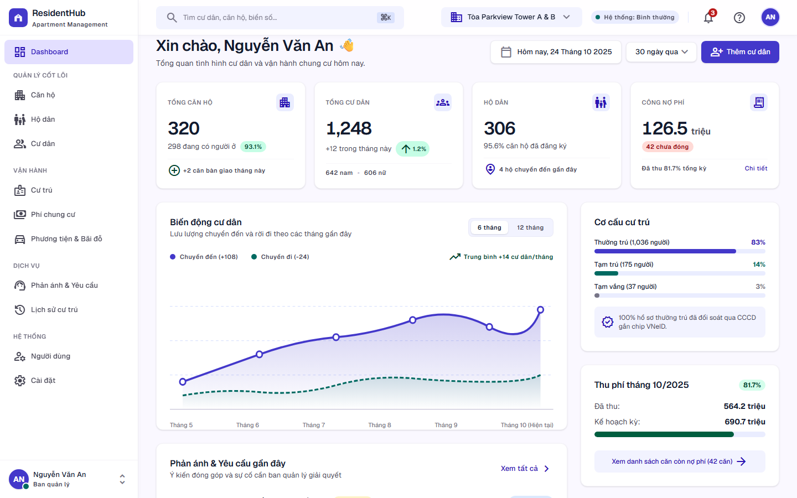](#-user-interface-tour)

<sub><b>Real Running Application</b> — Next.js 16 App Router, FastAPI 3-Tier Backend, 18 bảng chuẩn hóa 3NF, và bộ kiểm thử tự động <b>26/26 tests PASS (0.42s)</b>.<br/><a href="#-user-interface-tour">Khám phá chi tiết toàn bộ các màn hình và quy trình bên dưới →</a></sub>

</div>

---

## ⚡ 3 Minutes to a Running System

### 1. The Pure Domain Logic — EVN 6-Tier Electricity Calculation
Không nhúng logic nghiệp vụ vào controller hay câu lệnh SQL. Biểu giá điện bậc thang sinh hoạt và hạn mức định mức được đóng gói trong domain service độc lập:

```python
from backend.app.services.billing_service import BillingService

# Tính toán tiền điện sinh hoạt theo 6 bậc lũy tiến EVN
service = BillingService()
breakdown = service.calculate_electricity_tiered(kwh_consumed=245.0)

# Kết quả phân bổ từng bậc chuẩn xác:
# Bậc 1 (0-50 kWh):    50 kWh x 1,806đ = 90,300đ
# Bậc 2 (51-100 kWh):  50 kWh x 1,866đ = 93,300đ
# Bậc 3 (101-200 kWh): 100 kWh x 2,167đ = 216,700đ
# Bậc 4 (201-300 kWh): 45 kWh x 2,729đ = 122,805đ
# Thuế GTGT 8% được tự động tính trên tổng thành tiền
```

### 2. The Idempotent VietQR Pay Session Flow
Sinh phiên thanh toán mã QR ngân hàng động theo chuẩn Napas 247, tự động đối soát qua Webhook IPN:

```python
# API Ingress: POST /api/v1/billing/invoices/{invoice_id}/pay-session
pay_session = await billing_service.create_pay_session(
    invoice_id="inv-a1205-2026-03",
    payment_method="VIETQR"
)
# Trả về mã VietQR động, số tiền chính xác và correlation_id gạch nợ tự động
```

### 3. Run It Locally in 2 Terminals

```bash
# 1. Khởi động Backend FastAPI (Port 8000)
cd backend && uvicorn app.main:app --reload

# 2. Khởi động Frontend Next.js (Port 3000)
cd frontend && npm run dev

# 3. Chạy toàn bộ 26 Unit & Integration Tests (< 1 giây)
pytest backend/tests
# ======================== 26 passed in 0.42s ========================
```

---

## 🥊 Why ResidentHub vs Legacy Approaches?

| Trọng tâm kỹ thuật | Quản lý Excel / Zalo | Phần mềm đóng gói cũ (Monolith) | **ResidentHub Architecture** |
| :--- | :--- | :--- | :--- |
| **Trùng chỗ đỗ xe hầm (B1/B2)** | Rất thường xuyên do chia sẻ file trễ | Dễ xảy ra khi 2 nhân viên cùng mở form | **Pessimistic Lock `SELECT ... FOR UPDATE` (Cam kết 0% trùng lặp)** |
| **Chỉ số tiêu thụ điện & nước** | Dễ gõ nhầm công thức, lệch số âm | Tính toán thủ công ở tầng code | **Generated Columns `(current - prev)` cấp DB + EVN 6-Tier Engine** |
| **Gạch nợ & Đối soát tài chính** | Cư dân gửi ảnh chụp màn hình qua Zalo | Kế toán tra sổ phụ ngân hàng thủ công | **Mã VietQR động + Webhook IPN Napas 247 tự động gạch nợ tức thì** |
| **Bảo mật dữ liệu CCCD / VNeID** | Lưu file sheet phân tán, dễ lộ lọt | Lưu plain-text trong CSDL | **Phân quyền 4-Tier RBAC, tuân thủ Nghị định 13/2023/NĐ-CP** |
| **Toàn vẹn quan hệ nhân khẩu** | Khó theo dõi lịch sử tách/nhập hộ | Ràng buộc lỏng lẻo, sinh dữ liệu mồ côi | **Chuẩn hóa 3NF 18 bảng, Surrogate UUID v4, Cascading Rules** |
| **Tốc độ chu kỳ kiểm thử tự động** | Không có kiểm thử | Kiểm thử thủ công chậm chạp | **26 Unit & Integration Tests tự động PASS trong 0.42 giây** |

---

## 📊 Metric Box — System at a Glance

| Dimension | Specification | Notes |
| :--- | :--- | :--- |
| **Functional Scope** | **7 Core Modules** | Buildings, Households, Residents, Stay Tracking, Vehicles, Invoices, Feedbacks |
| **Database Architecture** | **18 Relational Tables (3NF)** | Fully normalized PostgreSQL schema with composite unique keys & cascading rules |
| **Data Definition** | **DBML + SQL DDL + ERD** | [`docs/DATABASE_SPECIFICATION_AND_DIAGRAMS.md`](docs/DATABASE_SPECIFICATION_AND_DIAGRAMS.md), [`database/schema.dbml`](database/schema.dbml) and [`database/schema.sql`](database/schema.sql) |
| **API Specifications** | **OpenAPI 3.0.3 + Swagger UI** | [`docs/openapi.yaml`](docs/openapi.yaml) (1,514 lines) and interactive console at [`/api-docs`](/api-docs) |
| **Access Governance (RBAC)**| **4 Distinct Roles** | `ADMIN`, `MANAGER`, `TECHNICIAN`, `RESIDENT` with row-level data isolation |
| **Backend Stack** | **Python 3.11 + FastAPI + AsyncPG** | Strict 3-Tier Layering: Controllers $\rightarrow$ Domain Services $\rightarrow$ SQL Repositories |
| **Frontend Stack** | **Next.js 16 (React 19) + TypeScript** | Modern App Router, Server Components & Tailwind CSS v4 |
| **Test Verification** | **26/26 Tests Passed (0.42s)** | Automated Pytest suite covering Auth, Billing Engine, Quotas, and SLA workflows |
| **Traceability** | **100% UI to Database Alignment** | Every UI field is explicitly mapped to database columns in [`docs/UI_DATABASE_MAPPING.md`](docs/UI_DATABASE_MAPPING.md) |

---

## 🏗️ Architecture: 3 System Views

### View 1: Top-Down Business Deconstruction

Decomposed from the high-level management objective, the platform encapsulates 7 operational subsystems:


```
                            ┌─ 1. Buildings & Apartments (Properties & Floor plans)
                            ├─ 2. Households & Family Rosters (So ho khau)
                            ├─ 3. Residents & Demographics (CCCD, Legal identity)
ResidentHub Operations ─────┼─ 4. Residence Tracking (Temporary stay, Absence, Move-out)
        Platform            ├─ 5. Vehicles & Parking Allocation (Basement B1/B2, RFID)
                            ├─ 6. Automated Billing & Invoicing (Meters, Tariffs, Overdue)
                            └─ 7. Maintenance & Resident Feedback (Tickets, SLA triage)
```

---

### View 2: Monthly Billing & Settlement Sequence

Automating the entire recurring financial lifecycle: from cut-off meter readings to batch invoicing and payment gateway reconciliation.

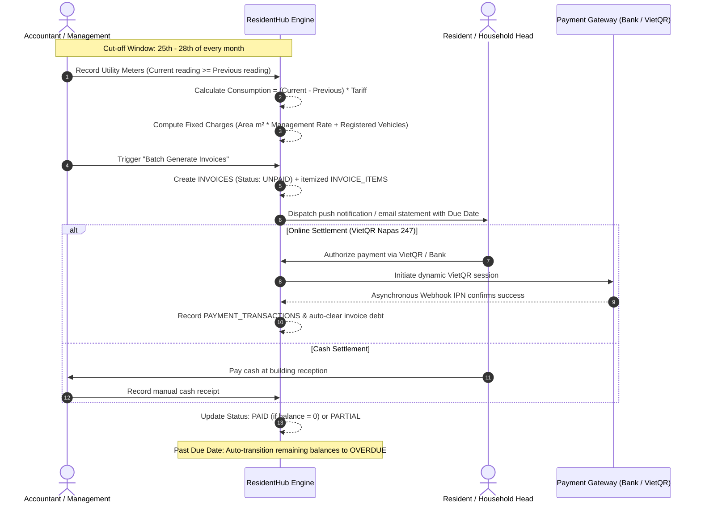

---

### View 3: Civil Residency & Invoice State Machines

#### A. Residency Movement Lifecycle
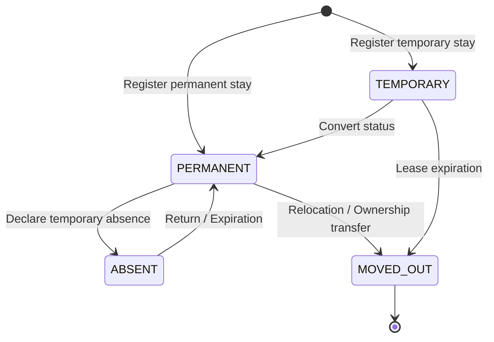

#### B. Invoice Financial Lifecycle
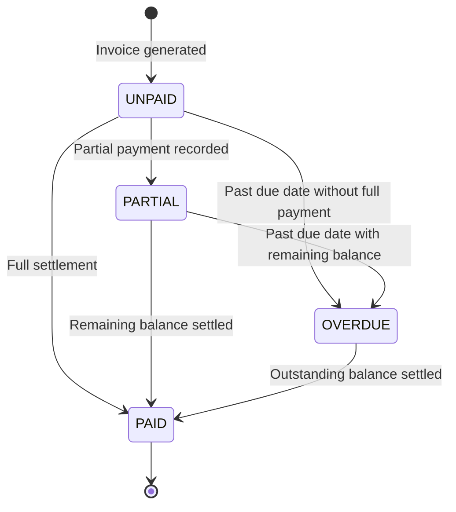

---

## 🖥️ User Interface Tour

ResidentHub is a production-grade enterprise application, not a mock design. All screens below are captured directly from the running Next.js application:

### 1. Operations Command Console (Dashboard)
Central oversight console aggregating building occupancy, recurring revenue collection rates, civil movements, and open maintenance requests.


---

### 2. Apartments & Properties Management
Visual directory of units with multi-tower filtering (Tower A, Tower B), floor distribution, bedroom specs, and live occupancy states.

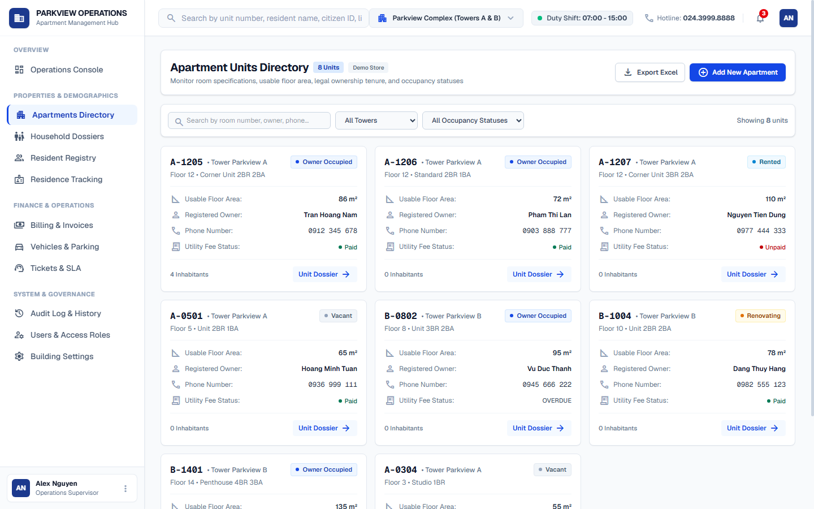

Clicking into any unit reveals the comprehensive **Apartment Deep-Dive Dossier**, linking ownership legal contracts, registered co-occupants, vehicle parking slots, and historical invoice statements:

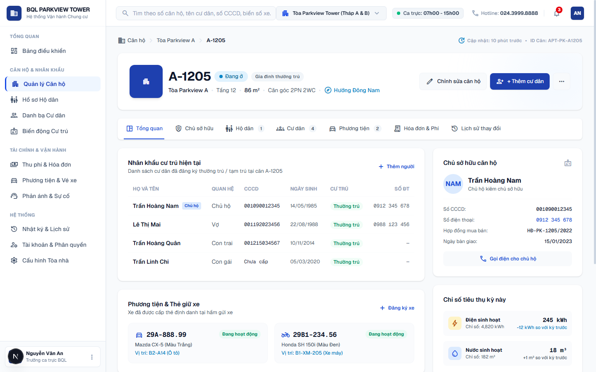

---

### 3. Residents & Household Demographics
Official civil registration roster tracking 12-digit Citizen Identity Cards (CCCD), family kinship relations (*Chủ hộ, Vợ, Con*), and statutory residency classifications (*Thường trú, Tạm trú*).

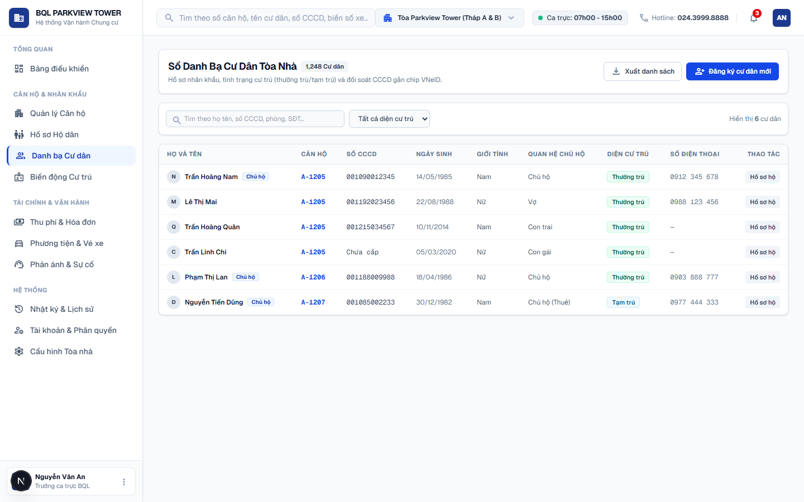

---

### 4. Automated Recurring Billing & Debt Reconciliation
Itemized monthly service invoice management featuring automated tariff calculations, overdue debt tracking, and interactive multi-channel payment reconciliation (*VietQR, Cash, VNPay*).

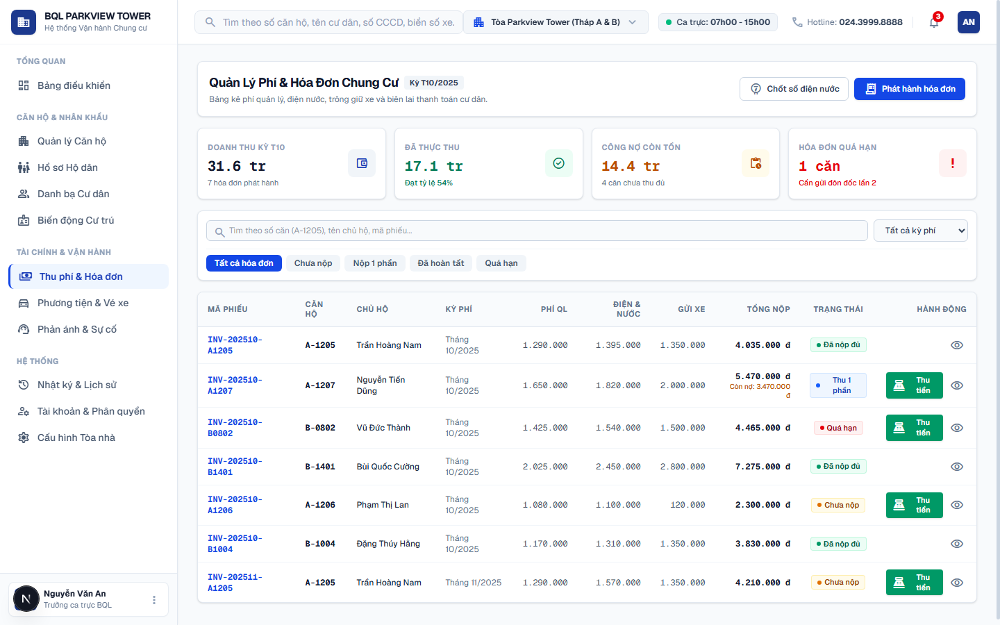

---

### 5. Service Requests & Resident Feedback SLA
Centralized maintenance ticket triage with urgency prioritization (*Khẩn cấp, Ưu tiên cao*), category routing (*Kỹ thuật, Vệ sinh, Tiếng ồn, An ninh*), and technician dispatch logging.

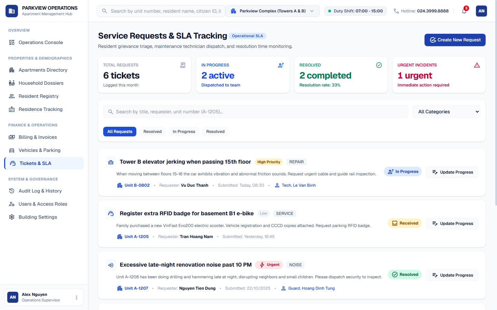

---

### 6. Vehicles & Basement Parking Slots (B1 & B2)
Underground parking allocation enforcing apartment vehicle quotas, license plate records, and contactless RFID access card assignments.

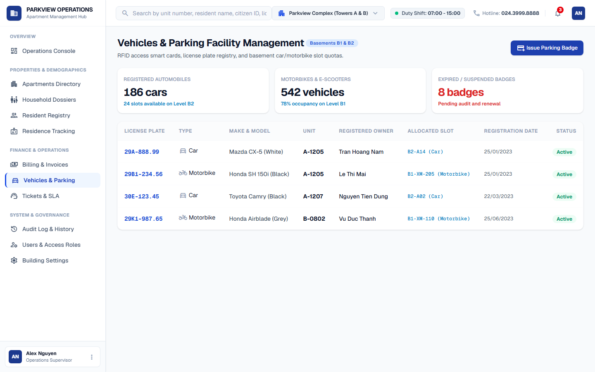

---

### 📑 Complete Screens Index

| Application Module | Screen Scope & Capabilities | Direct Route | Screenshot |
| :--- | :--- | :--- | :---: |
| **Command Console** | Macro KPI cards, revenue pulse, recent civil movement timeline | `/` | [View Screen](docs/screenshots/dashboard.png) |
| **Apartment Directory** | Unit grid, floor plans, area specs, occupancy filters | `/can-ho` | [View Screen](docs/screenshots/apartments.png) |
| **Apartment Dossier** | Ownership tenure, co-occupants, vehicles, financial ledger | `/can-ho/[roomNumber]` | [View Screen](docs/screenshots/apartment_detail.png) |
| **Resident Demographics** | Civil profiles, national CCCD, family tree relationships | `/cu-dan` | [View Screen](docs/screenshots/residents.png) |
| **Billing & Payments** | Automated utility billing, overdue reminders, VietQR modal | `/phi-chung-cu` | [View Screen](docs/screenshots/billing.png) |
| **Feedback & Tickets** | Resident incident triage, technician dispatch, SLA status | `/phan-anh-va-yeu-cau` | [View Screen](docs/screenshots/tickets.png) |
| **Vehicles & Parking** | Basement B1/B2 parking allocation, RFID smart card cards | `/phuong-tien-va-bai-do` | [View Screen](docs/screenshots/vehicles.png) |
| **API Documentation** | Interactive Swagger UI API console | `/api-docs` | [Open Console](/api-docs) |

---

## 🗄️ Database Architecture & Normalized ERD

The database schema is modeled in 3NF across 18 relational tables. Inspect the interactive schema definitions and diagrams:
- **Comprehensive ERD & Data Dictionary:** [`docs/DATABASE_SPECIFICATION_AND_DIAGRAMS.md`](docs/DATABASE_SPECIFICATION_AND_DIAGRAMS.md)
- **DBML Schema:** [`database/schema.dbml`](database/schema.dbml)
- **PostgreSQL DDL:** [`database/schema.sql`](database/schema.sql)

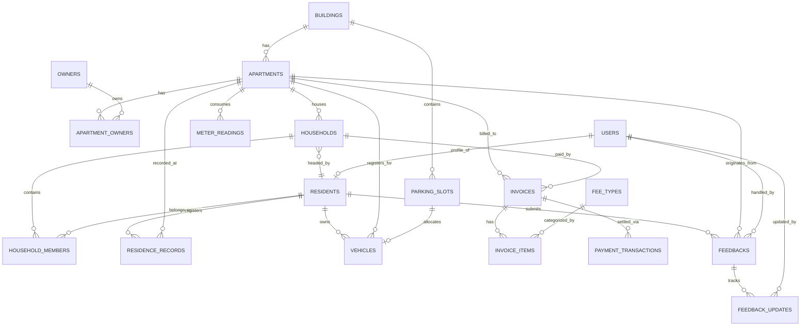

---

## 📚 Architecture Documentation Index

Tất cả các tài liệu kỹ thuật được chuẩn hóa và liên kết ma trận chéo trong thư mục `docs/`:

| Tài liệu | Phân loại | Câu hỏi kỹ thuật được giải đáp |
| :--- | :--- | :--- |
| **[REQUIREMENTS_INVEST.md](docs/REQUIREMENTS_INVEST.md)** | Requirements Engineering | User Stories chi tiết ra sao? Tiêu chí nghiệm thu BDD Gherkin và ma trận INVEST thế nào? |
| **[USE_CASES.md](docs/USE_CASES.md)** | Functional Specifications | Danh mục ca sử dụng (Use Cases), sơ đồ phân rã Actor và kịch bản ngoại lệ gồm những gì? |
| **[UI_UX_SPECIFICATION.md](docs/UI_UX_SPECIFICATION.md)** | Interaction Design | Cây kiến trúc thông tin (IA), phân cấp 4 tầng màn hình và hệ thống Design Tokens ra sao? |
| **[UI_DATABASE_MAPPING.md](docs/UI_DATABASE_MAPPING.md)** | Field-Level Traceability | Từng trường nhập liệu trên giao diện ánh xạ vào bảng và cột SQL nào trong CSDL? |
| **[ARCHITECTURE_C4.md](docs/ARCHITECTURE_C4.md)** | Architecture (Simon Brown C4) | Sơ đồ Context (C1), Container (C2), Component (C3), Dynamic view và Deployment topology? |
| **[ARCHITECTURE_ARC42.md](docs/ARCHITECTURE_ARC42.md)** | Architecture (arc42 Standard) | Hồ sơ kiến trúc chuẩn IEEE 42010 gồm 12 chương theo thông lệ quốc tế? |
| **[DATABASE_SPECIFICATION_AND_DIAGRAMS.md](docs/DATABASE_SPECIFICATION_AND_DIAGRAMS.md)** | Data Engineering | Thiết kế 18 bảng 3NF, từ điển dữ liệu (Data Dictionary), chiến lược Index và khóa bi quan? |
| **[openapi.yaml](docs/openapi.yaml)** | API Standard (OpenAPI 3.0.3) | Toàn bộ endpoints, DTO schema, mã lỗi RFC 7807 và phân quyền RBAC ở định dạng máy đọc được? |
| **[FOLDER_STRUCTURE_AND_3TIER_ARCHITECTURE.md](docs/FOLDER_STRUCTURE_AND_3TIER_ARCHITECTURE.md)** | Clean Architecture | Ranh giới 3 tầng (Presentation, Business Logic, Data Access) của cả Frontend và Backend? |
| **[DETAILED_CLASS_AND_SEQUENCE_DIAGRAMS.md](docs/DETAILED_CLASS_AND_SEQUENCE_DIAGRAMS.md)** | Detailed UML Modeling | Sơ đồ Class chi tiết và Sequence Diagrams cấp độ gọi hàm xử lý thanh toán, phân bổ slot đỗ xe? |

---

## 🧭 Where the Project Actually Is

Dự án duy trì tính minh bạch kỹ thuật cao nhất về tiến độ thực thi:

### ✅ Những gì đã hoàn thành và kiểm chứng thực tế:
- **Core Architecture & 3-Tier Layering:** Đầy đủ 8 API routers FastAPI, 6 Domain Services, 6 SQL Repositories.
- **Automated Test Suite:** **26/26 tests PASS trong 0.42 giây** ([backend/tests/](backend/tests/)), bao phủ Auth/JWT, Biểu giá điện EVN 6 bậc, Hạn mức xe, Quản lý sự cố SLA.
- **In-Memory Fallback Mode:** Hệ thống tự động hoạt động mượt mà ngay cả khi chưa kết nối PostgreSQL thật, phục vụ việc phát triển và demo tức thì.
- **Frontend App Router:** 7 module màn hình hoàn chỉnh viết bằng React 19 + Next.js 16 + Tailwind CSS v4, tích hợp Swagger UI console tương tác tại `/api-docs`.
- **Hồ sơ thiết kế đồng bộ 100%:** Đầy đủ 10 bộ tài liệu từ Requirements INVEST, arc42, C4, Database 3NF đến Class/Sequence diagrams.

### 🔄 Những hạng mục đang tiếp tục nâng cấp (Roadmap tiếp theo):
- **Live Database Migrations:** Bổ sung cấu hình **Alembic** để quản lý phiên bản database schema thay cho file SQL tĩnh.
- **Soft Delete Mechanism:** Thêm cột `deleted_at` cho các bảng thực thể chính (`residents`, `apartments`, `households`).
- **Responsive Card View:** Tối ưu hóa bảng dữ liệu trên thiết bị di động (< 768px).
- **Asynchronous Task Queue:** Tích hợp Redis Queue / Celery cho tác vụ xuất hóa đơn hàng loạt (Batch Invoicing) khi quy mô vượt 2,000 căn hộ.

---

## 👥 Contributors & License

- **Team:** ResidentHub Engineering
- **License:** Proprietary / MIT License
