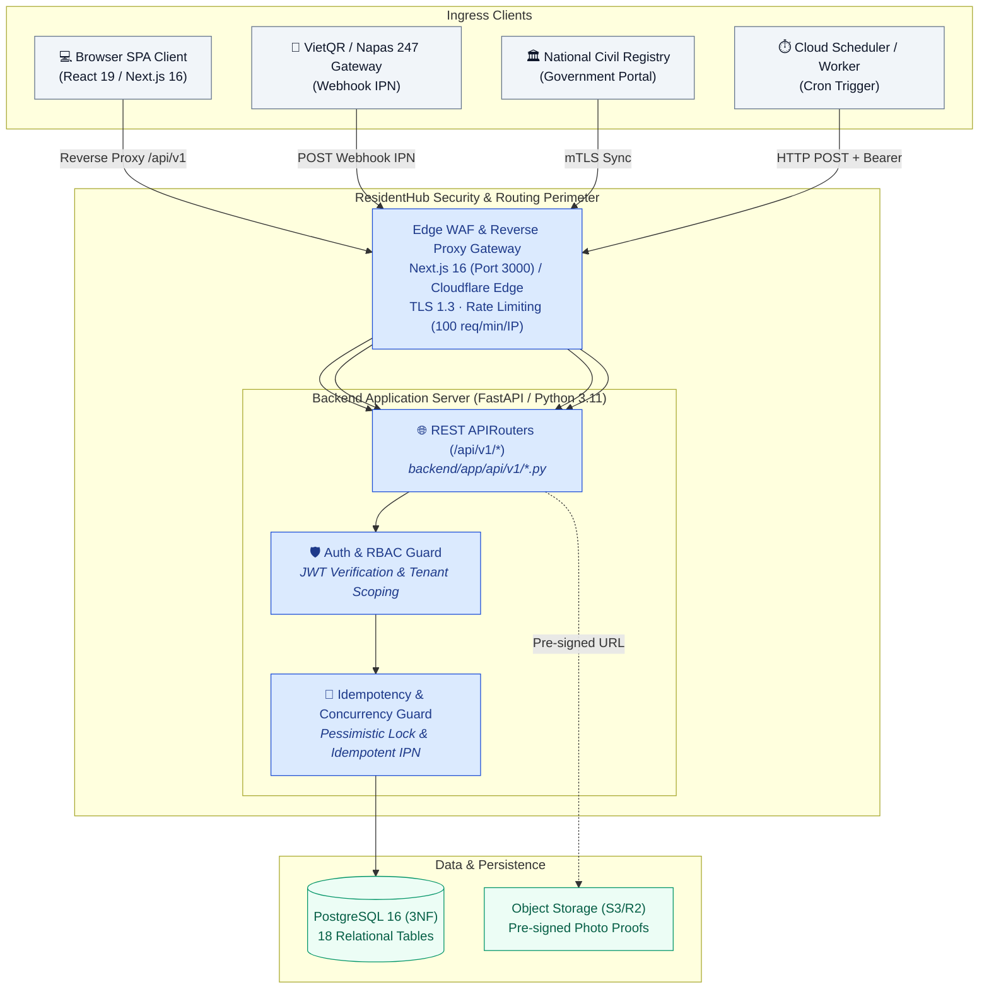
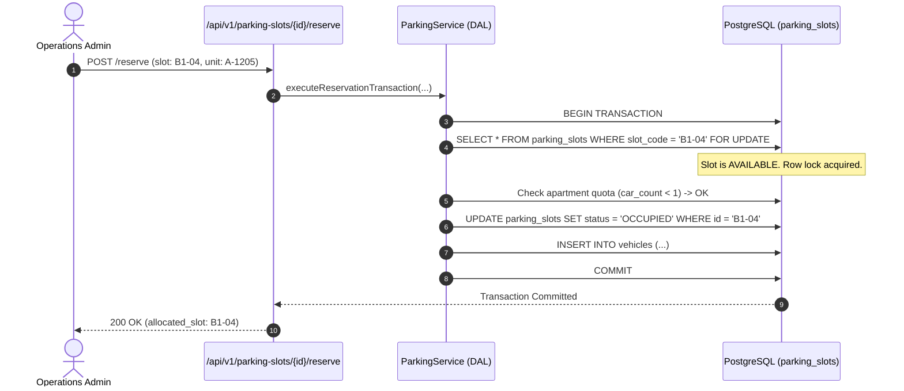
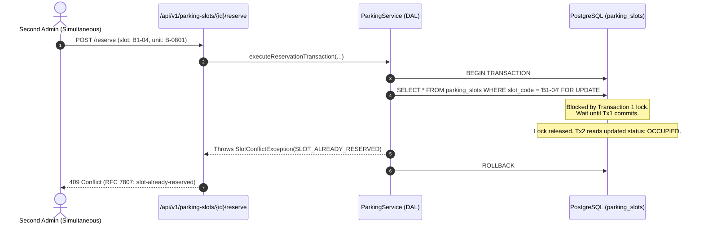
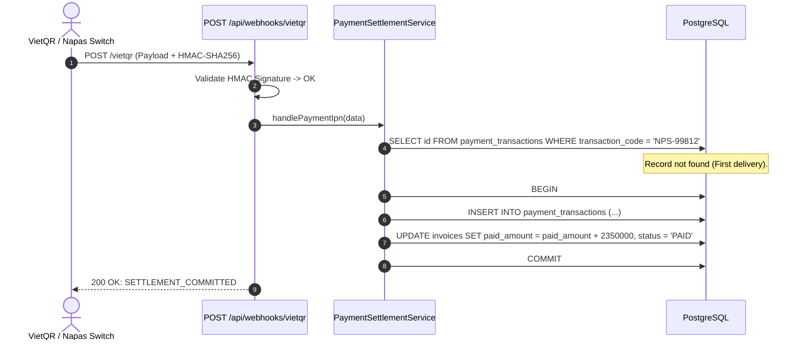
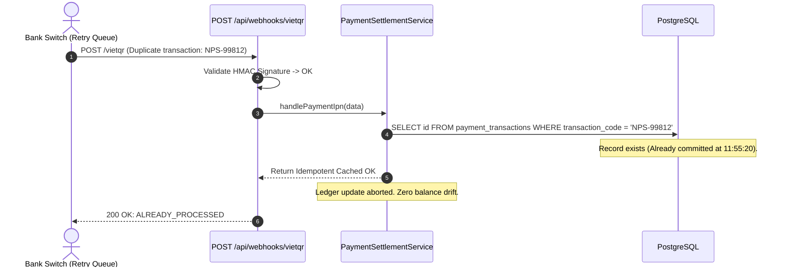

# ResidentHub — API & External Ingress Specification

> **Status:** Production Specification & Living Blueprint  
> **Audience:** Backend Engineers, Frontend Engineers, QA/SDET, Security Auditors, External Integrators  
> **Standard:** REST/JSON, RFC 7807 Problem Details, Next.js 16 App Router Server Actions, OpenAPI 3.0.3  
> **Interactive Swagger UI:** [http://localhost:3000/api-docs](/api-docs)  
> **OpenAPI 3.0 Spec:** [docs/openapi.yaml](openapi.yaml) (or download at [/openapi.yaml](/openapi.yaml))  
> **Database ERD & Specs:** [docs/05-DATABASE_SPECIFICATION_AND_DIAGRAMS.md](05-DATABASE_SPECIFICATION_AND_DIAGRAMS.md)  
> **Traceability:** Aligned with [11-USE_CASES.md](11-USE_CASES.md), [03-ARCHITECTURE_C4.md](03-ARCHITECTURE_C4.md), and [database/schema.sql](../database/schema.sql)  

---

## 📑 Table of Contents

- [1. Ground Truth Status Matrix](#1-ground-truth-status-matrix)
- [2. Ingress Architecture & Governance Principles](#2-ingress-architecture--governance-principles)
- [3. Standard Envelope, Headers & RFC 7807 Error Catalog](#3-standard-envelope-headers--rfc-7807-error-catalog)
- [4. Core Domain Modules — API Specifications](#4-core-domain-modules--api-specifications)
  - [4.1. Buildings & Apartments Management](#41-buildings--apartments-management)
  - [4.2. Households & Civil Demographics](#42-households--civil-demographics)
  - [4.3. Residence Tracking & Movement Declarations](#43-residence-tracking--movement-declarations)
  - [4.4. Vehicles & Underground Parking Allocation](#44-vehicles--underground-parking-allocation)
  - [4.5. Utility Meters & Automated Billing Engine](#45-utility-meters--automated-billing-engine)
  - [4.6. Service Requests & Resident Maintenance SLA](#46-service-requests--resident-maintenance-sla)
  - [4.7. Identity, Authentication & System Administration](#47-identity-authentication--system-administration)
- [5. External Ingress & Webhook Specifications](#5-external-ingress--webhook-specifications)
  - [5.1. VietQR Napas 247 Instant Payment Notification (IPN)](#51-vietqr-napas-247-instant-payment-notification-ipn)
  - [5.2. Object Storage (S3 / Cloudflare R2) Pre-signed Gateways](#52-object-storage-s3--cloudflare-r2-pre-signed-gateways)
  - [5.3. Civil Police Registry Integration (Planned)](#53-civil-police-registry-integration-planned)
- [6. API Runtime View & Failure Twins](#6-api-runtime-view--failure-twins)
- [7. Role-Based Access Control (RBAC) API Enforcement Matrix](#7-role-based-access-control-rbac-api-enforcement-matrix)
- [8. End-to-End API Traceability Matrix](#8-end-to-end-api-traceability-matrix)

---

## 1. Ground Truth Status Matrix

This table provides a transparent, verifiable audit of the platform's API state across the **Monorepo Architecture** ([ADR-0008](adr/ADR-0008-monorepo-nextjs16-fastapi-with-fallback-store.md)): what is live in the Python FastAPI backend, what is proxied via Next.js, and how the **Resilient Fallback Store** operates.

| Area / Subsystem | Ingress Endpoint | Protocol | Current Runtime State | Implementation Reference |
| :--- | :--- | :--- | :--- | :--- |
| **Command Console & Metrics** | `GET /api/v1/apartments` | REST / JSON | **Live (FastAPI + Fallback)** | `backend/app/api/v1/apartments.py` $\leftrightarrow$ `frontend/src/app/page.tsx` |
| **Apartment Directory & Deeds** | `GET /api/v1/apartments`, `POST /onboard` | REST / JSON | **Live (FastAPI + AsyncPG)** | `backend/app/api/v1/apartments.py` $\leftrightarrow$ `backend/app/services/apartment_service.py` |
| **Resident Demographics** | `GET /api/v1/residents`, `POST /residents` | REST / JSON | **Live (FastAPI + AsyncPG)** | `backend/app/api/v1/residents.py` $\leftrightarrow$ `frontend/src/services/api/residentApi.ts` |
| **Civil Stay Declarations** | `POST /api/v1/residents/stay-declaration` | REST / JSON | **Live (FastAPI + AsyncPG)** | `backend/app/api/v1/residents.py` $\leftrightarrow$ `backend/app/services/resident_service.py` |
| **Parking Slot Reservation** | `GET /api/v1/parking/slots`, `POST /allocate`| REST / JSON | **Live (FastAPI + Lock)** | `backend/app/api/v1/parking.py` $\leftrightarrow$ `SELECT FOR UPDATE` ([ADR-0003](adr/ADR-0003-pessimistic-locking-for-parking-slots.md)) |
| **VietQR Payment Session** | `POST /api/v1/billing/invoices/{id}/pay-session`| REST / JSON | **Live (FastAPI + VietQR)**| `backend/app/api/v1/billing.py` $\leftrightarrow$ `PaymentModal.tsx` ([ADR-0005](adr/ADR-0005-vietqr-napas-pay-sessions-and-ipn-idempotency.md)) |
| **VietQR Webhook IPN** | `POST /api/v1/webhooks/vietqr` | REST / JSON | **Live (FastAPI + Idempotent)**| `backend/app/api/v1/webhooks.py` $\leftrightarrow$ `backend/app/services/billing_service.py` |
| **Maintenance & Feedbacks** | `GET /api/v1/feedbacks` | REST / JSON | **Live (FastAPI + AsyncPG)** | `backend/app/api/v1/feedbacks.py` $\leftrightarrow$ `backend/app/services/feedback_service.py` |
| **Batch Billing Generation** | `POST /api/v1/billing/batch-generate` | REST / Scheduled | **Specification Ready** | `backend/app/services/billing_service.py`, [ARC42 §8.2](04-ARCHITECTURE_ARC42.md#82-error-handling-standard-rfc-7807) |
| **Evidence Media Upload** | S3 Pre-signed API | HTTPS S3 API (PUT/GET) | **Specification Ready** | [ARC42 §3.2](04-ARCHITECTURE_ARC42.md#32-external-interfaces-matrix) |
| **Civil Police Registry Sync**| mTLS External REST | HTTPS / REST (mTLS + OAuth2)| **Planned (Phase 4)** | [09-SYSTEM_WORKFLOWS_AND_SPECS.md §3](09-SYSTEM_WORKFLOWS_AND_SPECS.md#3-post-dbml-implementation-steps-next-steps) |

> [!NOTE]
> **Dual-Mode Resilient Ingress Architecture ([ADR-0008](adr/ADR-0008-monorepo-nextjs16-fastapi-with-fallback-store.md)):**  
> All client requests hitting `/api/v1/:path*` on port 3000 are transparently reverse-proxied to the FastAPI backend running on `http://localhost:8000/api/v1/:path*`. If the FastAPI backend is running and connected to PostgreSQL, live data is rendered with an active indicator badge (`FastAPI Live`). If the backend is offline or unreachable, `frontend/src/services/api/httpClient.ts` automatically catches the network error and falls back to the in-memory `Demo Store`, ensuring zero UI crashes during presentations or testing.

---

## 2. Ingress Architecture & Governance Principles



### 2.1. Dual-Mode Client Ingress: Live FastAPI with Resilient Fallback (ADR-0008)
* **Direct FastAPI Execution:** The high-performance Python 3.11 FastAPI backend (`http://localhost:8000`) executes all business rules, EVN tiered electricity/water calculations, and AsyncPG database transactions.
* **Transparent Reverse Proxy:** Next.js (`frontend/next.config.ts`) rewrites all `/api/v1/:path*` requests to `http://localhost:8000/api/v1/:path*`.
* **Zero-Downtime Fallback Store:** When running in standalone mode (without PostgreSQL running locally), `httpClient.ts` catches network errors and gracefully switches to pre-seeded mock fixtures in `mock-data.ts`, maintaining 100% interactive responsiveness.

### 2.2. Multi-Tenant Data Isolation (Tenant Scoping)
* **Tenancy Unit:** Multi-tenancy in ResidentHub is scoped at the **Apartment (`apartment_id`)** and **Building (`building_id`)** level.
* **Server-Enforced Isolation:**
  * For callers with role `RESIDENT`: The server extracts authenticated `resident_id` and authorized `apartment_id` from the verified session token. Any query attempting to read or mutate another apartment's bills, resident roster, or vehicles returns `403 Forbidden: RESIDENT_TENANT_VIOLATION`.
  * For callers with role `MANAGER` or `ADMIN`: Scoped to entire buildings under management (`building_id`).

### 2.3. Idempotency & Replay Protection
* Every mutating REST request (`POST`, `PUT`, `PATCH`) accepts an optional or mandatory `Idempotency-Key: <UUID>` HTTP header.
* Ingress payment webhooks enforce idempotency through unique database constraints on `payment_transactions.transaction_code`. Replayed webhooks return `200 OK` with an `ALREADY_PROCESSED` acknowledgment without duplicating ledger transactions.

---

## 3. Standard Envelope, Headers & RFC 7807 Error Catalog

### 3.1. Standard Request Headers

| Header Name | Type | Required | Description | Example |
| :--- | :--- | :---: | :--- | :--- |
| `Authorization` | String | Conditional | Bearer JWT token issued by auth service. Omitted only for `/api/v1/auth/login`. | `Bearer eyJhbGciOi...` |
| `X-Correlation-Id` | UUID | Recommended | Distributed tracing correlation ID. Generated at Edge WAF if absent. | `f81d4fae-7dec-11d0-a765-00a0c91e6bf6` |
| `Idempotency-Key` | UUID | Required on mutations | Unique transaction identifier to prevent duplicate side effects. | `7b9e02c1-8409-4822-b98a-2e6b9117cd52` |
| `Content-Type` | String | Required for body | Standard MIME format. | `application/json` |
| `X-Signature-SHA256`| String | Required on Webhooks| HMAC-SHA256 signature generated using shared secret key. | `a94a8fe5ccb19ba61c4c0873d391e987982f...` |

### 3.2. Standard Response Pagination Envelope (GET Lists)

All collection endpoints return metadata conforming to this envelope:

```json
{
  "data": [ /* Array of domain entities */ ],
  "pagination": {
    "page": 1,
    "limit": 20,
    "total_records": 120,
    "total_pages": 6,
    "has_next": true,
    "has_prev": false
  },
  "correlation_id": "f81d4fae-7dec-11d0-a765-00a0c91e6bf6",
  "timestamp": "2026-09-15T11:46:00Z"
}
```

### 3.3. RFC 7807 Problem Details Specification

All error responses strictly output `Content-Type: application/problem+json` formatted according to RFC 7807:

```json
{
  "type": "https://residenthub.internal/errors/slot-already-reserved",
  "title": "Parking Slot Conflict",
  "status": 409,
  "detail": "Slot B1-04 has already been reserved by another transaction.",
  "instance": "/api/v1/parking-slots/b1-04/reserve",
  "code": "SLOT_ALREADY_RESERVED",
  "invalid_params": [
    {
      "name": "slot_code",
      "reason": "Currently in status OCCUPIED"
    }
  ],
  "timestamp": "2026-09-15T11:46:00Z"
}
```

### 3.4. System Error Taxonomy & Status Registry

| HTTP Status | Error Code (`code`) | Meaning & Root Cause | Triggering Scenario |
| :---: | :--- | :--- | :--- |
| `400` | `INVALID_PAYLOAD_SCHEMA` | Malformed JSON or failed type validation | Zod / TypeScript schema violation in request body |
| `401` | `UNAUTHENTICATED_SESSION` | Missing or expired JWT token | Session cookie / Bearer token expired |
| `403` | `RBAC_PERMISSION_DENIED` | Caller role lacks required privilege | `RESIDENT` attempting to trigger batch billing |
| `403` | `TENANT_ACCESS_FORBIDDEN`| Attempting to access foreign unit data | `RESIDENT` requesting invoices of another apartment |
| `404` | `RESOURCE_NOT_FOUND` | Target entity does not exist | Invalid `apartment_id`, `invoice_id`, or `citizen_id` |
| `409` | `SLOT_ALREADY_RESERVED` | Concurrency race condition on slot lock | Two tenants booking last B1 parking spot concurrently |
| `409` | `VEHICLE_QUOTA_EXCEEDED` | Apartment parking allowance saturated | Unit exceeds limit (1 car, 2 motorbikes) |
| `409` | `HOUSEHOLD_HEAD_EXISTS` | Unit already has designated head of house | Registering second member with `is_head = true` |
| `409` | `OUTSTANDING_DEBT_BLOCK` | Unsettled financial ledger blocks move-out| Resident attempts `MOVED_OUT` with `UNPAID` balance |
| `422` | `UNRECORDED_METERS` | Missing utility meters for billing cycle | Batch generator finds units without meter inputs |
| `422` | `NEGATIVE_CONSUMPTION` | Meter current index < previous index | Meter reading inversion detected during data audit |
| `429` | `RATE_LIMIT_EXCEEDED` | Cloudflare / Ingress rate limit triggered | Caller exceeds 100 requests per minute |

---

## 4. Core Domain Modules — API Specifications

### 4.1. Buildings & Apartments Management

#### `GET /api/v1/apartments`
* **Description:** Retrieve paginated list of apartments with building specs, floor, area, and occupancy status.
* **RBAC Guard:** `ADMIN`, `MANAGER`, `TECHNICIAN`. (Callers with `RESIDENT` role are rejected with `403`).
* **Query Parameters:**
  * `building_id` *(UUID, optional)*: Filter by building.
  * `floor` *(Integer, optional)*: Filter by floor level.
  * `status` *(Enum `apartment_status`, optional)*: `EMPTY` | `RENTED` | `OWNER_OCCUPIED`.
  * `page` *(Integer, default: 1)*, `limit` *(Integer, default: 20)*.
* **Response `200 OK`:**
  ```json
  {
    "data": [
      {
        "id": "7b9e02c1-8409-4822-b98a-2e6b9117cd52",
        "building_code": "TOWER_A",
        "room_number": "A-1205",
        "floor": 12,
        "area": 85.50,
        "bedroom_count": 2,
        "bathroom_count": 2,
        "status": "OWNER_OCCUPIED",
        "owner_name": "Nguyễn Văn An",
        "active_residents_count": 3
      }
    ],
    "pagination": { "page": 1, "limit": 20, "total_records": 480, "total_pages": 24 }
  }
  ```

#### `GET /api/v1/apartments/{roomNumber}`
* **Description:** Retrieve the comprehensive deep-dive dossier for a specific unit (contracts, residents, registered vehicles, and ledger).
* **RBAC Guard:** `ADMIN`, `MANAGER`. `RESIDENT` permitted only if `roomNumber` matches authenticated session.
* **Response `200 OK`:**
  ```json
  {
    "id": "7b9e02c1-8409-4822-b98a-2e6b9117cd52",
    "room_number": "A-1205",
    "floor": 12,
    "area": 85.50,
    "status": "OWNER_OCCUPIED",
    "ownership": {
      "owner_id": "9c12df45-6712-4091-a128-112233445566",
      "full_name": "Nguyễn Văn An",
      "citizen_id": "001095012345",
      "ownership_type": "SOLE",
      "start_date": "2023-01-15"
    },
    "household": {
      "household_code": "HK-A1205",
      "head_name": "Nguyễn Văn An",
      "member_count": 3
    },
    "allocated_parking_slots": ["B1-04"],
    "unpaid_invoices_count": 0,
    "outstanding_balance_vnd": 0
  }
  ```

---

### 4.2. Households & Civil Demographics

#### `POST /api/v1/households`
* **Description:** Create a new household registration (Sổ hộ khẩu) for an apartment.
* **RBAC Guard:** `ADMIN`, `MANAGER`.
* **Request Body Schema:**
  ```json
  {
    "apartment_id": "7b9e02c1-8409-4822-b98a-2e6b9117cd52",
    "head_resident_id": "9c12df45-6712-4091-a128-112233445566",
    "household_code": "HK-A1205",
    "registration_date": "2026-09-01"
  }
  ```
* **Response `201 Created`:**
  ```json
  {
    "id": "c3a19024-5d98-4c6e-8219-48bb11223344",
    "household_code": "HK-A1205",
    "apartment_id": "7b9e02c1-8409-4822-b98a-2e6b9117cd52",
    "head_resident_id": "9c12df45-6712-4091-a128-112233445566",
    "status": "ACTIVE",
    "created_at": "2026-09-15T11:46:00Z"
  }
  ```
* **Failure Responses:**
  * `409 Conflict`: `HOUSEHOLD_ALREADY_EXISTS` if `apartment_id` already hosts an active household.
  * `422 Unprocessable Entity`: `head_resident_id` is not registered as `PERMANENT`.

#### `POST /api/v1/residents`
* **Description:** Register a new resident profile in the master census repository.
* **RBAC Guard:** `ADMIN`, `MANAGER`.
* **Request Body Schema:**
  ```json
  {
    "full_name": "Trần Thị Mai",
    "citizen_id": "001198054321",
    "date_of_birth": "1998-04-20",
    "gender": "FEMALE",
    "phone": "0987654321",
    "email": "mai.tran@example.com",
    "hometown": "Hà Nội",
    "resident_status": "PERMANENT",
    "household_id": "c3a19024-5d98-4c6e-8219-48bb11223344",
    "relationship_to_head": "VỢ"
  }
  ```
* **Response `201 Created`:** Returns created `residents` entity with assigned UUID and household membership link.

---

### 4.3. Residence Tracking & Movement Declarations

#### `POST /api/v1/residence-records`
* **Description:** Declare civil residence transition (`TAM_TRU`, `TAM_VANG`, `NHAP_HO`, `CHUYEN_DI`).
* **RBAC Guard:** `ADMIN`, `MANAGER`. `RESIDENT` can submit declarations in `PENDING` state.
* **Request Body Schema:**
  ```json
  {
    "resident_id": "9c12df45-6712-4091-a128-112233445566",
    "apartment_id": "7b9e02c1-8409-4822-b98a-2e6b9117cd52",
    "record_type": "TAM_TRU",
    "start_date": "2026-09-15",
    "end_date": "2027-09-15",
    "reason": "Thuê nhà công tác dài hạn",
    "police_verified_code": "CA-P04-2026/892"
  }
  ```
* **Response `201 Created`:**
  ```json
  {
    "id": "e4210943-3921-4f44-8da1-554433221100",
    "status": "APPROVED",
    "record_type": "TAM_TRU",
    "created_at": "2026-09-15T11:46:00Z"
  }
  ```

---

### 4.4. Vehicles & Underground Parking Allocation

#### `POST /api/v1/parking-slots/{id}/reserve`
* **Description:** Atomically reserve a parking slot in basement B1 or B2 for an apartment vehicle, enforcing vehicle quotas.
* **RBAC Guard:** `ADMIN`, `MANAGER`.
* **Idempotency:** Header `Idempotency-Key` mandatory.
* **Request Body Schema:**
  ```json
  {
    "apartment_id": "7b9e02c1-8409-4822-b98a-2e6b9117cd52",
    "resident_id": "9c12df45-6712-4091-a128-112233445566",
    "license_plate": "30K-998.89",
    "vehicle_type": "CAR",
    "brand_model": "Mazda CX-5",
    "color": "Trắng",
    "rfid_card_number": "RFID-B1-99889"
  }
  ```
* **Response `200 OK`:**
  ```json
  {
    "vehicle_id": "31f49a11-0021-49fa-9876-1234567890ab",
    "allocated_slot": {
      "slot_id": "b1-04-uuid",
      "slot_code": "B1-04",
      "floor": "B1",
      "status": "OCCUPIED"
    },
    "rfid_card_status": "ACTIVE"
  }
  ```
* **Failure Responses (Failure Twins):**
  * `409 Conflict`: `SLOT_ALREADY_RESERVED` if slot was seized by concurrent transaction during pessimistic lock acquisition (`SELECT ... FOR UPDATE`).
  * `409 Conflict`: `VEHICLE_QUOTA_EXCEEDED` if unit already has 1 registered CAR.

---

### 4.5. Utility Meters & Automated Billing Engine

#### `POST /api/v1/meters/readings`
* **Description:** Record monthly electricity or water meter readings for an apartment.
* **RBAC Guard:** `ADMIN`, `MANAGER`, `TECHNICIAN`.
* **Request Body Schema:**
  ```json
  {
    "apartment_id": "7b9e02c1-8409-4822-b98a-2e6b9117cd52",
    "meter_type": "WATER",
    "billing_period": "09-2026",
    "previous_reading": 142.50,
    "current_reading": 158.00
  }
  ```
* **Response `201 Created`:**
  ```json
  {
    "id": "11223344-5566-7788-99aa-bbccddeeff00",
    "consumption": 15.50,
    "recorded_at": "2026-09-15T11:46:00Z"
  }
  ```
* **Failure Response:**
  * `422 Unprocessable Entity`: `NEGATIVE_CONSUMPTION` if `current_reading < previous_reading`.

#### `POST /api/v1/billing/batch-generate`
* **Description:** Execute month-end utility & management fee invoicing batch across all active units.
* **RBAC Guard:** `ADMIN`, `MANAGER`.
* **Request Body Schema:**
  ```json
  {
    "billing_month": "09/2026",
    "due_date": "2026-10-10",
    "apply_tariffs": {
      "electricity_tiered": true,
      "water_tiered": true,
      "management_rate_per_sqm": 12000
    }
  }
  ```
* **Response `200 OK`:**
  ```json
  {
    "billing_month": "09/2026",
    "total_units_audited": 1200,
    "invoices_generated": 1188,
    "isolated_to_dead_letter": 12,
    "total_billed_amount_vnd": 2450000000,
    "execution_duration_ms": 1420
  }
  ```
* **Failure Response:**
  * `422 Unprocessable Entity`: `UNRECORDED_METERS` if missing critical threshold meters without override flag.

#### `POST /api/v1/invoices/{id}/pay-session`
* **Description:** Generate dynamic VietQR checkout session for resident settlement.
* **RBAC Guard:** `ADMIN`, `MANAGER`, `RESIDENT` (for own apartment).
* **Response `200 OK`:**
  ```json
  {
    "invoice_id": "INV-202609-A1205",
    "qr_url": "https://img.vietqr.io/image/970422-1903678999-compact2.png?amount=2350000&addInfo=INV202609A1205",
    "amount_vnd": 2350000,
    "bank_code": "970422",
    "account_number": "1903678999",
    "transfer_content": "INV202609A1205",
    "expires_at": "2026-09-15T12:01:00Z",
    "ttl_seconds": 900
  }
  ```

---

### 4.6. Service Requests & Resident Maintenance SLA

#### `POST /api/v1/feedbacks`
* **Description:** File maintenance ticket or noise/sanitation incident report.
* **RBAC Guard:** `RESIDENT`, `MANAGER`, `ADMIN`.
* **Request Body Schema:**
  ```json
  {
    "apartment_id": "7b9e02c1-8409-4822-b98a-2e6b9117cd52",
    "category": "REPAIR",
    "title": "Rò rỉ van nước chính khu bếp",
    "content": "Nước rỉ nhỏ giọt dưới gầm tủ bếp từ đêm qua.",
    "priority": "HIGH"
  }
  ```
* **Response `201 Created`:** Returns created `feedbacks` record in status `OPEN` with SLA target resolution time.

#### `PATCH /api/v1/feedbacks/{id}/status`
* **Description:** Progress ticket through lifecycle (`ASSIGNED` $\rightarrow$ `IN_PROGRESS` $\rightarrow$ `RESOLVED` $\rightarrow$ `CLOSED`).
* **RBAC Guard:** `TECHNICIAN` (for assigned tickets), `MANAGER`, `ADMIN`.
* **Request Body Schema:**
  ```json
  {
    "new_status": "RESOLVED",
    "technician_note": "Đã thay gioăng cao su van khóa tổng, áp lực nước ổn định.",
    "proof_image_urls": [
      "https://cdn.residenthub.internal/proofs/fb-9021-after.jpg"
    ]
  }
  ```

---

### 4.7. Identity, Authentication & System Administration

#### `POST /api/v1/auth/login`
* **Description:** Authenticate user credentials and return signed HTTP-Only session token.
* **RBAC Guard:** Public.
* **Request Body Schema:**
  ```json
  {
    "username": "manager_ha",
    "password": "SecurePassword#2026"
  }
  ```
* **Response `200 OK`:**
  ```json
  {
    "user": {
      "id": "u-1029-uuid",
      "username": "manager_ha",
      "role": "MANAGER",
      "full_name": "Phạm Thu Hà",
      "email": "ha.pham@residenthub.vn"
    },
    "token": "eyJhbGciOiJIUzI1NiIsIn...",
    "expires_in_seconds": 86400
  }
  ```

---

## 5. External Ingress & Webhook Specifications

### 5.1. VietQR Napas 247 Instant Payment Notification (IPN)

* **Endpoint:** `POST /api/webhooks/vietqr`
* **Protocol:** HTTPS POST / JSON Callback
* **Authentication:** HMAC-SHA256 signature passed in header `X-Signature-SHA256` computed over raw request body with merchant shared secret.
* **Payload Structure:**
  ```json
  {
    "gateway_transaction_id": "NPS2026091599812",
    "invoice_code": "INV-202609-A1205",
    "amount": 2350000,
    "payment_method": "BANK_TRANSFER",
    "transfer_content": "INV202609A1205",
    "transaction_time": "2026-09-15T11:55:20Z"
  }
  ```
* **Processing Rules & Idempotency:**
  1. Verify HMAC signature $\rightarrow$ Reject with `401 Unauthorized` if invalid.
  2. Query `payment_transactions WHERE transaction_code = $1` using `gateway_transaction_id`.
  3. If already present: Return `200 OK: ALREADY_PROCESSED` immediately (Idempotency Safe).
  4. If new: Execute atomic PostgreSQL transaction:
     - Insert record into `payment_transactions`.
     - Increment `invoices.paid_amount += 2350000`.
     - If `paid_amount >= total_amount`, update `invoices.status = 'PAID'`.

### 5.2. Object Storage (S3 / Cloudflare R2) Pre-signed Gateways

To protect server bandwidth and maintain secure uploads, evidence media files (incident photos, police stay registration documents) are uploaded directly to S3 via pre-signed URLs:

* **Endpoint:** `POST /api/v1/storage/presigned-upload`
* **Request:** `{ "filename": "leak-proof.jpg", "content_type": "image/jpeg", "scope": "FEEDBACK_PROOF" }`
* **Response:**
  ```json
  {
    "upload_url": "https://storage.residenthub.internal/proofs/leak-proof-uuid.jpg?X-Amz-Algorithm=AWS4-HMAC-SHA256&X-Amz-Expires=300...",
    "public_read_url": "https://cdn.residenthub.internal/proofs/leak-proof-uuid.jpg",
    "expires_in_seconds": 300
  }
  ```

---

## 6. API Runtime View & Failure Twins

Following the **Failure Twin convention**, every critical API workflow is modeled with both its **Happy Path** and its **Failure Twin** side-by-side.

### 6.1. Pair 1: Parking Slot Allocation Race Condition

#### Happy Path: First In Commits Slot


#### Failure Twin: Second Concurrent Requester Rejected (409 Conflict)


---

### 6.2. Pair 2: VietQR IPN Settlement & Duplicate Replay

#### Happy Path: Real-Time Payment Settlement


#### Failure Twin: Network Duplicate / Webhook Replay


---

## 7. Role-Based Access Control (RBAC) API Enforcement Matrix

Authorization is enforced exclusively at the server boundary. The table below outlines access policies across all 4 system roles:

| Module / Endpoint Group | Method | Path Pattern | ADMIN | MANAGER | TECHNICIAN | RESIDENT | Server-Side Data Constraint |
| :--- | :---: | :--- | :---: | :---: | :---: | :---: | :--- |
| **Apartments** | `GET` | `/api/v1/apartments` | ✅ | ✅ | ✅ | ❌ | Residents filtered out |
| **Apartment Dossier** | `GET` | `/api/v1/apartments/{room}` | ✅ | ✅ | ❌ | 🔒 | Resident limited to assigned unit |
| **Households** | `POST` | `/api/v1/households` | ✅ | ✅ | ❌ | ❌ | Only management creates roster |
| **Residents** | `GET` | `/api/v1/residents` | ✅ | ✅ | ❌ | ❌ | Census privacy enforcement |
| **Residence Move** | `POST` | `/api/v1/residence-records` | ✅ | ✅ | ❌ | 🔒 | Residents submit `PENDING` only |
| **Parking Reserve** | `POST` | `/api/v1/parking-slots/{id}/reserve`| ✅ | ✅ | ❌ | ❌ | Enforces apartment vehicle quotas |
| **Meters** | `POST` | `/api/v1/meters/readings` | ✅ | ✅ | ✅ | ❌ | Technical staff logging |
| **Batch Billing** | `POST` | `/api/v1/billing/batch-generate` | ✅ | ✅ | ❌ | ❌ | Restricted financial command |
| **Pay Session** | `POST` | `/api/v1/invoices/{id}/pay-session`| ✅ | ✅ | ❌ | 🔒 | Resident pays own bills only |
| **Webhook IPN** | `POST` | `/api/webhooks/vietqr` | 🤖 | 🤖 | 🤖 | 🤖 | Gateway HMAC-SHA256 signature |
| **Tickets List** | `GET` | `/api/v1/feedbacks` | ✅ | ✅ | 🔒 | 🔒 | Tech: assigned; Res: own unit |
| **Ticket Progress**| `PATCH`| `/api/v1/feedbacks/{id}/status` | ✅ | ✅ | 🔒 | ❌ | Tech updates assigned work only |
| **User Administration**| `CRUD` | `/api/v1/users` | ✅ | ❌ | ❌ | ❌ | Root system governance |

*Legend: ✅ Full Access | 🔒 Scoped by authenticated user/apartment ID | ❌ 403 Forbidden | 🤖 System-to-System Webhook (HMAC guarded)*

---

## 8. End-to-End API Traceability Matrix

This matrix establishes complete forward and reverse traceability connecting every API trigger to its governing Use Case, UI Screen, Domain Service, and Database Tables:

| API Route / Ingress | Use Case ID | Application Route | Responsible Domain Service | Target SQL Tables ([database/schema.sql](../database/schema.sql)) |
| :--- | :--- | :--- | :--- | :--- |
| `GET /api/v1/apartments` | `UC-APT-01` | `/can-ho` | `ApartmentService` | `apartments`, `buildings`, `owners` |
| `GET /api/v1/apartments/{room}` | `UC-APT-02` | `/can-ho/[roomNumber]` | `ApartmentService` | `apartments`, `apartment_owners`, `households` |
| `POST /api/v1/residents` | `UC-RES-01` | `/cu-dan` | `DemographicService` | `residents`, `household_members` |
| `POST /api/v1/residence-records`| `UC-RES-03` | `/cu-tru`, `/lich-su-cu-tru`| `ResidenceTrackingService`| `residence_records` |
| `POST /api/v1/parking-slots/{id}/reserve`| `UC-VEH-01`| `/phuong-tien-va-bai-do` | `ParkingAllocationService`| `parking_slots`, `vehicles` |
| `POST /api/v1/meters/readings` | `UC-FIN-01` | `/phi-chung-cu` | `UtilityBillingEngine` | `meter_readings` |
| `POST /api/billing/batch-generate` | `UC-FIN-02` | `/phi-chung-cu` | `UtilityBillingEngine` | `invoices`, `invoice_items` |
| `POST /api/invoices/{id}/pay-session` | `UC-FIN-03` | `/phi-chung-cu` | `PaymentReconciliationService`| `invoices` |
| `POST /api/webhooks/vietqr` | `UC-FIN-04` | *(External Gateway)* | `PaymentSettlementService` | `invoices`, `payment_transactions` |
| `POST /api/v1/feedbacks` | `UC-TKT-01` | `/phan-anh-va-yeu-cau` | `MaintenanceFeedbackService`| `feedbacks` |
| `PATCH /api/v1/feedbacks/{id}/status`| `UC-TKT-02`| `/phan-anh-va-yeu-cau` | `MaintenanceFeedbackService`| `feedbacks`, `feedback_updates` |
| `POST /api/v1/auth/login` | `UC-SYS-01` | `/dang-nhap` | `IdentityAccessService` | `users` |
| `GET /api/v1/users` | `UC-SYS-02` | `/nguoi-dung` | `IdentityAccessService` | `users` |
