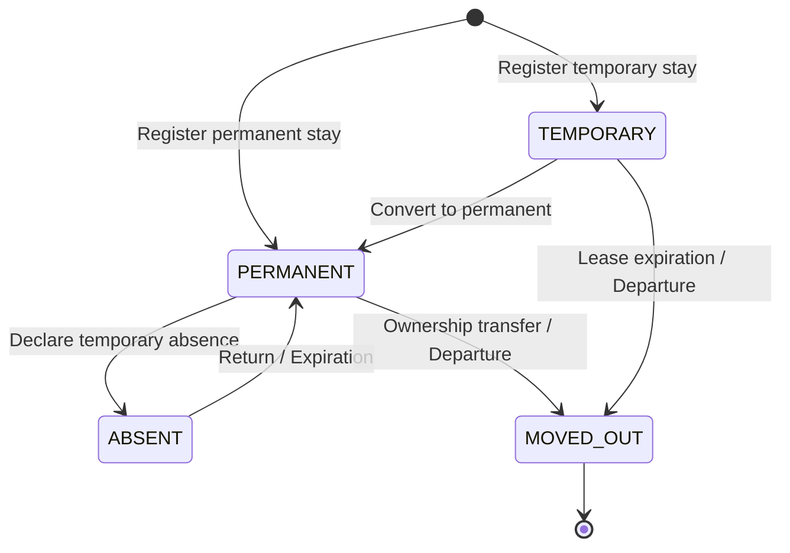
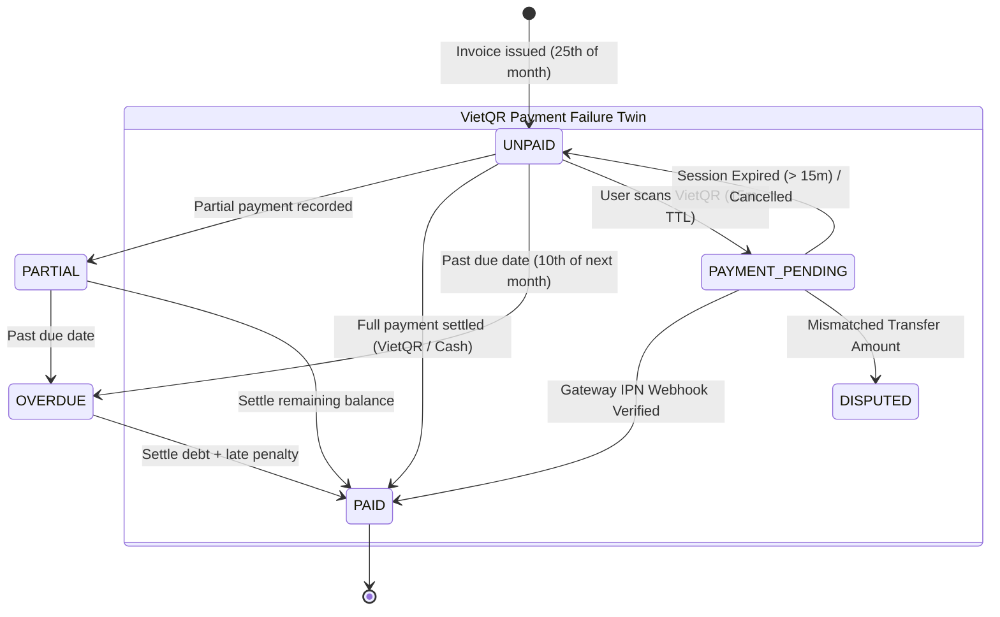
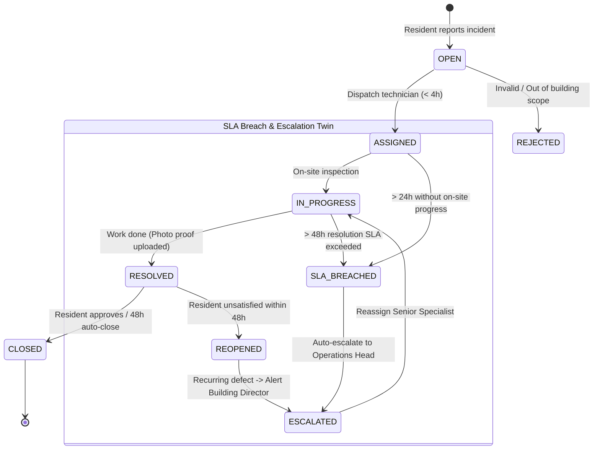

# ResidentHub - Core Workflows & Specifications

This document captures the essential domain designs: **Business Lifecycles (State Machines & Failure Twins)**, **RBAC Permission Matrix**, and **Implementation Engineering Rules**.

> 📚 **Architecture Dossier Navigation**:
> - [Use Case Specifications & Business Journeys](11-USE_CASES.md) (UML functional specs, 4 E2E journeys & traceability)
> - [C4 Model Architecture Document](03-ARCHITECTURE_C4.md) (Standard Mermaid visual diagrams & failure sequences)
> - [arc42 Complete Architecture Dossier](04-ARCHITECTURE_ARC42.md) (12-section IEEE 42010 architectural spec)

---

## 1. Core Lifecycles, State Machines & Failure Twins

### 1.1. Residence Lifecycle

- **Rules**: Max 1 household head (`is_head = true`) per unit. Head departure mandates assigning a successor first. Move-out revokes parking slots, deactivates user accounts, and requires zero outstanding balance.

---

### 1.2. Billing & Payment Lifecycle (with Failure Twins)

- **Cycle**: Record utility meters (25th–28th) $\rightarrow$ Calculate (Area $\times$ Tariff + Utilities + Parking) $\rightarrow$ Batch generate invoices $\rightarrow$ Settle via Gateway/Cash $\rightarrow$ Auto-flag `OVERDUE` after deadline.
- **Billing Dead-Letter Handling**: If a unit contains invalid meter data (e.g. current index < previous index), the automated batch isolates that unit into `billing_dead_letter_log` rather than halting the 1,000+ unit generation.

---

### 1.3. Service Ticket & SLA State Machine (Happy Path vs. SLA Breach)

---

### 1.4. Vehicle & Parking Allocation (Concurrency Guard)

- **Quota**: Max 1 car, 2 motorbikes per apartment unit.
- **Workflow**: Check unit quota $\rightarrow$ Acquire pessimistic database lock on parking slot (`SELECT ... FOR UPDATE`) $\rightarrow$ Verify registration logbook & Citizen ID $\rightarrow$ Activate RFID card $\rightarrow$ Link to monthly recurring billing.
- **Race Condition Twin**: If two residents attempt to reserve the final remaining B1 slot simultaneously, the transaction isolating `parking_slots` commits the first requester and aborts the second with `409 Conflict: SLOT_ALREADY_RESERVED`.

---

## 2. Role-Based Access Control (RBAC) Matrix

| Module | Action | ADMIN | MANAGER | TECHNICIAN | RESIDENT | Scope & Constraints |
| :--- | :--- | :---: | :---: | :---: | :---: | :--- |
| **Units** | View / Edit specs | CRUD | CRUD | Read | Read | Residents only view their own unit |
| **Residents** | Manage profiles & Stay status | CRUD | CRUD | - | Read / Submit | Residents only view co-occupants |
| **Vehicles** | Register & Slot allocation | CRUD | CRUD | - | Register | Unit vehicle quotas enforced |
| **Meters** | Record & Update readings | CRUD | Record | Record | - | Current reading $\ge$ Previous reading |
| **Billing** | Fee config & Issue invoices | CRUD | Issue / Collect | - | View & Pay | Residents only access their own bills |
| **Tickets** | Submit, Dispatch, Resolve | Manage | Dispatch | Update | Create / Close | Technicians update assigned tickets |
| **Users** | Account & Role governance | CRUD | - | - | - | System security administration |

---

## 3. Post-DBML Implementation Steps ("Next Steps")

1. **DB Migration & Constraints**:
   - Apply schema to PostgreSQL via Prisma/Drizzle.
   - Enforce unique composite constraints: `(building_id, room_number)`, `citizen_id`, `license_plate`, and `(apartment_id, billing_month)`.
2. **Relational Data Seeding**:
   - Seed in dependency order: Building & Slots $\rightarrow$ Fee Tariffs $\rightarrow$ Units $\rightarrow$ Households & Residents $\rightarrow$ Vehicles $\rightarrow$ Meter Readings & Invoices.
3. **Phased Development**:
   - **Phase 1 (Core)**: Auth, RBAC, Units, Residents & Households.
   - **Phase 2 (Operations)**: Residence tracking & Vehicle/Parking allocation.
   - **Phase 3 (Finance)**: Meter recording, Automated billing engine, Payment processing.
   - **Phase 4 (Services)**: Ticket management, Resident portal, Analytics dashboard.
4. **Key Verification Checks**:
   - **Tenant Isolation**: Strict row-level / query guards preventing cross-unit data access.
   - **Financial Accuracy**: Integer rounding on VND currency to eliminate floating-point precision errors.
   - **Concurrency Locks**: Atomic lock on parking slot allocation to prevent double-booking.
