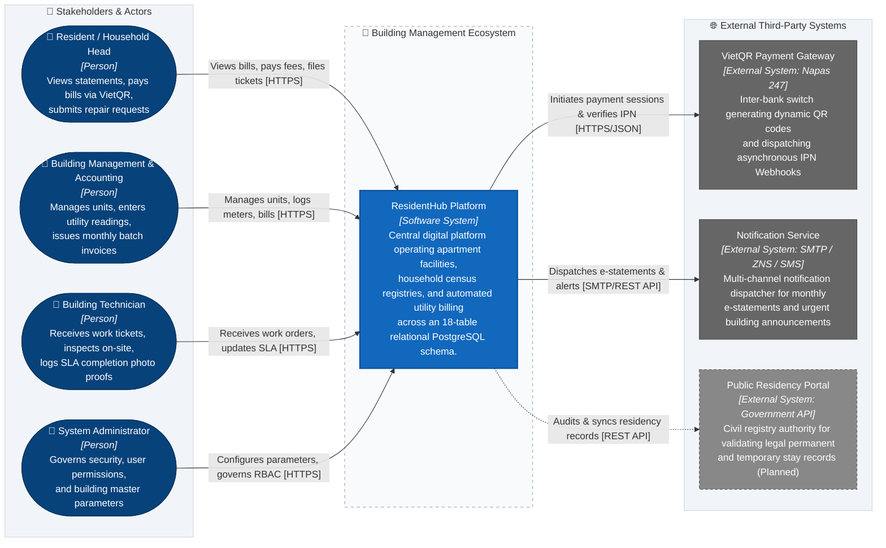
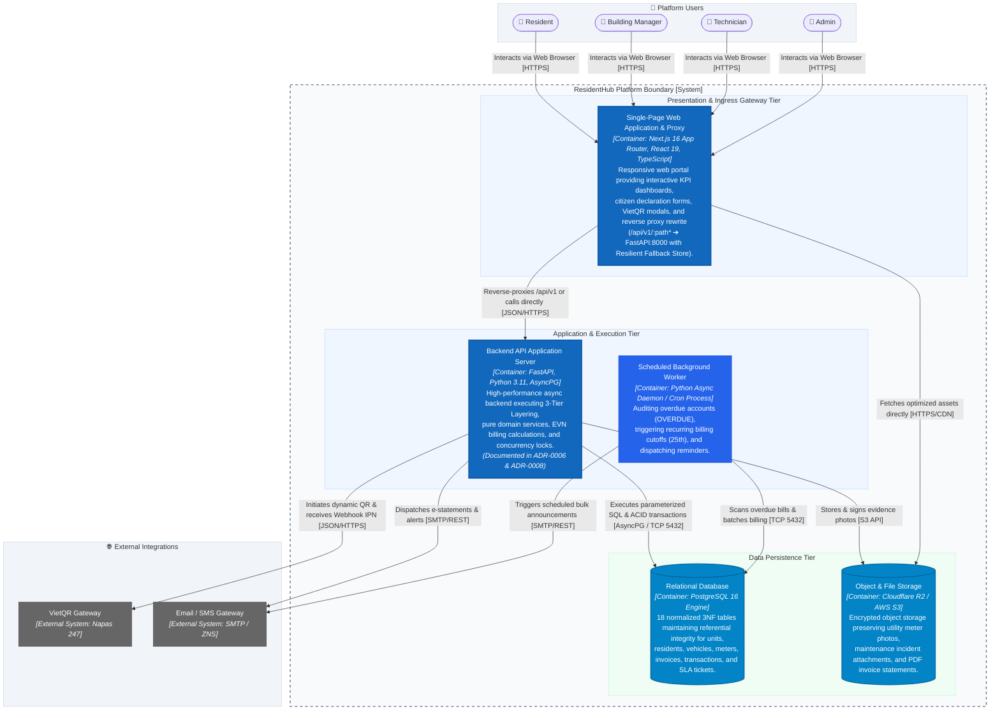
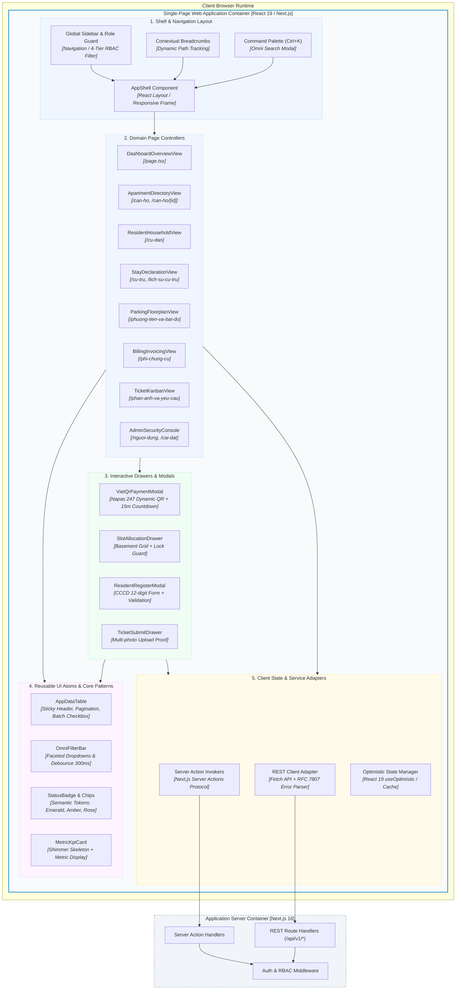
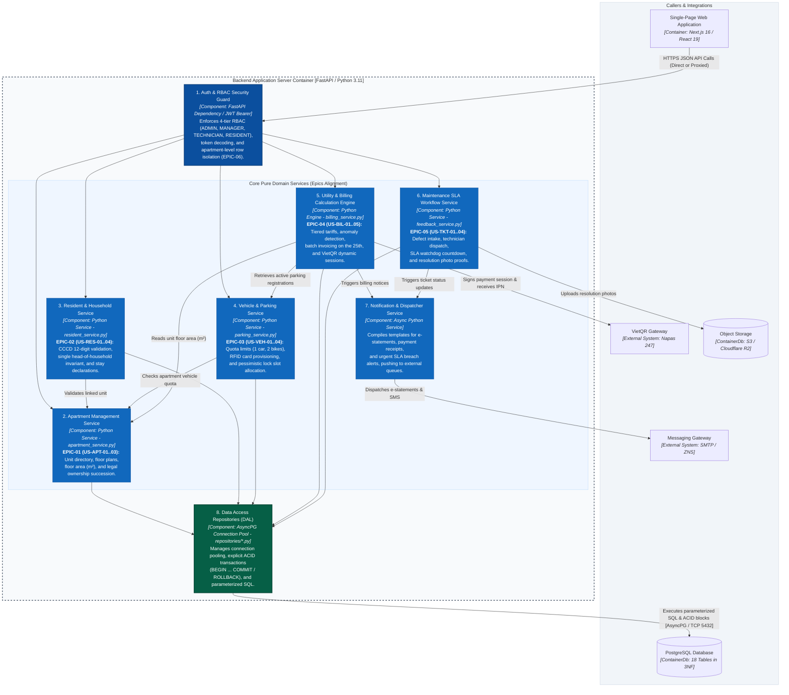
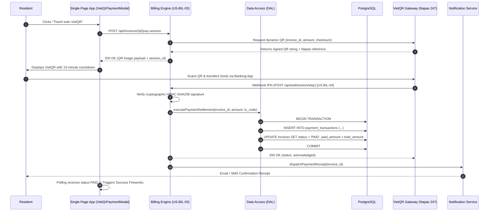
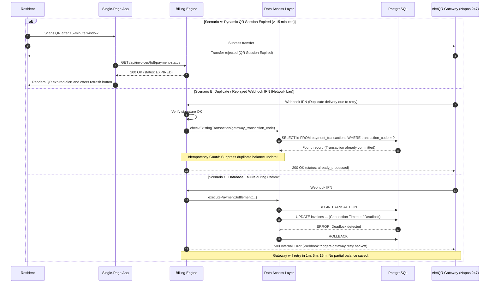
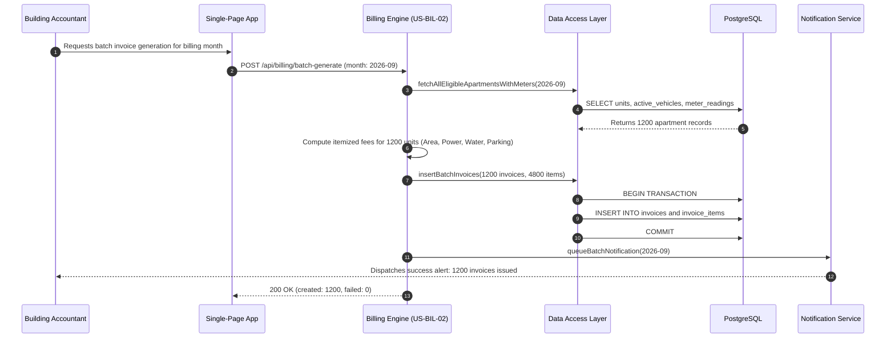
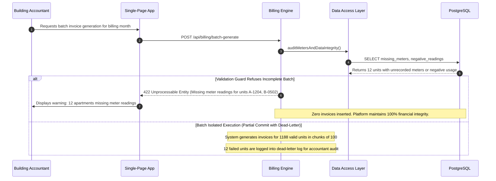
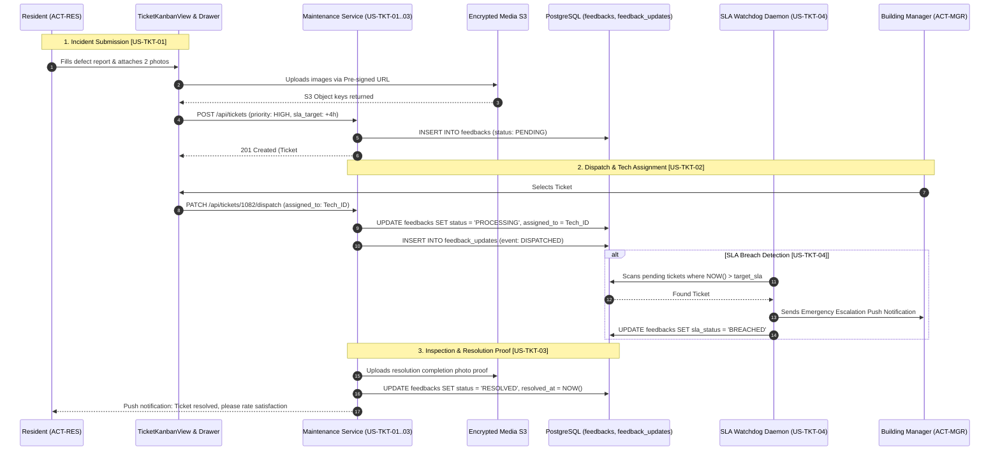
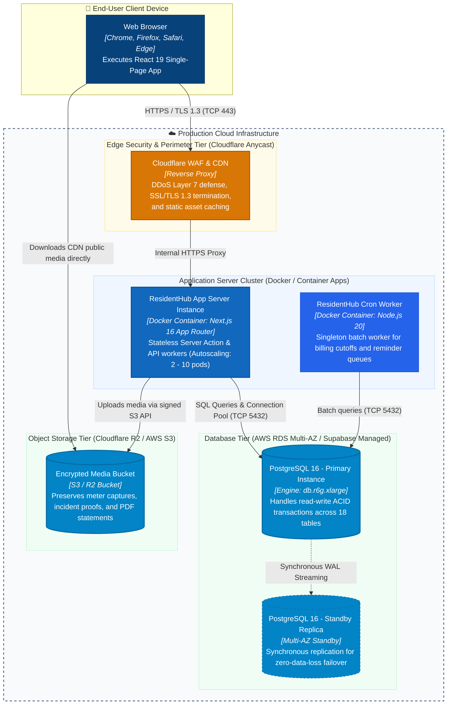

# ResidentHub - System Architecture Document (C4 Model & Pragmatic Mermaid)

This document provides the formal architectural specification for the **ResidentHub** platform (Apartment & Household Management System) using the **C4 Model** ([Simon Brown](https://c4model.com/)).

---

## 📑 Architecture Document Navigation

- 🏛️ **C4 Level 1**: [System Context Diagram](#1-c4-system-context-diagram---level-1) (Black Box boundary & Stakeholders)
- 📦 **C4 Level 2**: [Container Diagram](#2-c4-container-diagram---level-2) (Applications, Databases, and Storage)
- 🧩 **C4 Level 3**: [Component Diagrams](#3-c4-component-diagram---level-3)
  - [3.1. Presentation Tier Component Architecture](#31-presentation-tier--single-page-web-application-container-react-19--nextjs) (React 19 / Next.js Client)
  - [3.2. Application Tier Modular Services Architecture](#32-application-tier--web--api-application-server-container-nextjs-16) (Next.js 16 & Domain Services)
- ⚡ **C4 Dynamic**: [Runtime View & Failure Twins](#4-c4-dynamic-diagrams---runtime-view--failure-twins)
  - [4.1. Workflow 1: VietQR Billing Settlement [US-BIL-03, US-BIL-04]](#41-workflow-1-vietqr-billing-settlement-us-bil-03-us-bil-04)
  - [4.2. Workflow 2: Month-End Batch Invoice Generation [US-BIL-02]](#42-workflow-2-month-end-batch-invoice-generation-us-bil-02)
  - [4.3. Workflow 3: Maintenance Incident Ticket Lifecycle [US-TKT-01..04]](#43-workflow-3-maintenance-incident-ticket-lifecycle-us-tkt-01us-tkt-04)
- 🚀 **C4 Deployment**: [Production Deployment Topology](#5-c4-deployment-diagram---infrastructure-view) (Cloudflare Edge, AWS RDS Multi-AZ, S3)
- 🧪 **Fitness Functions**: [Integrity & Layering Gates](#6-architecture-fitness-functions--integrity-tests) (Automated CI assertions)
- 🔗 **Quad-Traceability Matrix**: [Requirements, UI, Architecture & DB Alignment](#7-full-quad-traceability-matrix)
- 📋 **Agile Requirements**: For User Stories and Gherkin Acceptance Criteria, see **[REQUIREMENTS_INVEST.md](REQUIREMENTS_INVEST.md)**.
- 🖥️ **UI/UX & IA Specifications**: For Information Architecture and Screen Hierarchy, see **[UI_UX_SPECIFICATION.md](UI_UX_SPECIFICATION.md)**.
- 📘 **arc42 Full Specification**: For the complete 12-section IEEE 42010 dossier, see **[ARCHITECTURE_ARC42.md](ARCHITECTURE_ARC42.md)**.
- 📋 **Use Case Specifications**: For UML catalogs and E2E journeys, see **[USE_CASES.md](USE_CASES.md)**.

---

## 1. C4 System Context Diagram - Level 1

The System Context diagram illustrates the high-level boundary of **ResidentHub** within the urban residential ecosystem. Adhering strictly to C4 Level 1 principles, **ResidentHub is treated as a Black Box**, orchestrating internal stakeholders and external third-party services.

### Context Elements Catalog

| Identifier | C4 Type | Display Label | Description & Responsibilities |
| :--- | :--- | :--- | :--- |
| `resident` | `Person` | Resident / Household Head | Portal user: reviews monthly bills, scans VietQR to settle balances, declares temporary stay, and submits repair tickets. |
| `manager` | `Person` | Management & Accounting | Operational user: audits meters (25th-28th), issues batch invoices, manages parking slots, and reconciles cash/gateway payments. |
| `tech` | `Person` | Building Technician | Field staff: assigned maintenance tickets, conducts physical inspections, and uploads photo evidence for SLA resolution. |
| `admin` | `Person` | System Administrator | IT security officer: manages 4-tier RBAC (`ADMIN`, `MANAGER`, `TECHNICIAN`, `RESIDENT`), configures fee tariffs, and audits access logs. |
| `residentHub` | `System` | ResidentHub Platform | Core software system delivering residential operations, census registry, and financial ledger. |
| `vietqr` | `System_Ext` | VietQR Payment Gateway | Financial switch generating dynamic Napas 247 QR codes and firing asynchronous IPN Webhook callbacks. |
| `notif` | `System_Ext` | Notification Gateway | Multi-channel network dispatching itemized e-statements and debt reminders via Email, SMS, and Zalo ZNS. |
| `civil` | `System_Ext` | Public Residency Portal | Governmental civil registry interface for residency verification (Planned integration). |

---

## 2. C4 Container Diagram - Level 2

The Container diagram decomposes **ResidentHub** into independently deployable units, client interfaces, background workers, and data persistence engines.

### Container Inventory

| Container | Tech Stack & Environment | Primary Technical Responsibilities |
| :--- | :--- | :--- |
| **`spa`** | Next.js 16 App Router, React 19, Tailwind CSS v4, TypeScript | Client-side reactive UI delivering master-detail tables, KPI charts, VietQR modals, and seamless reverse proxy to FastAPI with Resilient Fallback Store ([ADR-0008](adr/ADR-0008-monorepo-nextjs16-fastapi-with-fallback-store.md)). Tested via Vitest ([ADR-0009](adr/ADR-0009-frontend-testing-with-vitest-and-testing-library.md)). |
| **`api`** | FastAPI, Python 3.11, AsyncPG | High-performance asynchronous backend executing 3-Tier Layering: APIRouters, Pure Domain Services, and AsyncPG Repositories ([ADR-0006](adr/ADR-0006-3tier-architecture-with-pure-domain-services.md)). Tested via Pytest (26 suites). |
| **`worker`** | Python Async Worker / Cron Process | Scheduled cron worker scanning for overdue invoices, computing monthly penalties, and driving batch billing cycles. |
| **`database`** | PostgreSQL 16 (18 Tables in 3NF) | ACID relational engine enforcing referential integrity, unique constraints, and isolation across 18 business entities ([ADR-0002](adr/ADR-0002-postgresql-3nf-relational-modeling.md)). |
| **`storage`** | Cloudflare R2 / AWS S3 | Encrypted object storage preserving utility meter photos, repair evidence, and generated PDF e-statements. |

---

## 3. C4 Component Diagram - Level 3

Adhering to Simon Brown's C4 model, Level 3 decomposes the platform's primary deployable containers into their internal structural components, responsibilities, and interface boundaries:
- **3.1. Presentation Tier**: Internal component architecture of the **Single-Page Web Application Container** (React 19 / Next.js Client), aligned directly with [UI_UX_SPECIFICATION.md](UI_UX_SPECIFICATION.md).
- **3.2. Application Tier**: Modular service architecture of the **Web & API Application Server Container** (Next.js 16 App Router & Services), mapped 1-to-1 with Epics in [REQUIREMENTS_INVEST.md](REQUIREMENTS_INVEST.md).

---

### 3.1. Presentation Tier — Single-Page Web Application Container (React 19 / Next.js)

---

### 3.2. Application Tier — Backend Application Server Container (FastAPI / Python 3.11)

The Application Tier inspects the internal modular architecture of the **FastAPI Application Server** container, detailing functional domain services and repositories aligned 1-to-1 with the 6 business Epics from [REQUIREMENTS_INVEST.md](REQUIREMENTS_INVEST.md) and [ADR-0006](adr/ADR-0006-3tier-architecture-with-pure-domain-services.md):

---

## 4. C4 Dynamic Diagrams - Runtime View & Failure Twins

### 4.1. Workflow 1: VietQR Billing Settlement [US-BIL-03, US-BIL-04]

#### Happy Path (Successful Settlement)
*Triggered from UI Modal: `VietQrPaymentModal` on `/phi-chung-cu`*

#### Failure Twin (Network Timeout, Duplicate IPN, & Expiration)

---

### 4.2. Workflow 2: Month-End Batch Invoice Generation [US-BIL-02]

#### Happy Path (Full Batch Success)
*Triggered from UI Action: `MonthlyBillingAction` on `/phi-chung-cu`*

#### Failure Twin (Missing Readings & Partial Rollback)

---

### 4.3. Workflow 3: Maintenance Incident Ticket Lifecycle [US-TKT-01..US-TKT-04]

*Triggers and orchestrates the defect lifecycle between Resident, Manager, and Field Technician:*

---

## 5. C4 Deployment Diagram - Infrastructure View

The Deployment diagram maps ResidentHub containers to cloud infrastructure nodes, VPC security boundaries, and high-availability database tiers.

### Infrastructure Inventory

| Node | Environment | Deployed Artifact | Technical Specifications |
| :--- | :--- | :--- | :--- |
| **`waf`** | Cloudflare Edge | Reverse Proxy / WAF | Global DDoS mitigation, HTTP/3, TLS 1.3 termination, and automatic rate-limiting at 100 req/min/IP. |
| **`api_pod`** | Container Apps / ECS | Docker Image (`residenthub:latest`) | Horizontal Pod Autoscaler (HPA) scaling between 2 to 10 replicas on CPU > 70% or RPS spikes. |
| **`worker_pod`** | Container Daemon | Docker Image (`residenthub:latest`) | Singleton worker with distributed lease lock ensuring only 1 worker processes the 25th month-end billing. |
| **`db_primary`** | AWS RDS PostgreSQL 16 | Relational Storage | 18 tables in 3NF, automated daily snapshots, 30-day Point-in-Time Recovery (PITR), and connection pooling via PgBouncer. |
| **`db_standby`** | AWS RDS Multi-AZ | Hot Standby Replica | Zero-downtime automatic failover within 60 seconds of hardware or zone failure. |
| **`s3`** | Cloudflare R2 / S3 | Object Bucket | AES-256 server-side encrypted unstructured media storage with zero egress fee distribution via Cloudflare CDN. |

---

## 6. Architecture Fitness Functions & Integrity Tests

| Fitness Test | Enforced Rule | Failure Condition | Implementation |
| :--- | :--- | :--- | :--- |
| `LayersPointInward` | Layering | Client components importing DB directly; API routes referencing private UI components | ESLint `import/order` & project boundary lint rules |
| `NoCircularDependencies` | Modularity | Service modules forming circular dependency cycles | `madge --circular src/` check in CI pipeline |
| `EveryActionGuardsRBAC` | Security | Any Server Action or API mutation lacking a call to `enforceRole(...)` | Static AST analyzer test in Vitest |
| `FinancialCalculationsAreInteger` | Precision | Currency arithmetic producing floating-point fractional numbers | Unit test suite asserting integer VND rounding on all bills |
| `NoOrphanDatabaseEntities` | Integrity | Foreign keys configured without `ON DELETE RESTRICT/CASCADE` constraints | Database migration linter on `schema.sql` |

---

## 7. Full Quad-Traceability Matrix

This matrix establishes 100% bidirectional traceability between **Agile Requirements (INVEST)**, **User Interface Architecture (IA & Screens)**, **C4 Model Components (Front & Back)**, and the **3NF Relational Database Schema**:

| INVEST User Story | UI Screen / Modal Component | C4 Frontend Component | C4 Backend Domain Service | PostgreSQL Relational Tables (3NF) |
| :--- | :--- | :--- | :--- | :--- |
| **`US-APT-01`** (Tra cứu căn hộ) | `/can-ho` (Apartments View) | `ApartmentDirectoryView` | `ApartmentService` | `apartments`, `buildings` |
| **`US-APT-02`** (Thêm căn hộ mới) | `ApartmentCreateModal` | `ActionModals.resModal` | `ApartmentService` | `apartments`, `owners`, `apartment_owners` |
| **`US-APT-03`** (Bàn giao căn hộ) | `/can-ho/[id]` (Dossier View) | `ApartmentDirectoryView` | `ApartmentService` | `apartment_owners`, `apartments` |
| **`US-RES-01`** (Đăng ký nhân khẩu) | `ResidentRegisterModal` | `ActionModals.resModal` | `ResidentService` | `residents`, `household_members` |
| **`US-RES-02`** (Chuyển đổi chủ hộ) | `HouseholdHeadTransferModal`| `ResidentHouseholdView` | `ResidentService` | `households`, `household_members` |
| **`US-RES-03`** (Khai báo tạm trú) | `/cu-tru` (Stay Declaration Form)| `StayDeclarationView` | `ResidentService` | `residence_records` |
| **`US-RES-04`** (Phê duyệt cư trú) | `/lich-su-cu-tru` (Audit History)| `StayDeclarationView` | `ResidentService` | `residence_records` |
| **`US-VEH-01`** (Đăng ký xe & Quota)| `VehicleRegisterModal` | `ParkingFloorplanView` | `ParkingService` | `vehicles`, `apartments` |
| **`US-VEH-02`** (Cấp nốt đỗ bi quan)| `SlotAllocationDrawer` | `ActionModals.slotDrawer`| `ParkingService` | `parking_slots`, `vehicles` |
| **`US-VEH-03`** (Kích hoạt RFID) | `RfidActivationCard` | `ParkingFloorplanView` | `ParkingService` | `vehicles` |
| **`US-VEH-04`** (Hủy đăng ký xe) | `VehicleRevokeDialog` | `ParkingFloorplanView` | `ParkingService` | `vehicles`, `parking_slots` |
| **`US-BIL-01`** (Ghi chỉ số điện nước)| `MeterReadingBatchModal` | `BillingInvoicingView` | `BillingEngine` | `meter_readings`, `apartments` |
| **`US-BIL-02`** (Phát hành hóa đơn) | `MonthlyBillingAction` | `BillingInvoicingView` | `BillingEngine` | `invoices`, `invoice_items`, `fee_types` |
| **`US-BIL-03`** (Mã VietQR động) | `VietQrPaymentModal` | `ActionModals.vietQrModal`| `BillingEngine` | `invoices`, `payment_transactions` |
| **`US-BIL-04`** (Webhook IPN gạch nợ)| `/api/webhooks/vietqr` | `ClientIngress.restClient`| `BillingEngine` | `payment_transactions`, `invoices` |
| **`US-BIL-05`** (Quét nợ quá hạn) | Cron Background Worker | `WorkerProcess` | `BillingEngine` | `invoices` |
| **`US-TKT-01`** (Gửi phản ánh sự cố)| `TicketSubmitDrawer` | `ActionModals.ticketDrawer`| `MaintenanceSlaService` | `feedbacks`, `feedback_updates` |
| **`US-TKT-02`** (Điều phối kỹ thuật) | `TicketDispatchModal` | `TicketKanbanView` | `MaintenanceSlaService` | `feedback_updates`, `feedbacks` |
| **`US-TKT-03`** (Nghiệm thu ảnh chụp)| `TicketResolveDrawer` | `TicketKanbanView` | `MaintenanceSlaService` | `feedbacks`, `feedback_updates` |
| **`US-TKT-04`** (Leo thang vi phạm SLA)| Cron SLA Watchdog | `WorkerProcess` | `MaintenanceSlaService` | `feedbacks` |
| **`US-ADM-01`** (Quản lý RBAC 4 cấp)| `/nguoi-dung` (User Management) | `AdminSecurityConsole` | `SecurityAuthService` | `users` |
| **`US-ADM-02`** (Cấu hình biểu phí) | `/cai-dat` (Fee Tariffs) | `AdminSecurityConsole` | `BillingEngine` | `fee_types` |
| **`US-ADM-03`** (Nhật ký kiểm toán) | `/cai-dat` (Audit Trail) | `AdminSecurityConsole` | `SecurityAuthService` | `audit_logs` |
