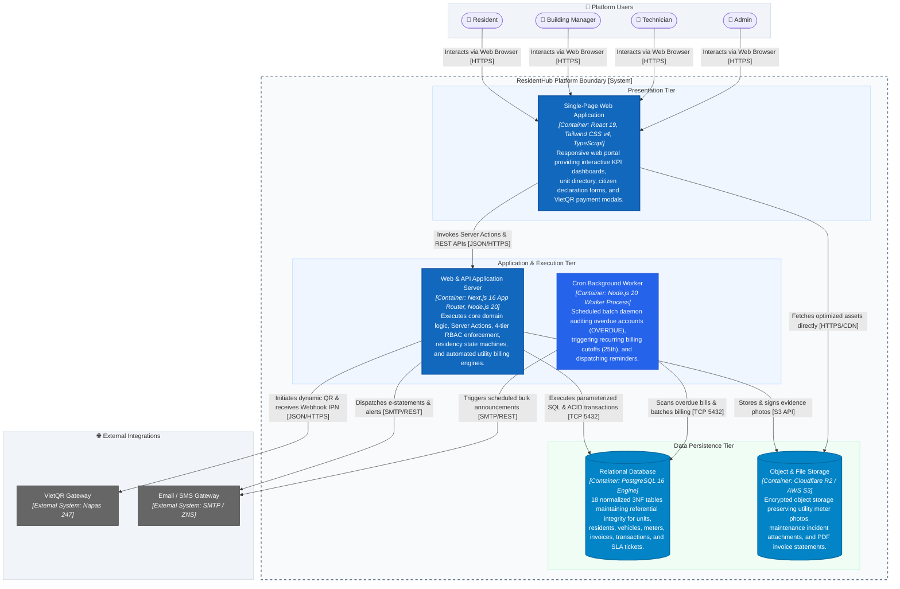
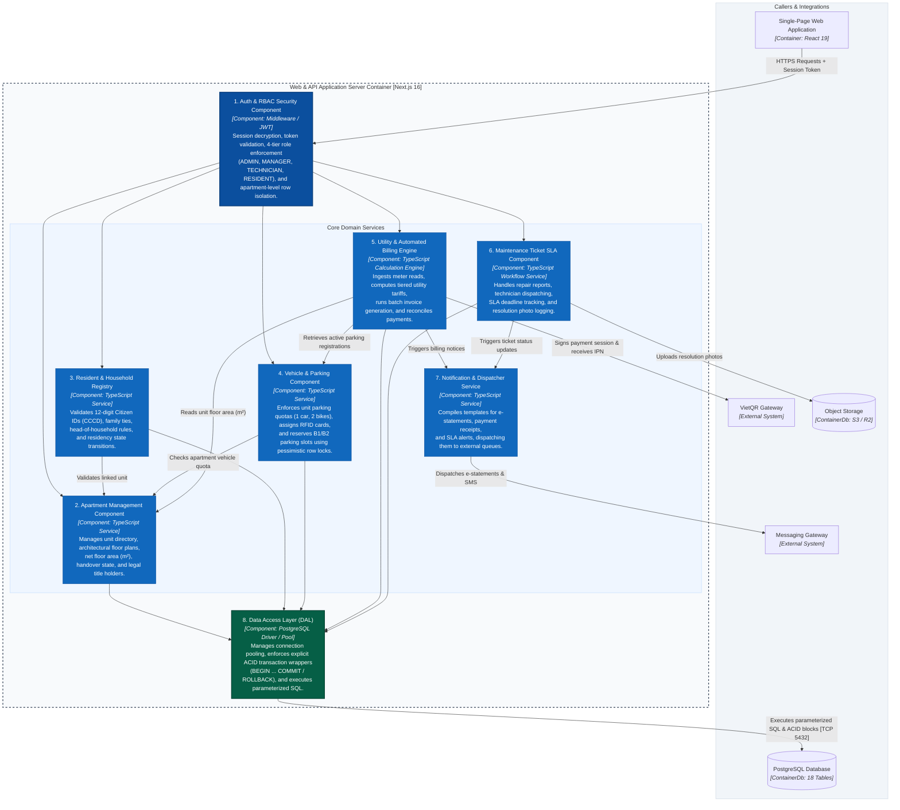
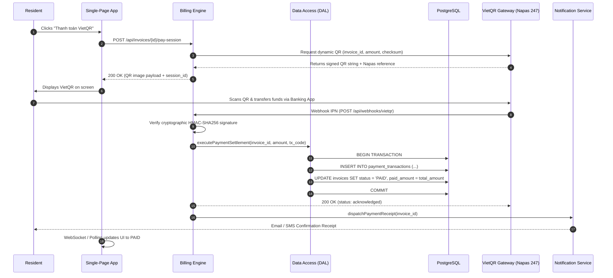
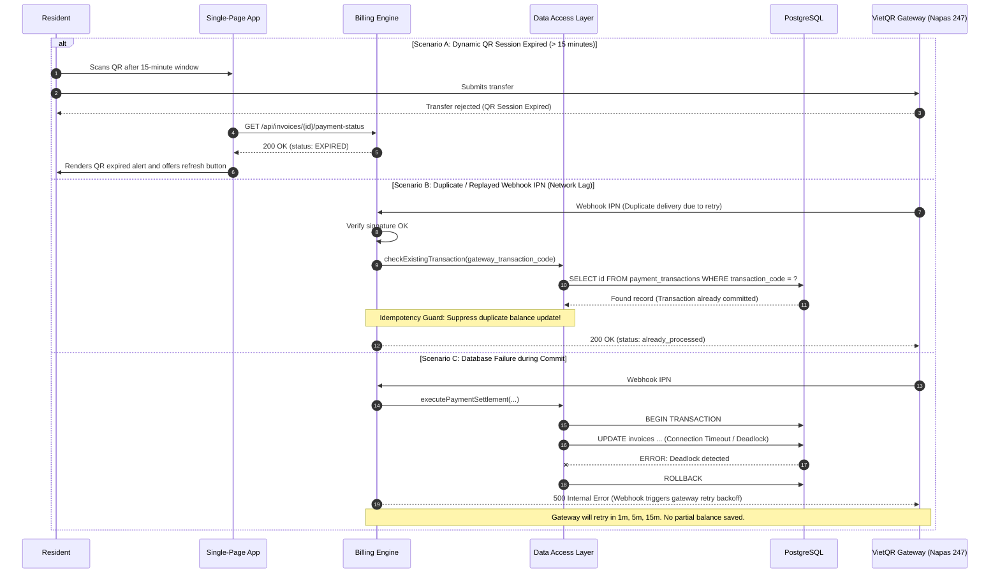
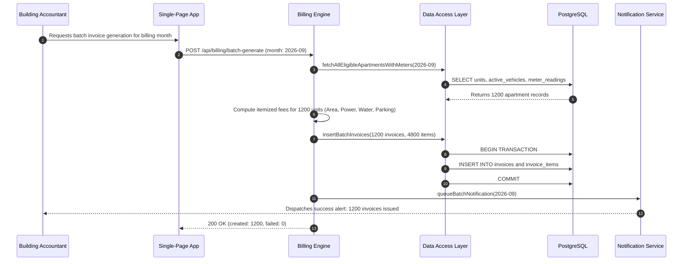
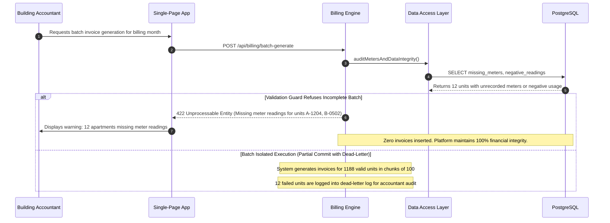
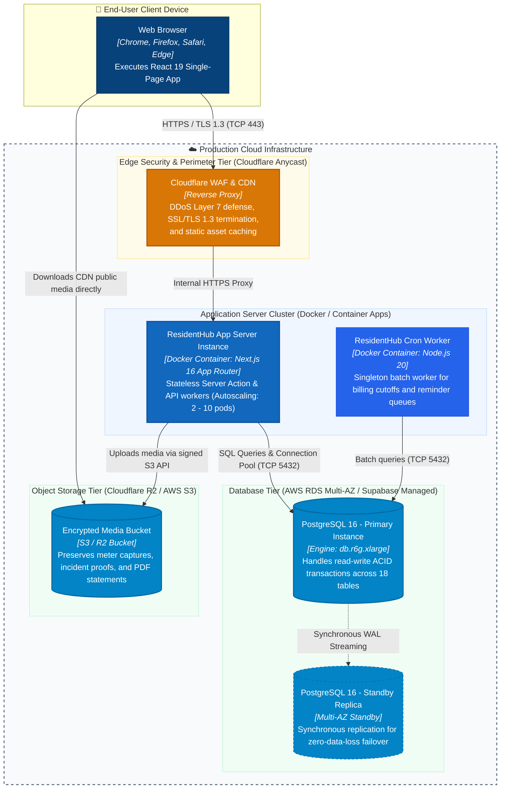

# ResidentHub - System Architecture Document (C4 Model & Pragmatic Mermaid)

This document provides the formal architectural specification for the **ResidentHub** platform (Apartment & Household Management System) using the **C4 Model** ([Simon Brown](https://c4model.com/)).

---

## 📑 Architecture Document Navigation

- 🏛️ **C4 Level 1**: [System Context Diagram](#1-c4-system-context-diagram---level-1) (Black Box boundary & Stakeholders)
- 📦 **C4 Level 2**: [Container Diagram](#2-c4-container-diagram---level-2) (Applications, Databases, and Storage)
- 🧩 **C4 Level 3**: [Component Diagram](#3-c4-component-diagram---level-3) (Internal Next.js 16 modular services)
- ⚡ **C4 Dynamic**: [Runtime View & Failure Twins](#4-c4-dynamic-diagrams---runtime-view--failure-twins) (Happy Path vs. Failure Twin sequences)
- 🚀 **C4 Deployment**: [Production Deployment Topology](#5-c4-deployment-diagram---infrastructure-view) (Vercel Edge, AWS RDS Multi-AZ, S3)
- 🧪 **Fitness Functions**: [Integrity & Layering Gates](#6-architecture-fitness-functions--integrity-tests) (Automated CI assertions)
- 📘 **arc42 Full Specification**: For the complete 12-section IEEE 42010 architectural dossier, see **[ARCHITECTURE_ARC42.md](ARCHITECTURE_ARC42.md)**.
- 📋 **Use Case Specifications**: For UML catalogs, 4 End-to-End journeys, and fully-dressed specs, see **[USE_CASES.md](USE_CASES.md)**.

---

## 1. C4 System Context Diagram - Level 1

The System Context diagram illustrates the high-level boundary of **ResidentHub** within the urban residential ecosystem. Adhering strictly to C4 Level 1 principles, **ResidentHub is treated as a Black Box**, orchestrating internal stakeholders and external third-party services.

### Context Elements Catalog

| Identifier | C4 Type | Display Label | Description & Responsibilities |
| :--- | :--- | :--- | :--- |
| `resident` | `Person` | Resident / Household Head | Portal user: reviews monthly bills, scans VietQR to settle balances, declares temporary stay, and submits repair tickets. |
| `manager` | `Person` | Management & Accounting | Operational user: audits meters (25th-28th), issues batch invoices, manages parking slots, and reconciles cash/gateway payments. |
| `tech` | `Person` | Building Technician | Field staff: assigned maintenance tickets, conducts physical inspections, and uploads photo evidence for SLA resolution. |
| `admin` | `Person` | System Administrator | IT security officer: manages 4-tier RBAC (`ADMIN`, `MANAGER`, `TECHNICIAN`, `RESIDENT`), configures fee tariffs, and audits access logs. |
| `residentHub` | `System` | ResidentHub Platform | Core software system delivering residential operations, census registry, and financial ledger. |
| `vietqr` | `System_Ext` | VietQR Payment Gateway | Financial switch generating dynamic Napas 247 QR codes and firing asynchronous IPN Webhook callbacks. |
| `notif` | `System_Ext` | Notification Gateway | Multi-channel network dispatching itemized e-statements and debt reminders via Email, SMS, and Zalo ZNS. |
| `civil` | `System_Ext` | Public Residency Portal | Governmental civil registry interface for residency verification (Planned integration). |

---

## 2. C4 Container Diagram - Level 2

The Container diagram decomposes **ResidentHub** into independently deployable units, client interfaces, background workers, and data persistence engines.

### Container Inventory

| Container | Tech Stack & Environment | Primary Technical Responsibilities |
| :--- | :--- | :--- |
| **`spa`** | React 19, Tailwind CSS v4, TypeScript | Client-side reactive UI delivering master-detail tables, KPI charts, VietQR modal dialogs, and registration wizards. |
| **`api`** | Next.js 16 App Router, Node.js 20 | Unified Server Application handling Server Actions, REST endpoints, RBAC session verification, and transactional domain logic. |
| **`worker`** | Node.js 20 Worker Process | Scheduled cron worker scanning for overdue invoices, computing monthly penalties, and driving batch billing cycles. |
| **`database`** | PostgreSQL 16 (18 Tables in 3NF) | ACID relational engine enforcing referential integrity, unique constraints, and isolation across 18 business entities. |
| **`storage`** | Cloudflare R2 / AWS S3 | Encrypted object storage preserving utility meter photos, repair evidence, and generated PDF e-statements. |

---

## 3. C4 Component Diagram - Level 3

The Component diagram inspects the internal modular architecture of the **Web & API Application Server** container, detailing functional service components and the Data Access Layer.

---

## 4. C4 Dynamic Diagrams - Runtime View & Failure Twins

### 4.1. Workflow 1: VietQR Billing Settlement

#### Happy Path (Successful Settlement)

#### Failure Twin (Network Timeout, Duplicate IPN, & Expiration)

---

### 4.2. Workflow 2: Month-End Batch Invoice Generation

#### Happy Path (Full Batch Success)

#### Failure Twin (Missing Readings & Partial Rollback)

---

## 5. C4 Deployment Diagram - Infrastructure View

The Deployment diagram maps ResidentHub containers to cloud infrastructure nodes, VPC security boundaries, and high-availability database tiers.

### Infrastructure Inventory

| Node | Environment | Deployed Artifact | Technical Specifications |
| :--- | :--- | :--- | :--- |
| **`waf`** | Cloudflare Edge | Reverse Proxy / WAF | Global DDoS mitigation, HTTP/3, TLS 1.3 termination, and automatic rate-limiting at 100 req/min/IP. |
| **`api_pod`** | Container Apps / ECS | Docker Image (`residenthub:latest`) | Horizontal Pod Autoscaler (HPA) scaling between 2 to 10 replicas on CPU > 70% or RPS spikes. |
| **`worker_pod`** | Container Daemon | Docker Image (`residenthub:latest`) | Singleton worker with distributed lease lock ensuring only 1 worker processes the 25th month-end billing. |
| **`db_primary`** | AWS RDS PostgreSQL 16 | Relational Storage | 18 tables in 3NF, automated daily snapshots, 30-day Point-in-Time Recovery (PITR), and connection pooling via PgBouncer. |
| **`db_standby`** | AWS RDS Multi-AZ | Hot Standby Replica | Zero-downtime automatic failover within 60 seconds of hardware or zone failure. |
| **`s3`** | Cloudflare R2 / S3 | Object Bucket | AES-256 server-side encrypted unstructured media storage with zero egress fee distribution via Cloudflare CDN. |

---

## 6. Architecture Fitness Functions & Integrity Tests

| Fitness Test | Enforced Rule | Failure Condition | Implementation |
| :--- | :--- | :--- | :--- |
| `LayersPointInward` | Layering | Client components importing DB directly; API routes referencing private UI components | ESLint `import/order` & project boundary lint rules |
| `NoCircularDependencies` | Modularity | Service modules forming circular dependency cycles | `madge --circular src/` check in CI pipeline |
| `EveryActionGuardsRBAC` | Security | Any Server Action or API mutation lacking a call to `enforceRole(...)` | Static AST analyzer test in Vitest |
| `FinancialCalculationsAreInteger` | Precision | Currency arithmetic producing floating-point fractional numbers | Unit test suite asserting integer VND rounding on all bills |
| `NoOrphanDatabaseEntities` | Integrity | Foreign keys configured without `ON DELETE RESTRICT/CASCADE` constraints | Database migration linter on `schema.sql` |
