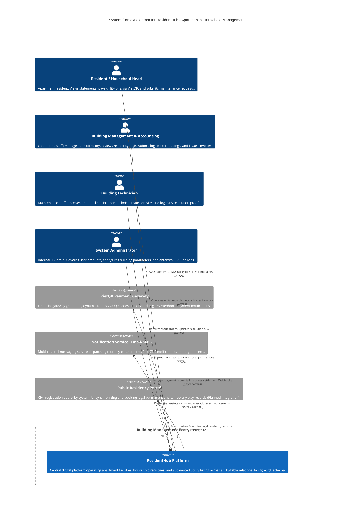
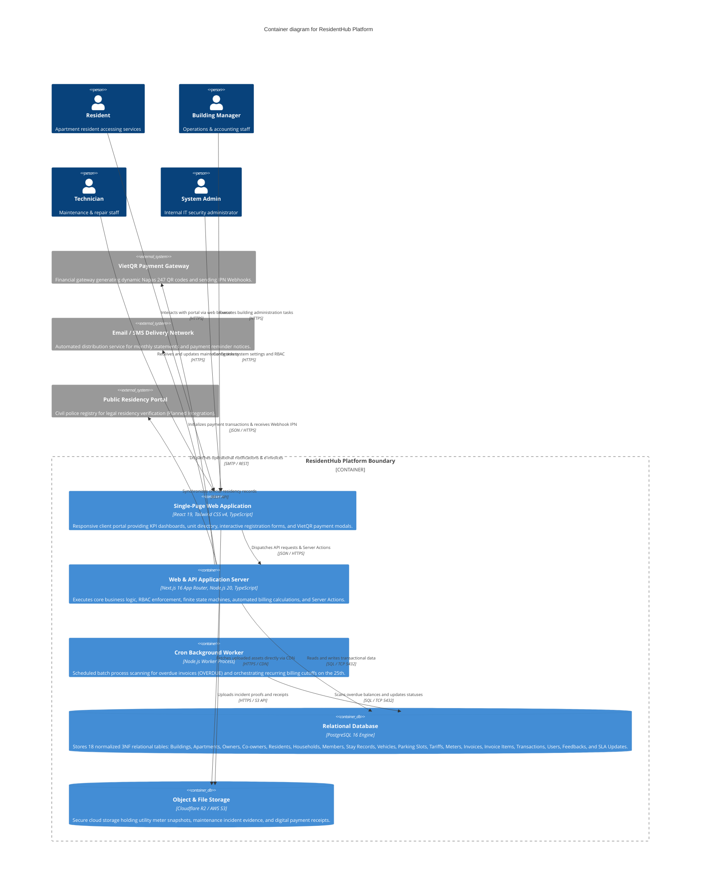
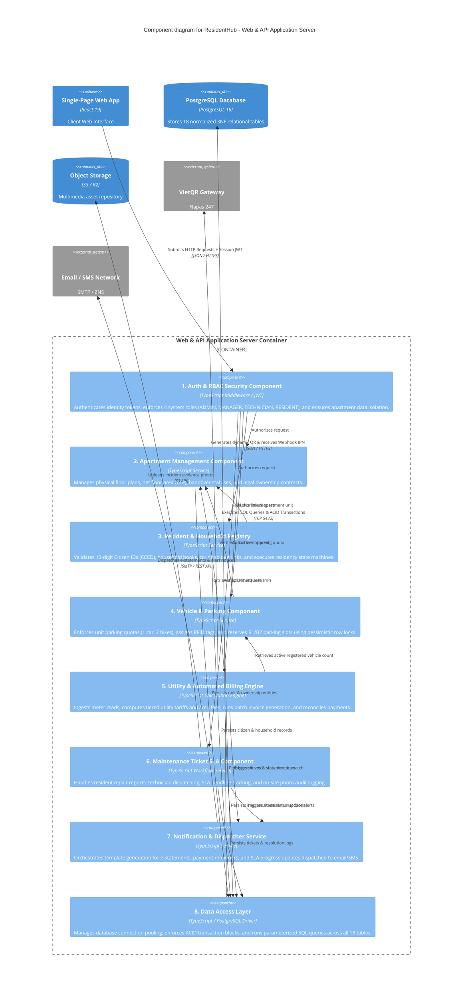
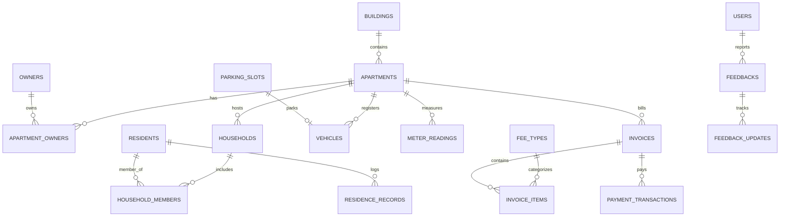
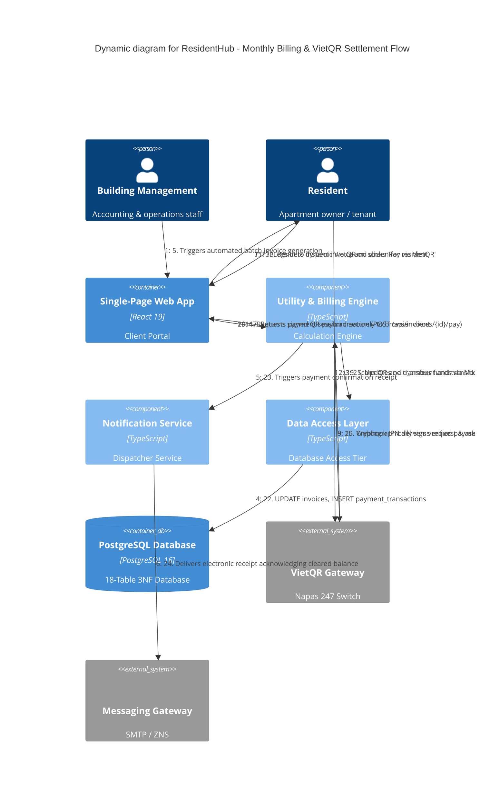
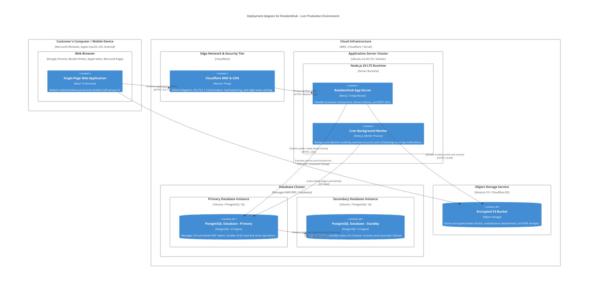

# ResidentHub - System Architecture Document (C4 Model & Mermaid Diagrams)

This document provides a comprehensive architectural specification for the **ResidentHub** platform (Apartment & Household Management System) using the **Mermaid C4 Diagram** syntax, strictly following the [Simon Brown C4 Model](https://c4model.com/), [Mermaid C4 Syntax](https://mermaid.ai/open-source/syntax/c4.html), and [C4-PlantUML Standards](https://github.com/plantuml-stdlib/C4-PlantUML/blob/master/README.md).

The architecture is organized across **4 core hierarchical levels** and **2 supplementary diagrams**:
1. [C4 System Context Diagram (`C4Context`) - Level 1](#1-c4-system-context-diagram-c4context---level-1)
2. [C4 Container Diagram (`C4Container`) - Level 2](#2-c4-container-diagram-c4container---level-2)
3. [C4 Component Diagram (`C4Component`) - Level 3](#3-c4-component-diagram-c4component---level-3)
4. [C4 Code & Data Architecture - Level 4](#4-c4-code--data-architecture---level-4)
5. [C4 Dynamic Diagram (`C4Dynamic`) - Supplementary Operational Workflow](#5-c4-dynamic-diagram-c4dynamic---supplementary-operational-workflow)
6. [C4 Deployment Diagram (`C4Deployment`) - Supplementary Infrastructure View](#6-c4-deployment-diagram-c4deployment---supplementary-infrastructure-view)

---

## 1. C4 System Context Diagram (`C4Context`) - Level 1

The System Context diagram illustrates the high-level boundary of **ResidentHub** within the building management ecosystem. Adhering strictly to C4 Level 1 principles, **ResidentHub is treated as a Black Box**, orchestrating internal stakeholders (`Person`) and third-party ecosystems (`System_Ext`).

### Context Elements Catalog
| Identifier | C4 Type | Display Label | Description & Responsibilities |
| :--- | :--- | :--- | :--- |
| `resident` | `Person` | Resident / Household Head | Self-service portal user: reviews bills, completes VietQR payments, and files service requests. |
| `manager` | `Person` | Building Management & Accounting | Operational user: inputs utility indices, generates monthly batch invoices, and reviews stay declarations. |
| `tech` | `Person` | Building Technician | Field staff: claims service tickets, uploads completion photo evidence, and meets operational SLAs. |
| `admin` | `Person` | System Administrator | Internal IT operator: system configuration, security governance, and 4-tier RBAC management (`ADMIN`, `MANAGER`, `TECHNICIAN`, `RESIDENT`). |
| `residentHub` | `System` | ResidentHub Platform | Single Source of Truth for building operations, resident census, and financial ledger. |
| `vietqr` | `System_Ext` | VietQR Gateway | Inter-bank switch providing Napas 247 dynamic QR codes and IPN transaction callbacks. |
| `notif` | `System_Ext` | Notification Service | External delivery network for e-statements and debt reminders via Email / SMS / Zalo ZNS. |
| `civil` | `System_Ext` | Public Residency Portal | Governmental civil registry interface for residency audit and compliance checking. |

---

## 2. C4 Container Diagram (`C4Container`) - Level 2

The Container diagram zooms into **ResidentHub**, decomposing the platform into independently executable software applications (`Container`), data storage units (`ContainerDb`), and their communication protocols.

### Container Inventory
| Container | Tech Stack & Environment | Primary Technical Responsibilities |
| :--- | :--- | :--- |
| **`spa`** | React 19, Tailwind CSS v4, TypeScript | Client-side presentation tier rendering reactive administrative tables, charting metrics, payment QR dialogs, and citizen declaration forms. |
| **`api`** | Next.js 16 App Router, Node.js 20 | Internal API Gateway, React Server Components (RSC), Server Actions, RBAC authorization, and automated Billing Engine execution. |
| **`worker`** | Node.js Worker Process | Headless cron runner executing scheduled batch tasks: month-end meter audits, penalty fees, and overdue state transitions. |
| **`database`** | PostgreSQL 16 (18 Tables in 3NF) | Primary ACID relational database maintaining referential integrity across 18 business entities with strict foreign keys and composite unique constraints. |
| **`storage`** | Cloudflare R2 / AWS S3 | Encrypted object storage preserving binary media: meter capture images, maintenance attachments, and PDF e-statements. |

---

## 3. C4 Component Diagram (`C4Component`) - Level 3

The Component diagram inspects the internals of the **Web & API Application Server** container, detailing functional modules (`Component`), the notification engine, and the Data Access Layer (`repo`).

### Component Catalog
| Identifier | Component Name | Technical Description & Responsibilities |
| :--- | :--- | :--- |
| **`auth`** | Auth & RBAC Security | Session decryption, token validation, 4-tier role enforcement (`ADMIN`, `MANAGER`, `TECHNICIAN`, `RESIDENT`), and apartment-level row isolation. |
| **`apt`** | Apartment Component | Manages architectural layout, unit specifications, and legal titles (`apartments`, `owners`, `apartment_owners`). |
| **`res`** | Resident Registry | Validates National Citizen IDs, tracks family relationships, and governs stay state transitions (`residents`, `households`, `household_members`, `residence_records`). |
| **`park`** | Parking Component | Validates per-unit quotas, assigns RFID access cards, and prevents double-booking using pessimistic database locks (`vehicles`, `parking_slots`). |
| **`bill`** | Billing Engine | Computes tiered electricity/water consumption, calculates area-based fees, and generates itemized monthly bills (`invoices`, `invoice_items`, `meter_readings`, `fee_types`). |
| **`ticket`** | Ticket SLA Component | Workflow manager handling resident ticket creation, technician assignment, and SLA timer monitoring (`feedbacks`, `feedback_updates`). |
| **`notif`** | Notification Service | Template compiler and queue dispatcher forwarding billing notices and critical announcements to email and messaging gateways. |
| **`repo`** | Data Access Layer | Encapsulates connection pooling, parameterized query execution, and multi-table atomic transaction wrappers across all 18 database tables. |

---

## 4. C4 Code & Data Architecture - Level 4

Level 4 maps software components down to physical data modeling and object-oriented design patterns implemented in code.

### 4.1. The 18-Table Relational Schema Catalog (3NF)
The physical persistence layer is formally defined in [schema.sql](file:///d:/VSF/chung-cu-household-management/schema.sql) and [database/schema.dbml](file:///d:/VSF/chung-cu-household-management/database/schema.dbml), organized into 5 core business domains:

1. **Property & Asset Domain**: `buildings` (physical structures), `apartments` (living units), `owners` (legal title holders), `apartment_owners` (co-ownership relations).
2. **Residency & Census Domain**: `residents` (citizen profiles), `households` (family registry units), `household_members` (head/member relations), `residence_records` (temporary stay and absence history).
3. **Parking & Vehicle Domain**: `parking_slots` (underground B1/B2 slots), `vehicles` (registered motor vehicles and bikes).
4. **Finance & Metering Domain**: `fee_types` (tariff policies), `meter_readings` (utility meter readings), `invoices` (master monthly bill), `invoice_items` (line-item charge breakdown), `payment_transactions` (reconciled payment receipts).
5. **Governance & Service Domain**: `users` (system accounts and security credentials), `feedbacks` (incident service tickets), `feedback_updates` (chronological resolution and SLA audit log).

### 4.2. Core Design Patterns in Code
- **Strategy Pattern (Fee Calculation)**: Isolates tariff formulas (area-based maintenance fees, 6-tier progressive electricity tariffs, clean water tiers, and vehicle quota formulas) into interchangeable calculation strategies.
- **Finite State Machine (FSM)**:
  - *Residency Status*: `PERMANENT` $\leftrightarrow$ `ABSENT` $\rightarrow$ `MOVED`.
  - *Invoice Lifecycle*: `UNPAID` $\rightarrow$ `PARTIAL` $\rightarrow$ `PAID` / `OVERDUE`.
  - *Maintenance SLA*: `OPEN` $\rightarrow$ `IN_PROGRESS` $\rightarrow$ `RESOLVED` $\rightarrow$ `CLOSED`.
- **Repository & Unit of Work**: Ensures atomicity across multi-table operations through explicit PostgreSQL transactions (`BEGIN ... COMMIT / ROLLBACK`).

---

## 5. C4 Dynamic Diagram (`C4Dynamic`) - Supplementary Operational Workflow

The Dynamic diagram demonstrates the runtime collaboration between users, software components, and external gateways during the end-of-month utility billing and secure VietQR settlement cycle.

---

## 6. C4 Deployment Diagram (`C4Deployment`) - Supplementary Infrastructure View

The Deployment diagram maps software containers onto physical hardware, network boundaries, and managed cloud infrastructure tiers.

### Infrastructure Mapping Catalog
| Infrastructure Node | Hardware / Cloud Environment | Deployed Container | Role & Capacity |
| :--- | :--- | :--- | :--- |
| **`browser`** | End-User Client Device | `spa` | Client environment executing optimized React 19 JavaScript bundles. |
| **`edge`** | Cloudflare Global Anycast Network | `waf` | Perimeter defense, Web Application Firewall (WAF), edge SSL offloading, and static asset caching. |
| **`app_server_node`** | Docker on Ubuntu 22.04 LTS | `api`, `worker` | Compute cluster running Next.js 16 App Server and headless Node.js cron workers. |
| **`db_node`** | AWS RDS Multi-AZ / Supabase | `db_primary`, `db_standby` | Enterprise database cluster operating active-standby replication across 18 normalized tables with automated failover. |
| **`storage_node`** | Amazon S3 / Cloudflare R2 | `s3` | Scalable object storage preserving encrypted unstructured media with regional CDN distribution. |
