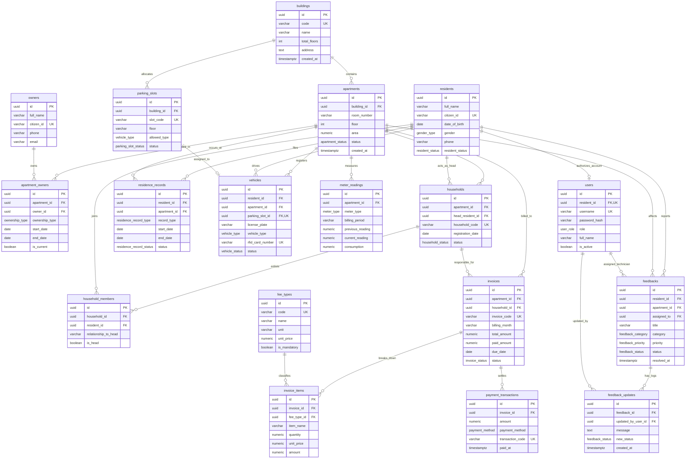
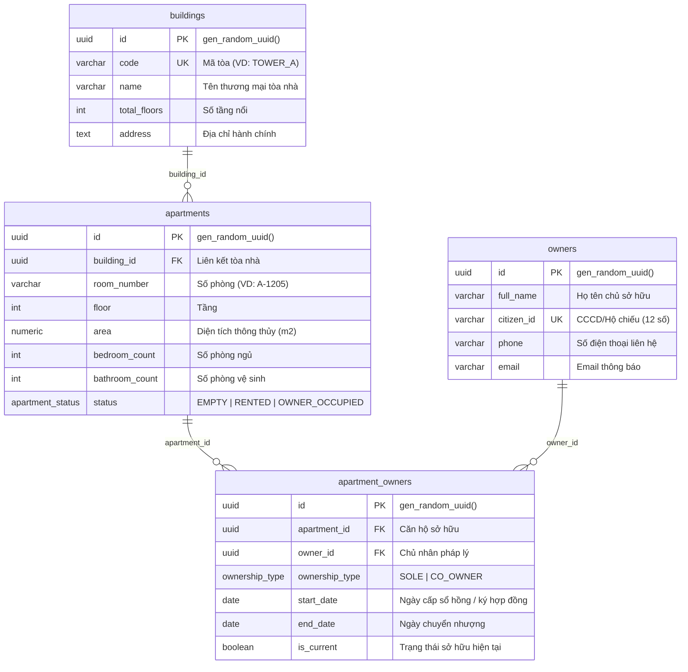
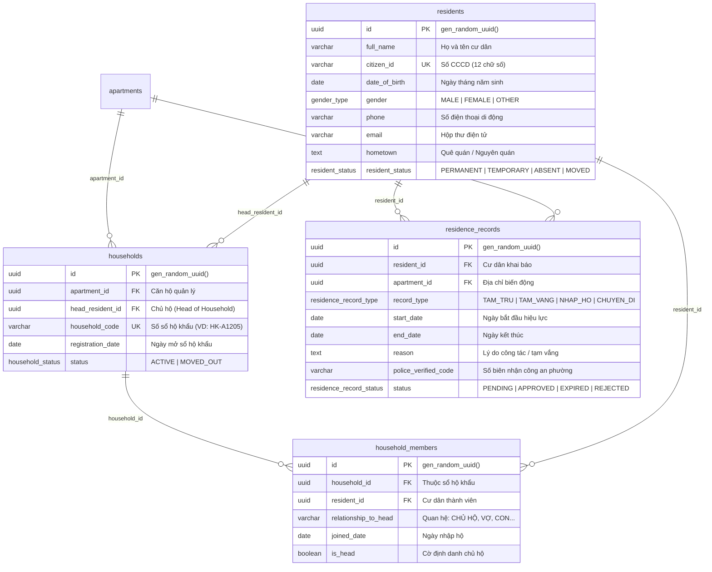
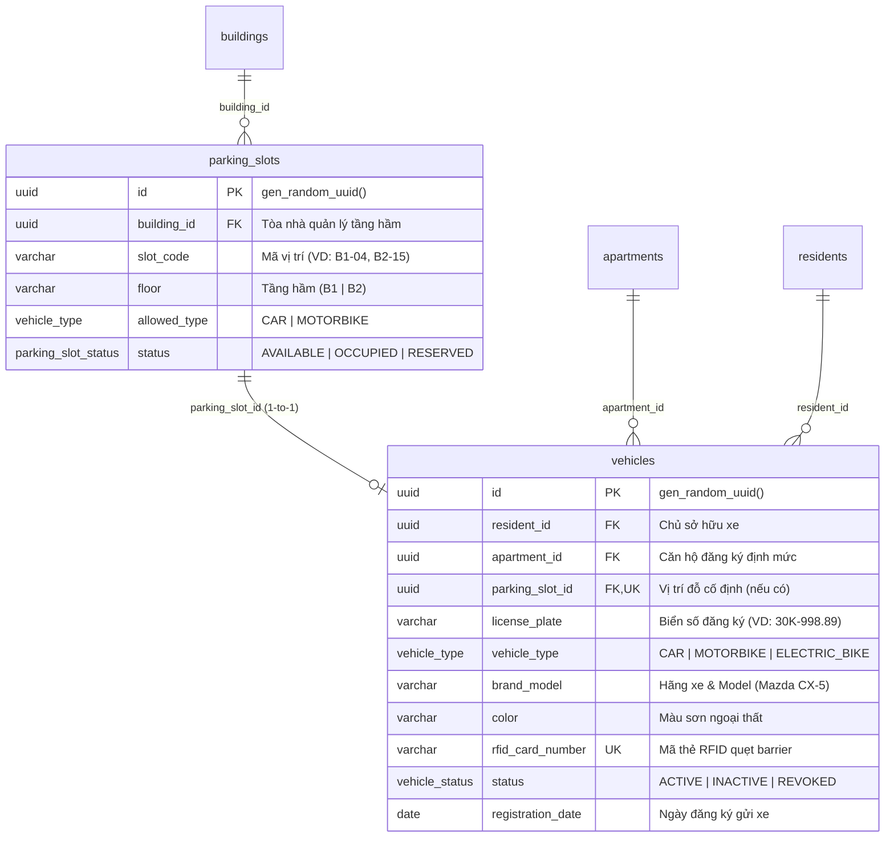
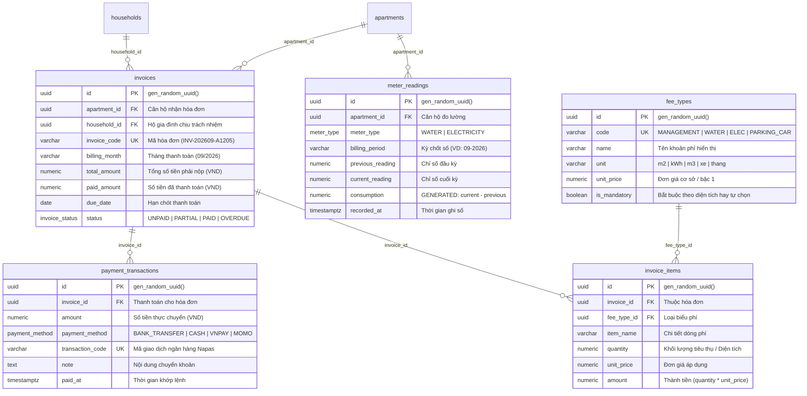
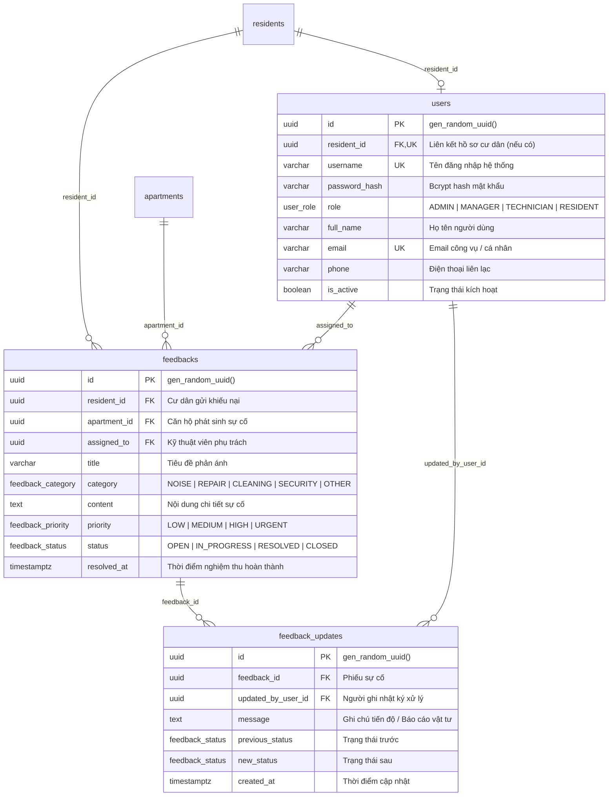

# ResidentHub — Database Specification & Entity-Relationship Diagrams (ERD)
## Comprehensive 18-Table Relational Schema, Data Dictionary & Concurrency Architecture

> **Status:** Approved Architectural Baseline  
> **Database Engine:** PostgreSQL 16+ (Normalized 3NF)  
> **Traceability Links:**  
> - 🗄️ [database/schema.sql](../database/schema.sql) (Production DDL Script with Constraints & Indexes)  
> - 📐 [database/schema.dbml](../database/schema.dbml) (DBML Schema for dbdiagram.io / dbdocs.io)  
> - 📋 [REQUIREMENTS_INVEST.md](REQUIREMENTS_INVEST.md) (Agile User Stories & Acceptance Criteria)  
> - 🏛️ [ARCHITECTURE_C4.md](ARCHITECTURE_C4.md) (C4 Level 2 Container & Level 3 Component Diagrams)  
> - 🔌 [API_DOCUMENTATION.md](API_DOCUMENTATION.md) (REST Endpoints & RFC 7807 Error Envelope)  
> - 🔗 [UI_DATABASE_MAPPING.md](UI_DATABASE_MAPPING.md) (Field-level UI-to-Database Mapping)  

---

## 📑 Table of Contents

1. [Architectural Overview & Relational Modeling Principles](#1-architectural-overview--relational-modeling-principles)
2. [Global System Entity-Relationship Diagram (18 Tables)](#2-global-system-entity-relationship-diagram-18-tables)
3. [Subsystem Domain ERDs & Entity Deep-Dives](#3-subsystem-domain-erds--entity-deep-dives)
   - [3.1. Subsystem 1: Buildings, Apartments & Ownership Deeds](#31-subsystem-1-buildings-apartments--ownership-deeds)
   - [3.2. Subsystem 2: Households, Residents & Civil Movements](#32-subsystem-2-households-residents--civil-movements)
   - [3.3. Subsystem 3: Basements, Parking Slots & Vehicle Quotas](#33-subsystem-3-basements-parking-slots--vehicle-quotas)
   - [3.4. Subsystem 4: Meters, Progressive Tariffs, Invoices & Payments](#34-subsystem-4-meters-progressive-tariffs-invoices--payments)
   - [3.5. Subsystem 5: Incident Maintenance, SLAs & User Governance](#35-subsystem-5-incident-maintenance-slas--user-governance)
4. [Complete 18-Table Data Dictionary](#4-complete-18-table-data-dictionary)
5. [High-Performance Indexing & Query Optimization Strategy](#5-high-performance-indexing--query-optimization-strategy)
6. [ACID Concurrency Control & Pessimistic Locking Mechanisms](#6-acid-concurrency-control--pessimistic-locking-mechanisms)
7. [Integrity Triggers, Computed Columns & Cascading Rules](#7-integrity-triggers-computed-columns--cascading-rules)
8. [Soft Delete Mechanism & Partial Index Strategy](#8-soft-delete-mechanism--partial-index-strategy)
9. [High-Scale Table Partitioning Specification](#9-high-scale-table-partitioning-specification)

---

## 1. Architectural Overview & Relational Modeling Principles

The **ResidentHub** data tier is architected to serve as the unified, immutable Single Source of Truth for urban high-rise operations. The schema adheres to four strict database design standards:

1. **Third Normal Form (3NF) Strictness:** All transitive dependencies are removed. Data such as resident identities (`residents`), ownership legal contracts (`owners`, `apartment_owners`), and household rosters (`households`, `household_members`) are decoupled.
2. **Surrogate UUID Primary Keys:** All tables use cryptographically secure `UUID v4` (`gen_random_uuid()`) primary keys to prevent enumeration attacks, facilitate zero-collision distributed insertions, and decouple logical identifiers from storage sequence.
3. **Optimized Concurrency Locks:** Scarce physical entities (basement parking spaces) and periodic financial cut-offs enforce pessimistic row-level locking (`SELECT ... FOR UPDATE`) to guarantee zero double-allocation.
4. **Declarative Integrity & Virtual Generated Columns:** Consumption indices are computed natively via PostgreSQL generated columns (`GENERATED ALWAYS AS (current_reading - previous_reading) STORED`) to eliminate synchronization bugs between software layers.

---

## 2. Global System Entity-Relationship Diagram (18 Tables)



---

## 3. Subsystem Domain ERDs & Entity Deep-Dives

### 3.1. Subsystem 1: Buildings, Apartments & Ownership Deeds

Governs building infrastructure hierarchy and legal property title deeds:



* **Ràng buộc toàn vẹn:** `uq_building_room (building_id, room_number)` ngăn chặn tình trạng tạo 2 căn hộ trùng số phòng trong cùng một tòa nhà.
* **Xử lý xóa:** `ON DELETE CASCADE` đảm bảo khi xóa căn hộ, thông tin liên kết chủ hộ sở hữu tự động được thu hồi.

---

### 3.2. Subsystem 2: Households, Residents & Civil Movements

Quản lý nhân khẩu học, sổ hộ khẩu chung cư và biến động lưu trú theo quy định hành chính:



* **Toàn vẹn quan hệ:** Bảng `household_members` có khóa kết hợp duy nhất `uq_household_resident (household_id, resident_id)` chống gán trùng một cư dân vào cùng một hộ khẩu nhiều lần.
* **Quy tắc xóa:** `ON DELETE RESTRICT` trên `households.head_resident_id` và `households.apartment_id` ngăn chặn việc vô tình xóa cư dân đang giữ tư cách chủ hộ.

---

### 3.3. Subsystem 3: Basements, Parking Slots & Vehicle Quotas

Quản lý không gian bãi đỗ xe tầng hầm B1/B2, định danh thẻ quẹt RFID và kiểm soát hạn ngạch căn hộ:



* **Tính độc quyền vị trí:** Cột `vehicles.parking_slot_id` có ràng buộc duy nhất `UNIQUE`, đảm bảo một vị trí đỗ xe tại một thời điểm chỉ có thể phân bổ cho duy nhất 1 phương tiện.
* **Hạn ngạch xe (Business Rule):** Hệ thống chặn việc đăng ký vượt quá **1 ô tô** và **2 xe máy** cho một căn hộ.

---

### 3.4. Subsystem 4: Meters, Progressive Tariffs, Invoices & Payments

Trục động cơ tài chính, tính toán tiêu thụ điện/nước, lập hóa đơn tự động và gạch nợ Napas/VietQR:



* **Chống chốt số ngược:** `CHECK (current_reading >= previous_reading)` bảo đảm số tiêu thụ điện nước không âm.
* **Chống xuất hóa đơn trùng:** Chỉ mục phức hợp `(apartment_id, billing_month)` bảo đảm mỗi căn hộ chỉ có duy nhất 1 hóa đơn định kỳ trong một tháng.

---

### 3.5. Subsystem 5: Incident Maintenance, SLAs & User Governance

Quản lý tiếp nhận phản ánh kiến nghị của cư dân, điều phối kỹ thuật viên hiện trường và tài khoản người dùng RBAC:



---

## 4. Complete 18-Table Data Dictionary

| # | Tên bảng SQL | Tên đại diện | Mô tả nghiệp vụ | Khóa chính & Ngoại |
| :---: | :--- | :--- | :--- | :--- |
| 1 | `buildings` | Tòa nhà | Danh mục các tòa tháp chung cư trong quần thể | **PK:** `id` |
| 2 | `apartments` | Căn hộ | Thực thể căn hộ vật lý, diện tích m², tầng và trạng thái cư trú | **PK:** `id`<br/>**FK:** `building_id` |
| 3 | `owners` | Chủ sở hữu | Danh bạ pháp nhân/thể nhân sở hữu bất động sản | **PK:** `id` |
| 4 | `apartment_owners` | Sở hữu căn hộ | Hợp đồng / Sổ hồng chứng nhận quyền sở hữu theo thời gian | **PK:** `id`<br/>**FK:** `apartment_id`, `owner_id` |
| 5 | `residents` | Cư dân | Hồ sơ nhân khẩu học, số định danh CCCD và thông tin liên hệ | **PK:** `id` |
| 6 | `households` | Sổ hộ khẩu | Sổ hộ khẩu chung cư, liên kết căn hộ và định danh chủ hộ | **PK:** `id`<br/>**FK:** `apartment_id`, `head_resident_id` |
| 7 | `household_members` | Nhân khẩu hộ | Danh sách thành viên và mối quan hệ với chủ hộ trong sổ | **PK:** `id`<br/>**FK:** `household_id`, `resident_id` |
| 8 | `residence_records` | Biến động cư trú | Hồ sơ đăng ký Tạm trú, Tạm vắng, Nhập hộ, Chuyển đi | **PK:** `id`<br/>**FK:** `resident_id`, `apartment_id` |
| 9 | `parking_slots` | Vị trí đỗ xe | Các slot đỗ xe tại tầng hầm B1/B2 và tình trạng chiếm dụng | **PK:** `id`<br/>**FK:** `building_id` |
| 10 | `vehicles` | Phương tiện | Phương tiện của cư dân, gắn slot đỗ hầm và mã thẻ quẹt RFID | **PK:** `id`<br/>**FK:** `resident_id`, `apartment_id`, `parking_slot_id` |
| 11 | `fee_types` | Biểu phí dịch vụ | Biểu giá phí quản lý, đơn giá lũy tiến nước, điện, gửi xe | **PK:** `id` |
| 12 | `meter_readings` | Chỉ số công tơ | Số đo điện nước định kỳ hàng tháng theo từng căn hộ | **PK:** `id`<br/>**FK:** `apartment_id` |
| 13 | `invoices` | Hóa đơn tháng | Hóa đơn tổng hợp dịch vụ hàng tháng của căn hộ | **PK:** `id`<br/>**FK:** `apartment_id`, `household_id` |
| 14 | `invoice_items` | Chi tiết hóa đơn | Bảng kê phân rã từng khoản phí thành phần trong hóa đơn | **PK:** `id`<br/>**FK:** `invoice_id`, `fee_type_id` |
| 15 | `payment_transactions` | Giao dịch nạp tiền | Nhật ký giao dịch chuyển khoản VietQR, POS hoặc tiền mặt | **PK:** `id`<br/>**FK:** `invoice_id` |
| 16 | `users` | Tài khoản hệ thống | Tài khoản xác thực danh tính và phân quyền RBAC 4 cấp | **PK:** `id`<br/>**FK:** `resident_id` |
| 17 | `feedbacks` | Phản ánh bảo trì | Phiếu khiếu nại, yêu cầu sửa chữa và sự cố tòa nhà | **PK:** `id`<br/>**FK:** `resident_id`, `apartment_id`, `assigned_to` |
| 18 | `feedback_updates` | Nhật ký xử lý | Lịch sử trao đổi, cập nhật trạng thái SLA của phản ánh | **PK:** `id`<br/>**FK:** `feedback_id`, `updated_by_user_id` |

---

## 5. High-Performance Indexing & Query Optimization Strategy

Nhằm bảo đảm tốc độ phản hồi sub-50ms trong các tác vụ truy vấn danh bạ lớn và xử lý tài chính định kỳ, hệ thống thiết lập 16 chỉ mục chuyên biệt:

```sql
-- 1. Tối ưu tìm kiếm căn hộ theo tòa nhà và trạng thái
CREATE INDEX idx_apartments_building_id ON apartments(building_id);
CREATE INDEX idx_apartments_status ON apartments(status);

-- 2. Tối ưu truy vấn hộ khẩu và nhân thân cư dân
CREATE INDEX idx_households_apartment_id ON households(apartment_id);
CREATE INDEX idx_households_head_id ON households(head_resident_id);
CREATE INDEX idx_residents_citizen_id ON residents(citizen_id);
CREATE INDEX idx_residents_phone ON residents(phone);

-- 3. Tối ưu tìm kiếm thành viên gia đình và lịch sử cư trú
CREATE INDEX idx_household_members_household ON household_members(household_id);
CREATE INDEX idx_household_members_resident ON household_members(resident_id);
CREATE INDEX idx_residence_records_resident ON residence_records(resident_id);

-- 4. Tối ưu kiểm soát phương tiện và thẻ RFID tầng hầm
CREATE INDEX idx_vehicles_apartment ON vehicles(apartment_id);
CREATE INDEX idx_vehicles_license_plate ON vehicles(license_plate);

-- 5. Tối ưu truy xuất hóa đơn và đối soát thanh toán
CREATE INDEX idx_invoices_apartment_status ON invoices(apartment_id, status);
CREATE INDEX idx_invoices_billing_month ON invoices(billing_month);

-- 6. Tối ưu quản lý sự cố và vận hành kỹ thuật
CREATE INDEX idx_feedbacks_status ON feedbacks(status);
CREATE INDEX idx_feedbacks_resident ON feedbacks(resident_id);
CREATE INDEX idx_users_username ON users(username);
```

---

## 6. ACID Concurrency Control & Pessimistic Locking Mechanisms

Trong môi trường vận hành chung cư quy mô lớn (hàng nghìn căn hộ), có hai luồng nghiệp vụ tiềm ẩn rủi ro tương tranh nghiêm trọng:

### 6.1. Tranh chấp slot đỗ xe tầng hầm (`US-VEH-02`)
Khi nhiều cư dân cùng chọn đặt chỗ ô tô cuối cùng tại tầng hầm B1, hệ thống áp dụng cơ chế khóa hàng bi quan (**Pessimistic Row Lock**):
```sql
BEGIN;
-- Khóa bản ghi slot đỗ xe ngăn các transaction khác đọc/ghi đè cùng lúc
SELECT id, status, floor, slot_code 
FROM parking_slots 
WHERE id = $1 AND status = 'AVAILABLE' 
FOR UPDATE;

-- Nếu slot không còn khả dụng, ROLLBACK ngay lập tức và trả về HTTP 409
-- Nếu hợp lệ:
UPDATE parking_slots SET status = 'OCCUPIED' WHERE id = $1;
INSERT INTO vehicles (resident_id, apartment_id, parking_slot_id, license_plate, vehicle_type, rfid_card_number)
VALUES ($2, $3, $1, $4, 'CAR', $5);

COMMIT;
```

### 6.2. Tạo hóa đơn lô tháng chống trùng lặp (`US-BIL-02`)
Quá trình chốt hóa đơn toàn tòa nhà được bảo vệ bằng chỉ mục độc nhất và kiểm tra khóa giao dịch:
```sql
-- Ràng buộc độc nhất ngăn chặn việc tạo 2 hóa đơn cho cùng 1 căn hộ trong 1 tháng
ALTER TABLE invoices ADD CONSTRAINT uq_apartment_billing_month UNIQUE (apartment_id, billing_month);
```

---

## 7. Integrity Triggers, Computed Columns & Cascading Rules

1. **Cột tính toán tự động:**
   ```sql
   consumption NUMERIC(10, 2) GENERATED ALWAYS AS (current_reading - previous_reading) STORED;
   ```
   Tránh hoàn toàn sai lệch tính toán giữa ứng dụng Backend và Cơ sở dữ liệu.

2. **Chính sách Cascading an toàn:**
   - Khi xóa một `invoice`, toàn bộ `invoice_items` chi tiết và `payment_transactions` được thu hồi bằng `ON DELETE CASCADE`.
   - Đối với tài sản gốc như `apartments` hay `residents`, các liên kết pháp lý như `households` được bảo vệ bằng `ON DELETE RESTRICT` để tránh làm thất thoát lịch sử nhân khẩu học.

---

## 8. Soft Delete Mechanism & Partial Index Strategy

### 8.1. Rationale & Regulatory Compliance
Trong các hệ thống quản lý bất động sản và cư dân đô thị, việc xóa cứng dữ liệu (`DELETE FROM`) bị nghiêm cấm vì:
1. **Kiểm toán pháp lý & Lịch sử nhân khẩu:** Khi một cư dân chuyển đi hoặc bán căn hộ, hồ sơ CCCD, các đợt tạm trú/tạm vắng và lịch sử hóa đơn phải được bảo toàn vĩnh viễn theo quy định lưu trữ của cơ quan công an và thuế.
2. **Khắc phục lỗi thao tác (Accidental Deletions):** Cho phép ban quản lý khôi phục tức thì căn hộ hoặc thông tin cư dân nếu nhân viên bấm nhầm.

### 8.2. Implementation via `deleted_at` Timestamp
Mỗi thực thể chính đều mang trường kiểm toán:
```sql
deleted_at TIMESTAMPTZ DEFAULT NULL
```
- Khi bản ghi đang hoạt động: `deleted_at IS NULL`.
- Khi bản ghi bị xóa logic: `deleted_at = CURRENT_TIMESTAMP`.

### 8.3. Partial Unique Index Architecture
Để giải quyết mâu thuẫn giữa ràng buộc UNIQUE và Soft Delete (ví dụ: một chiếc xe máy biển số `29A1-12345` sau khi bị xóa/chuyển nhượng thì người khác phải có thể đăng ký lại biển số đó), hệ thống sử dụng **Partial Unique Indexes**:

```sql
-- Chỉ kiểm tra tính duy nhất trên các bản ghi CHƯA BỊ XÓA (Active Records)
CREATE UNIQUE INDEX idx_uq_residents_citizen_id_active 
ON residents (citizen_id) 
WHERE deleted_at IS NULL;

CREATE UNIQUE INDEX idx_uq_apartments_room_active 
ON apartments (building_id, room_number) 
WHERE deleted_at IS NULL;

CREATE UNIQUE INDEX idx_uq_vehicles_license_plate_active 
ON vehicles (license_plate) 
WHERE deleted_at IS NULL;

CREATE UNIQUE INDEX idx_uq_parking_slots_code_active 
ON parking_slots (building_id, slot_code) 
WHERE deleted_at IS NULL;
```

### 8.4. Application Query Pattern
Tầng Data Access Layer (Repositories) luôn tự động gắn điều kiện lọc:
```sql
-- Standard active query
SELECT * FROM apartments 
WHERE building_id = $1 AND deleted_at IS NULL 
ORDER BY room_number ASC;

-- Administrative audit query (view archived/deleted records)
SELECT * FROM residents 
WHERE deleted_at IS NOT NULL 
ORDER BY deleted_at DESC;
```

---

## 9. High-Scale Table Partitioning Specification

### 9.1. Growth Dynamics & Scalability Bottlenecks
Đối với một cụm chung cư 2,000 căn hộ:
- **`meter_readings`:** 2,000 căn hộ $\times$ 2 loại đồng hồ (điện + nước) = 4,000 bản ghi/tháng $\rightarrow$ gần 50,000 bản ghi/năm.
- **`invoices` & `invoice_items`:** 2,000 hóa đơn $\times$ 8 mục phí = 18,000 bản ghi/tháng $\rightarrow$ hơn 200,000 bản ghi/năm.

Sau 5 năm vận hành, bảng hóa đơn và chỉ số tích lũy hàng triệu dòng, khiến các câu lệnh quét hóa đơn tháng hiện tại bị suy giảm I/O trầm trọng nếu lưu trên một bảng đơn lẻ.

### 9.2. Declarative Range Partitioning Architecture
ResidentHub áp dụng mô hình **Range Partitioning theo tháng** (`PARTITION BY RANGE`):

```sql
-- 1. Bảng cha phân vùng cho hóa đơn
CREATE TABLE invoices_partitioned (
    id UUID DEFAULT gen_random_uuid(),
    apartment_id UUID NOT NULL,
    household_id UUID,
    invoice_code VARCHAR(100) NOT NULL,
    billing_month VARCHAR(20) NOT NULL,
    billing_date DATE NOT NULL,
    total_amount NUMERIC(12, 2) NOT NULL DEFAULT 0,
    paid_amount NUMERIC(12, 2) NOT NULL DEFAULT 0,
    due_date DATE NOT NULL,
    status invoice_status DEFAULT 'UNPAID',
    created_at TIMESTAMPTZ DEFAULT CURRENT_TIMESTAMP,
    updated_at TIMESTAMPTZ DEFAULT CURRENT_TIMESTAMP,
    deleted_at TIMESTAMPTZ DEFAULT NULL,
    PRIMARY KEY (id, billing_date)
) PARTITION BY RANGE (billing_date);

-- 2. Khởi tạo các partition tháng cụ thể
CREATE TABLE invoices_2026_01 PARTITION OF invoices_partitioned
    FOR VALUES FROM ('2026-01-01') TO ('2026-02-01');

CREATE TABLE invoices_2026_02 PARTITION OF invoices_partitioned
    FOR VALUES FROM ('2026-02-01') TO ('2026-03-01');

CREATE TABLE invoices_2026_03 PARTITION OF invoices_partitioned
    FOR VALUES FROM ('2026-03-01') TO ('2026-04-01');
```

### 9.3. Partition Pruning Performance Advantage
Khi hệ thống truy vấn hóa đơn của tháng hiện tại (`billing_date >= '2026-03-01' AND billing_date < '2026-04-01'`), trình tối ưu hóa truy vấn PostgreSQL kích hoạt tính năng **Partition Pruning**:
- Bỏ qua hoàn toàn việc quét đĩa trên các partition của năm trước.
- Giảm số lượng block I/O lên tới **95%**.
- Tăng tốc độ phản hồi API chốt hóa đơn hàng loạt và báo cáo thu tài chính.

### 9.4. Cold-Storage Detachment Policy
Dữ liệu trên 5 năm có thể được ngắt kết nối linh hoạt mà không cần xóa vật lý:
```sql
-- Ngắt partition cũ để lưu trữ lạnh (Cold Data Storage)
ALTER TABLE invoices_partitioned DETACH PARTITION invoices_2021_01;
-- Sau đó nén thành định dạng Parquet xuất lên AWS S3 / Cloudflare R2
```
