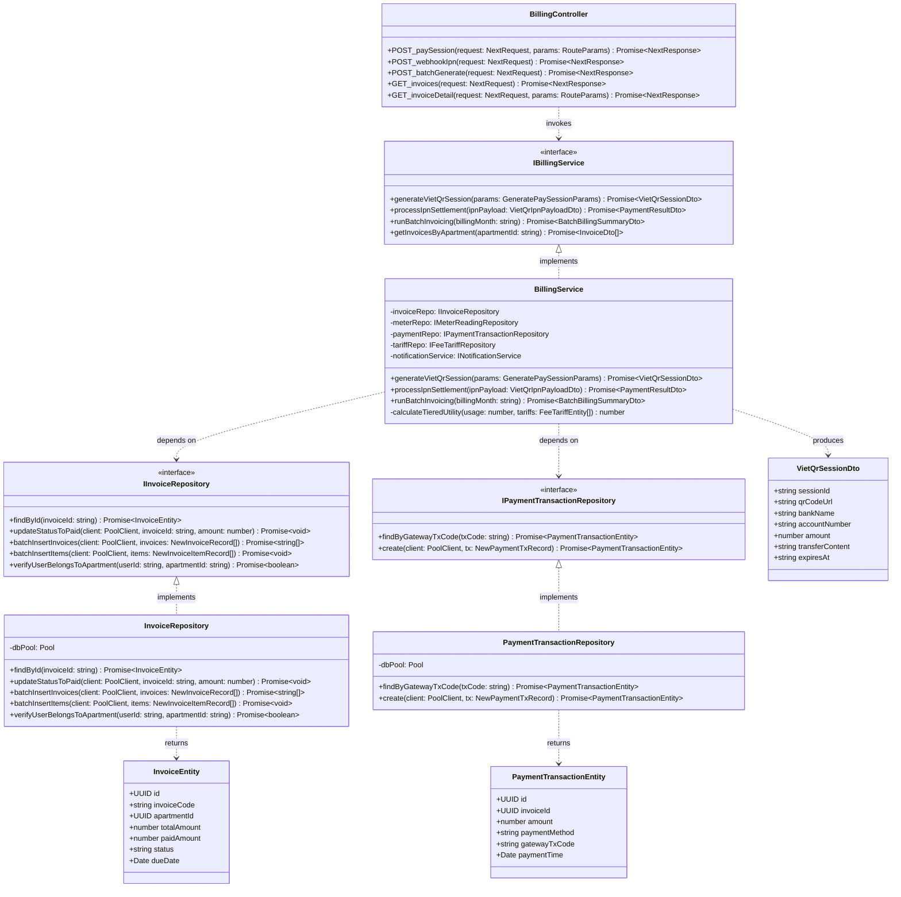
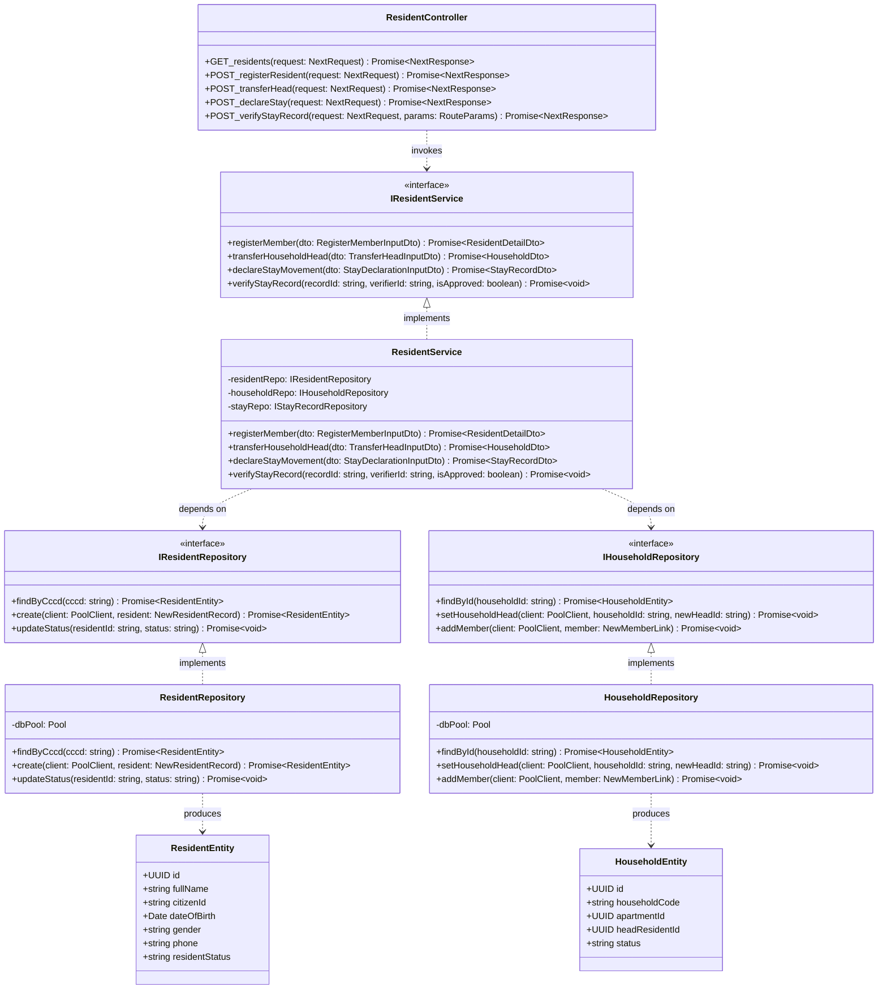
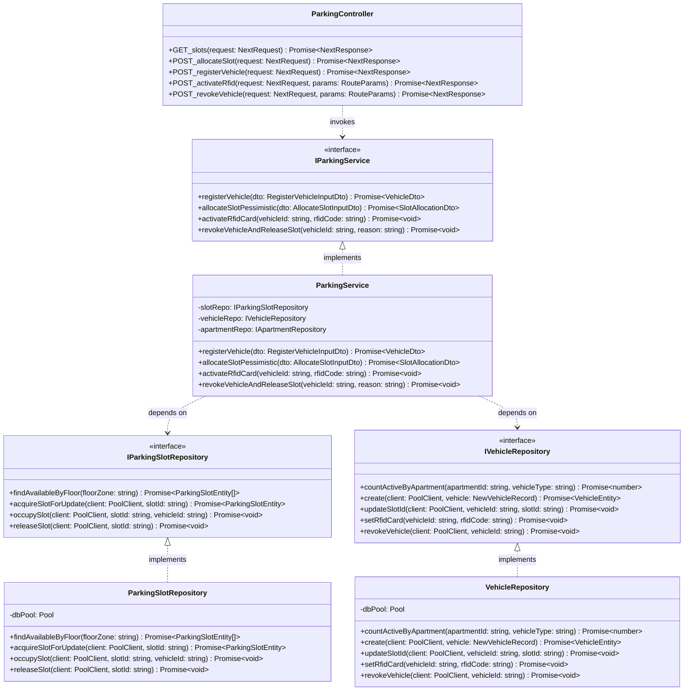
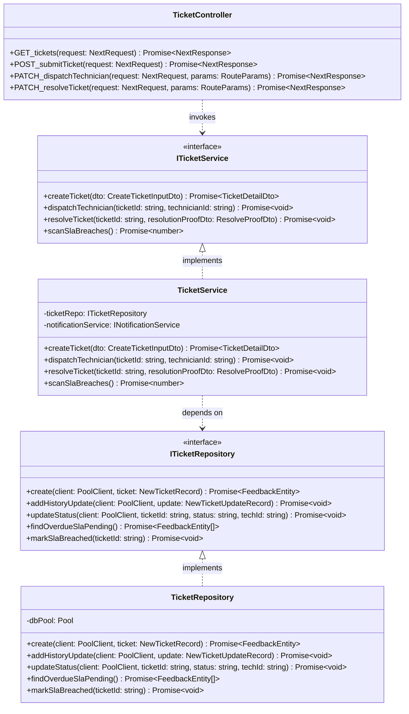
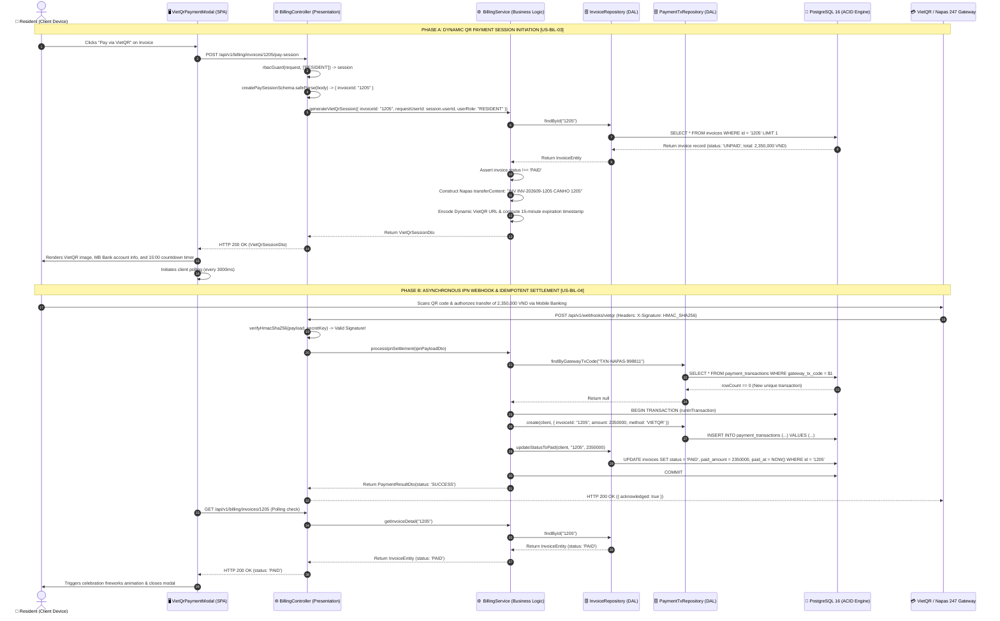
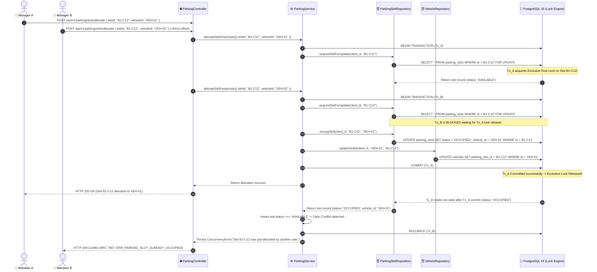
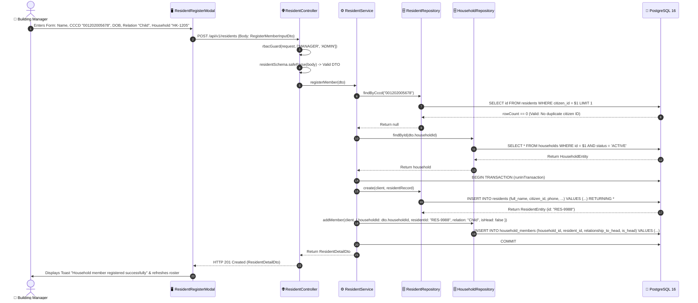
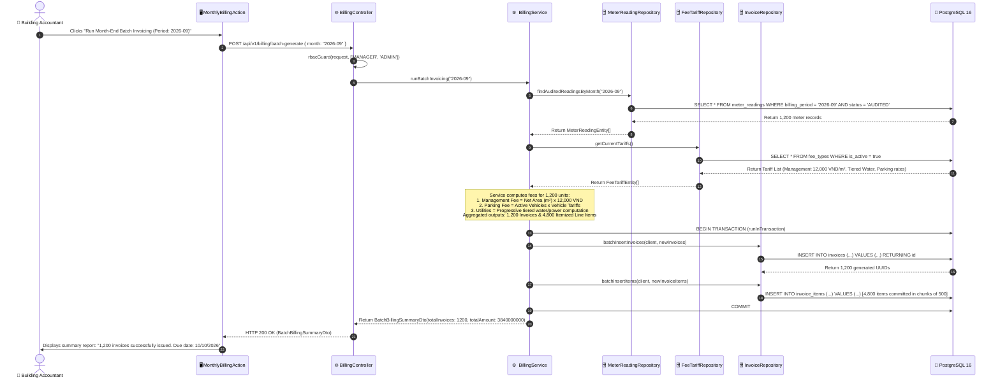

# ResidentHub — Detailed Class & Sequence Diagrams (3-Tier Layering)
## Comprehensive UML Class Specifications & Method-Level Sequence Diagrams Aligned with 3-Tier Architecture

> **Status:** Approved Architectural Baseline  
> **Audience:** Backend Engineers, Software Architects, QA/SDET, Code Reviewers  
> **Standard:** UML 2.5, Clean Architecture / 3-Tier Layering, RFC 7807  
> **Traceability Links:**  
> - 📂 [FOLDER_STRUCTURE_AND_3TIER_ARCHITECTURE.md](FOLDER_STRUCTURE_AND_3TIER_ARCHITECTURE.md) (Physical Folder Layout & Layer Boundaries)  
> - 📋 [REQUIREMENTS_INVEST.md](REQUIREMENTS_INVEST.md) (Agile Requirements & INVEST Acceptance Criteria)  
> - 🏛️ [ARCHITECTURE_C4.md](ARCHITECTURE_C4.md) (C4 Level 3 Component Diagrams)  
> - 🔌 [API_DOCUMENTATION.md](API_DOCUMENTATION.md) (REST Endpoints & DTO Contracts)  
> - 🗄️ [schema.sql](../schema.sql) (PostgreSQL 18-Table 3NF Normalized Database Schema)

---

## 📑 Table of Contents

1. [3-Tier UML Design Methodology](#1-3-tier-uml-design-methodology)
2. [UML Class Diagrams across the 3 Tiers](#2-uml-class-diagrams-across-the-3-tiers)
   - [2.1. Billing, Metering & VietQR Payment Subsystem](#21-billing-metering--vietqr-payment-subsystem)
   - [2.2. Residents, Households & Civil Registry Subsystem](#22-residents-households--civil-registry-subsystem)
   - [2.3. Vehicles & Underground Parking Subsystem](#23-vehicles--underground-parking-subsystem)
   - [2.4. Service Tickets & Maintenance SLA Subsystem](#24-service-tickets--maintenance-sla-subsystem)
3. [Detailed Method-Level Sequence Diagrams](#3-detailed-method-level-sequence-diagrams)
   - [3.1. Flow 1: Dynamic VietQR Payment & Webhook IPN Settlement (US-BIL-03, US-BIL-04)](#31-flow-1-dynamic-vietqr-payment--webhook-ipn-settlement-us-bil-03-us-bil-04)
   - [3.2. Flow 2: Underground Parking Slot Allocation via Pessimistic Lock (US-VEH-02)](#32-flow-2-underground-parking-slot-allocation-via-pessimistic-lock-us-veh-02)
   - [3.3. Flow 3: Household Member Registration & Citizen ID Verification (US-RES-01)](#33-flow-3-household-member-registration--citizen-id-verification-us-res-01)
   - [3.4. Flow 4: Month-End Meter Capture & Batch Billing Generation (US-BIL-02)](#34-flow-4-month-end-meter-capture--batch-billing-generation-us-bil-02)
4. [3-Tier Method Traceability Matrix](#4-3-tier-method-traceability-matrix)

---

## 1. 3-Tier UML Design Methodology

The Class and Sequence diagrams in this document strictly enforce the **3-Tier Architecture** established in [FOLDER_STRUCTURE_AND_3TIER_ARCHITECTURE.md](FOLDER_STRUCTURE_AND_3TIER_ARCHITECTURE.md):

1. **Presentation Tier (Controllers / Route Handlers):** Acts as the ingress boundary, receiving HTTP requests, executing authentication & authorization guards (`rbacGuard`), validating input payloads with Zod schemas, and delegating business execution to the Service layer.
2. **Business Logic Tier (Domain Services):** Encapsulates core business rules, progressive tariff computations, quota enforcement, and ACID transaction orchestration (`runInTransaction`), remaining completely independent of HTTP framework primitives.
3. **Data Access Tier (Repositories & Storage):** Executes parameterized SQL statements (`$1, $2`), acquires pessimistic locks (`SELECT ... FOR UPDATE`), and maps relational database rows to domain entities.

---

## 2. UML Class Diagrams across the 3 Tiers

### 2.1. Billing, Metering & VietQR Payment Subsystem

---

### 2.2. Residents, Households & Civil Registry Subsystem

---

### 2.3. Vehicles & Underground Parking Subsystem

---

### 2.4. Service Tickets & Maintenance SLA Subsystem

---

## 3. Detailed Method-Level Sequence Diagrams

### 3.1. Flow 1: Dynamic VietQR Payment & Webhook IPN Settlement (US-BIL-03, US-BIL-04)

Illustrates the full settlement lifecycle: (A) Dynamic QR payment session initiation and (B) Asynchronous Napas 247 IPN webhook handling with strict Idempotency deduplication:

---

### 3.2. Flow 2: Underground Parking Slot Allocation via Pessimistic Lock (US-VEH-02)

Demonstrates how the Data Access layer utilizes PostgreSQL `SELECT ... FOR UPDATE` row locks to completely eliminate race conditions when multiple managers attempt to reserve the same parking slot:

---

### 3.3. Flow 3: Household Member Registration & Citizen ID Verification (US-RES-01)

---

### 3.4. Flow 4: Month-End Meter Capture & Batch Billing Generation (US-BIL-02)

---

## 4. 3-Tier Method Traceability Matrix

Bidirectional cross-reference matrix tracing **REST API Endpoints (#4)** $\leftrightarrow$ **Controller Methods (#5)** $\leftrightarrow$ **Service Methods (#5)** $\leftrightarrow$ **Repository Methods (#5)** $\leftrightarrow$ **SQL Tables (#4)**:

| REST API Endpoint | Controller Ingress (Presentation) | Service Logic (Business Tier) | Repository Operations (Data Access) | SQL Tables (3NF Schema) |
| :--- | :--- | :--- | :--- | :--- |
| `POST /api/v1/billing/invoices/{id}/pay-session` | `BillingController.POST_paySession` | `BillingService.generateVietQrSession` | `InvoiceRepository.findById` | `invoices`, `apartments` |
| `POST /api/v1/webhooks/vietqr` | `BillingController.POST_webhookIpn` | `BillingService.processIpnSettlement` | `PaymentTxRepo.create` `InvoiceRepo.updateStatusToPaid` | `payment_transactions`, `invoices` |
| `POST /api/v1/billing/batch-generate` | `BillingController.POST_batchGenerate` | `BillingService.runBatchInvoicing` | `MeterRepo.findAuditedReadings` `InvoiceRepo.batchInsertInvoices` | `meter_readings`, `invoices`, `invoice_items` |
| `POST /api/v1/residents` | `ResidentController.POST_registerResident` | `ResidentService.registerMember` | `ResidentRepo.create` `HouseholdRepo.addMember` | `residents`, `household_members` |
| `POST /api/v1/residents/head-transfer` | `ResidentController.POST_transferHead` | `ResidentService.transferHouseholdHead` | `HouseholdRepo.setHouseholdHead` | `households`, `household_members` |
| `POST /api/v1/stay-records` | `ResidentController.POST_declareStay` | `ResidentService.declareStayMovement` | `StayRecordRepo.create` | `residence_records` |
| `POST /api/v1/parking/slots/allocate` | `ParkingController.POST_allocateSlot` | `ParkingService.allocateSlotPessimistic` | `SlotRepo.acquireSlotForUpdate` `SlotRepo.occupySlot` | `parking_slots`, `vehicles` |
| `POST /api/v1/parking/vehicles` | `ParkingController.POST_registerVehicle` | `ParkingService.registerVehicle` | `VehRepo.countActiveByApartment` `VehRepo.create` | `vehicles`, `apartments` |
| `POST /api/v1/tickets` | `TicketController.POST_submitTicket` | `TicketService.createTicket` | `TicketRepo.create` | `feedbacks`, `feedback_updates` |
| `PATCH /api/v1/tickets/{id}/dispatch` | `TicketController.PATCH_dispatchTechnician` | `TicketService.dispatchTechnician` | `TicketRepo.updateStatus` | `feedbacks`, `feedback_updates` |
| `PATCH /api/v1/tickets/{id}/resolve` | `TicketController.PATCH_resolveTicket` | `TicketService.resolveTicket` | `TicketRepo.updateStatus` | `feedbacks`, `feedback_updates` |
| `POST /api/v1/apartments` | `ApartmentController.POST_create` | `ApartmentService.createApartment` | `ApartmentRepo.create` `OwnerRepo.create` | `apartments`, `owners`, `apartment_owners` |
