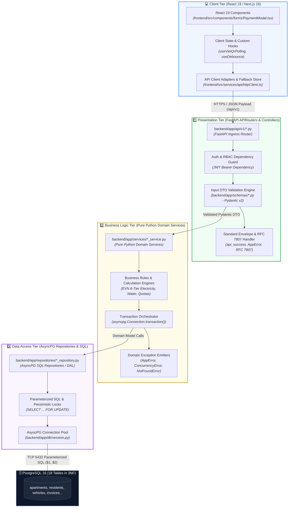

# ResidentHub — Folder Structures & 3-Tier Architecture Specification
## Comprehensive Frontend (ReactJS / Next.js Client) & Backend (3-Tier Layering) Architectural Blueprint

> **Status:** Approved Architectural Baseline  
> **Audience:** Fullstack Developers, Backend Engineers, Frontend Engineers, Solution Architects, Code Reviewers  
> **Frameworks:** Next.js 16 (App Router), React 19, TypeScript, PostgreSQL 16 (3NF), Tailwind CSS v4  
> **Traceability Links:**  
> - 📋 [REQUIREMENTS_INVEST.md](REQUIREMENTS_INVEST.md) (Agile Requirements & User Stories)  
> - 🖥️ [UI_UX_SPECIFICATION.md](UI_UX_SPECIFICATION.md) (Information Architecture & Screens Hierarchy)  
> - 🏛️ [ARCHITECTURE_C4.md](ARCHITECTURE_C4.md) (C4 Level 3 Component Diagrams)  
> - 🔌 [API_DOCUMENTATION.md](API_DOCUMENTATION.md) (REST Endpoints, DTOs & RFC 7807 Error Envelope)  
> - 🗄️ [database/schema.sql](../database/schema.sql) (18-Table PostgreSQL Relational Schema)

---

## 📑 Table of Contents

1. [3-Tier Architectural Principles & Strict Layer Boundaries](#1-3-tier-architectural-principles--strict-layer-boundaries)
2. [Comprehensive Frontend Folder Architecture (ReactJS / Next.js Client)](#2-comprehensive-frontend-folder-architecture-reactjs--nextjs-client)
   - [2.1. Component Hierarchy (Atomic UI, Forms, Layout, Domain Views)](#21-component-hierarchy-atomic-ui-forms-layout-domain-views)
   - [2.2. Client API Ingress Layer (Services / API Client Adapters)](#22-client-api-ingress-layer-services--api-client-adapters)
   - [2.3. Custom Hooks, Contexts, Utilities & Types](#23-custom-hooks-contexts-utilities--types)
3. [Comprehensive Backend 3-Tier Folder Architecture (Node.js / Next.js Server)](#3-comprehensive-backend-3-tier-folder-architecture-nodejs--nextjs-server)
   - [3.1. Tier 1: Presentation Tier (Route Handlers / Controllers)](#31-tier-1-presentation-tier-route-handlers--controllers)
   - [3.2. Tier 2: Business Logic Tier (Pure Domain Services)](#32-tier-2-business-logic-tier-pure-domain-services)
   - [3.3. Tier 3: Data Access Tier (Repositories & Database Pool)](#33-tier-3-data-access-tier-repositories--database-pool)
   - [3.4. Cross-cutting Infrastructure Concerns](#34-cross-cutting-infrastructure-concerns)
4. [Data Flow Pipeline & RFC 7807 Standard Error Handling](#4-data-flow-pipeline--rfc-7807-standard-error-handling)
5. [Production-Grade Boilerplate Code Skeleton (VietQR Pay Session Flow)](#5-production-grade-boilerplate-code-skeleton-vietqr-pay-session-flow)

---

## 1. 3-Tier Architectural Principles & Strict Layer Boundaries

The **3-Tier Architecture** eliminates spaghetti code and tight coupling across user interfaces, domain computations, and database queries. Adhering to **[ADR-0006](adr/ADR-0006-3tier-architecture-with-pure-domain-services.md)** and **[ADR-0008](adr/ADR-0008-monorepo-nextjs16-fastapi-with-fallback-store.md)**, ResidentHub strictly enforces **Clean Architecture** layering across its Monorepo ecosystem:



### Strict Layer Boundary Rules:

1. **Rule 1 (Controllers Never Contain SQL):** Writing SQL statements (`SELECT`, `INSERT`, `UPDATE`) or directly acquiring database connection pools inside FastAPI APIRouters (`backend/app/api/v1/*.py`) is strictly prohibited. Controllers perform exactly 4 tasks: (1) Receive Request $\rightarrow$ (2) Verify JWT & RBAC Role $\rightarrow$ (3) Validate Input DTOs via Pydantic v2 $\rightarrow$ (4) Delegate execution to the Domain Service and return the standard JSON envelope.
2. **Rule 2 (Domain Services Are 100% HTTP-Agnostic):** All files in `backend/app/services/` must be **Pure Python Modules**. Never import `fastapi.Request`, `fastapi.Response`, or FastAPI `Depends` directly. Services receive primitive values or Pydantic DTOs and return Domain Dictionaries / Models. This guarantees that **Services can be unit-tested in complete isolation via Pytest** in under 0.40 seconds without spinning up an HTTP server.
3. **Rule 3 (Repositories Exclusively Own SQL):** All database queries, transaction boundaries, and row-level locks must reside within `backend/app/repositories/`. Every SQL statement must be **100% parameterized (`$1, $2, ...`)** via AsyncPG to eliminate SQL injection vulnerabilities.
4. **Rule 4 (Frontend Connects via Resilient API Ingress):** Frontend client components (`"use client"`) connect exclusively through `frontend/src/services/api/` with automatic proxying (`/api/v1/:path*` $\rightarrow$ `http://localhost:8000`) and fallback store protection (`Demo Store`) if the backend is unreachable ([ADR-0008](adr/ADR-0008-monorepo-nextjs16-fastapi-with-fallback-store.md)).

---

## 2. Comprehensive Frontend Folder Architecture (ReactJS / Next.js Client)

The frontend folder hierarchy blends **Domain-Driven Design (DDD)** with **Atomic Design Principles**:

```
chung-cu-household-management/
├── components/                      # USER INTERFACE COMPONENT LAYER
│   ├── ui/                          # 1. Atomic UI Primitives (Built with Tailwind CSS v4)
│   │   ├── button.tsx               # Button variants (Primary, Secondary, Outline, Danger, Ghost)
│   │   ├── input.tsx                # Text, Number, Password, Search inputs with Clear icons
│   │   ├── modal.tsx                # Accessible Pop-up Dialog (Backdrop blur, Focus trap, Esc to close)
│   │   ├── drawer.tsx               # Slide-over Right Drawer panel
│   │   ├── badge.tsx                # Status chip badges (Success, Warning, Danger, Info, Neutral)
│   │   ├── select.tsx               # Custom accessible dropdown selector
│   │   ├── table.tsx                # Table primitives (Table, TableHeader, TableRow, TableCell)
│   │   ├── card.tsx                 # Content container cards (Card, CardHeader, CardContent, CardFooter)
│   │   ├── skeleton.tsx             # Shimmer skeleton loader (Zero Cumulative Layout Shift - CLS = 0)
│   │   ├── tabs.tsx                 # Segmented control tab switches
│   │   ├── toast.tsx                # Floating toast notifications
│   │   └── confirm-dialog.tsx       # Destructive action verification dialog (Delete, Revoke slot)
│   │
│   ├── forms/                       # 2. Reusable Form Controllers (React Hook Form + Zod)
│   │   ├── ApartmentForm.tsx        # Create / update apartment unit details
│   │   ├── ResidentForm.tsx         # Add household resident (12-digit Citizen ID verification)
│   │   ├── StayDeclarationForm.tsx  # Temporary stay / absence declaration form
│   │   ├── VehicleForm.tsx          # Vehicle registration form (Quota compliance validation)
│   │   ├── MeterReadingForm.tsx     # Monthly utility meter logging form
│   │   └── TicketForm.tsx           # Incident ticket submission form with photo upload
│   │
│   ├── layout/                      # 3. Structural Shell & Layout Components
│   │   ├── AppShell.tsx             # Responsive global layout wrapper
│   │   ├── Header.tsx               # Top navigational bar (User Profile, Notifications)
│   │   ├── Sidebar.tsx              # Left navigation sidebar (Filtered by RBAC role)
│   │   ├── Breadcrumb.tsx           # Contextual dynamic breadcrumb trail
│   │   └── CommandPalette.tsx       # Global omni-search shortcut (Ctrl + K)
│   │
│   └── domain/                      # 4. Specialized Domain Views & Widgets
│       ├── apartments/
│       │   ├── ApartmentDataTable.tsx   # Apartment unit directory table with tower/floor filters
│       │   ├── ApartmentCardGrid.tsx    # Visual apartment card grid
│       │   └── OwnershipTimeline.tsx    # Ownership transfer chronological audit trail
│       ├── residents/
│       │   ├── ResidentRosterTable.tsx  # Master resident directory table
│       │   └── HouseholdCard.tsx        # Household book summary card
│       ├── parking/
│       │   ├── BasementFloorplan.tsx    # Interactive basement slot floorplan (B1/B2)
│       │   ├── SlotDetailCard.tsx       # Parking slot card (License plate, RFID, Status)
│       │   └── VehicleQuotaWidget.tsx   # Apartment vehicle quota allocation gauge
│       ├── billing/
│       │   ├── InvoiceDataTable.tsx     # Period monthly invoice table
│       │   ├── VietQrPaymentModal.tsx   # Dynamic Napas VietQR modal with 15:00 countdown timer
│       │   └── MeterAuditTable.tsx      # Meter reading audit table with anomaly detection alerts
│       └── tickets/
│           ├── TicketKanbanBoard.tsx    # Drag-and-drop maintenance SLA Kanban board
│           ├── SlaCountdownBadge.tsx    # Real-time SLA breach countdown badge
│           └── PhotoProofGallery.tsx    # Before/after defect resolution photographic gallery
│
├── services/                        # CLIENT-SIDE API CALLER LAYER
│   └── api/
│       ├── httpClient.ts            # Base Fetch API client with Bearer token interceptor
│       ├── apartmentApi.ts          # Endpoints for /api/v1/apartments
│       ├── residentApi.ts           # Endpoints for /api/v1/residents, /stay-records
│       ├── parkingApi.ts            # Endpoints for /api/v1/parking/slots, /vehicles
│       ├── billingApi.ts            # Endpoints for /api/v1/billing/invoices, /pay-session
│       ├── ticketApi.ts             # Endpoints for /api/v1/tickets
│       └── errorParser.ts           # Translates RFC 7807 error problem details into localized UI strings
│
├── hooks/                           # CUSTOM REACT HOOKS
│   ├── useDebounce.ts               # Search input debouncer (300ms)
│   ├── useApartmentFilter.ts        # Apartment directory filter state manager
│   ├── useVietQrPolling.ts          # Payment settlement status poller (every 3000ms)
│   ├── useBasementSlots.ts          # Real-time parking slot state listener
│   ├── useAuth.ts                   # Current user session and RBAC role resolver
│   └── useMediaQuery.ts             # Responsive viewport width detector
│
├── context/                         # GLOBAL REACT CONTEXT STATE PROVIDERS
│   ├── AuthContext.tsx              # Authenticated user, role, login/logout context
│   ├── ToastContext.tsx             # Global toast notification queue manager
│   └── SlaAlertContext.tsx          # Urgent SLA breach broadcast banner provider
│
├── utils/                           # REUSABLE PURE UTILITY FUNCTIONS
│   ├── formatters.ts                # formatCurrencyVND(2500000) -> "2,500,000 VND", formatDateVN()
│   ├── validators.ts                # validateCCCD(cccd), validateLicensePlate(plate)
│   ├── classNames.ts                # CSS class merge utility (clsx / tailwind-merge)
│   └── exportExcel.ts               # Tabular data exporter (Excel / CSV)
│
└── types/                           # FRONTEND TYPESCRIPT DEFINITIONS
    ├── dto/                         # Data Transfer Objects from server responses
    │   ├── apartment.dto.ts
    │   ├── resident.dto.ts
    │   ├── billing.dto.ts
    │   └── ticket.dto.ts
    ├── view/                        # UI-specific ViewModels
    │   ├── filter.types.ts
    │   └── table.types.ts
    └── index.ts                     # Barrel export index
```

---

## 3. Comprehensive Backend 3-Tier Folder Architecture (Python 3.11 FastAPI Service)

The ResidentHub backend is implemented as a dedicated high-performance **Python 3.11+ FastAPI** microservice enforcing strict **3-Tier Layering Architecture** and asynchronous I/O via **asyncpg**.

Client browser requests on `/api/v1/:path*` are seamlessly reverse-proxied via Next.js (`frontend/next.config.ts`) to the FastAPI backend running on `http://localhost:8000/api/v1/:path*`.

```
backend/
├── app/
│   ├── main.py                      # Application factory, lifespan, CORS, and RFC 7807 global exception handlers
│   │
│   ├── api/                         # ════ TIER 1: PRESENTATION TIER (FASTAPI ROUTERS & CONTROLLERS) ════
│   │   └── v1/
│   │       ├── api.py               # Master API v1 Router aggregation
│   │       ├── apartments.py        # GET /api/v1/apartments, POST (Onboard), GET /{id}, POST /{id}/transfer-ownership
│   │       ├── residents.py         # GET /api/v1/residents (Roster), POST (Register), POST /stay-declaration
│   │       ├── parking.py           # GET /api/v1/parking/slots (B1/B2 floorplan), POST /slots/allocate, POST /vehicles
│   │       ├── billing.py           # GET /api/v1/billing/invoices, GET /{id}, POST /{id}/pay-session (VietQR)
│   │       ├── webhooks.py          # POST /api/v1/webhooks/vietqr (Napas 247 asynchronous IPN receiver)
│   │       └── feedbacks.py         # GET /api/v1/feedbacks (Planned: Ticket triage & SLA watchdog)
│   │
│   ├── services/                    # ════ TIER 2: BUSINESS LOGIC TIER (PURE DOMAIN SERVICES) ════
│   │   ├── apartment_service.py     # Building zoning, net area (m²), legal title transfer orchestration
│   │   ├── resident_service.py      # 12-digit Citizen ID verification, single household head invariant
│   │   ├── parking_service.py       # Quota compliance (1 car, 2 bikes), pessimistic lock slot assignment
│   │   ├── billing_service.py       # Progressive EVN 6-tier electricity & water, VietQR pay sessions, IPN idempotency
│   │   └── feedback_service.py      # (Planned) Incident defect intake, technician SLA dispatch
│   │
│   ├── repositories/                # ════ TIER 3: DATA ACCESS TIER (SQL REPOSITORIES / DAL) ════
│   │   ├── apartment_repository.py  # Parameterized SQL for 'apartments', 'buildings', 'apartment_owners'
│   │   ├── resident_repository.py   # Parameterized SQL for 'residents', 'households', 'household_members'
│   │   ├── parking_repository.py    # Parameterized SQL for 'parking_slots' (SELECT FOR UPDATE) & 'vehicles'
│   │   ├── billing_repository.py    # Parameterized SQL for 'invoices', 'invoice_items', 'payment_transactions'
│   │   └── feedback_repository.py   # (Planned) Parameterized SQL for 'feedbacks', 'feedback_updates'
│   │
│   ├── schemas/                     # INPUT / OUTPUT DTO VALIDATION (PYDANTIC V2 ENGINE)
│   │   ├── apartment.py             # ApartmentCreate, ApartmentResponse, TransferOwnershipRequest
│   │   ├── resident.py              # ResidentCreate, ResidentResponse, StayDeclarationRequest
│   │   ├── parking.py               # AllocateSlotRequest, RegisterVehicleRequest, ParkingSlotResponse
│   │   └── billing.py               # InvoiceResponse, VietQrPaySessionResponse, VietQrIpnWebhookRequest
│   │
│   ├── core/                        # CROSS-CUTTING INFRASTRUCTURE & ENVELOPE
│   │   ├── config.py                # Pydantic Settings (DATABASE_URL, CORS_ORIGINS, API_V1_STR)
│   │   ├── errors.py                # RFC 7807 Problem Details exception handlers (AppError, ValidationError)
│   │   └── response.py              # api_success({ success, data, timestamp }) standard response envelope
│   │
│   └── db/                          # DATA PERSISTENCE & CONNECTION POOL
│       └── session.py               # AsyncPG connection pool (init_db_pool, close_db_pool, get_db_pool)
│
├── tests/                           # ════ AUTOMATED UNIT & INTEGRATION TESTING (PYTEST) ════
│   ├── test_api_endpoints.py        # /health, /docs, RFC 7807 error format assertion
│   ├── test_billing_service.py      # EVN 6-tier electricity, water, VietQR session, IPN idempotency tests
│   ├── test_parking_service.py      # Car/Motorbike quota limits, duplicate license plate, slot concurrency tests
│   └── test_resident_service.py     # 12-digit CCCD validation, duplicate citizen ID, missing household tests
│
├── requirements.txt                 # Python dependencies (fastapi, uvicorn, asyncpg, pydantic-settings, pytest)
└── README.md                        # Quickstart guide, port specifications, and architecture summary
```

---

## 4. Data Flow Pipeline & RFC 7807 Standard Error Handling

Every inbound request flows through a unified 3-tier processing pipeline:

```
[HTTP Client Request] 
       │
       ▼
[Presentation Tier: Controller]
       │ • Extract Bearer JWT and call `rbacGuard(req, ['ROLE'])`
       │ • Validate Request Body via Zod Schema (`safeParse`)
       │ • If invalid: throw ValidationError (HTTP 422)
       │
       ▼
[Business Logic Tier: Service]
       │ • Enforce business invariants (Vehicle Quotas, Citizen ID uniqueness)
       │ • Open ACID transaction block (`runInTransaction`)
       │ • Compute integer arithmetic (Tiered utility tariffs in VND)
       │
       ▼
[Data Access Tier: Repository]
       │ • Acquire client connection from `dbPool`
       │ • Execute parameterized SQL (`$1, $2`) or Pessimistic Lock (`FOR UPDATE`)
       │ • Map raw SQL rows to typed Domain Entities
       │
       ▼
[PostgreSQL Database (ACID Commit)]
       │
       ▼
[Response Pipeline Back to Client]
       │ • Service serializes result into clean DTO (omits sensitive hashes)
       │ • Controller wraps DTO in Standard Envelope:
       │   {
       │     "success": true,
       │     "data": { ... },
       │     "timestamp": "2026-09-15T15:30:00.000Z"
       │   }
```

### Standard Error Handling Format (RFC 7807 Problem Details):
Any unhandled rejection or domain exception is formatted into RFC 7807 standard envelope:

```json
{
  "type": "https://residenthub.internal/errors/concurrency-conflict",
  "title": "Resource Concurrency Conflict",
  "status": 409,
  "detail": "Parking slot B1-C12 was allocated by another manager 200ms ago. Please select another slot.",
  "instance": "/api/v1/parking/slots/allocate",
  "errorCode": "ERR_PARKING_SLOT_ALREADY_OCCUPIED",
  "timestamp": "2026-09-15T15:30:00.000Z"
}
```

---

## 5. Production-Grade Boilerplate Code Skeleton (VietQR Pay Session Flow)

A complete end-to-end implementation example for the **Dynamic VietQR Payment Session Initiation (`US-BIL-03`)**:

### 5.1. DTO Validator Schema (`backend/app/schemas/billing.py` - Pydantic v2)
```python
from pydantic import BaseModel, Field
from typing import Optional
from enum import Enum
import uuid

class PaymentChannel(str, Enum):
    VIETQR_NAPAS = "VIETQR_NAPAS"
    CASH_DESK = "CASH_DESK"

class CreatePaySessionRequest(BaseModel):
    invoice_id: uuid.UUID = Field(..., description="Target Invoice UUID")
    payment_channel: PaymentChannel = Field(default=PaymentChannel.VIETQR_NAPAS)

class VietQrSessionResponse(BaseModel):
    session_id: str
    invoice_id: str
    qr_code_url: str
    bank_name: str
    account_number: str
    account_holder: str
    amount: int
    transfer_content: str
    expires_at: str
```

---

### 5.2. Tier 1: FastAPI APIRouter Controller (`backend/app/api/v1/billing.py`)
```python
from fastapi import APIRouter, Depends, status
from app.schemas.billing import CreatePaySessionRequest, VietQrSessionResponse
from app.services.billing_service import billing_service
from app.core.response import api_success
from app.core.errors import AppError, NotFoundError, ValidationError

router = APIRouter(prefix="/billing", tags=["Billing"])

@router.post(
    "/invoices/{invoice_id}/pay-session",
    response_model=dict,
    status_code=status.HTTP_200_OK,
    summary="Initiate dynamic VietQR payment session (US-BIL-03)"
)
async def create_pay_session(
    invoice_id: str,
    payload: CreatePaySessionRequest,
):
    """
    Tier 1 Controller:
    1. Validates payload via Pydantic v2
    2. Delegates domain execution to pure BillingService
    3. Wraps response in standard envelope { success, data, timestamp }
    """
    session_dto = await billing_service.generate_vietqr_session(
        invoice_id=invoice_id,
        channel=payload.payment_channel
    )
    return api_success(data=session_dto)
```

---

### 5.3. Tier 2: Pure Domain Service (`backend/app/services/billing_service.py`)
```python
import urllib.parse
from datetime import datetime, timezone, timedelta
from app.repositories.billing_repository import billing_repository
from app.core.errors import NotFoundError, ValidationError

class BillingService:
    """
    Tier 2 Business Logic: Pure Python, 100% decoupled from HTTP primitives.
    Fully testable via Pytest without spinning up a web server.
    """
    async def generate_vietqr_session(self, invoice_id: str, channel: str) -> dict:
        # 1. Retrieve invoice record via Data Access Repository
        invoice = await billing_repository.get_invoice_by_id(invoice_id)
        if not invoice:
            raise NotFoundError(f"Invoice with ID #{invoice_id} was not found.")

        # 2. Invariant: Settled invoices cannot generate new QR sessions
        if invoice.get("status") == "PAID":
            raise ValidationError("This invoice has already been fully paid and settled.")

        # 3. Compute outstanding balance and 15-minute expiration TTL
        total_amount = int(invoice["total_amount"])
        paid_amount = int(invoice.get("paid_amount") or 0)
        remaining_balance = total_amount - paid_amount

        invoice_code = invoice.get("invoice_code", "INV")
        room_number = invoice.get("room_number", "")
        transfer_content = f"INV {invoice_code} CANHO {room_number}"
        
        now = datetime.now(timezone.utc)
        expires_at = (now + timedelta(minutes=15)).isoformat()

        # 4. Construct Napas 247 Dynamic VietQR standard image endpoint
        safe_content = urllib.parse.quote(transfer_content)
        account_name = urllib.parse.quote("BQL CHUNG CU RESIDENTHUB")
        qr_code_url = (
            f"https://img.vietqr.io/image/MB-098765432199-compact2.png"
            f"?amount={remaining_balance}&addInfo={safe_content}&accountName={account_name}"
        )

        return {
            "session_id": f"SESSION-{invoice_id[:8]}-{int(now.timestamp())}",
            "invoice_id": invoice_id,
            "qr_code_url": qr_code_url,
            "bank_name": "MB Bank (Military Commercial Joint Stock Bank)",
            "account_number": "098765432199",
            "account_holder": "BQL CHUNG CU RESIDENTHUB",
            "amount": remaining_balance,
            "transfer_content": transfer_content,
            "expires_at": expires_at
        }

billing_service = BillingService()
```

---

### 5.4. Tier 3: AsyncPG Data Access Repository (`backend/app/repositories/billing_repository.py`)
```python
from app.db.session import get_db_pool
from typing import Optional, Dict, Any

class BillingRepository:
    """
    Tier 3 Data Access: Exclusively owns SQL queries, connection pools,
    and parameterized SQL statements ($1, $2).
    """
    async def get_invoice_by_id(self, invoice_id: str) -> Optional[Dict[str, Any]]:
        query = """
            SELECT 
                i.id,
                i.invoice_code,
                i.apartment_id,
                a.room_number,
                i.total_amount,
                i.paid_amount,
                i.status,
                i.due_date
            FROM invoices i
            INNER JOIN apartments a ON a.id = i.apartment_id
            WHERE i.id = $1 AND i.deleted_at IS NULL
            LIMIT 1;
        """
        pool = get_db_pool()
        async with pool.acquire() as conn:
            row = await conn.fetchrow(query, invoice_id)
            return dict(row) if row else None

billing_repository = BillingRepository()
```

---

### 5.5. Client API Ingress Adapter (`frontend/src/services/api/httpClient.ts` & `PaymentModal.tsx`)
```typescript
/**
 * Frontend Client Tier (React 19 / Next.js 16):
 * Calls /api/v1/billing/invoices/:id/pay-session via reverse proxy rewrite.
 * Seamlessly catches network timeouts and falls back to Demo Store if offline (ADR-0008).
 */
import { httpClient } from '@/services/api/httpClient';

export async function requestVietQrSession(invoiceId: string) {
  return await httpClient.post<{
    session_id: string;
    qr_code_url: string;
    amount: number;
    transfer_content: string;
    expires_at: string;
  }>(`/billing/invoices/${invoiceId}/pay-session`, {
    invoice_id: invoiceId,
    payment_channel: 'VIETQR_NAPAS',
  });
}
```
