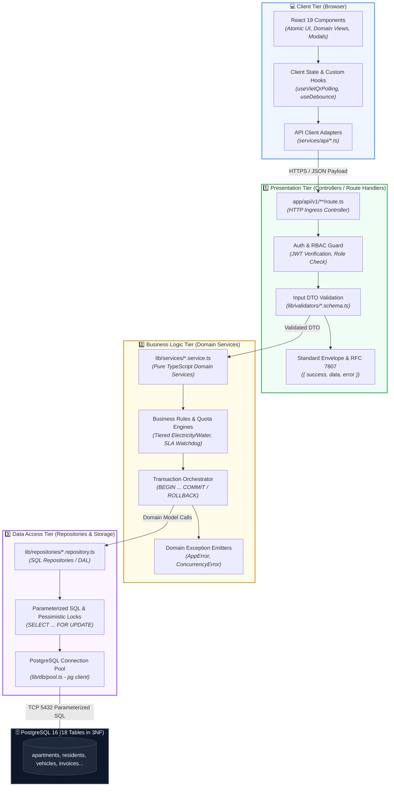

# ResidentHub — Folder Structures & 3-Tier Architecture Specification
## Comprehensive Frontend (ReactJS / Next.js Client) & Backend (3-Tier Layering) Architectural Blueprint

> **Status:** Approved Architectural Baseline  
> **Audience:** Fullstack Developers, Backend Engineers, Frontend Engineers, Solution Architects, Code Reviewers  
> **Frameworks:** Next.js 16 (App Router), React 19, TypeScript, PostgreSQL 16 (3NF), Tailwind CSS v4  
> **Traceability Links:**  
> - 📋 [REQUIREMENTS_INVEST.md](REQUIREMENTS_INVEST.md) (Agile Requirements & User Stories)  
> - 🖥️ [UI_UX_SPECIFICATION.md](UI_UX_SPECIFICATION.md) (Information Architecture & Screens Hierarchy)  
> - 🏛️ [ARCHITECTURE_C4.md](ARCHITECTURE_C4.md) (C4 Level 3 Component Diagrams)  
> - 🔌 [API_DOCUMENTATION.md](API_DOCUMENTATION.md) (REST Endpoints, DTOs & RFC 7807 Error Envelope)  
> - 🗄️ [schema.sql](../schema.sql) (18-Table PostgreSQL Relational Schema)

---

## 📑 Table of Contents

1. [3-Tier Architectural Principles & Strict Layer Boundaries](#1-3-tier-architectural-principles--strict-layer-boundaries)
2. [Comprehensive Frontend Folder Architecture (ReactJS / Next.js Client)](#2-comprehensive-frontend-folder-architecture-reactjs--nextjs-client)
   - [2.1. Component Hierarchy (Atomic UI, Forms, Layout, Domain Views)](#21-component-hierarchy-atomic-ui-forms-layout-domain-views)
   - [2.2. Client API Ingress Layer (Services / API Client Adapters)](#22-client-api-ingress-layer-services--api-client-adapters)
   - [2.3. Custom Hooks, Contexts, Utilities & Types](#23-custom-hooks-contexts-utilities--types)
3. [Comprehensive Backend 3-Tier Folder Architecture (Node.js / Next.js Server)](#3-comprehensive-backend-3-tier-folder-architecture-nodejs--nextjs-server)
   - [3.1. Tier 1: Presentation Tier (Route Handlers / Controllers)](#31-tier-1-presentation-tier-route-handlers--controllers)
   - [3.2. Tier 2: Business Logic Tier (Pure Domain Services)](#32-tier-2-business-logic-tier-pure-domain-services)
   - [3.3. Tier 3: Data Access Tier (Repositories & Database Pool)](#33-tier-3-data-access-tier-repositories--database-pool)
   - [3.4. Cross-cutting Infrastructure Concerns](#34-cross-cutting-infrastructure-concerns)
4. [Data Flow Pipeline & RFC 7807 Standard Error Handling](#4-data-flow-pipeline--rfc-7807-standard-error-handling)
5. [Production-Grade Boilerplate Code Skeleton (VietQR Pay Session Flow)](#5-production-grade-boilerplate-code-skeleton-vietqr-pay-session-flow)

---

## 1. 3-Tier Architectural Principles & Strict Layer Boundaries

The **3-Tier Architecture** eliminates spaghetti code and tight coupling across user interfaces, domain computations, and database queries. Within the **Next.js 16 App Router** ecosystem, the platform strictly enforces **Clean Architecture** layering:



### Strict Layer Boundary Rules:

1. **Rule 1 (Controllers Never Contain SQL):** Writing SQL statements (`SELECT`, `INSERT`, `UPDATE`) or directly calling the database client pool within Controller route handlers (`app/api/**`) is strictly prohibited. Controllers perform exactly 4 tasks: (1) Receive Request $\rightarrow$ (2) Verify Token & RBAC Role $\rightarrow$ (3) Validate Input DTOs via Zod $\rightarrow$ (4) Delegate execution to the Domain Service and return the formatted HTTP response.
2. **Rule 2 (Domain Services Are 100% HTTP-Agnostic):** All files in `lib/services/` must be **Pure TypeScript Modules**. Never import `NextRequest`, `NextResponse`, `headers()`, or `cookies()`. Services receive primitive values or DTOs and return Domain Entities. This guarantees that **Services can be unit-tested in complete isolation** without mocking HTTP servers.
3. **Rule 3 (Repositories Exclusively Own SQL):** All database reads and mutations must reside within `lib/repositories/`. Every SQL statement must be **100% parameterized (`$1, $2, ...`)** to prevent SQL injection vulnerabilities.
4. **Rule 4 (Client Components Never Import Server Layers):** Frontend client components (`"use client"`) must never import files from `lib/db/`, `lib/repositories/`, or server-only environment variables (`DATABASE_URL`, `JWT_SECRET`).

---

## 2. Comprehensive Frontend Folder Architecture (ReactJS / Next.js Client)

The frontend folder hierarchy blends **Domain-Driven Design (DDD)** with **Atomic Design Principles**:

```
chung-cu-household-management/
├── components/                      # USER INTERFACE COMPONENT LAYER
│   ├── ui/                          # 1. Atomic UI Primitives (Built with Tailwind CSS v4)
│   │   ├── button.tsx               # Button variants (Primary, Secondary, Outline, Danger, Ghost)
│   │   ├── input.tsx                # Text, Number, Password, Search inputs with Clear icons
│   │   ├── modal.tsx                # Accessible Pop-up Dialog (Backdrop blur, Focus trap, Esc to close)
│   │   ├── drawer.tsx               # Slide-over Right Drawer panel
│   │   ├── badge.tsx                # Status chip badges (Success, Warning, Danger, Info, Neutral)
│   │   ├── select.tsx               # Custom accessible dropdown selector
│   │   ├── table.tsx                # Table primitives (Table, TableHeader, TableRow, TableCell)
│   │   ├── card.tsx                 # Content container cards (Card, CardHeader, CardContent, CardFooter)
│   │   ├── skeleton.tsx             # Shimmer skeleton loader (Zero Cumulative Layout Shift - CLS = 0)
│   │   ├── tabs.tsx                 # Segmented control tab switches
│   │   ├── toast.tsx                # Floating toast notifications
│   │   └── confirm-dialog.tsx       # Destructive action verification dialog (Delete, Revoke slot)
│   │
│   ├── forms/                       # 2. Reusable Form Controllers (React Hook Form + Zod)
│   │   ├── ApartmentForm.tsx        # Create / update apartment unit details
│   │   ├── ResidentForm.tsx         # Add household resident (12-digit Citizen ID verification)
│   │   ├── StayDeclarationForm.tsx  # Temporary stay / absence declaration form
│   │   ├── VehicleForm.tsx          # Vehicle registration form (Quota compliance validation)
│   │   ├── MeterReadingForm.tsx     # Monthly utility meter logging form
│   │   └── TicketForm.tsx           # Incident ticket submission form with photo upload
│   │
│   ├── layout/                      # 3. Structural Shell & Layout Components
│   │   ├── AppShell.tsx             # Responsive global layout wrapper
│   │   ├── Header.tsx               # Top navigational bar (User Profile, Notifications)
│   │   ├── Sidebar.tsx              # Left navigation sidebar (Filtered by RBAC role)
│   │   ├── Breadcrumb.tsx           # Contextual dynamic breadcrumb trail
│   │   └── CommandPalette.tsx       # Global omni-search shortcut (Ctrl + K)
│   │
│   └── domain/                      # 4. Specialized Domain Views & Widgets
│       ├── apartments/
│       │   ├── ApartmentDataTable.tsx   # Apartment unit directory table with tower/floor filters
│       │   ├── ApartmentCardGrid.tsx    # Visual apartment card grid
│       │   └── OwnershipTimeline.tsx    # Ownership transfer chronological audit trail
│       ├── residents/
│       │   ├── ResidentRosterTable.tsx  # Master resident directory table
│       │   └── HouseholdCard.tsx        # Household book summary card
│       ├── parking/
│       │   ├── BasementFloorplan.tsx    # Interactive basement slot floorplan (B1/B2)
│       │   ├── SlotDetailCard.tsx       # Parking slot card (License plate, RFID, Status)
│       │   └── VehicleQuotaWidget.tsx   # Apartment vehicle quota allocation gauge
│       ├── billing/
│       │   ├── InvoiceDataTable.tsx     # Period monthly invoice table
│       │   ├── VietQrPaymentModal.tsx   # Dynamic Napas VietQR modal with 15:00 countdown timer
│       │   └── MeterAuditTable.tsx      # Meter reading audit table with anomaly detection alerts
│       └── tickets/
│           ├── TicketKanbanBoard.tsx    # Drag-and-drop maintenance SLA Kanban board
│           ├── SlaCountdownBadge.tsx    # Real-time SLA breach countdown badge
│           └── PhotoProofGallery.tsx    # Before/after defect resolution photographic gallery
│
├── services/                        # CLIENT-SIDE API CALLER LAYER
│   └── api/
│       ├── httpClient.ts            # Base Fetch API client with Bearer token interceptor
│       ├── apartmentApi.ts          # Endpoints for /api/v1/apartments
│       ├── residentApi.ts           # Endpoints for /api/v1/residents, /stay-records
│       ├── parkingApi.ts            # Endpoints for /api/v1/parking/slots, /vehicles
│       ├── billingApi.ts            # Endpoints for /api/v1/billing/invoices, /pay-session
│       ├── ticketApi.ts             # Endpoints for /api/v1/tickets
│       └── errorParser.ts           # Translates RFC 7807 error problem details into localized UI strings
│
├── hooks/                           # CUSTOM REACT HOOKS
│   ├── useDebounce.ts               # Search input debouncer (300ms)
│   ├── useApartmentFilter.ts        # Apartment directory filter state manager
│   ├── useVietQrPolling.ts          # Payment settlement status poller (every 3000ms)
│   ├── useBasementSlots.ts          # Real-time parking slot state listener
│   ├── useAuth.ts                   # Current user session and RBAC role resolver
│   └── useMediaQuery.ts             # Responsive viewport width detector
│
├── context/                         # GLOBAL REACT CONTEXT STATE PROVIDERS
│   ├── AuthContext.tsx              # Authenticated user, role, login/logout context
│   ├── ToastContext.tsx             # Global toast notification queue manager
│   └── SlaAlertContext.tsx          # Urgent SLA breach broadcast banner provider
│
├── utils/                           # REUSABLE PURE UTILITY FUNCTIONS
│   ├── formatters.ts                # formatCurrencyVND(2500000) -> "2,500,000 VND", formatDateVN()
│   ├── validators.ts                # validateCCCD(cccd), validateLicensePlate(plate)
│   ├── classNames.ts                # CSS class merge utility (clsx / tailwind-merge)
│   └── exportExcel.ts               # Tabular data exporter (Excel / CSV)
│
└── types/                           # FRONTEND TYPESCRIPT DEFINITIONS
    ├── dto/                         # Data Transfer Objects from server responses
    │   ├── apartment.dto.ts
    │   ├── resident.dto.ts
    │   ├── billing.dto.ts
    │   └── ticket.dto.ts
    ├── view/                        # UI-specific ViewModels
    │   ├── filter.types.ts
    │   └── table.types.ts
    └── index.ts                     # Barrel export index
```

---

## 3. Comprehensive Backend 3-Tier Folder Architecture (Node.js / Next.js Server)

All server-side code is systematically divided into **3 Tiers**:

```
chung-cu-household-management/
├── app/api/v1/                      # ════ TIER 1: PRESENTATION TIER (CONTROLLERS / ROUTE HANDLERS) ════
│   ├── apartments/
│   │   ├── route.ts                 # GET /api/v1/apartments (Query list), POST (Create apartment)
│   │   └── [id]/
│   │       ├── route.ts             # GET (Detail), PATCH (Update), DELETE
│   │       └── ownership/route.ts   # POST /api/v1/apartments/{id}/ownership (Transfer title)
│   │
│   ├── residents/
│   │   ├── route.ts                 # GET /api/v1/residents (Roster), POST (Register resident)
│   │   ├── [id]/route.ts            # GET /api/v1/residents/{id}, PATCH, DELETE
│   │   └── head-transfer/route.ts   # POST /api/v1/residents/head-transfer (Successor handover)
│   │
│   ├── stay-records/
│   │   ├── route.ts                 # GET (Registry log), POST (Declare temporary stay/absence)
│   │   └── [id]/verify/route.ts     # POST /api/v1/stay-records/{id}/verify (Management/Police approval)
│   │
│   ├── parking/
│   │   ├── slots/
│   │   │   ├── route.ts             # GET /api/v1/parking/slots (B1/B2 floorplan)
│   │   │   └── allocate/route.ts    # POST /api/v1/parking/slots/allocate (Pessimistic lock reservation)
│   │   └── vehicles/
│   │       ├── route.ts             # GET /api/v1/parking/vehicles, POST (Register vehicle)
│   │       ├── [id]/rfid/route.ts   # POST /api/v1/parking/vehicles/{id}/rfid (Provision RFID card)
│   │       └── [id]/revoke/route.ts # POST /api/v1/parking/vehicles/{id}/revoke (De-register & free slot)
│   │
│   ├── billing/
│   │   ├── invoices/
│   │   │   ├── route.ts             # GET /api/v1/billing/invoices (Query monthly invoices)
│   │   │   └── [id]/
│   │   │       ├── route.ts         # GET (Invoice detail & itemized breakdown)
│   │   │       └── pay-session/route.ts # POST (Initiate dynamic VietQR payment session)
│   │   ├── meter-readings/
│   │   │   ├── route.ts             # GET, POST (Capture meter read & flag anomalies)
│   │   │   └── audit-batch/route.ts # POST /api/v1/billing/meter-readings/audit-batch
│   │   ├── batch-generate/route.ts  # POST /api/v1/billing/batch-generate (Month-end cutoff on the 25th)
│   │   └── overdue-scan/route.ts    # POST /api/v1/billing/overdue-scan (Overdue debt audit after the 10th)
│   │
│   ├── webhooks/
│   │   └── vietqr/route.ts          # POST /api/v1/webhooks/vietqr (Napas 247 asynchronous IPN receiver)
│   │
│   └── tickets/
│       ├── route.ts                 # GET /api/v1/tickets (Kanban feed), POST (Submit defect report)
│       └── [id]/
│           ├── dispatch/route.ts    # PATCH /api/v1/tickets/{id}/dispatch (Assign technician)
│           ├── resolve/route.ts     # PATCH /api/v1/tickets/{id}/resolve (Upload proof & close ticket)
│           └── escalate/route.ts    # POST /api/v1/tickets/{id}/escalate (Manual SLA escalation)
│
├── lib/                             # ════ BACKEND DOMAIN CORE & DATA PERSISTENCE ════
│   │
│   ├── services/                    # ════ TIER 2: BUSINESS LOGIC TIER (PURE DOMAIN SERVICES) ════
│   │   ├── apartment.service.ts     # Tower zoning, net area (m²), legal title succession
│   │   ├── resident.service.ts      # 12-digit Citizen ID verification, single household head invariant
│   │   ├── parking.service.ts       # Quota compliance (1 car, 2 bikes), pessimistic lock slot assignment
│   │   ├── billing.service.ts       # Progressive tariff calculations, VietQR generation, batch cutoffs
│   │   ├── payment.service.ts       # Asynchronous IPN webhook handling, idempotency deduplication
│   │   ├── ticket.service.ts        # Defect intake, technician dispatching, photo proof verification
│   │   ├── sla-watchdog.service.ts  # Background SLA countdown monitor (4h/24h), emergency escalation
│   │   ├── notification.service.ts  # E-statement compilation, payment receipt dispatching
│   │   └── auth.service.ts          # Bcrypt hashing, JWT issuance, 4-tier RBAC authorization
│   │
│   ├── repositories/                # ════ TIER 3: DATA ACCESS TIER (SQL REPOSITORIES / DAL) ════
│   │   ├── apartment.repository.ts  # Interacts with 'apartments', 'buildings', 'apartment_owners'
│   │   ├── resident.repository.ts   # Interacts with 'residents', 'household_members'
│   │   ├── household.repository.ts  # Interacts with 'households'
│   │   ├── stay-record.repository.ts# Interacts with 'residence_records'
│   │   ├── parking-slot.repository.ts# Interacts with 'parking_slots' (SELECT FOR UPDATE)
│   │   ├── vehicle.repository.ts    # Interacts with 'vehicles'
│   │   ├── invoice.repository.ts    # Interacts with 'invoices', 'invoice_items'
│   │   ├── meter-reading.repository.ts# Interacts with 'meter_readings'
│   │   ├── payment-tx.repository.ts # Interacts with 'payment_transactions'
│   │   ├── fee-tariff.repository.ts # Interacts with 'fee_types'
│   │   ├── ticket.repository.ts     # Interacts with 'feedbacks', 'feedback_updates'
│   │   └── audit-log.repository.ts  # Interacts with 'audit_logs'
│   │
│   ├── db/                          # DATABASE INFRASTRUCTURE
│   │   ├── pool.ts                  # PostgreSQL connection pool (pg.Pool singleton)
│   │   └── transaction.ts           # ACID transaction wrapper (runInTransaction)
│   │
│   ├── errors/                      # DOMAIN EXCEPTION CATALOG (RFC 7807 MAPPINGS)
│   │   ├── app-error.ts             # Base application error class with statusCode and error codes
│   │   ├── validation-error.ts      # HTTP 422 - Malformed or illegal input payload
│   │   ├── not-found-error.ts       # HTTP 404 - Requested entity does not exist
│   │   ├── unauthorized-error.ts    # HTTP 401 / 403 - Unauthenticated or insufficient RBAC privileges
│   │   ├── concurrency-error.ts     # HTTP 409 - Race condition conflict (Slot already occupied)
│   │   └── idempotency-error.ts     # HTTP 200/409 - Transaction already completed
│   │
│   ├── validators/                  # INPUT PAYLOAD VALIDATION SCHEMAS (ZOD ENGINE)
│   │   ├── apartment.schema.ts      # Schemas for unit creation, ownership transfer
│   │   ├── resident.schema.ts       # Schemas for 12-digit Citizen ID, kinship, demographics
│   │   ├── parking.schema.ts        # Schemas for license plates, RFID codes, slot reservation
│   │   ├── billing.schema.ts        # Schemas for meter captures, VietQR pay sessions
│   │   └── ticket.schema.ts         # Schemas for defect reporting, technician dispatch
│   │
│   └── auth/                        # SECURITY & ACCESS CONTROL
│       ├── jwt.ts                   # Access and Refresh Token signing and verification
│       ├── rbac-guard.ts            # Role-based middleware guard (ADMIN, MANAGER, TECH, RESIDENT)
│       └── password.ts              # Salted password hashing via Bcrypt (Salt rounds = 12)
```

---

## 4. Data Flow Pipeline & RFC 7807 Standard Error Handling

Every inbound request flows through a unified 3-tier processing pipeline:

```
[HTTP Client Request] 
       │
       ▼
[Presentation Tier: Controller]
       │ • Extract Bearer JWT and call `rbacGuard(req, ['ROLE'])`
       │ • Validate Request Body via Zod Schema (`safeParse`)
       │ • If invalid: throw ValidationError (HTTP 422)
       │
       ▼
[Business Logic Tier: Service]
       │ • Enforce business invariants (Vehicle Quotas, Citizen ID uniqueness)
       │ • Open ACID transaction block (`runInTransaction`)
       │ • Compute integer arithmetic (Tiered utility tariffs in VND)
       │
       ▼
[Data Access Tier: Repository]
       │ • Acquire client connection from `dbPool`
       │ • Execute parameterized SQL (`$1, $2`) or Pessimistic Lock (`FOR UPDATE`)
       │ • Map raw SQL rows to typed Domain Entities
       │
       ▼
[PostgreSQL Database (ACID Commit)]
       │
       ▼
[Response Pipeline Back to Client]
       │ • Service serializes result into clean DTO (omits sensitive hashes)
       │ • Controller wraps DTO in Standard Envelope:
       │   {
       │     "success": true,
       │     "data": { ... },
       │     "timestamp": "2026-09-15T15:30:00.000Z"
       │   }
```

### Standard Error Handling Format (RFC 7807 Problem Details):
Any unhandled rejection or domain exception is formatted into RFC 7807 standard envelope:

```json
{
  "type": "https://residenthub.internal/errors/concurrency-conflict",
  "title": "Resource Concurrency Conflict",
  "status": 409,
  "detail": "Parking slot B1-C12 was allocated by another manager 200ms ago. Please select another slot.",
  "instance": "/api/v1/parking/slots/allocate",
  "errorCode": "ERR_PARKING_SLOT_ALREADY_OCCUPIED",
  "timestamp": "2026-09-15T15:30:00.000Z"
}
```

---

## 5. Production-Grade Boilerplate Code Skeleton (VietQR Pay Session Flow)

A complete end-to-end implementation example for the **Dynamic VietQR Payment Session Initiation (`US-BIL-03`)**:

### 5.1. DTO Validator Schema (`lib/validators/billing.schema.ts`)
```typescript
import { z } from 'zod';

export const createPaySessionSchema = z.object({
  invoiceId: z.string().uuid({ message: "Invoice ID must be a valid UUID" }),
  paymentChannel: z.enum(['VIETQR_NAPAS', 'CASH_DESK']).default('VIETQR_NAPAS'),
});

export type CreatePaySessionInput = z.infer<typeof createPaySessionSchema>;
```

---

### 5.2. Tier 1: Controller Route Handler (`app/api/v1/billing/invoices/[id]/pay-session/route.ts`)
```typescript
import { NextRequest, NextResponse } from 'next/server';
import { createPaySessionSchema } from '@/lib/validators/billing.schema';
import { billingService } from '@/lib/services/billing.service';
import { rbacGuard } from '@/lib/auth/rbac-guard';
import { AppError } from '@/lib/errors/app-error';

export async function POST(
  request: NextRequest,
  context: { params: Promise<{ id: string }> }
) {
  try {
    // 1. Authorization: Require authenticated user with RESIDENT, MANAGER, or ADMIN role
    const session = await rbacGuard(request, ['RESIDENT', 'MANAGER', 'ADMIN']);
    const { id } = await context.params;

    // 2. Validate input payload
    const body = await request.json().catch(() => ({}));
    const validationResult = createPaySessionSchema.safeParse({ ...body, invoiceId: id });

    if (!validationResult.success) {
      return NextResponse.json(
        {
          type: 'https://residenthub.internal/errors/validation-error',
          title: 'Invalid Request Payload',
          status: 422,
          detail: validationResult.error.issues[0]?.message,
          instance: request.nextUrl.pathname,
        },
        { status: 422 }
      );
    }

    // 3. Delegate execution to the Business Logic Tier
    const paySession = await billingService.generateVietQrSession({
      invoiceId: id,
      requestUserId: session.userId,
      userRole: session.role,
    });

    // 4. Return standard envelope response
    return NextResponse.json(
      {
        success: true,
        data: paySession,
        timestamp: new Date().toISOString(),
      },
      { status: 200 }
    );
  } catch (error: unknown) {
    if (error instanceof AppError) {
      return NextResponse.json(error.toRfc7807(request.nextUrl.pathname), {
        status: error.statusCode,
      });
    }

    // Unhandled exception (Internal Server Error 500)
    console.error('[PaySession Controller Error]:', error);
    return NextResponse.json(
      {
        type: 'https://residenthub.internal/errors/internal-server-error',
        title: 'Internal Server Error',
        status: 500,
        detail: 'The system encountered an unexpected error generating the VietQR session.',
        instance: request.nextUrl.pathname,
      },
      { status: 500 }
    );
  }
}
```

---

### 5.3. Tier 2: Domain Service (`lib/services/billing.service.ts`)
```typescript
import { invoiceRepository } from '@/lib/repositories/invoice.repository';
import { NotFoundError } from '@/lib/errors/not-found-error';
import { ValidationError } from '@/lib/errors/validation-error';
import { UnauthorizedError } from '@/lib/errors/unauthorized-error';

export interface GeneratePaySessionParams {
  invoiceId: string;
  requestUserId: string;
  userRole: string;
}

export interface VietQrSessionDto {
  sessionId: string;
  invoiceId: string;
  qrCodeUrl: string;
  bankName: string;
  accountNumber: string;
  accountHolder: string;
  amount: number;
  transferContent: string;
  expiresAt: string;
}

export class BillingService {
  /**
   * Generates a dynamic VietQR Napas 247 payment session (US-BIL-03)
   * Pure Business Logic: 100% decoupled from NextRequest and NextResponse
   */
  async generateVietQrSession(params: GeneratePaySessionParams): Promise<VietQrSessionDto> {
    const { invoiceId, requestUserId, userRole } = params;

    // 1. Retrieve invoice record from Data Access Tier
    const invoice = await invoiceRepository.findById(invoiceId);
    if (!invoice) {
      throw new NotFoundError(`Invoice with ID #${invoiceId} was not found.`);
    }

    // 2. Enforce business rule: Settled invoices cannot generate new QR sessions
    if (invoice.status === 'PAID') {
      throw new ValidationError('This invoice has already been fully paid and settled.');
    }

    // 3. Multi-tenant isolation: Residents can only pay bills for their registered unit
    if (userRole === 'RESIDENT') {
      const isOwnerOrResident = await invoiceRepository.verifyUserBelongsToApartment(
        requestUserId,
        invoice.apartmentId
      );
      if (!isOwnerOrResident) {
        throw new UnauthorizedError('You are not authorized to pay invoices for other apartment units.');
      }
    }

    // 4. Compute outstanding balance and 15-minute TTL
    const remainingAmount = invoice.totalAmount - (invoice.paidAmount || 0);
    const transferContent = `INV ${invoice.invoiceCode} CANHO ${invoice.roomNumber}`;
    const expiresAt = new Date(Date.now() + 15 * 60 * 1000).toISOString();

    // 5. Construct Napas 247 Dynamic VietQR endpoint string
    const qrCodeUrl = `https://img.vietqr.io/image/MB-098765432199-compact2.png?amount=${remainingAmount}&addInfo=${encodeURIComponent(
      transferContent
    )}&accountName=${encodeURIComponent('BQL CHUNG CU RESIDENTHUB')}`;

    return {
      sessionId: `SESSION-${invoice.id.substring(0, 8)}-${Date.now()}`,
      invoiceId: invoice.id,
      qrCodeUrl,
      bankName: 'MB Bank (Military Commercial Joint Stock Bank)',
      accountNumber: '098765432199',
      accountHolder: 'BQL CHUNG CU RESIDENTHUB',
      amount: remainingAmount,
      transferContent,
      expiresAt,
    };
  }
}

export const billingService = new BillingService();
```

---

### 5.4. Tier 3: Data Access Repository (`lib/repositories/invoice.repository.ts`)
```typescript
import { dbPool } from '@/lib/db/pool';

export interface InvoiceRecord {
  id: string;
  invoiceCode: string;
  apartmentId: string;
  roomNumber: string;
  totalAmount: number;
  paidAmount: number;
  status: 'UNPAID' | 'PAID' | 'OVERDUE' | 'CANCELLED';
  dueDate: string;
}

export class InvoiceRepository {
  /**
   * Retrieves an invoice record joined with apartment room data (Parameterized SQL)
   */
  async findById(invoiceId: string): Promise<InvoiceRecord | null> {
    const query = `
      SELECT 
        i.id,
        i.invoice_code AS "invoiceCode",
        i.apartment_id AS "apartmentId",
        a.room_number AS "roomNumber",
        i.total_amount AS "totalAmount",
        i.paid_amount AS "paidAmount",
        i.status,
        i.due_date AS "dueDate"
      FROM invoices i
      INNER JOIN apartments a ON a.id = i.apartment_id
      WHERE i.id = $1
      LIMIT 1;
    `;

    const result = await dbPool.query(query, [invoiceId]);
    return result.rows[0] || null;
  }

  /**
   * Verifies resident residency/ownership credentials against the targeted apartment unit
   */
  async verifyUserBelongsToApartment(userId: string, apartmentId: string): Promise<boolean> {
    const query = `
      SELECT 1 FROM household_members hm
      INNER JOIN households h ON h.id = hm.household_id
      INNER JOIN residents r ON r.id = hm.resident_id
      INNER JOIN users u ON u.id = r.user_id
      WHERE u.id = $1 AND h.apartment_id = $2
      LIMIT 1;
    `;
    const result = await dbPool.query(query, [userId, apartmentId]);
    return (result.rowCount ?? 0) > 0;
  }
}

export const invoiceRepository = new InvoiceRepository();
```

---

### 5.5. Database Transaction Helper (`lib/db/transaction.ts`)
```typescript
import { PoolClient } from 'pg';
import { dbPool } from './pool';

/**
 * Wraps business execution inside an atomic ACID transaction block
 * Handles BEGIN, COMMIT upon success, and automatic ROLLBACK on exceptions
 */
export async function runInTransaction<T>(
  callback: (client: PoolClient) => Promise<T>
): Promise<T> {
  const client = await dbPool.connect();
  try {
    await client.query('BEGIN');
    const result = await callback(client);
    await client.query('COMMIT');
    return result;
  } catch (error) {
    await client.query('ROLLBACK');
    throw error;
  } finally {
    client.release();
  }
}
```
