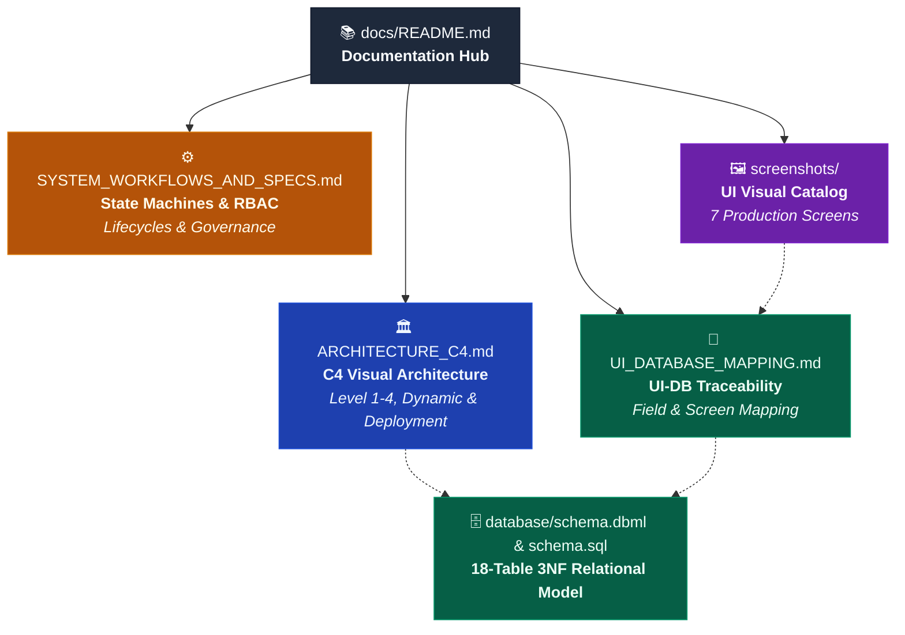

# ResidentHub - Technical Documentation Hub

Welcome to the **ResidentHub** architecture and technical specifications repository. This directory houses the comprehensive architectural designs, behavioral models, field-level traceability matrices, and visual artifacts governing the platform.



---

## 📑 Documentation Index

| Document | Focus Area | Target Audience | Primary Contents |
| :--- | :--- | :--- | :--- |
| **[ARCHITECTURE_C4.md](ARCHITECTURE_C4.md)** | **System Architecture (C4 Model)** | System Architects, Tech Leads, DevOps | • Level 1 System Context (Black box)<br/>• Level 2 Containers (React 19, Next.js 16, PostgreSQL 16)<br/>• Level 3 Components (8 internal server services)<br/>• Level 4 Code & 18-Table 3NF Data Model<br/>• Dynamic Runtime Sequence (VietQR Settlement)<br/>• Production Cloud Deployment Topology |
| **[SYSTEM_WORKFLOWS_AND_SPECS.md](SYSTEM_WORKFLOWS_AND_SPECS.md)** | **Business Lifecycles & Governance** | Backend Developers, Product Owners, QA | • Residence State Machine (`PERMANENT` / `TEMPORARY` / `ABSENT` / `MOVED`)<br/>• Billing & Debt State Machine (`UNPAID` $\rightarrow$ `PAID` / `OVERDUE`)<br/>• Incident SLA State Machine (`OPEN` $\rightarrow$ `CLOSED`)<br/>• RBAC Matrix (4 Roles across 7 Modules)<br/>• Post-DBML 4-Phase Implementation Roadmap |
| **[UI_DATABASE_MAPPING.md](UI_DATABASE_MAPPING.md)** | **Data Traceability Matrix** | Fullstack Engineers, QA, DBAs | • Granular field-by-field mapping between UI controls and 18 SQL tables<br/>• Data flow validation (Read vs. Write vs. Computed)<br/>• Missing column and schema alignment rules |
| **[screenshots/README.md](screenshots/README.md)** | **Visual Interface Gallery** | UI/UX Designers, Stakeholders, Developers | • Visual inventory of 7 primary application views<br/>• Route mappings and primary user role permissions<br/>• Feature walkthroughs for all core pages |

---

## 🗺️ Engineering Onboarding & Reading Path

For developers and contributors joining the **ResidentHub** team, recommended reading progression:

```
Step 1: High-Level Understanding
  └── [README.md](../README.md) (Project vision, technology stack, and quickstart)
        └── [ARCHITECTURE_C4.md](ARCHITECTURE_C4.md) (System boundaries, containers, and deployment)

Step 2: Business Logic & Rules
  └── [SYSTEM_WORKFLOWS_AND_SPECS.md](SYSTEM_WORKFLOWS_AND_SPECS.md) (State machines and RBAC permission matrix)

Step 3: Database & Physical Persistence
  └── [../database/schema.dbml](../database/schema.dbml) & [../schema.sql](../schema.sql) (18-table 3NF schema)

Step 4: Fullstack Implementation & Traceability
  └── [UI_DATABASE_MAPPING.md](UI_DATABASE_MAPPING.md) (Connecting Next.js frontend pages to SQL queries)
        └── [screenshots/README.md](screenshots/README.md) (UI reference catalog)
```

---

## 🏛️ Related Root Resources

- **[Project Root README](../README.md)**: Main developer portal with installation instructions, scripts, and feature highlights.
- **[Database SQL Schema](../schema.sql)**: Official PostgreSQL (v13+) DDL definition file with ENUMs, triggers, and indices.
- **[Database DBML Definition](../database/schema.dbml)**: Visual schema script for [dbdiagram.io](https://dbdiagram.io) and [dbdocs.io](https://dbdocs.io).
- **[Interactive Stitch Prototype](https://stitch.withgoogle.com/projects/16326783556633031011?pli=1)**: High-fidelity interactive UI prototype.
