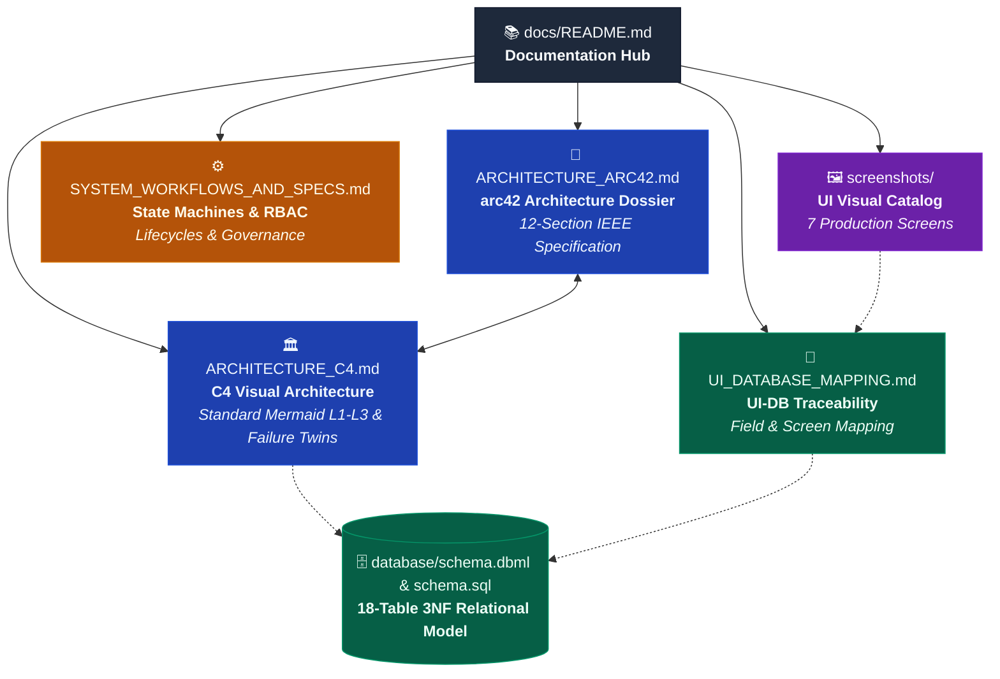

# ResidentHub - Technical Documentation Hub

Welcome to the **ResidentHub** architecture and technical specifications repository. This directory houses the comprehensive architectural designs, behavioral models, field-level traceability matrices, and visual artifacts governing the platform.

---

## 🗺️ Role-Based Reading Paths

Select the reading path tailored to your role, perspective, and available time:

### 1. "I want to grasp the system overview in 15–20 minutes" (Executive & Lead Review)
>
> **Goal:** Understand the big picture, business context, system boundaries, and primary stakeholders.

- ➡️ **[ARCHITECTURE_ARC42.md §1 & §4](ARCHITECTURE_ARC42.md#1-introduction-and-goals)**: Context, stakeholders, and measurable quality goals.
- ➡️ **[ARCHITECTURE_C4.md §1 & §2](ARCHITECTURE_C4.md#1-c4-system-context-diagram---level-1)**: C4 Level 1 (System Context) and Level 2 (Containers) diagrams.
- ➡️ **[screenshots/README.md](screenshots/README.md)**: Visual tour of the 7 production user interfaces.

### 2. "I am a newly onboarded developer" (First Day Setup & Code Structure)
>
> **Goal:** Master the codebase layout, folder organization, architectural layering, and engineering conventions.

- ➡️ **[../README.md](../README.md)**: Local development setup with Next.js and Docker.
- ➡️ **[ARCHITECTURE_ARC42.md §5.3](ARCHITECTURE_ARC42.md#53-target-code-structure)**: Physical source code structure (`src/app`, `src/lib/services`, `src/lib/db`).
- ➡️ **[ARCHITECTURE_C4.md §3](ARCHITECTURE_C4.md#3-c4-component-diagram---level-3)**: The 8 modular internal domain services within the Next.js server.
- ➡️ **[UI_DATABASE_MAPPING.md](UI_DATABASE_MAPPING.md)**: Field-by-field UI-to-database mapping and query contracts.

### 3. "I want an in-depth architectural audit" (Architect & Senior Technical Review)
>
> **Goal:** Evaluate system reliability, financial integrity, failure recovery mechanisms, and Architecture Decision Records (ADRs).

- ➡️ **[ARCHITECTURE_ARC42.md](ARCHITECTURE_ARC42.md)**: Complete 12-section IEEE 42010 architectural dossier.
- ➡️ **[ARCHITECTURE_C4.md §4](ARCHITECTURE_C4.md#4-c4-dynamic-diagrams---runtime-view--failure-twins)**: Real-time runtime sequences and **Failure Twins**.
- ➡️ **[ARCHITECTURE_ARC42.md §9 & §12](ARCHITECTURE_ARC42.md#9-architecture-decisions-adr-index)**: Architectural Decision Records (ADR Index) and automated CI Fitness Functions.

### 4. "I work with the database & financial/operations domain" (Backend & Data Engineer)
>
> **Goal:** Master the 18-table 3NF relational schema, utility billing calculation strategies, and state machines.

- ➡️ **[../schema.sql](../schema.sql)** & **[../database/schema.dbml](../database/schema.dbml)**: 18 relational tables, foreign keys, constraints, and indexes.
- ➡️ **[SYSTEM_WORKFLOWS_AND_SPECS.md §1](SYSTEM_WORKFLOWS_AND_SPECS.md#1-core-lifecycles-state-machines--failure-twins)**: Residence lifecycles, billing debt transitions, and parking quota allocation.
- ➡️ **[UI_DATABASE_MAPPING.md](UI_DATABASE_MAPPING.md)**: Comprehensive mapping matrix from 18 SQL tables to UI screens.

### 5. "I am a QA engineer seeking test scenarios" (QA & Test Automation Engineer)
>
> **Goal:** Construct test suites covering both Happy Paths and edge cases/failure twins.

- ➡️ **[ARCHITECTURE_C4.md §4](ARCHITECTURE_C4.md#4-c4-dynamic-diagrams---runtime-view--failure-twins)**: Failure twins: VietQR expiration, duplicate webhook delivery, meter audit rollbacks.
- ➡️ **[SYSTEM_WORKFLOWS_AND_SPECS.md §2](SYSTEM_WORKFLOWS_AND_SPECS.md#2-role-based-access-control-rbac-matrix)**: 4-tier RBAC permission verification matrix across 7 system modules.
- ➡️ **[ARCHITECTURE_ARC42.md §10](ARCHITECTURE_ARC42.md#10-quality-requirements-stimulus--response--measure)**: Stimulus-Response-Measure matrix (QR1 through QR5).

### 6. "I manage infrastructure, operations & reliability" (DevOps & SRE Engineer)
>
> **Goal:** Operate cloud infrastructure, WAF security, high-availability database replication, and autoscaling policies.

- ➡️ **[ARCHITECTURE_C4.md §5](ARCHITECTURE_C4.md#5-c4-deployment-diagram---infrastructure-view)**: Cloudflare Anycast + AWS RDS Multi-AZ + S3 deployment topology.
- ➡️ **[ARCHITECTURE_ARC42.md §2 & §11](ARCHITECTURE_ARC42.md#2-architecture-constraints)**: Operational constraints and system risk register.

---

## 📑 Documentation Index

| Document | Focus Area | Target Audience | Primary Contents |
| :--- | :--- | :--- | :--- |
| **[ARCHITECTURE_ARC42.md](ARCHITECTURE_ARC42.md)** | **arc42 Complete Architecture Dossier** | Architects, Leads, Reviewers | • 12 standard IEEE sections • Measurable Quality Goals (Q1-Q7) • External Interfaces & Solution Strategy • ADR Index (ADR-0001 to ADR-0004) • Architecture Fitness Functions in CI |
| **[ARCHITECTURE_C4.md](ARCHITECTURE_C4.md)** | **C4 Visual Architecture (Standard Mermaid)** | Developers, Architects, DevOps | • Level 1 System Context (Black box) • Level 2 Containers (React 19, Next.js 16, PostgreSQL 16) • Level 3 Components (8 internal server services) • **Dynamic Runtime View & Failure Twins** • Production Cloud Deployment Topology |
| **[SYSTEM_WORKFLOWS_AND_SPECS.md](SYSTEM_WORKFLOWS_AND_SPECS.md)** | **Business Lifecycles & Governance** | Backend Developers, QA | • Residence State Machine (`PERMANENT` / `TEMPORARY` / `ABSENT` / `MOVED`) • Billing & VietQR Failure Twin State Machine • Incident SLA & Escalation State Machine • RBAC Matrix (4 Roles across 7 Modules) • Post-DBML 4-Phase Implementation Roadmap |
| **[UI_DATABASE_MAPPING.md](UI_DATABASE_MAPPING.md)** | **Data Traceability Matrix** | Fullstack Engineers, QA, DBAs | • Granular field-by-field mapping between UI controls and 18 SQL tables • Data flow validation (Read vs. Write vs. Computed) • Missing column and schema alignment rules |
| **[screenshots/README.md](screenshots/README.md)** | **Visual Interface Gallery** | UI/UX Designers, Stakeholders, Developers | • Visual inventory of 7 primary application views • Route mappings and primary user role permissions • Feature walkthroughs for all core pages |

---

## 🏛️ Related Root Resources

- **[Project Root README](../README.md)**: Main developer portal with installation instructions, scripts, and feature highlights.
- **[Database SQL Schema](../schema.sql)**: Official PostgreSQL (v13+) DDL definition file with ENUMs, triggers, and indices.
- **[Database DBML Definition](../database/schema.dbml)**: Visual schema script for [dbdiagram.io](https://dbdiagram.io) and [dbdocs.io](https://dbdocs.io).
- **[Interactive Stitch Prototype](https://stitch.withgoogle.com/projects/16326783556633031011?pli=1)**: High-fidelity interactive UI prototype.
