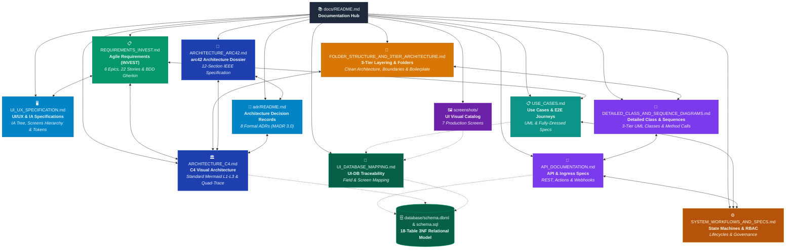

# ResidentHub - Technical Documentation Hub

Welcome to the **ResidentHub** architecture and technical specifications repository. This directory houses the comprehensive architectural designs, behavioral models, field-level traceability matrices, and visual artifacts governing the platform.

---

## 🗺️ Role-Based Reading Paths

Select the reading path tailored to your role, perspective, and available time:

### 1. "I want to grasp the system overview in 15–20 minutes" (Executive & Lead Review)
>
> **Goal:** Understand the big picture, business context, system boundaries, and primary stakeholders.

- ➡️ **[ARCHITECTURE_ARC42.md §1 & §4](ARCHITECTURE_ARC42.md#1-introduction-and-goals)**: Context, stakeholders, and measurable quality goals.
- ➡️ **[ARCHITECTURE_C4.md §1 & §2](ARCHITECTURE_C4.md#1-c4-system-context-diagram---level-1)**: C4 Level 1 (System Context) and Level 2 (Containers) diagrams.
- ➡️ **[screenshots/README.md](screenshots/README.md)**: Visual tour of the 7 production user interfaces.

### 2. "I am a newly onboarded developer" (First Day Setup & Code Structure)
>
> **Goal:** Master the codebase layout, folder organization, architectural layering, and engineering conventions.

- ➡️ **[../README.md](../README.md)**: Local development setup with Next.js and Docker.
- ➡️ **[FOLDER_STRUCTURE_AND_3TIER_ARCHITECTURE.md](FOLDER_STRUCTURE_AND_3TIER_ARCHITECTURE.md)**: 3-Tier Layering architecture, physical folder layout, strict boundary rules, and boilerplate code skeletons.
- ➡️ **[DETAILED_CLASS_AND_SEQUENCE_DIAGRAMS.md](DETAILED_CLASS_AND_SEQUENCE_DIAGRAMS.md)**: UML class diagrams and method-level sequence diagrams across the 3 tiers.
- ➡️ **[UI_UX_SPECIFICATION.md](UI_UX_SPECIFICATION.md)**: Information Architecture tree, screens hierarchy, and reusable component tokens.
- ➡️ **[API_DOCUMENTATION.md](API_DOCUMENTATION.md)**: Standard REST endpoints, Next.js Server Actions, RFC 7807 error catalog, and RBAC matrix.
- ➡️ **[UI_DATABASE_MAPPING.md](UI_DATABASE_MAPPING.md)**: Field-by-field UI-to-database mapping and query contracts.

### 3. "I want an in-depth architectural audit" (Architect & Senior Technical Review)
>
> **Goal:** Evaluate system reliability, financial integrity, failure recovery mechanisms, and Architecture Decision Records (ADRs).

- ➡️ **[ARCHITECTURE_ARC42.md](ARCHITECTURE_ARC42.md)**: Complete 12-section IEEE 42010 architectural dossier.
- ➡️ **[adr/README.md](adr/README.md)**: Master ADR Catalog capturing 8 formal architectural decision records (MADR 3.0).
- ➡️ **[ARCHITECTURE_C4.md §4 & §7](ARCHITECTURE_C4.md#4-c4-dynamic-diagrams---runtime-view--failure-twins)**: Real-time runtime sequences, Failure Twins, and Quad-Traceability Matrix.
- ➡️ **[DETAILED_CLASS_AND_SEQUENCE_DIAGRAMS.md](DETAILED_CLASS_AND_SEQUENCE_DIAGRAMS.md)**: In-depth UML class models, method signatures, and concurrency pessimistic locking sequences.
- ➡️ **[API_DOCUMENTATION.md §5 & §6](API_DOCUMENTATION.md#5-external-ingress--webhook-specifications)**: VietQR IPN Webhooks, idempotency checks, and API failure twins.
- ➡️ **[ARCHITECTURE_ARC42.md §9 & §12](ARCHITECTURE_ARC42.md#9-architecture-decisions-adr-index)**: Architectural Decision Records (ADR Index) and automated CI Fitness Functions.

### 4. "I work with the database & financial/operations domain" (Backend & Data Engineer)
>
> **Goal:** Master the 18-table 3NF relational schema, utility billing calculation strategies, and state machines.

- ➡️ **[../database/schema.sql](../database/schema.sql)** & **[../database/schema.dbml](../database/schema.dbml)**: 18 relational tables, foreign keys, constraints, and indexes.
- ➡️ **[SYSTEM_WORKFLOWS_AND_SPECS.md §1](SYSTEM_WORKFLOWS_AND_SPECS.md#1-core-lifecycles-state-machines--failure-twins)**: Residence lifecycles, billing debt transitions, and parking quota allocation.
- ➡️ **[UI_DATABASE_MAPPING.md](UI_DATABASE_MAPPING.md)**: Comprehensive mapping matrix from 18 SQL tables to UI screens.

### 5. "I am a Product Owner / BA / QA engineer seeking requirements & specs"
>
> **Goal:** Construct test suites covering Agile User Stories, BDD Given-When-Then criteria, E2E journeys, and edge cases.

- ➡️ **[REQUIREMENTS_INVEST.md](REQUIREMENTS_INVEST.md)**: **6 Epics, 22 User Stories** strictly adhering to INVEST criteria with BDD Gherkin test scenarios.
- ➡️ **[UI_UX_SPECIFICATION.md](UI_UX_SPECIFICATION.md)**: Screen hierarchy, 5 core UI states, and navigation transition matrix.
- ➡️ **[USE_CASES.md](USE_CASES.md)**: Complete UML use case catalogs, 4 End-to-End resident journeys, 6 fully-dressed specifications, and traceability matrix.
- ➡️ **[ARCHITECTURE_C4.md §4](ARCHITECTURE_C4.md#4-c4-dynamic-diagrams---runtime-view--failure-twins)**: Failure twins: VietQR expiration, duplicate webhook delivery, meter audit rollbacks.
- ➡️ **[SYSTEM_WORKFLOWS_AND_SPECS.md §2](SYSTEM_WORKFLOWS_AND_SPECS.md#2-role-based-access-control-rbac-matrix)**: 4-tier RBAC permission verification matrix across 7 system modules.

### 6. "I manage infrastructure, operations & reliability" (DevOps & SRE Engineer)
>
> **Goal:** Operate cloud infrastructure, WAF security, high-availability database replication, and autoscaling policies.

- ➡️ **[ARCHITECTURE_C4.md §5](ARCHITECTURE_C4.md#5-c4-deployment-diagram---infrastructure-view)**: Cloudflare Anycast + AWS RDS Multi-AZ + S3 deployment topology.
- ➡️ **[ARCHITECTURE_ARC42.md §2 & §11](ARCHITECTURE_ARC42.md#2-architecture-constraints)**: Operational constraints and system risk register.

---

## 📑 Documentation Index

| Document | Focus Area | Target Audience | Primary Contents |
| :--- | :--- | :--- | :--- |
| **[adr/README.md](adr/README.md)** | **Architecture Decision Records (MADR)** | Architects, Leads, Reviewers | • Master ADR catalog & lifecycle governance • 8 formal decisions (PostgreSQL 3NF, Lock, VietQR, Monorepo) • Rationale, considered alternatives & trade-offs |
| **[FOLDER_STRUCTURE_AND_3TIER_ARCHITECTURE.md](FOLDER_STRUCTURE_AND_3TIER_ARCHITECTURE.md)** | **3-Tier Layering & Folder Architecture** | Fullstack & Backend Devs | • Physical folder breakdown (Frontend & Backend) • 4 Strict Layer Boundary Rules • Pipeline data flow & RFC 7807 error mapper • Complete boilerplate code skeleton (VietQR flow) |
| **[DETAILED_CLASS_AND_SEQUENCE_DIAGRAMS.md](DETAILED_CLASS_AND_SEQUENCE_DIAGRAMS.md)** | **Detailed UML Class & Sequence Models** | Backend Devs, Architects, QA | • 4 Subsystem UML Class Diagrams across 3 Tiers • Method signatures & parameter types • **4 Method-level Sequence Diagrams (VietQR, Lock, CCCD, Batch)** • Method Traceability Matrix |
| **[REQUIREMENTS_INVEST.md](REQUIREMENTS_INVEST.md)** | **Agile Requirements (INVEST & BDD)** | POs, BAs, QA, Developers | • 6 Epics covering 100% of business domains • 22 User Stories with INVEST scorecards • BDD Acceptance Criteria (*Given-When-Then*) • Requirements Traceability Matrix |
| **[UI_UX_SPECIFICATION.md](UI_UX_SPECIFICATION.md)** | **Information Architecture & UI/UX** | UI/UX Designers, Frontend Devs, POs | • 4 IA systems (Organization, Labeling, Nav, Search) • Comprehensive Mermaid IA Tree diagram • 4-level Screens Hierarchy & Transition Matrix • Design Tokens & 5 Core UI States |
| **[USE_CASES.md](USE_CASES.md)** | **Use Cases & E2E Journeys** | POs, BAs, QA, Fullstack | • Actor & Trigger taxonomy (HTTP, Cron, Webhook) • 4 UML Subsystem Use Case Diagrams • **4 End-to-End Journeys (Move-in, Billing, SLA, Move-out)** • 6 Fully-Dressed Use Case Specs with Failure Twins • Use Case $\leftrightarrow$ UI $\leftrightarrow$ Service $\leftrightarrow$ DB Traceability |
| **[ARCHITECTURE_ARC42.md](ARCHITECTURE_ARC42.md)** | **arc42 Complete Architecture Dossier** | Architects, Leads, Reviewers | • 12 standard IEEE sections • Measurable Quality Goals (Q1-Q7) • External Interfaces & Solution Strategy • ADR Index (ADR-0001 to ADR-0008) • Architecture Fitness Functions in CI |
| **[ARCHITECTURE_C4.md](ARCHITECTURE_C4.md)** | **C4 Visual Architecture (Standard Mermaid)** | Developers, Architects, DevOps | • Level 1 System Context (Black box) • Level 2 Containers (React 19, Next.js 16, PostgreSQL 16) • **Level 3 Components (Frontend SPA + Backend Services)** • **Dynamic Runtime View with Story IDs & Failure Twins** • Full Quad-Traceability Matrix |
| **[SYSTEM_WORKFLOWS_AND_SPECS.md](SYSTEM_WORKFLOWS_AND_SPECS.md)** | **Business Lifecycles & Governance** | Backend Developers, QA | • Residence State Machine (`PERMANENT` / `TEMPORARY` / `ABSENT` / `MOVED`) • Billing & VietQR Failure Twin State Machine • Incident SLA & Escalation State Machine • RBAC Matrix (4 Roles across 7 Modules) • Post-DBML 4-Phase Implementation Roadmap |
| **[API_DOCUMENTATION.md](API_DOCUMENTATION.md)** | **API & External Ingress Specs** | Backend, Frontend, QA, Integrators | • Ground Truth status matrix (Mocked vs Real) • Standard Ingress & RFC 7807 Error Catalog • 7 Core modules REST & Action endpoints with DTOs • **VietQR Webhook IPN & S3 Storage Specs** • **API Runtime Views & Failure Twins** |
| **[UI_DATABASE_MAPPING.md](UI_DATABASE_MAPPING.md)** | **Data Traceability Matrix** | Fullstack Engineers, QA, DBAs | • Granular field-by-field mapping between UI controls and 18 SQL tables • Data flow validation (Read vs. Write vs. Computed) • Missing column and schema alignment rules |
| **[screenshots/README.md](screenshots/README.md)** | **Visual Interface Gallery** | UI/UX Designers, Stakeholders, Developers | • Visual inventory of 7 primary application views • Route mappings and primary user role permissions • Feature walkthroughs for all core pages |

---

## 🏛️ Related Root Resources

- **[Project Root README](../README.md)**: Main developer portal with installation instructions, scripts, and feature highlights.
- **[Database SQL Schema](../database/schema.sql)**: Official PostgreSQL (v13+) DDL definition file with ENUMs, triggers, and indices.
- **[Database DBML Definition](../database/schema.dbml)**: Visual schema script for [dbdiagram.io](https://dbdiagram.io) and [dbdocs.io](https://dbdocs.io).
- **[Interactive Stitch Prototype](https://stitch.withgoogle.com/projects/16326783556633031011?pli=1)**: High-fidelity interactive UI prototype.
