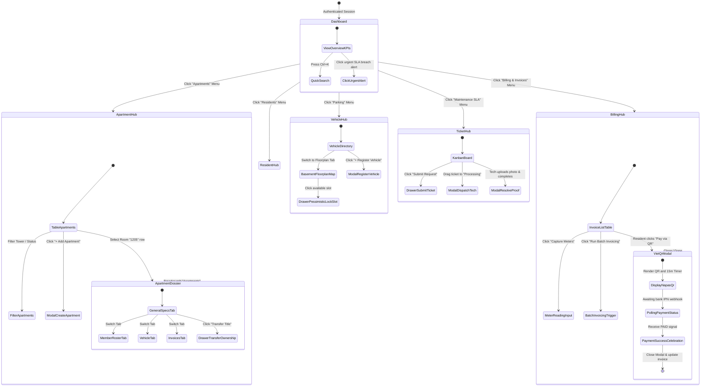

# ResidentHub — UI/UX Specification & Information Architecture
## Comprehensive Information Architecture, Screens Hierarchy & Visual Design System

> **Status:** Approved Architectural Baseline  
> **Audience:** Product Designers, Frontend Engineers, Fullstack Developers, QA/UAT Engineers  
> **Traceability Links:**  
> - 📋 [REQUIREMENTS_INVEST.md](REQUIREMENTS_INVEST.md) (Agile User Stories & INVEST Acceptance Criteria)  
> - 🏛️ [ARCHITECTURE_C4.md](ARCHITECTURE_C4.md) (C4 Container & Component Diagrams)  
> - 📂 [FOLDER_STRUCTURE_AND_3TIER_ARCHITECTURE.md](FOLDER_STRUCTURE_AND_3TIER_ARCHITECTURE.md) (Frontend & Backend 3-Tier Layering)  
> - 🔗 [UI_DATABASE_MAPPING.md](UI_DATABASE_MAPPING.md) (Field-level UI-to-Database Mapping)  
> - 📸 [docs/screenshots/](screenshots/README.md) (Visual Gallery of Production Screens)  
> - 🗄️ [database/schema.sql](../database/schema.sql) (PostgreSQL Normalized Relational Schema)

---

## 📑 Table of Contents

1. [Core UX Design Principles](#1-core-ux-design-principles)
2. [Information Architecture (IA) Systems](#2-information-architecture-ia-systems)
   - [2.1. Organization System](#21-organization-system)
   - [2.2. Labeling System](#22-labeling-system)
   - [2.3. Navigation System](#23-navigation-system)
   - [2.4. Search & Filtering System](#24-search--filtering-system)
   - [2.5. Comprehensive Mermaid IA Tree Diagram](#25-comprehensive-mermaid-ia-tree-diagram)
3. [Screens Hierarchy & Navigation Flow](#3-screens-hierarchy--navigation-flow)
   - [3.1. 4-Level Screen Hierarchy Model](#31-4-level-screen-hierarchy-model)
   - [3.2. Mermaid Screen Navigation Flowchart](#32-mermaid-screen-navigation-flowchart)
   - [3.3. Screen Transition Matrix](#33-screen-transition-matrix)
   - [3.4. Role-Based Screen Access Matrix (RBAC)](#34-role-based-screen-access-matrix-rbac)
4. [UI/UX Design Standards](#4-uiux-design-standards)
   - [4.1. Design Tokens (Colors, Typography, Layout Grid, Shadows)](#41-design-tokens-colors-typography-layout-grid-shadows)
   - [4.2. 5 Core UI States (Loading, Ideal, Empty, Error, Warning)](#42-5-core-ui-states-loading-ideal-empty-error-warning)
   - [4.3. Reusable Component Patterns (AppDataTable, VietQR, Floorplan)](#43-reusable-component-patterns-appdatatable-vietqr-floorplan)
5. [Interface Route Mapping & Production Screenshots](#5-interface-route-mapping--production-screenshots)

---

## 1. Core UX Design Principles

The **ResidentHub** interface is engineered for urban residential operations and facility administration. The visual and interaction design follows 4 core tenets:

1. **Task Efficiency First:** Minimize administrative friction for building managers. Routine workflows (finding an apartment, verifying a citizen ID, approving stay records, reconciling invoices) must be executable within **at most 3 clicks**.
2. **Financial & Demographic Transparency:** Monetary figures (VND), living areas (m²), tiered electric/water consumption indices, and license plates are displayed with standardized units to eliminate operational ambiguity.
3. **Optimistic & Concurrency-Safe UI:**
   - For idempotent administrative operations: The UI provides immediate optimistic state feedback.
   - For scarce physical assets (basement car parking bays, billing batch cutoffs): The UI displays real-time concurrency status locks to prevent simultaneous double-booking.
4. **Zero Dead-Ends:** Every empty or error state provides clear instructional context accompanied by an actionable Primary Call-to-Action (CTA) button.

---

## 2. Information Architecture (IA) Systems

### 2.1. Organization System

ResidentHub combines **Topic-Based** and **Role-Based** organizational structures:

- **Physical Property Domain:** Buildings $\rightarrow$ Floors $\rightarrow$ Apartments $\rightarrow$ Legal Ownership contracts.
- **Demographic & Census Domain:** Households $\rightarrow$ Household Registries (*Sổ hộ khẩu*) $\rightarrow$ Occupants $\rightarrow$ Civil Movement Declarations (Temporary Stay/Absence).
- **Parking & Vehicle Infrastructure:** Basement Floorplans (B1/B2) $\rightarrow$ Parking Slots $\rightarrow$ Vehicles $\rightarrow$ Active RFID Access Cards.
- **Finance & Utility Accounting:** Monthly Utility Index Metering $\rightarrow$ Automated Invoicing Batches $\rightarrow$ Dynamic VietQR Sessions $\rightarrow$ Bank Settlement Receipts.
- **Maintenance & Incident SLA:** Defect Intake $\rightarrow$ Technician Dispatch $\rightarrow$ Photographic Proof Resolution $\rightarrow$ Automated SLA Escalation Watchdog.
- **System Administration:** User Management $\rightarrow$ 4-Tier RBAC Policies $\rightarrow$ Progressive Tariff Configuration $\rightarrow$ Immutable Audit Trails.

---

### 2.2. Labeling System

To ensure consistency across the application and documentation, key urban management terms are standardized:

| UI Display Label | SQL Entity | English Technical Term | Business Definition & Scope |
| :--- | :--- | :--- | :--- |
| **Apartment** | `apartments` | Apartment Unit | Physical living unit (e.g., Room 1205, Tower A, Floor 12). |
| **Legal Owner** | `owners` | Legal Property Owner | Legal title deed or sales contract holder. |
| **Household Book** | `households` | Household Registry | Unique household book identifier (e.g., `HK-1205`). |
| **Household Head** | `head_resident_id` | Household Head | Primary legal representative responsible for unit obligations. |
| **Occupant / Resident** | `household_members` | Household Member | Registered family member or long-term tenant. |
| **Civil Movement** | `residence_records` | Residence Record | Statutory declaration: Temporary Stay (`TAM_TRU`), Absence (`TAM_VANG`). |
| **Parking Slot** | `parking_slots` | Parking Bay / Slot | Physical dedicated slot in basement (e.g., `B1-A01`, `B2-C15`). |
| **Vehicle Quota** | `quota` | Vehicle Quota | Regulatory quota: Max 1 car and 2 motorbikes per apartment unit. |
| **Meter Reading** | `meter_readings` | Utility Meter Read | Monthly captured power (kWh) and water (m³) consumption indices. |
| **Monthly Invoice** | `invoices` | Monthly Invoice | Itemized monthly billing statement for an apartment unit. |
| **Dynamic VietQR** | `payment_sessions` | Dynamic VietQR | Napas 247 QR code pre-encoded with exact bill amount and reference. |
| **Service Ticket** | `feedbacks` | Incident Ticket | Defect or maintenance request filed with facility management. |
| **SLA Status** | `sla_status` | Service Level Agreement | Resolution timeline: Urgent (4 hours), Standard (24 hours). |

---

### 2.3. Navigation System

The navigation architecture is structured into 4 synchronized layers:

1. **Global Sidebar Navigation:** Fixed left sidebar (260px desktop width, collapsible drawer on mobile/tablet) dynamically filtered based on authenticated RBAC roles (`ADMIN`, `MANAGER`, `TECHNICIAN`, `RESIDENT`).
2. **Contextual Breadcrumb Bar:** Displays active hierarchical path: `Dashboard > Apartments > Room 1205 Dossier`.
3. **Local Segmented Tabs:** Used in deep-dive dossier views (e.g., Apartment Dossier contains: `General Specs`, `Household Roster`, `Vehicles & Slots`, `Billing Ledger`).
4. **Command Palette (`Ctrl + K`):** Global omni-search modal enabling immediate lookup of rooms, citizen IDs, or license plates.

---

### 2.4. Search & Filtering System

Every list and data table incorporates a standardized multi-faceted toolbar:

- **Omni Search Box:** Debounced (300ms) text search supporting unaccented and accented Vietnamese text.
- **Status Filter Chips:** One-click filtering between `All`, `Active`, `Pending Review`, and `Overdue`.
- **Faceted Dropdowns:** Combined filtering across Towers (`Tower A`, `Tower B`), Floor ranges, and Date ranges.
- **Reset Filters Button:** Reverts all filters back to default with a single click.

---

### 2.5. Comprehensive Mermaid IA Tree Diagram

```mermaid
graph TD
    ROOT["🏛️ ResidentHub Root Portal"]

    %% Dashboard Console
    ROOT --> DASH["📊 Command Dashboard (/page.tsx)<br/>- Occupancy Rate KPI<br/>- Monthly Revenue Gauge<br/>- Basement Capacity Balancing<br/>- Urgent SLA Breach Watchlist"]

    %% Apartments Subsystem
    ROOT --> APT["🏢 Apartment Directory (/can-ho)<br/>- Grid & Table Views<br/>- Tower, Floor & Status Filters"]
    APT --> APT_NEW["➕ Modal: Add New Apartment"]
    APT --> APT_DETAIL["🔍 Apartment Dossier (/can-ho/[roomNumber])"]
    APT_DETAIL --> APT_TAB_INFO["Tab 1: Architectural Specs & Floorplan"]
    APT_DETAIL --> APT_TAB_MEM["Tab 2: Household Occupants"]
    APT_DETAIL --> APT_TAB_VEH["Tab 3: Vehicles & Parking Bays"]
    APT_DETAIL --> APT_TAB_BILL["Tab 4: Financial Ledger & Invoices"]
    APT_DETAIL --> APT_ACT_OWNER["Drawer: Ownership Title Transfer"]

    %% Residents Subsystem
    ROOT --> RES["👥 Resident Registry (/cu-dan)<br/>- Master Demographic Roster<br/>- 12-Digit Citizen ID Lookup"]
    RES --> RES_MODAL_ADD["➕ Modal: Register Occupant"]
    RES --> RES_MODAL_HEAD["🔄 Modal: Household Head Succession"]

    %% Civil Movement Subsystem
    ROOT --> STAY["📋 Civil Movement Registry (/cu-tru)<br/>- Online Temporary Stay Submission<br/>- Temporary Absence Declaration"]
    STAY --> STAY_HIST["📜 Residency History Audit (/lich-su-cu-tru)<br/>- Police Dossier Endorsement<br/>- Municipal Authority Export"]

    %% Vehicles Subsystem
    ROOT --> VEH["🚗 Vehicles & Parking (/phuong-tien-va-bai-do)<br/>- Apartment Quota Monitor<br/>- Basement Floorplans (B1/B2)<br/>- RFID Card Provisioning"]
    VEH --> VEH_MODAL_REG["➕ Modal: Register Vehicle"]
    VEH --> VEH_MODAL_SLOT["🅿️ Drawer: Pessimistic Lock Slot Allocation"]

    %% Billing Subsystem
    ROOT --> FIN["💳 Billing & Finance (/phi-chung-cu)<br/>- Utility Meter Audit Table<br/>- Month-End Batch Invoicing (25th)<br/>- Overdue Debt Monitor"]
    FIN --> FIN_MODAL_QR["📱 Modal: Dynamic VietQR Payment"]
    FIN --> FIN_MODAL_METER["⚡ Modal: Utility Meter Capture"]

    %% Tickets Subsystem
    ROOT --> TKT["🔧 Maintenance Tickets (/phan-anh-va-yeu-cau)<br/>- SLA Kanban Board<br/>- Real-time SLA Breach Countdown"]
    TKT --> TKT_DRAWER_NEW["➕ Drawer: Submit Defect Report"]
    TKT --> TKT_MODAL_DISPATCH["👷 Modal: Dispatch Field Technician"]
    TKT --> TKT_MODAL_RESOLVE["📸 Modal: Photo Proof Resolution"]

    %% Admin Subsystem
    ROOT --> ADM["⚙️ System Administration (/cai-dat, /nguoi-dung)<br/>- User Accounts & 4-Tier RBAC<br/>- Progressive Tariff Configuration<br/>- Immutable Audit Log Trail"]

    classDef rootStyle fill:#1e3a8a,color:#fff,stroke:#1d4ed8,stroke-width:3px;
    classDef hubStyle fill:#0284c7,color:#fff,stroke:#0369a1,stroke-width:2px;
    classDef detailStyle fill:#0d9488,color:#fff,stroke:#0f766e,stroke-width:2px;
    classDef actionStyle fill:#475569,color:#fff,stroke:#334155,stroke-width:1px;

    class ROOT rootStyle;
    class DASH,APT,RES,STAY,VEH,FIN,TKT,ADM hubStyle;
    class APT_DETAIL,STAY_HIST detailStyle;
    class APT_NEW,APT_TAB_INFO,APT_TAB_MEM,APT_TAB_VEH,APT_TAB_BILL,APT_ACT_OWNER,RES_MODAL_ADD,RES_MODAL_HEAD,STAY_HIST,VEH_MODAL_REG,VEH_MODAL_SLOT,FIN_MODAL_QR,FIN_MODAL_METER,TKT_DRAWER_NEW,TKT_MODAL_DISPATCH,TKT_MODAL_RESOLVE actionStyle;
```



---

## 3. Screens Hierarchy & Navigation Flow

### 3.1. 4-Level Screen Hierarchy Model

```
[Level 0: Command Console]
       │
       ├──> [Level 1: Domain Hubs]
       │           │
       │           ├──> [Level 2: Dossier Views]
       │           │           │
       │           │           └──> [Level 3: Action Modals & Drawers]
       │           │
       │           └──> [Level 3: Batch Actions & Global Creation Modals]
```

- **Level 0 (Command Console):** Main root view (`/page.tsx`). Consolidates operational KPIs, monthly revenue graphs, basement capacity gauges, and urgent SLA breach alerts.
- **Level 1 (Domain Hubs):** Primary directories (`/can-ho`, `/cu-dan`, `/phuong-tien-va-bai-do`, `/phi-chung-cu`, `/phan-anh-va-yeu-cau`). Renders master data tables or card grids with faceted filters and batch action bars.
- **Level 2 (Dossier Views):** 360-degree deep-dive views for individual entities (`/can-ho/[roomNumber]`, service ticket detail view). Aggregates related cross-table records into dedicated tabs.
- **Level 3 (Action Modals & Drawers):** Contextual pop-ups and slide-over drawers (Vehicle registration modal, VietQR pay session modal, defect reporting drawer). Preserves underlying parent page context.

---

### 3.2. Mermaid Screen Navigation Flowchart



---

### 3.3. Screen Transition Matrix

| Source Screen | Trigger Action | Target Screen / Component | Transition Mechanism | Context Data Transferred | Dismiss / Cancellation Behavior |
| :--- | :--- | :--- | :--- | :--- | :--- |
| **Dashboard (`/`)** | Clicks apartment row | `/can-ho/[roomNumber]` | Client Route Navigation | `roomNumber` slug | Breadcrumb link back to Dashboard |
| **Dashboard (`/`)** | Clicks SLA alert badge | `/phan-anh-va-yeu-cau` | Client Route Navigation | `?filter=URGENT&status=PENDING` | Breadcrumb link back to Dashboard |
| **`/can-ho`** | Clicks `"+ Add Apartment"` | `ApartmentCreateModal` | Modal Pop-up (Overlay) | None | Clicks "Cancel" or backdrop |
| **`/can-ho/[roomNumber]`**| Clicks `"Transfer Title"` | `OwnershipTransferDrawer`| Slide-over Right Drawer | `apartmentId`, `currentOwner` | Clicks "X" close icon |
| **`/cu-dan`** | Clicks `"+ Register Occupant"`| `ResidentRegisterModal` | Modal Pop-up | `householdId` | Clicks "Cancel" |
| **`/cu-dan`** | Clicks `"Change Head"` | `HouseholdHeadTransferModal`| Confirmation Dialog | `currentHeadId`, `memberList` | Clicks "Cancel" to retain current head |
| **`/phuong-tien-va-bai-do`**| Clicks `"+ Register Vehicle"` | `VehicleRegisterModal` | Modal Pop-up | `apartmentList` | Clicks "Cancel" |
| **`/phuong-tien-va-bai-do`**| Clicks green available slot | `SlotAllocationDrawer` | Drawer Panel | `slotCode`, `buildingId` | Clicks "Close" (releases pessimistic lock) |
| **`/phi-chung-cu`** | Clicks `"Pay via VietQR"` | `VietQrPaymentModal` | Centered Modal | `invoiceId`, `amount`, `orderCode` | Clicks "Close" (session TTL expires in 15m) |
| **`/phi-chung-cu`** | Clicks `"Capture Meters"` | `MeterReadingBatchModal`| Fullscreen Modal | `billingPeriod` (YYYY-MM) | Clicks "Save Draft" or "Exit" |
| **`/phan-anh-va-yeu-cau`**| Clicks `"+ Submit Request"` | `TicketSubmitDrawer` | Drawer Panel | `residentApartmentId` | Clicks "Cancel" |
| **`/phan-anh-va-yeu-cau`**| Clicks `"Dispatch Tech"` | `TicketDispatchModal` | Modal Pop-up | `ticketId`, `specialtyType` | Clicks "Close" |

---

### 3.4. Role-Based Screen Access Matrix (RBAC)

Access levels: **`V` (View)**, **`C` (Create)**, **`U` (Update)**, **`D` (Delete/Revoke)**:

| URL Route | Interface Module | `ADMIN` (SysAdmin) | `MANAGER` (Operations) | `TECHNICIAN` (Field) | `RESIDENT` (Occupant) |
| :--- | :--- | :---: | :---: | :---: | :---: |
| **`/`** | Operational Command Console | **V, C, U, D** | **V, C, U, D** | **V** (Technical metrics) | **V** (Personal unit metrics) |
| **`/can-ho`** | Apartment Directory | **V, C, U, D** | **V, C, U** | **V** (Read-only specs) | **V** (Own unit only) |
| **`/can-ho/[roomNumber]`** | Apartment 360 Dossier | **V, C, U, D** | **V, C, U** | **V** (Read-only specs) | **V** (Own unit only) |
| **`/cu-dan`** | Resident Directory & Census | **V, C, U, D** | **V, C, U, D** | ❌ Blocked | **V** (Own family roster only) |
| **`/cu-tru`** | Civil Stay Declarations | **V, U, D** | **V, U, D** (Review) | ❌ Blocked | **V, C** (Self-submit declarations) |
| **`/lich-su-cu-tru`** | Movement History Audit | **V, U, D** | **V, U** (Endorse) | ❌ Blocked | ❌ Blocked |
| **`/phuong-tien-va-bai-do`** | Vehicles & Parking Slots | **V, C, U, D** | **V, C, U, D** | **V** (Plate lookup) | **V, C** (Register own vehicle) |
| **`/phi-chung-cu`** | Billing, Invoices & VietQR | **V, C, U, D** | **V, C, U** (Cutoff) | **V, U** (Log meters) | **V, U** (View & Scan QR to pay) |
| **`/phan-anh-va-yeu-cau`** | Tickets & Maintenance SLA | **V, C, U, D** | **V, U, D** (Dispatch) | **V, U** (Photo proof) | **V, C** (File ticket & rate SLA) |
| **`/nguoi-dung`** | User Credentials & RBAC | **V, C, U, D** | ❌ Blocked | ❌ Blocked | ❌ Blocked |
| **`/cai-dat`** | Tariffs & Audit Logs | **V, C, U, D** | **V** (Read-only rates) | ❌ Blocked | ❌ Blocked |

---

## 4. UI/UX Design Standards

### 4.1. Design Tokens

Configured to align with **Tailwind CSS v4** token standards:

#### Color Palette
- **Primary Brand Tokens:**
  - `primary-50`: `#eff6ff` (Subtle card highlight, badge background)
  - `primary-500`: `#3b82f6` (Input focus ring, status icons)
  - `primary-600`: `#2563eb` (Primary CTA buttons)
  - `primary-700`: `#1d4ed8` (Button hover state)
  - `primary-900`: `#1e3a8a` (Global sidebar background)
- **Semantic Status Tokens:**
  - **Success / Available:** Emerald (`#059669` / `#d1fae5`) — Used for settled invoices (`PAID`), available parking bays (`AVAILABLE`), and approved dossiers (`APPROVED`).
  - **Warning / Pending:** Amber (`#d97706` / `#fef3c7`) — Used for unpaid invoices (`UNPAID`), pending declarations (`PENDING`), and anomaly alerts (`ANOMALY`).
  - **Danger / Overdue / Occupied:** Rose (`#e11d48` / `#ffe4e6`) — Used for overdue invoices (`OVERDUE`), occupied parking slots (`OCCUPIED`), and SLA breach flags (`SLA_BREACHED`).
  - **Neutral / Revoked:** Slate (`#64748b` / `#f1f5f9`) — Used for de-registered vehicles (`REVOKED`) and inactive users (`INACTIVE`).

#### Typography & Scale
- **Font Stack:** `Inter`, `Roboto`, system sans-serif.
- **Scale:**
  - `text-xs` (11px): Metadata tags, timestamps, slot badges.
  - `text-sm` (13px): Data table rows, form input labels, breadcrumbs.
  - `text-base` (15px): Primary body text, card descriptions.
  - `text-lg` / `text-xl` (18px - 20px): Card titles, room numbers.
  - `text-2xl` / `text-3xl` (24px - 30px): Dashboard financial KPI metrics.

#### Layout & Elevation Grid
- **Grid:** 12-column responsive layout (`grid-cols-12`).
- **Spacing:** Multiples of 4px: `gap-4` (16px), `gap-6` (24px).
- **Border Radius:** `rounded-lg` (8px) for inputs; `rounded-xl` (12px) for cards and buttons; `rounded-2xl` (16px) for modals and KPI blocks.
- **Elevation:** `shadow-sm` for table rows; `shadow-lg` for cards; `shadow-2xl` for modals and drawers.

---

### 4.2. 5 Core UI States

Every view and data container implements 5 core UI states:

```
┌─────────────────┐       ┌─────────────────┐       ┌─────────────────┐
│ 1. Loading      │ ----> │ 2. Ideal State  │ ----> │ 3. Partial /    │
│    Skeleton     │       │    (Full Data)  │       │    Warning State│
└─────────────────┘       └─────────────────┘       └─────────────────┘
         │                         │
         v                         v
┌─────────────────┐       ┌─────────────────┐
│ 4. Empty State  │       │ 5. Error State  │
│    (No Data     │       │    (RFC 7807    │
│     + CTA)      │       │     Fallback)   │
└─────────────────┘       └─────────────────┘
```

1. **Loading Skeleton State:** Zero layout shift (**CLS = 0**) via shimmering skeleton cards matching real table and card dimensions.
2. **Ideal / Loaded State:** Data displayed with aligned typography (left-aligned text, right-aligned monetary VND amounts, center-aligned status chips).
3. **Empty State:** Includes contextual graphic icon, friendly explanatory message, and a prominent Primary CTA button (`"+ Add Vehicle"`).
4. **Error / Fallback State:** Conforms to RFC 7807 problem details with error icon, user-friendly localized message, and `"Retry"` / `"Return Home"` action buttons.
5. **Partial / Warning State:** Highlighted banner warnings (e.g., *"Basement B1 car capacity reached 95% (4 slots remaining)"*).

---

### 4.3. Reusable Component Patterns

#### Pattern 1: AppDataTable Pattern
- Sticky header during long scroll operations.
- Leading column selection checkboxes for batch actions (Batch print, bulk reminders).
- Trailing contextual action dropdown `[...]` (Inspect, Edit, Delete).
- Bottom pagination bar displaying record count, page size (10, 25, 50), and page jumpers.

#### Pattern 2: VietQrPaymentModal Pattern
- Header displaying total VND amount in large bold font.
- Centered high-resolution Napas 247 VietQR code with MB Bank beneficiary details and one-click copy button.
- 15-minute countdown progress bar.
- Automatic 3-second polling checking for settlement signals, triggering celebration fireworks upon confirmation.

#### Pattern 3: Basement Floorplan Slot Grid
- Visual grid divided into Basement B1 (Cars) and Basement B2 (Motorbikes).
- Each slot displays designated code (`B1-01`) with clear status colors:
  - Green border & tint: Available (`AVAILABLE`).
  - Red border & tint: Occupied (`OCCUPIED`) displaying license plate overlay.
  - Amber border: Locked by concurrent allocation session.
  - Gray hatch: Maintenance mode (`MAINTENANCE`).

---

## 5. Interface Route Mapping & Production Screenshots

| Interface Module | Route Path | Production Screenshot Reference | Database Mapping Reference |
| :--- | :--- | :--- | :--- |
| **Operational Command Console** | `app/page.tsx` | [`docs/screenshots/dashboard.png`](screenshots/dashboard.png) | [UI_DATABASE_MAPPING.md §0](UI_DATABASE_MAPPING.md) |
| **Apartment Directory** | `app/can-ho/page.tsx` | [`docs/screenshots/apartments.png`](screenshots/apartments.png) | [UI_DATABASE_MAPPING.md §1](UI_DATABASE_MAPPING.md#1-apartments-management-view-can-ho-can-horoomnumber) |
| **Apartment 360 Dossier** | `app/can-ho/[roomNumber]/page.tsx`| [`docs/screenshots/apartment_detail.png`](screenshots/apartment_detail.png) | [UI_DATABASE_MAPPING.md §1](UI_DATABASE_MAPPING.md#1-apartments-management-view-can-ho-can-horoomnumber) |
| **Resident Directory & Census** | `app/cu-dan/page.tsx` | [`docs/screenshots/residents.png`](screenshots/residents.png) | [UI_DATABASE_MAPPING.md §2](UI_DATABASE_MAPPING.md#2-residents--household-roster-view-cu-dan) |
| **Civil Stay Declarations** | `app/cu-tru/page.tsx` | [`docs/screenshots/residents.png`](screenshots/residents.png) | [UI_DATABASE_MAPPING.md §3](UI_DATABASE_MAPPING.md#3-stay-declarations--audit-history-cu-tru-lich-su-cu-tru) |
| **Vehicles & Parking Slots** | `app/phuong-tien-va-bai-do/page.tsx`| [`docs/screenshots/vehicles.png`](screenshots/vehicles.png) | [UI_DATABASE_MAPPING.md §4](UI_DATABASE_MAPPING.md#4-vehicles--parking-management-view-phuong-tien-va-bai-do) |
| **Billing, Invoices & VietQR** | `app/phi-chung-cu/page.tsx` | [`docs/screenshots/billing.png`](screenshots/billing.png) | [UI_DATABASE_MAPPING.md §5](UI_DATABASE_MAPPING.md#5-utility-meters-invoices--payments-view-phi-chung-cu) |
| **Tickets & Maintenance SLA** | `app/phan-anh-va-yeu-cau/page.tsx` | [`docs/screenshots/tickets.png`](screenshots/tickets.png) | [UI_DATABASE_MAPPING.md §6](UI_DATABASE_MAPPING.md#6-service-requests--tickets-view-phan-anh-va-yeu-cau) |
| **User Management & Settings** | `app/nguoi-dung/page.tsx`, `app/cai-dat/page.tsx`| *Unified administration* | [UI_DATABASE_MAPPING.md §7](UI_DATABASE_MAPPING.md#7-system-users--rbac-view-nguoi-dung-cai-dat) |
