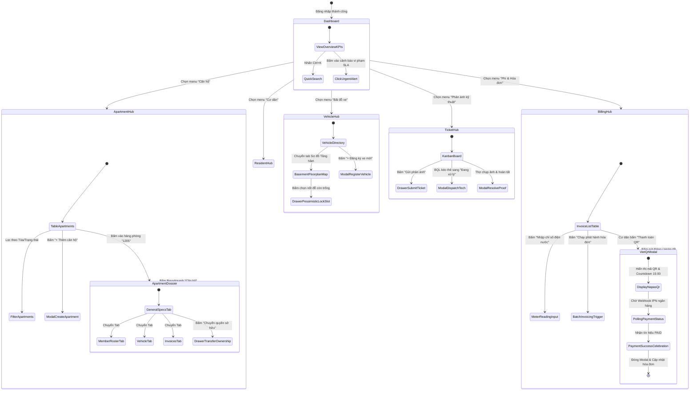

# ResidentHub — UI/UX Specification & Information Architecture
## Comprehensive Information Architecture, Screens Hierarchy & Visual Design System

> **Status:** Approved Architectural Baseline  
> **Audience:** Product Designers, Frontend Engineers, Fullstack Developers, QA/UAT Engineers  
> **Traceability Links:**  
> - 📋 [REQUIREMENTS_INVEST.md](REQUIREMENTS_INVEST.md) (Agile User Stories & INVEST Acceptance Criteria)  
> - 🏛️ [ARCHITECTURE_C4.md](ARCHITECTURE_C4.md) (C4 Container & Component Diagrams)  
> - 🔗 [UI_DATABASE_MAPPING.md](UI_DATABASE_MAPPING.md) (Field-level UI-to-Database Mapping)  
> - 📸 [docs/screenshots/](screenshots/README.md) (Visual Gallery of Production Screens)  
> - 🗄️ [schema.sql](../schema.sql) (PostgreSQL Normalized Relational Schema)

---

## 📑 Mục lục Tài liệu

1. [Tổng quan Nguyên lý Thiết kế & Trải nghiệm Người dùng](#1-tổng-quan-nguyên-lý-thiết-kế--trải-nghiệm-người-dùng)
2. [Hệ thống Cấu trúc Thông tin (Information Architecture - IA)](#2-hệ-thống-cấu-trúc-thông-tin-information-architecture---ia)
   - [2.1. Hệ thống Tổ chức (Organization System)](#21-hệ-thống-tổ-chức-organization-system)
   - [2.2. Hệ thống Nhãn chuẩn hóa (Labeling System)](#22-hệ-thống-nhãn-chuẩn-hóa-labeling-system)
   - [2.3. Hệ thống Điều hướng (Navigation System)](#23-hệ-thống-điều-hướng-navigation-system)
   - [2.4. Hệ thống Tìm kiếm & Bộ lọc (Search & Filter System)](#24-hệ-thống-tìm-kiếm--bộ-lọc-search--filter-system)
   - [2.5. Sơ đồ Cây Cấu trúc Thông tin Toàn diện (Mermaid IA Tree)](#25-sơ-đồ-cây-cấu-trúc-thông-tin-toàn-diện-mermaid-ia-tree)
3. [Phân cấp Màn hình & Luồng Điều hướng (Screens Hierarchy & Flow)](#3-phân-cấp-màn-hình--luồng-điều-hướng-screens-hierarchy--flow)
   - [3.1. Mô hình Phân cấp Màn hình 4 Cấp độ](#31-mô-hình-phân-cấp-màn-hình-4-cấp-độ)
   - [3.2. Sơ đồ Luồng Điều hướng Màn hình (Mermaid Screen Flow)](#32-sơ-đồ-luồng-điều-hướng-màn-hình-mermaid-screen-flow)
   - [3.3. Ma trận Chuyển trạng thái Màn hình (Screen Transition Matrix)](#33-ma-trận-chuyển-trạng-thái-màn-hình-screen-transition-matrix)
   - [3.4. Ma trận Phân quyền Truy cập Màn hình (RBAC Screen Access)](#34-ma-trận-phân-quyền-truy-cập-màn-hình-rbac-screen-access)
4. [Quy chuẩn Thiết kế Giao diện (UI/UX Design Standards)](#4-quy-chuẩn-thiết-kế-giao-diện-uiux-design-standards)
   - [4.1. Design Tokens (Màu sắc, Typography, Spacing, Shadows)](#41-design-tokens-màu-sắc-typography-spacing-shadows)
   - [4.2. Chuẩn hóa 5 Trạng thái Giao diện Cốt lõi (5 Core UI States)](#42-chuẩn-hóa-5-trạng-thái-giao-diện-cốt-lõi-5-core-ui-states)
   - [4.3. Các Mẫu Thành phần Dùng chung (Reusable Component Patterns)](#43-các-mẫu-thành-phần-dùng-chung-reusable-component-patterns)
5. [Bản đồ Ánh xạ Giao diện tới Ảnh Chụp & Mã Nguồn](#5-bản-đồ-ánh-xạ-giao-diện-tới-ảnh-chụp--mã-nguồn)

---

## 1. Tổng quan Nguyên lý Thiết kế & Trải nghiệm Người dùng

Nền tảng **ResidentHub** được xây dựng nhằm phục vụ công tác quản lý đô thị hiện đại và đời sống cư dân chung cư cao tầng. Thiết kế UI/UX tuân thủ 4 nguyên lý cốt lõi:

1. **Hiệu năng & Tối giản thao tác (Task Efficiency First):** Giảm thiểu số lần nhấp chuột cho Ban Quản lý. Mọi thao tác thường nhật (tìm căn hộ, tra CCCD, duyệt đơn tạm trú, gạch nợ hóa đơn) phải hoàn thành trong vòng tối đa **3 thao tác**.
2. **Minh bạch Dữ liệu Tài chính & Pháp lý:** Số liệu tiền tệ, diện tích m², sản lượng điện nước lũy tiến và biển số xe luôn được trình bày rõ ràng kèm đơn vị đo chuẩn, hạn chế tối đa nhầm lẫn khi kế toán xuất hóa đơn.
3. **Phản hồi Tức thời & Chống xung đột (Optimistic & Concurrency-Safe UI):** 
   - Với các hành động duyệt đơn, cập nhật trạng thái: Hệ thống cập nhật giao diện ngay lập tức (*Optimistic Update*).
   - Với các tài nguyên hữu hạn (nốt đỗ xe ô tô, chỉ số chốt sổ): Giao diện có cơ chế hiển thị trạng thái khóa (*Pessimistic concurrency indicators*), ngăn chặn hai nhân viên gán trùng một vị trí.
4. **Không để người dùng bế tắc (Zero Dead-Ends):** Mọi màn hình trống (*Empty State*) hoặc màn hình lỗi (*Error State*) đều phải có lời chỉ dẫn nghiệp vụ rõ ràng cùng nút bấm hành động chuyển tiếp (*Actionable CTA*).

---

## 2. Hệ thống Cấu trúc Thông tin (Information Architecture - IA)

### 2.1. Hệ thống Tổ chức (Organization System)

Hệ thống cấu trúc thông tin của ResidentHub kết hợp giữa **Tổ chức theo Phân hệ Nghiệp vụ (Topic-based)** và **Tổ chức theo Vai trò Người dùng (Role-based)**:

- **Nhóm Vận hành Bất động sản (Physical Property):** Quản lý Tòa nhà $\rightarrow$ Tầng $\rightarrow$ Căn hộ $\rightarrow$ Hồ sơ quyền sở hữu và hợp đồng.
- **Nhóm Dân cư & Nhân khẩu (Civil Registry):** Quản lý Hộ gia đình $\rightarrow$ Sổ hộ khẩu $\rightarrow$ Nhân khẩu $\rightarrow$ Biến động cư trú (Tạm trú / Tạm vắng / Chuyển đi).
- **Nhóm Hạ tầng Bãi đỗ (Parking Infrastructure):** Quản lý Mặt bằng tầng hầm B1/B2 $\rightarrow$ Danh mục Nốt đỗ $\rightarrow$ Phương tiện (Ô tô/Xe máy) $\rightarrow$ Thẻ từ RFID.
- **Nhóm Kế toán & Dịch vụ (Finance & Invoicing):** Quản lý Đo lường chỉ số điện nước $\rightarrow$ Đợt phát hành hóa đơn tổng hợp $\rightarrow$ Phiên thanh toán VietQR động $\rightarrow$ Biên lai gạch nợ.
- **Nhóm Kỹ thuật & Phản ánh (Maintenance SLA):** Tiếp nhận sự cố $\rightarrow$ Điều phối Kỹ thuật viên $\rightarrow$ Nghiệm thu hiện trường $\rightarrow$ Leo thang giám sát hạn xử lý SLA.
- **Nhóm Quản trị & Cấu hình (System Administration):** Tài khoản người dùng $\rightarrow$ Bảng phân quyền RBAC $\rightarrow$ Cấu hình bảng giá định mức phí $\rightarrow$ Nhật ký kiểm toán an toàn.

---

### 2.2. Hệ thống Nhãn chuẩn hóa (Labeling System)

Để bảo đảm tính nhất quán trên toàn bộ giao diện và tài liệu hướng dẫn sử dụng, các thuật ngữ được chuẩn hóa theo hệ thống từ vựng hành chính đô thị Việt Nam:

| Thuật ngữ Giao diện | Mã Entity SQL | Tiếng Anh Kỹ thuật | Ý nghĩa Nghiệp vụ & Phạm vi Áp dụng |
| :--- | :--- | :--- | :--- |
| **Căn hộ** | `apartments` | Apartment Unit | Căn hộ vật lý (ví dụ: Phòng 1205, Tòa A, Tầng 12). |
| **Chủ sở hữu** | `owners` | Legal Owner | Thể nhân đứng tên sổ hồng/hợp đồng mua bán căn hộ. |
| **Sổ hộ khẩu** | `households` | Household Registry | Mã định danh quản lý hộ gia đình sinh sống (ví dụ: `HK-1205`). |
| **Chủ hộ** | `head_resident_id` | Household Head | Người đại diện duy nhất chịu trách nhiệm pháp lý của hộ dân. |
| **Nhân khẩu** | `household_members` | Household Member | Thành viên thường trú/tạm trú có quan hệ với chủ hộ. |
| **Biến động cư trú**| `residence_records`| Residence Movement | Khai báo pháp lý: Tạm trú (`TAM_TRU`), Tạm vắng (`TAM_VANG`). |
| **Nốt đỗ xe** | `parking_slots` | Parking Bay/Slot | Vị trí đỗ cố định dưới tầng hầm (ví dụ: `B1-A01`, `B2-C15`). |
| **Hạn ngạch xe** | `quota` | Vehicle Quota | Hạn mức cho phép: Tối đa 1 ô tô và 2 xe máy cho mỗi căn hộ. |
| **Chỉ số tiêu thụ** | `meter_readings` | Utility Meter Read | Số điện (kWh) và số nước (m³) đo được chốt cuối tháng. |
| **Hóa đơn dịch vụ** | `invoices` | Monthly Invoice | Bảng kê tổng hợp nghĩa vụ tài chính tháng của căn hộ. |
| **Mã VietQR động** | `payment_sessions` | Dynamic VietQR | Mã QR thanh toán Napas 247 mã hóa sẵn số tiền và mã hóa đơn. |
| **Phiếu sự cố** | `feedbacks` | Incident Ticket | Yêu cầu báo hỏng hoặc phản ánh dân sinh gửi tới Ban Quản lý. |
| **Cam kết SLA** | `sla_status` | Service Level Agreement | Thời hạn cam kết xử lý: Khẩn cấp (4 giờ), Tiêu chuẩn (24 giờ). |

---

### 2.3. Hệ thống Điều hướng (Navigation System)

Hệ thống điều hướng bao gồm 4 tầng thành phần:

1. **Global Sidebar Menu (Thanh Điều hướng Toàn cục):**
   - Nằm cố định bên trái màn hình (độ rộng 260px trên Desktop, thu gọn dạng drawer trượt trên Mobile/Tablet).
   - Tự động lọc các mục menu dựa trên vai trò người dùng đăng nhập (`ADMIN`, `MANAGER`, `TECHNICIAN`, `RESIDENT`).
   - Có badge hiển thị số lượng công việc chờ xử lý (ví dụ: số đơn cư trú chờ duyệt, số phiếu báo hỏng khẩn cấp).
2. **Contextual Breadcrumb Bar (Thanh Điều hướng Phân tầng):**
   - Hiển thị vị trí phân cấp hiện tại: `Bàn làm việc > Căn hộ > Chi tiết Căn hộ 1205`.
   - Giúp người dùng dễ dàng lùi lại cấp cha chỉ bằng một lần bấm.
3. **Local Segmented Tabs (Hệ thống Thẻ Phân vùng):**
   - Sử dụng trong các màn hình chi tiết chuyên sâu (*Dossier Views*).
   - Ví dụ tại màn hình Chi tiết Căn hộ: gồm 4 tabs: `[Thông tin chung]`, `[Danh sách Nhân khẩu]`, `[Phương tiện & Nốt đỗ]`, `[Lịch sử Phí & Hóa đơn]`.
4. **Quick Action Floating Bar & Command Palette (`Ctrl + K`):**
   - Hộp thoại tìm kiếm nhanh toàn cầu cho phép gõ mã phòng (ví dụ `1205`), số CCCD hoặc biển số xe để nhảy ngay tới trang chi tiết mà không cần điều hướng thủ công.

---

### 2.4. Hệ thống Tìm kiếm & Bộ lọc (Search & Filter System)

Mọi danh sách dữ liệu trong hệ thống đều được tích hợp thanh công cụ lọc đa chiều đồng nhất:

- **Ô Tìm kiếm Từ khóa (Omni Search Box):** Tự động debounce 300ms, hỗ trợ tìm kiếm không dấu/có dấu tiếng Việt.
- **Bộ lọc Trạng thái Nhanh (Status Chips):** Cho phép bấm chọn nhanh giữa `Tất cả`, `Đang hoạt động`, `Chờ phê duyệt`, `Quá hạn`.
- **Bộ lọc Dropdown Kết hợp (Multi-faceted Dropdowns):**
  - Lọc theo Tòa nhà (`Tất cả`, `Tòa A`, `Tòa B`).
  - Lọc theo Tầng (`Tất cả`, `Tầng 1-10`, `Tầng 11-20`, `Tầng 21-30`).
  - Lọc theo Khoảng thời gian (*Date Range Picker* cho ngày nộp đơn, kỳ hóa đơn).
- **Nút "Đặt lại bộ lọc" (Reset Filters):** Xóa toàn bộ điều kiện lọc và đưa bảng về trạng thái mặc định ban đầu.

---

### 2.5. Sơ đồ Cây Cấu trúc Thông tin Toàn diện (Mermaid IA Tree)

```mermaid
graph TD
    ROOT["🏛️ ResidentHub Root Portal"]

    %% Dashboard Console
    ROOT --> DASH["📊 Bàn làm việc Điều hành (/page.tsx)<br/>- KPI Tỷ lệ Lấp đầy<br/>- Doanh thu Thu phí Tháng<br/>- Biểu đồ Cân đối Nốt đỗ Tầng hầm<br/>- Danh sách Việc cần xử lý Khẩn cấp"]

    %% Căn hộ Subsystem
    ROOT --> APT["🏢 Quản lý Căn hộ (/can-ho)<br/>- Danh mục Căn hộ dạng Grid & Table<br/>- Bộ lọc Tòa nhà, Tầng, Trạng thái"]
    APT --> APT_NEW["➕ Modal Thêm Căn hộ Mới"]
    APT --> APT_DETAIL["🔍 Hồ sơ Chi tiết Căn hộ (/can-ho/[roomNumber])"]
    APT_DETAIL --> APT_TAB_INFO["Tab 1: Mặt bằng & Diện tích"]
    APT_DETAIL --> APT_TAB_MEM["Tab 2: Nhân khẩu Hộ dân"]
    APT_DETAIL --> APT_TAB_VEH["Tab 3: Phương tiện & Nốt đỗ"]
    APT_DETAIL --> APT_TAB_BILL["Tab 4: Lịch sử Thu nợ & Phí"]
    APT_DETAIL --> APT_ACT_OWNER["Drawer: Chuyển nhượng Chủ quyền"]

    %% Cư dân Subsystem
    ROOT --> RES["👥 Cư dân & Hộ khẩu (/cu-dan)<br/>- Danh bạ Nhân khẩu Toàn khu<br/>- Tra cứu số CCCD 12 số"]
    RES --> RES_MODAL_ADD["➕ Modal Thêm Nhân khẩu"]
    RES --> RES_MODAL_HEAD["🔄 Modal Chuyển giao Chủ hộ"]

    %% Cư trú Subsystem
    ROOT --> STAY["📋 Biến động Cư trú (/cu-tru)<br/>- Khai báo Tạm trú trực tuyến<br/>- Khai báo Tạm vắng trực tuyến"]
    STAY --> STAY_HIST["📜 Sổ Lịch sử Cư trú (/lich-su-cu-tru)<br/>- Thẩm tra & Phê duyệt Hồ sơ BQL<br/>- Xuất Báo cáo Công an Phường"]

    %% Phương tiện Subsystem
    ROOT --> VEH["🚗 Phương tiện & Bãi đỗ (/phuong-tien-va-bai-do)<br/>- Giám sát Quota căn hộ<br/>- Bản đồ Nốt đỗ Tầng hầm B1/B2<br/>- Cấp phát thẻ từ RFID"]
    VEH --> VEH_MODAL_REG["➕ Modal Đăng ký Xe mới"]
    VEH --> VEH_MODAL_SLOT["🅿️ Drawer Cấp nốt đỗ Bi quan"]

    %% Tài chính Subsystem
    ROOT --> FIN["💳 Tài chính & Hóa đơn (/phi-chung-cu)<br/>- Bảng chốt Chỉ số Điện nước<br/>- Lập Đợt Hóa đơn Batch ngày 25<br/>- Theo dõi Công nợ Quá hạn"]
    FIN --> FIN_MODAL_QR["📱 Modal Thanh toán VietQR Động"]
    FIN --> FIN_MODAL_METER["⚡ Modal Nhập Chỉ số Điện Nước"]

    %% Phản ánh Subsystem
    ROOT --> TKT["🔧 Phản ánh & Kỹ thuật (/phan-anh-va-yeu-cau)<br/>- Bảng Kanban Tiến độ Xử lý<br/>- Theo dõi Đồng hồ Đếm ngược SLA"]
    TKT --> TKT_DRAWER_NEW["➕ Drawer Gửi Báo hỏng kèm Ảnh"]
    TKT --> TKT_MODAL_DISPATCH["👷 Modal Điều phối Thợ Kỹ thuật"]
    TKT --> TKT_MODAL_RESOLVE["📸 Modal Nghiệm thu & Chụp ảnh"]

    %% Quản trị Subsystem
    ROOT --> ADM["⚙️ Cấu hình & Quản trị (/cai-dat, /nguoi-dung)<br/>- Danh sách Tài khoản & RBAC 4 Cấp<br/>- Cấu hình Biểu phí Lũy tiến<br/>- Nhật ký Kiểm toán Audit Logs"]

    classDef rootStyle fill:#1e3a8a,color:#fff,stroke:#1d4ed8,stroke-width:3px;
    classDef hubStyle fill:#0284c7,color:#fff,stroke:#0369a1,stroke-width:2px;
    classDef detailStyle fill:#0d9488,color:#fff,stroke:#0f766e,stroke-width:2px;
    classDef actionStyle fill:#475569,color:#fff,stroke:#334155,stroke-width:1px;

    class ROOT rootStyle;
    class DASH,APT,RES,STAY,VEH,FIN,TKT,ADM hubStyle;
    class APT_DETAIL,STAY_HIST detailStyle;
    class APT_NEW,APT_TAB_INFO,APT_TAB_MEM,APT_TAB_VEH,APT_TAB_BILL,APT_ACT_OWNER,RES_MODAL_ADD,RES_MODAL_HEAD,STAY_HIST,VEH_MODAL_REG,VEH_MODAL_SLOT,FIN_MODAL_QR,FIN_MODAL_METER,TKT_DRAWER_NEW,TKT_MODAL_DISPATCH,TKT_MODAL_RESOLVE actionStyle;
```



---

## 3. Phân cấp Màn hình & Luồng Điều hướng (Screens Hierarchy & Flow)

### 3.1. Mô hình Phân cấp Màn hình 4 Cấp độ

Hệ thống màn hình ResidentHub được phân chia thành 4 cấp độ phân cấp rõ rệt:

```
[Level 0: Command Console]
       │
       ├──> [Level 1: Domain Hubs]
       │           │
       │           ├──> [Level 2: Dossier Views]
       │           │           │
       │           │           └──> [Level 3: Action Modals & Drawers]
       │           │
       │           └──> [Level 3: Batch Actions & Global Creation Modals]
```

- **Cấp độ 0 (Level 0 — Command Console):** Trang đích chính (`/page.tsx`). Nơi tổng hợp các chỉ số KPI vận hành, biểu đồ công nợ, bản đồ sức chứa tầng hầm và các cảnh báo khẩn cấp cần hành động ngay.
- **Cấp độ 1 (Level 1 — Domain Hubs):** Các trung tâm danh mục chính (`/can-ho`, `/cu-dan`, `/phuong-tien-va-bai-do`, `/phi-chung-cu`, `/phan-anh-va-yeu-cau`). Trình bày dữ liệu dạng Bảng (*Data Table*) hoặc Lưới (*Grid Card*) kèm bộ lọc đa tiêu chí, phân trang và các nút tác vụ tổng hợp.
- **Cấp độ 2 (Level 2 — Dossier Views):** Màn hình hồ sơ chi tiết đối tượng đơn lẻ (`/can-ho/[roomNumber]`, trang chi tiết phiếu sự cố). Trình bày toàn bộ thông tin 360 độ của một thực thể, kết hợp dữ liệu đa bảng qua các tab con.
- **Cấp độ 3 (Level 3 — Action Modals & Drawers):** Các cửa sổ biểu mẫu tác vụ trượt hoặc pop-up (Modal đăng ký xe, Drawer nộp báo hỏng, Modal quét mã VietQR). Màn hình này không làm mất ngữ cảnh của màn hình cha bên dưới.

---

### 3.2. Sơ đồ Luồng Điều hướng Màn hình (Mermaid Screen Flow)



---

### 3.3. Ma trận Chuyển trạng thái Màn hình (Screen Transition Matrix)

| Màn hình Nguồn | Hành động Kích hoạt (Trigger) | Màn hình / Component Đích | Kiểu Điều hướng | Dữ liệu Truyền tải qua Context/URL | Hành vi Hủy / Quay lại |
| :--- | :--- | :--- | :--- | :--- | :--- |
| **Dashboard (`/`)** | Bấm dòng căn hộ trong danh sách | `/can-ho/[roomNumber]` | Client Route Transition | `roomNumber` trên URL slug | Quay lại Dashboard qua Breadcrumb |
| **Dashboard (`/`)** | Bấm thẻ cảnh báo SLA khẩn | `/phan-anh-va-yeu-cau` | Client Route Transition | `?filter=URGENT&status=PENDING` | Quay lại Dashboard qua Breadcrumb |
| **`/can-ho`** | Bấm nút `"+ Thêm căn hộ"` | `ApartmentCreateModal` | Modal Pop-up (Overlay) | None | Bấm nút "Hủy" hoặc click backdrop |
| **`/can-ho/[roomNumber]`**| Bấm nút `"Chuyển quyền sở hữu"` | `OwnershipTransferDrawer`| Slide-over Drawer (Phải)| `apartmentId`, `currentOwner` | Bấm dấu "X" góc phải |
| **`/cu-dan`** | Bấm nút `"+ Thêm nhân khẩu"` | `ResidentRegisterModal` | Modal Pop-up | `householdId` | Bấm "Hủy" đóng modal |
| **`/cu-dan`** | Bấm icon `"Chuyển chủ hộ"` | `HouseholdHeadTransferModal`| Confirm Dialog | `currentHeadId`, `householdMembers` | Bấm "Hủy bỏ" giữ nguyên chủ hộ |
| **`/phuong-tien-va-bai-do`**| Bấm nút `"+ Đăng ký xe"` | `VehicleRegisterModal` | Modal Pop-up | `apartmentList` | Bấm "Hủy" |
| **`/phuong-tien-va-bai-do`**| Click vào ô nốt đỗ màu xanh | `SlotAllocationDrawer` | Drawer Panel | `slotCode`, `buildingId` | Bấm "Đóng" nhả khóa bi quan |
| **`/phi-chung-cu`** | Bấm nút `"Thanh toán VietQR"` | `VietQrPaymentModal` | Centered Modal | `invoiceId`, `amount`, `orderCode` | Bấm "Đóng" (phiên QR tự hủy sau 15p)|
| **`/phi-chung-cu`** | Bấm `"Ghi chỉ số đồng hồ"` | `MeterReadingBatchModal`| Fullscreen Modal | `billingPeriod` (Tháng/Năm) | Bấm "Lưu tạm" hoặc "Thoát" |
| **`/phan-anh-va-yeu-cau`**| Bấm `"+ Gửi phản ánh"` | `TicketSubmitDrawer` | Drawer Panel | `residentApartmentId` | Bấm "Hủy" |
| **`/phan-anh-va-yeu-cau`**| Bấm `"Điều phối kỹ thuật"` | `TicketDispatchModal` | Modal Pop-up | `ticketId`, `specialtyType` | Bấm "Đóng" |

---

### 3.4. Ma trận Phân quyền Truy cập Màn hình (RBAC Screen Access)

Hệ thống phân chia 4 mức quyền: **`V` (View - Xem)**, **`C` (Create - Tạo mới)**, **`U` (Update - Cập nhật/Sửa)**, **`D` (Delete/Revoke - Xóa/Hủy)**:

| Đường dẫn URL Màn hình | Tên Phân hệ Giao diện | `ADMIN` (Quản trị) | `MANAGER` (Ban Quản lý) | `TECHNICIAN` (Kỹ thuật) | `RESIDENT` (Cư dân) |
| :--- | :--- | :---: | :---: | :---: | :---: |
| **`/`** | Bàn làm việc Điều hành | **V, C, U, D** | **V, C, U, D** | **V** (Chỉ số kỹ thuật) | **V** (Chỉ số cá nhân căn hộ) |
| **`/can-ho`** | Danh mục & Hồ sơ Căn hộ | **V, C, U, D** | **V, C, U** | **V** (Chỉ đọc) | **V** (Chỉ căn hộ của mình) |
| **`/can-ho/[roomNumber]`** | Chi tiết Hồ sơ Căn hộ 360 | **V, C, U, D** | **V, C, U** | **V** (Chỉ đọc thông số) | **V** (Chỉ xem căn hộ mình ở) |
| **`/cu-dan`** | Danh bạ Cư dân & Sổ hộ khẩu | **V, C, U, D** | **V, C, U, D** | ❌ Chặn truy cập | **V** (Chỉ xem hộ gia đình mình) |
| **`/cu-tru`** | Khai báo Tạm trú / Tạm vắng | **V, U, D** | **V, U, D** (Duyệt) | ❌ Chặn truy cập | **V, C** (Tự nộp đơn khai báo) |
| **`/lich-su-cu-tru`** | Sổ theo dõi Biến động & Công an| **V, U, D** | **V, U** (Phê duyệt) | ❌ Chặn truy cập | ❌ Chặn truy cập |
| **`/phuong-tien-va-bai-do`** | Phương tiện & Bãi đỗ xe | **V, C, U, D** | **V, C, U, D** | **V** (Tra cứu biển số) | **V, C** (Đăng ký xe căn hộ) |
| **`/phi-chung-cu`** | Quản lý Phí, Hóa đơn & VietQR| **V, C, U, D** | **V, C, U** (Chốt sổ) | **V, U** (Nhập chỉ số) | **V, U** (Xem & Quét VietQR trả) |
| **`/phan-anh-va-yeu-cau`** | Phản ánh Sự cố & Kỹ thuật SLA | **V, C, U, D** | **V, U, D** (Điều phối) | **V, U** (Nghiệm thu ảnh) | **V, C** (Gửi phản ánh & đánh giá)|
| **`/nguoi-dung`** | Quản lý Tài khoản & Phân quyền | **V, C, U, D** | ❌ Chặn truy cập | ❌ Chặn truy cập | ❌ Chặn truy cập |
| **`/cai-dat`** | Cấu hình Biểu phí & Audit Log | **V, C, U, D** | **V** (Chỉ đọc biểu phí)| ❌ Chặn truy cập | ❌ Chặn truy cập |

---

## 4. Quy chuẩn Thiết kế Giao diện (UI/UX Design Standards)

### 4.1. Design Tokens

Nền tảng sử dụng hệ thống Design Tokens tương thích với **Tailwind CSS v4** và chuẩn thiết kế giao diện hiện đại:

#### Bảng Màu (Color Palette)
- **Primary Brand (Sắc xanh Chủ đạo):**
  - `primary-50`: `#eff6ff` (Nền badge nhẹ, highlight hàng được chọn)
  - `primary-500`: `#3b82f6` (Đường viền focus, icon trạng thái)
  - `primary-600`: `#2563eb` (Màu nút bấm chính Primary CTA)
  - `primary-700`: `#1d4ed8` (Trạng thái hover của nút bấm)
  - `primary-900`: `#1e3a8a` (Nền thanh Sidebar điều hướng toàn cục)
- **Semantic Status (Màu Trạng thái Nghiệp vụ):**
  - **Thành công / Trống (Success/Available):** Emerald Green (`#059669` / `#d1fae5`) — Dùng cho hóa đơn đã thanh toán (`PAID`), nốt đỗ còn trống (`AVAILABLE`), hồ sơ đã duyệt (`APPROVED`).
  - **Cảnh báo / Chờ duyệt (Warning/Pending):** Amber Gold (`#d97706` / `#fef3c7`) — Dùng cho hóa đơn chưa trả (`UNPAID`), đơn chờ duyệt (`PENDING`), chỉ số bất thường (`ANOMALY`).
  - **Nguy hiểm / Quá hạn / Đã chiếm (Danger/Overdue/Occupied):** Rose Red (`#e11d48` / `#ffe4e6`) — Dùng cho hóa đơn quá hạn (`OVERDUE`), nốt đỗ đã có xe (`OCCUPIED`), cảnh báo vi phạm SLA (`SLA_BREACHED`).
  - **Trung tính / Đã hủy (Neutral/Muted):** Slate Gray (`#64748b` / `#f1f5f9`) — Dùng cho xe đã hủy (`REVOKED`), tài khoản bị khóa (`INACTIVE`).

#### Typography & Scale
- **Font chữ:** `Inter`, `Roboto`, hệ thống sans-serif tiêu chuẩn tối ưu độ đọc số liệu.
- **Tỷ lệ hiển thị chữ:**
  - `text-xs` (11px): Dùng cho nhãn metadata phụ, thời gian timestamp, badge nốt đỗ.
  - `text-sm` (13px): Dùng cho chữ trong bảng dữ liệu, nhãn form nhập liệu, breadcrumbs.
  - `text-base` (15px): Dùng cho nội dung đọc chính, mô tả thẻ card.
  - `text-lg` / `text-xl` (18px - 20px): Dùng cho tiêu đề card, mã phòng căn hộ lớn.
  - `text-2xl` / `text-3xl` (24px - 30px): Dùng cho chỉ số KPI tiền tệ tổng hợp tại Dashboard.

#### Bố cục & Lưới (Layout & Spacing Grid)
- **Lưới tổng thể:** 12 cột linh hoạt (`grid-cols-12`).
- **Khoảng cách tiêu chuẩn (Spacing):** Bước nhảy 4px: `gap-4` (16px), `gap-6` (24px).
- **Bo góc (Border Radius):** `rounded-lg` (8px) cho input form; `rounded-xl` (12px) cho card và nút bấm; `rounded-2xl` (16px) cho Modal Pop-up và KPI Cards.
- **Đổ bóng (Elevation Shadow):** `shadow-sm` cho hàng trong bảng; `shadow-lg` cho card nổi; `shadow-2xl` cho Modal hộp thoại và thanh Quick Action.

---

### 4.2. Chuẩn hóa 5 Trạng thái Giao diện Cốt lõi (5 Core UI States)

Mọi màn hình và thành phần dữ liệu trong ResidentHub đều bắt buộc phải hiện thực đủ 5 trạng thái:

```
┌─────────────────┐       ┌─────────────────┐       ┌─────────────────┐
│ 1. Loading      │ ----> │ 2. Ideal State  │ ----> │ 3. Partial /    │
│    Skeleton     │       │    (Đầy đủ Data)│       │    Warning State│
└─────────────────┘       └─────────────────┘       └─────────────────┘
         │                         │
         v                         v
┌─────────────────┐       ┌─────────────────┐
│ 4. Empty State  │       │ 5. Error State  │
│    (Chưa có dữ  │       │    (RFC 7807    │
│     liệu + CTA) │       │     Fallback)   │
└─────────────────┘       └─────────────────┘
```

1. **Trạng thái Đang tải (Loading Skeleton State):**
   - Tuyệt đối không dùng vòng quay Spinner đơn điệu chặn toàn màn hình.
   - Sử dụng **Skeleton Shimmer Cards** có hình dáng và kích thước chiều cao khớp 100% với bảng hoặc card thực tế, bảo đảm chỉ số dịch chuyển layout tích lũy **CLS = 0** (*Cumulative Layout Shift*).
2. **Trạng thái Lý tưởng (Ideal / Loaded State):**
   - Dữ liệu hiển thị đầy đủ, căn lề khoa học (căn trái cho chuỗi văn bản, căn phải cho số tiền/diện tích, căn giữa cho chip trạng thái).
   - Tích hợp hiệu ứng *Hover Subtle Highlight* giúp mắt người dùng dễ dàng theo dõi dòng dữ liệu khi rà chuột.
3. **Trạng thái Trống (Empty State):**
   - Hiển thị khi không có bản ghi nào (hoặc kết quả tìm kiếm không trùng khớp).
   - Bao gồm 3 thành phần bắt buộc:
     1. Icon đồ họa ngữ cảnh mờ nhạt (ví dụ icon xe hơi gạch chéo khi không có phương tiện).
     2. Tiêu đề và dòng giải thích thân thiện (ví dụ: *"Căn hộ này chưa đăng ký phương tiện nào"*).
     3. Nút bấm kêu gọi hành động (*Primary CTA Button*, ví dụ: `"+ Đăng ký xe mới ngay"`).
4. **Trạng thái Lỗi (Error / Fallback State):**
   - Tuân thủ cấu trúc lỗi chuẩn **RFC 7807 Problem Details**.
   - Trình bày trực quan với icon tam giác cảnh báo màu đỏ, thông điệp lỗi bằng tiếng Việt dễ hiểu (ví dụ: *"Không thể kết nối đến máy chủ cơ sở dữ liệu. Mã lỗi: ERR_DB_TIMEOUT"*).
   - Cung cấp nút `"Thử lại (Retry)"` và nút `"Quay về trang chủ"`.
5. **Trạng thái Cảnh báo Bán phần (Partial / Warning State):**
   - Kích hoạt khi có hiện tượng bất thường nhưng hệ thống vẫn hoạt động:
     - Banner màu vàng trên cùng: *"Công suất bãi đỗ xe ô tô tầng hầm B1 đã đạt 95% (Còn trống 4 nốt)"*.
     - Chip cảnh báo trên dòng chỉ số: *"Chỉ số nước tháng này tăng 420% so với tháng trước. Cần kiểm tra rò rỉ"*.

---

### 4.3. Các Mẫu Thành phần Dùng chung (Reusable Component Patterns)

#### Pattern 1: Bảng Dữ liệu Đa năng (AppDataTable Pattern)
- Header cố định (*Sticky Header*) khi cuộn trang dài.
- Cột đầu tiên có hộp chọn Checkbox để thực hiện thao tác hàng loạt (*Batch actions: In hàng loạt, Gửi email nhắc nợ hàng loạt*).
- Cột cuối cùng chứa nút hành động ngữ cảnh `[...]` trỏ tới menu thao tác nhanh (*Xem chi tiết, Sửa, Xóa*).
- Thanh phân trang ở chân bảng (*Pagination Bar*): Hiển thị tổng số bản ghi, nút chọn số dòng/trang (10, 25, 50) và nút chuyển trang.

#### Pattern 2: Modal Thanh toán VietQR Động (VietQrPaymentModal Pattern)
- **Đầu modal:** Hiển thị số tiền to rõ màu xanh lá và mã hóa đơn tương ứng.
- **Khu vực trung tâm:**
  - Khung ảnh mã VietQR Napas 247 sắc nét độ phân giải cao.
  - Huy hiệu ngân hàng thụ hưởng (MB Bank) kèm số tài khoản và tên thụ hưởng.
  - Nút bấm `"Sao chép nội dung chuyển khoản"` nhanh tiện lợi.
- **Đồng hồ đếm ngược:** Thanh tiến trình đếm ngược 15 phút. Khi hết hạn, mã QR tự động mờ đi kèm nút `"Tạo lại mã thanh toán mới"`.
- **Cơ chế Polling:** Tự động gọi kiểm tra trạng thái gạch nợ mỗi 3 giây. Khi nhận tín hiệu thanh toán thành công, màn hình lập tức kích hoạt hiệu ứng pháo hoa chúc mừng và tự động đóng modal.

#### Pattern 3: Sơ đồ Mặt bằng Nốt đỗ Tầng hầm (Floorplan Slot Grid)
- Trình bày dạng sơ đồ trực quan chia theo 2 phân khu: Tầng hầm B1 (Ô tô) và Tầng hầm B2 (Xe máy).
- Mỗi nốt đỗ là một ô chữ nhật có mã định danh (ví dụ `B1-01`), phân màu rõ rệt:
  - Màu xanh lá nhạt + Viền xanh lá: Nốt còn trống (`AVAILABLE`), click vào để mở drawer gán xe.
  - Màu đỏ nhạt + Viền đỏ: Nốt đã có xe đỗ (`OCCUPIED`), hiển thị biển số xe đè lên trên.
  - Màu vàng cam: Nốt đang được nhân viên khác mở giữ chỗ (*Locked by Concurrency*).
  - Màu xám sọc: Nốt đang bảo trì hạ tầng (`MAINTENANCE`).

---

## 5. Bản đồ Ánh xạ Giao diện tới Ảnh Chụp & Mã Nguồn

| Màn hình / Phân hệ Giao diện | Đường dẫn Route Mã Nguồn | File Ảnh Chụp Thực tế trong Repo | Tài liệu CSDL Tương ứng |
| :--- | :--- | :--- | :--- |
| **Bàn làm việc Điều hành** | `app/page.tsx` | [`docs/screenshots/dashboard.png`](screenshots/dashboard.png) | [UI_DATABASE_MAPPING.md §0](UI_DATABASE_MAPPING.md) |
| **Danh mục Quản lý Căn hộ** | `app/can-ho/page.tsx` | [`docs/screenshots/apartments.png`](screenshots/apartments.png) | [UI_DATABASE_MAPPING.md §1](UI_DATABASE_MAPPING.md#1-apartments-management-view-can-ho-can-horoomnumber) |
| **Hồ sơ Chi tiết Căn hộ 360**| `app/can-ho/[roomNumber]/page.tsx`| [`docs/screenshots/apartment_detail.png`](screenshots/apartment_detail.png) | [UI_DATABASE_MAPPING.md §1](UI_DATABASE_MAPPING.md#1-apartments-management-view-can-ho-can-horoomnumber) |
| **Danh bạ Cư dân & Hộ khẩu** | `app/cu-dan/page.tsx` | [`docs/screenshots/residents.png`](screenshots/residents.png) | [UI_DATABASE_MAPPING.md §2](UI_DATABASE_MAPPING.md#2-residents--household-roster-view-cu-dan) |
| **Khai báo & Biến động Cư trú**| `app/cu-tru/page.tsx` | [`docs/screenshots/residents.png`](screenshots/residents.png) | [UI_DATABASE_MAPPING.md §3](UI_DATABASE_MAPPING.md#3-stay-declarations--audit-history-cu-tru-lich-su-cu-tru) |
| **Phương tiện & Bãi đỗ xe** | `app/phuong-tien-va-bai-do/page.tsx`| [`docs/screenshots/vehicles.png`](screenshots/vehicles.png) | [UI_DATABASE_MAPPING.md §4](UI_DATABASE_MAPPING.md#4-vehicles--parking-management-view-phuong-tien-va-bai-do) |
| **Tài chính, Hóa đơn & VietQR**| `app/phi-chung-cu/page.tsx` | [`docs/screenshots/billing.png`](screenshots/billing.png) | [UI_DATABASE_MAPPING.md §5](UI_DATABASE_MAPPING.md#5-utility-meters-invoices--payments-view-phi-chung-cu) |
| **Phản ánh Sự cố & Kỹ thuật**| `app/phan-anh-va-yeu-cau/page.tsx` | [`docs/screenshots/tickets.png`](screenshots/tickets.png) | [UI_DATABASE_MAPPING.md §6](UI_DATABASE_MAPPING.md#6-service-requests--tickets-view-phan-anh-va-yeu-cau) |
| **Quản trị Người dùng & Cài đặt**| `app/nguoi-dung/page.tsx`, `app/cai-dat/page.tsx`| *Đồng bộ cấu hình chung* | [UI_DATABASE_MAPPING.md §7](UI_DATABASE_MAPPING.md#7-system-users--rbac-view-nguoi-dung-cai-dat) |
