# ResidentHub - Use Case Specifications & Business Journeys
## Complete UML Functional Catalog, End-to-End Journeys & Fully-Dressed Specifications

> **Audience:** Product Owners, System Architects, QA/Test Engineers, Fullstack Developers  
> **Traceability Links:**  
> - 🏛️ [ARCHITECTURE_C4.md](ARCHITECTURE_C4.md) (Context, Container, Components & Runtime Failure Twins)  
> - 📘 [ARCHITECTURE_ARC42.md](ARCHITECTURE_ARC42.md) (IEEE 42010 12-Section Architecture Dossier)  
> - ⚙️ [SYSTEM_WORKFLOWS_AND_SPECS.md](SYSTEM_WORKFLOWS_AND_SPECS.md) (State Machines & RBAC Matrix)  
> - 🔗 [UI_DATABASE_MAPPING.md](UI_DATABASE_MAPPING.md) (Field-level UI-to-Database Mapping)  
> - 🗄️ [database/schema.sql](../database/schema.sql) / [database/schema.dbml](../database/schema.dbml) (18-Table Normalized Schema)

---

## 1. Actor Hierarchy & Catalog (UML Actor Hierarchy)

In standard UML modeling, an **Actor** is an external entity that interacts directly with the system to execute use cases. The ResidentHub platform distinguishes between:
- **Human Actors:** Inheriting from the base actor `SystemUser` (authenticated users with active session credentials).
- **External System Actors:** Automated third-party gateways and services communicating via Webhook / API protocols.

### 1.1. UML Actor Generalization Diagram

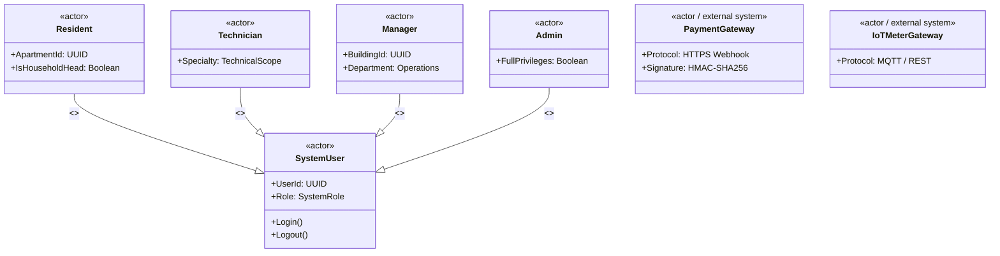

### 1.2. Actor Catalog

| Actor Code | Actor Name | Classification | Primary System Responsibilities |
| :--- | :--- | :--- | :--- |
| **`ACT-RES`** | **Resident (Tenant / Household Head)** | Primary Human Actor | Declares residence changes, registers vehicles, views and settles monthly invoices, submits maintenance complaints. |
| **`ACT-TECH`** | **Technician (Maintenance Engineer)** | Primary Human Actor | Receives repair tickets, updates on-site resolution progress, logs utility meter index readings. |
| **`ACT-MGR`** | **Manager (Building Management / Accountant)** | Secondary Human Actor | Approves residency shifts, allocates parking bays, audits meter indexes, issues monthly invoice batches, reconciles bank ledgers. |
| **`ACT-ADM`** | **Admin (System Administrator)** | Secondary Human Actor | Manages user accounts, enforces RBAC privileges, configures fee tariffs & quotas, inspects audit logs. |
| **`EXT-BANK`**| **VietQR / Payment Gateway** | External System Actor | Processes online digital settlements, dispatches signed IPN Webhook callback events. |
| **`EXT-IOT`** | **IoT Smart Meter Gateway** | External System Actor | Automatically transmits electric and water consumption readings to the system on scheduled intervals. |
| **`SYS-CRON`**| **System Scheduler / Watchdog** | Internal System Actor | Automatically flags overdue invoices, detects SLA breaches on unresolved tickets, executes month-end batch billing on the 25th. |

---

## 2. Standard UML Use Case Diagrams

### 2.1. Master System Use Case Diagram

*The diagram delineates the system boundary (**System Boundary**), actors (**Actors**), oval use cases (**Use Cases**), and standard UML dependency stereotypes (`<<include>>`, `<<extend>>`):*

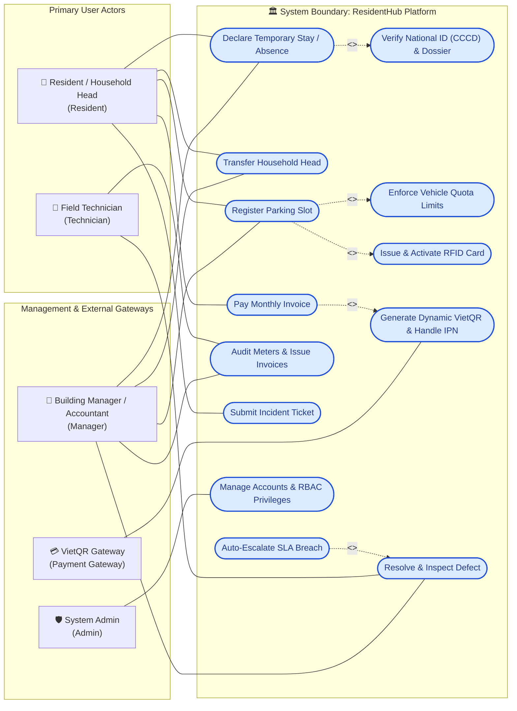

---

### 2.2. Apartment & Residence Subsystem

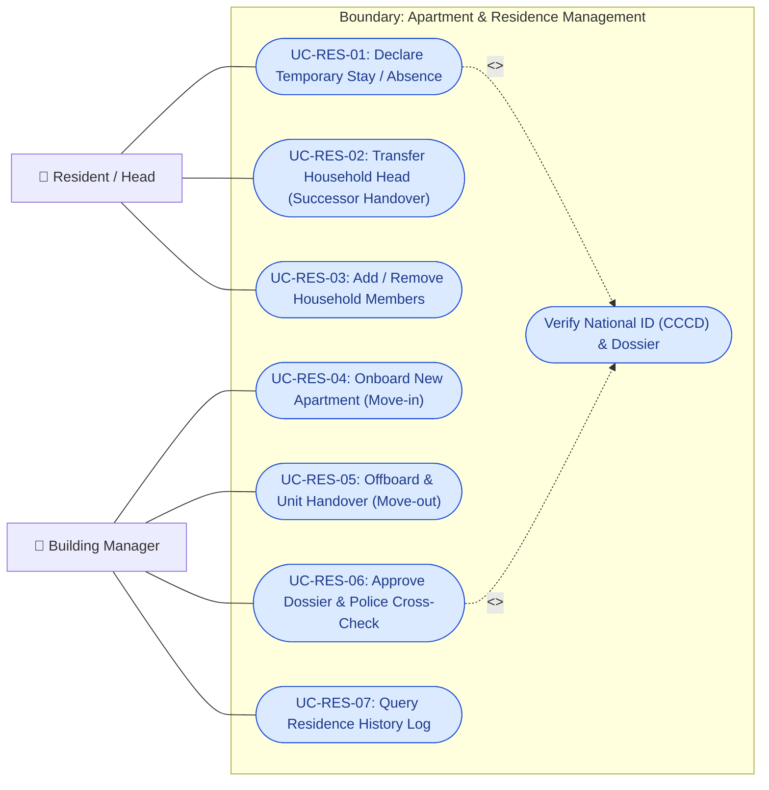

### 2.3. Vehicle & Parking Subsystem

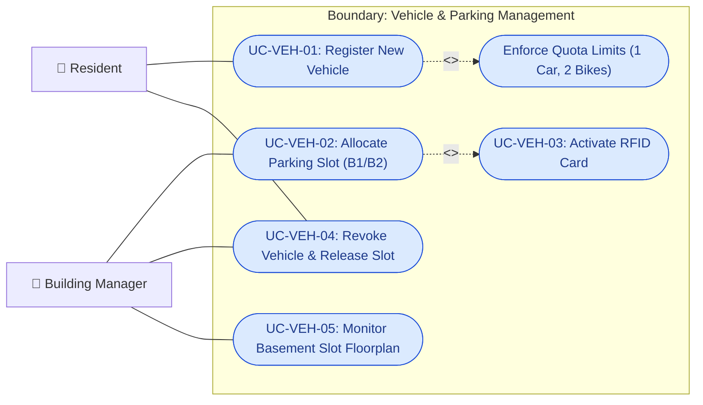

### 2.4. Utility & Billing Subsystem

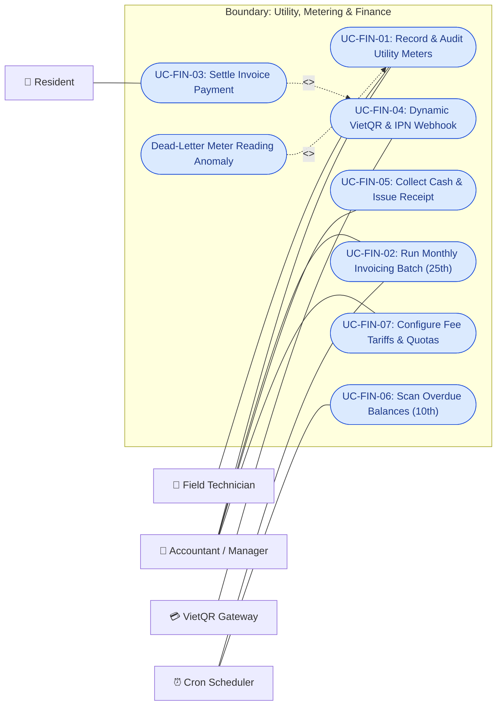

### 2.5. Incident & Maintenance Subsystem

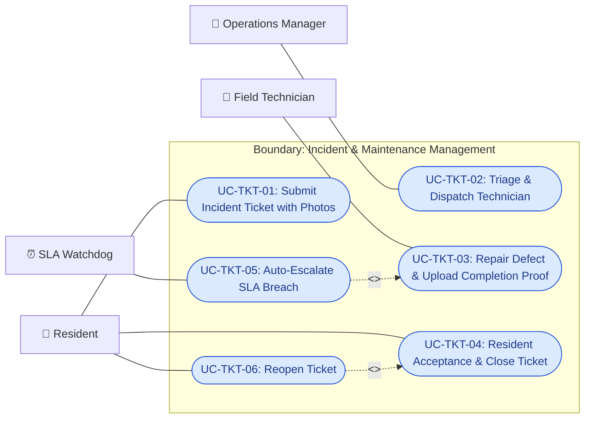

### 2.6. Security & Administration Subsystem

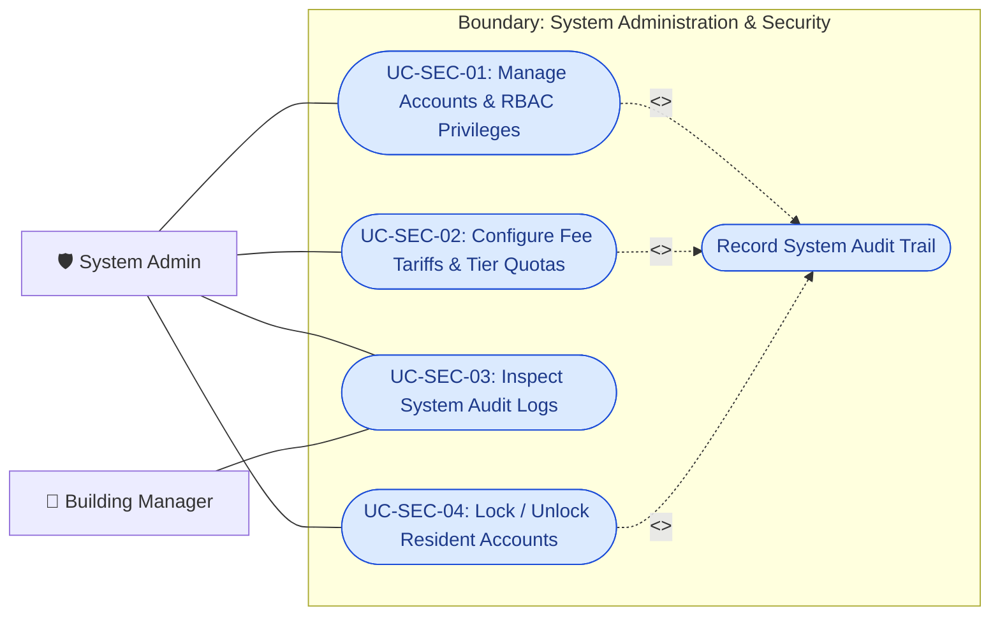

---

## 3. End-to-End Resident Journeys (4 Core Operational Scenarios)

*ResidentHub standardizes 4 complete end-to-end operational journeys:*

### 3.1. Journey 1: New Resident Onboarding (Move-in to Access)

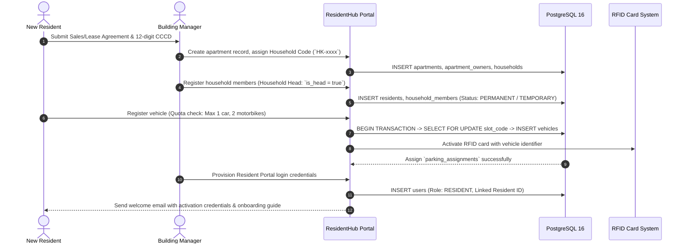

### 3.2. Journey 2: Monthly Fee Calculation & Settlement Cycle (Billing Cycle)

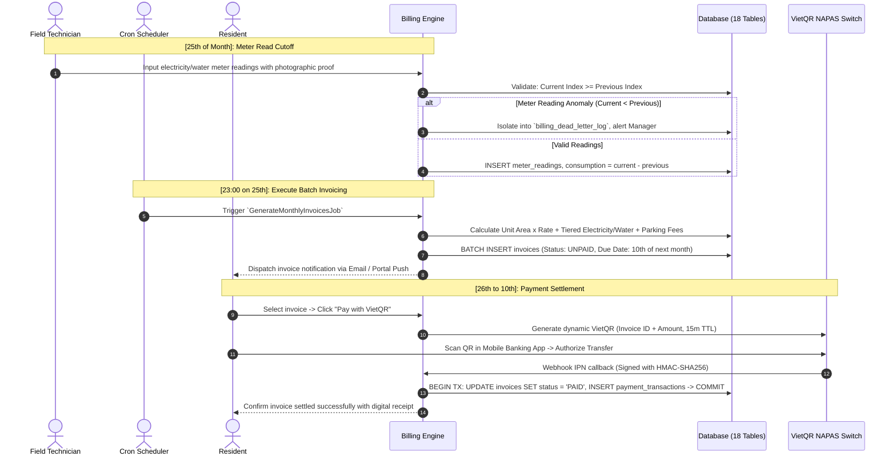

### 3.3. Journey 3: Incident Management & SLA Watchdog (Incident-to-Resolution)

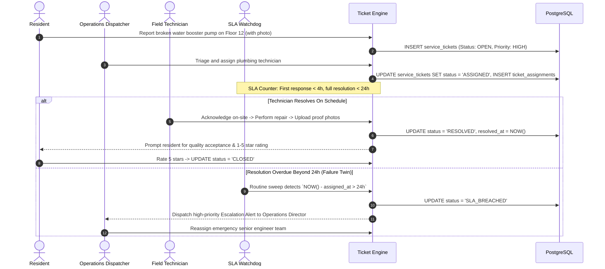

### 3.4. Journey 4: Move-out & Premises Handover (Offboarding / Move-out)

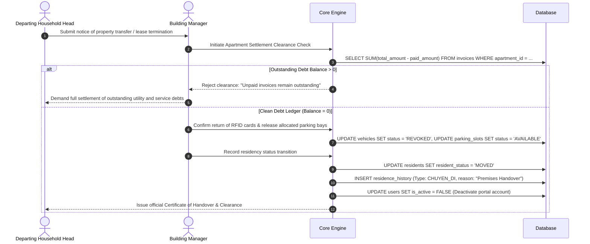

---

## 4. Fully-Dressed Use Case Specifications (6 Critical Use Cases)

### 4.1. `UC-RES-01`: Temporary Residence / Absence Declaration & Census Transitions

- **Use Case ID:** `UC-RES-01`
- **Business Name:** Declare Temporary Stay / Absence for Household Members
- **Primary Actors:** Resident / Household Head (`ACT-RES`), Building Manager (`ACT-MGR`)
- **Pre-conditions:**
  1. Apartment has an assigned Household Head with an active portal account (`users.is_active = true`).
  2. Declared member possesses a valid 12-digit Citizen Identity Card (CCCD).
- **Triggers:** Resident navigates to the "Residence Declaration" interface at `/cu-tru`.
- **Main Success Scenario (Happy Path):**
  1. Resident selects declaration category: `TAM_TRU` (Temporary Stay) or `TAM_VANG` (Temporary Absence).
  2. Resident inputs: Full Name, 12-digit CCCD, Date of Birth, Hometown, Justification, Effective Start Date, and Estimated End Date.
  3. Resident uploads front and back photos of CCCD along with supporting documents (Lease agreement, local authority exit permit).
  4. System verifies no duplicate active residency records exist for this CCCD across the `residents` table.
  5. System persists the application in `residence_records` with status `PENDING`.
  6. Building Manager receives notification and cross-checks the dossier with local ward police authorities.
  7. Manager inputs police clearance code (`police_verified_code`) and clicks "Approve".
  8. System transitions record status to `APPROVED`, updates `resident_status` accordingly (`TEMPORARY` or `ABSENT`), and logs an audit record in `residence_history`.
- **Failure Twins / Extensions:**
  - *2a. Duplicate CCCD actively registered as permanent resident in another unit:* System halts registration and prompts the user to complete a departure declaration (`CHUYEN_DI`) first.
  - *6a. Incomplete or invalid documentation:* Manager clicks "Reject" with required clarification notes. Record status transitions to `REJECTED`. Resident receives notification requesting supplemental documents.
  - *7a. Expiration of temporary status:* Nightly Cron Job detects past-due expiration dates, updates status to `EXPIRED`, and dispatches an automated renewal reminder 15 days prior.
- **Post-conditions:** Building census registry reflects verified resident headcount, fulfilling municipal administrative compliance.

---

### 4.2. `UC-RES-02`: Transfer Household Head (`is_head = true`) & Responsibility Handover

- **Use Case ID:** `UC-RES-02`
- **Business Name:** Reassign Household Head in Apartment Census Registry
- **Primary Actors:** Current Household Head, Successor Member, Building Manager (`ACT-MGR`)
- **Pre-conditions:**
  1. Apartment unit has exactly 1 active household head (`is_head = true`).
  2. Successor member is at least 18 years of age and holds `PERMANENT` residency status in the same unit.
- **Main Success Scenario (Happy Path):**
  1. Current head submits a notarized transfer agreement, or Building Manager receives validated inheritance/property deed transfer records.
  2. Manager opens the household administration screen at `/ho-dan`.
  3. Manager selects the successor member and clicks "Assign New Household Head".
  4. System executes an ACID Transaction Block:
     - Clear flag `is_head = false` for the previous head in `household_members`.
     - Set flag `is_head = true` for the designated successor.
     - Update relationship attributes for all other co-occupants relative to the new head (`relationship_to_head`).
     - Record residency status change in `residence_history` (Type: `NHAP_HO` / Head Handover).
  5. System commits the transaction and updates primary billing contact details.
- **Failure Twins / Extensions:**
  - *3a. Former head is deceased or departed without prior designation:* Manager triggers legal administrative override based on certified court or inheritance documents.
  - *4a. Database Invariant Constraint Violation:* If transaction checks detect 0 heads or > 1 head following mutation, transaction immediately triggers `ROLLBACK` and returns `422 Unprocessable Entity: INVALID_HOUSEHOLD_HEAD_COUNT`.
- **Post-conditions:** Invariant guarantees exactly 1 legal representative per apartment for financial billing and civic voting rights.

---

### 4.3. `UC-VEH-01`: Vehicle Registration & Basement Parking Slot Allocation

- **Use Case ID:** `UC-VEH-01`
- **Business Name:** Register Vehicle & Allocate Parking Slot (Quota Limit Enforcement & Concurrency Lock)
- **Primary Actors:** Resident (`ACT-RES`), Building Manager (`ACT-MGR`)
- **Pre-conditions:** Apartment has not exceeded quota allowances (Maximum 1 car, 2 motorbikes). Parking lot has available bays (`status = 'AVAILABLE'`).
- **Main Success Scenario (Happy Path):**
  1. Resident accesses `/phuong-tien-va-bai-do` and clicks "Register New Vehicle".
  2. Resident inputs License Plate, Vehicle Type (`CAR` / `MOTORBIKE`), Brand & Color, and uploads vehicle ownership registration card photo.
  3. System evaluates unit's active quota balance:
     $$\text{Current Cars} < 1 \quad \text{and} \quad \text{Current Motorbikes} < 2$$
  4. Manager verifies registration document validity and selects an available slot (e.g., Slot `B1-12`).
  5. System locks target slot row using a pessimistic lock (`SELECT ... FOR UPDATE` on `parking_slots`).
  6. System creates `vehicles` record, binds RFID card serial, links slot, and transitions slot status to `OCCUPIED`.
  7. System automatically schedules corresponding monthly parking fee line items into the upcoming billing cycle.
- **Failure Twins / Extensions:**
  - *3a. Quota Exceeded:* System halts registration immediately: *"Apartment has reached maximum allocation limit of 1 automobile. Please apply to join the waitlist."*
  - *4a. Duplicate License Plate:* System rejects with error indicating plate already exists within complex database, flagging potential duplicate card fraud.
  - *5a. Slot Reservation Race Condition Twin:* Two residents choose slot `B1-12` concurrently: First transaction commits successfully; second transaction is rejected with `409 Conflict: SLOT_ALREADY_RESERVED`. System refreshes available slot inventory for the second user.
- **Post-conditions:** Parking slot is atomically reserved, RFID card is programmed to operate basement barriers, and parking fees are appended to recurring monthly bills.

---

### 4.4. `UC-FIN-01`: Utility Meter Audit & Automated Monthly Invoicing Batch

- **Use Case ID:** `UC-FIN-01`
- **Business Name:** Record Utility Meters & Execute Scheduled Month-End Billing Batch
- **Primary Actors:** Field Technician (`ACT-TECH`), Chief Accountant (`ACT-MGR`), Cron Scheduler (`SYS`)
- **Pre-conditions:** Scheduled cutoff date reached (25th of the month). Active fee tariffs (`fee_tariffs`) exist.
- **Main Success Scenario (Happy Path):**
  1. Technician walks floors with mobile portal, reading physical electric and water meters.
  2. Technician enters new readings at `/phi-chung-cu`. System verifies:
     $$\text{New Index} \ge \text{Previous Index}$$
  3. System calculates consumption: $\text{Consumption} = \text{Current} - \text{Previous}$.
  4. Promptly at 23:00 on the 25th, Cron Job `GenerateMonthlyInvoicesJob` initiates automatically:
     - Multiply apartment area $\times$ Management / Service fee unit price.
     - Calculate progressive tiered water and electricity consumption based on active `fee_tariffs`.
     - Multiply active registered vehicles $\times$ Vehicle parking fee rates.
     - Calculate total invoice amount = Service Fee + Water + Electricity + Parking.
  5. System generates unique invoice code (e.g., `INV-202510-1205`) and itemized breakdown records in `invoice_items`.
  6. Invoice status initialized as `UNPAID` with payment due date set to the 10th of the following month.
  7. System automatically dispatches invoice statements with itemized breakdowns via Email and portal notification to household heads.
- **Failure Twins / Extensions:**
  - *2a. Current Index < Previous Index (Dead-Letter Isolation):* Caused by manual entry typo or mechanical meter rollover: System isolates anomaly into `billing_dead_letter_log`, suspends invoice generation for that specific unit, and triggers alert to Chief Accountant. Batch processing for remaining 999 apartments completes without interruption.
  - *4a. Unit with outstanding previous balances:* Outstanding arrears are aggregated into a "Previous Arrears" line item on the new statement with service disconnection warning threshold.
- **Post-conditions:** 100% of apartment units receive transparent, itemized statements ready for digital VietQR settlement.

---

### 4.5. `UC-FIN-02`: VietQR Invoice Payment (with Failure Twin Handling)

- **Use Case ID:** `UC-FIN-02`
- **Business Name:** Settle Monthly Utility Invoices via Dynamic VietQR NAPAS Gateway
- **Primary Actors:** Resident (`ACT-RES`), VietQR Gateway / Banking Switch (`EXT-BANK`)
- **Pre-conditions:** Target invoice is in `UNPAID` or `PARTIAL` status.
- **Main Success Scenario (Happy Path):**
  1. Resident opens invoice details page at `/phi-chung-cu`.
  2. Resident clicks "Pay via VietQR".
  3. System renders dynamic NAPAS-compliant VietQR containing: Management Bank Account, Exact VND Amount, and Transfer Memo formatted as `RHUB <INVOICE_CODE>`.
  4. System opens a checkout session with 15-minute Time-To-Live (TTL), transitioning invoice status to `PAYMENT_PENDING`.
  5. Resident scans QR code using banking mobile app and authorizes transfer.
  6. Banking switch processes payment and issues IPN (Instant Payment Notification) Webhook to `/api/webhooks/vietqr`.
  7. System validates digital signature (HMAC-SHA256) and verifies invoice code and amount.
  8. System executes transactional update:
     - `invoices.paid_amount = invoices.total_amount`
     - `invoices.status = 'PAID'`
     - Insert `payment_transactions` record logging payment method `VIETQR` and bank reference code.
  9. Resident browser updates to "Paid" via WebSocket/SSE, accompanied by an instant digital receipt.
- **Failure Twins / Extensions:**
  - *4a. 15-Minute Expiration Twin:* If transfer is not completed within 15 minutes, checkout session expires, and invoice status reverts to `UNPAID`.
  - *6a. Webhook Replay / Duplicate Delivery (Idempotency Guard Twin):* Gateway retries webhook 3 times due to network blips: System queries `transaction_code` unique index. If already processed, system immediately returns HTTP 200 OK without updating balance twice.
  - *7a. Payment Discrepancy Twin:* Resident edits transfer amount or transfers insufficient sum: System records actual credited funds into `paid_amount`, transitions status to `PARTIAL` (if underpaid) or credits excess as prepaid balance toward next month, while opening a reconciliation ticket for the accounting department.
- **Post-conditions:** Financial transactions are recorded in real-time with zero discrepancy between bank switch logs and internal accounting ledgers.

---

### 4.6. `UC-TKT-01`: Incident Reporting & SLA-Monitored Resolution Pipeline

- **Use Case ID:** `UC-TKT-01`
- **Business Name:** Report Maintenance Incident & Manage SLA-Monitored Repair Dispatch
- **Primary Actors:** Resident (`ACT-RES`), Field Technician (`ACT-TECH`), Operations Manager (`ACT-MGR`), SLA Watchdog (`SYS`)
- **Pre-conditions:** Resident holds active, verified residency credentials within the residential complex.
- **Main Success Scenario (Happy Path):**
  1. Resident navigates to `/phan-anh-va-yeu-cau` and clicks "Submit New Request".
  2. Resident selects category: `DIEN` (Electrical), `NUOC` (Plumbing), `THANG_MAY` (Elevator), `AN_NINH` (Security), `VESINH` (Sanitation), enters detailed description, and attaches up to 3 scene photos.
  3. System creates a defect record in `service_tickets` (Status: `OPEN`, SLA Target: Initial response < 4h).
  4. Building Manager triages request, assigns qualified technical specialist, and clicks "Dispatch".
  5. System assigns ticket, transitions status to `ASSIGNED`, and pushes notification to technician's mobile device.
  6. Technician arrives on-site and updates status to `IN_PROGRESS`.
  7. Upon completing repair, Technician uploads proof photos of fixed equipment, inputs technical completion notes, and clicks "Resolve". Status transitions to `RESOLVED`.
  8. Resident receives inspection prompt: Resident confirms satisfaction, submits 1-5 star rating. Ticket transitions to `CLOSED`.
- **Failure Twins / Extensions:**
  - *3a. Duplicate or out-of-scope ticket:* Manager clicks "Reject" with recorded explanation. Status transitions to `REJECTED`.
  - *5a. SLA Breach & Escalation Twin:* Cron Watchdog detects ticket unassigned for > 4h or unresolved for > 24h, automatically flags ticket as `SLA_BREACHED`, and dispatches critical Escalation Alerts via SMS/Email to Building Director and Head of Operations.
  - *8a. Unsatisfactory Repair / Reopened Ticket Twin:* Within 48h of `RESOLVED` status, if resident indicates defect persists, ticket transitions to `REOPENED` with Priority 1 Emergency rating. If no feedback is submitted within 48h, system executes `Auto-Close`.
- **Post-conditions:** All maintenance defects include verifiable photographic proof, SLA response metrics are audited, and residential quality standards are upheld.

---

## 5. Use Case Traceability Matrix

This comprehensive cross-reference table allows system architects, QA engineers, and project leads to trace requirements end-to-end: **Business Requirement (Use Case) $\rightarrow$ User Interface (UI Route) $\rightarrow$ Internal Service $\rightarrow$ PostgreSQL Relational Tables (Schema.sql)**:

| Use Case ID | Functional Feature Name | Primary Actors | Target UI Route | Internal Business Service | Impacted Database Tables (Schema.sql) |
| :--- | :--- | :--- | :--- | :--- | :--- |
| **`UC-RES-01`** | Declare Temporary Stay / Absence | Resident, Manager | `/cu-tru`, `/lich-su-cu-tru` | `ResidenceService` | `residents`, `residence_records`, `residence_history` |
| **`UC-RES-02`** | Assign / Transfer Household Head | Resident, Manager | `/ho-dan` | `HouseholdService` | `households`, `household_members`, `residence_history` |
| **`UC-RES-03`** | Manage Household Members | Resident, Manager | `/ho-dan`, `/cu-dan` | `HouseholdService` | `residents`, `household_members` |
| **`UC-RES-04`** | Onboard New Apartment (Move-in) | Manager | `/can-ho`, `/ho-dan` | `ApartmentService` | `apartments`, `apartment_owners`, `households` |
| **`UC-RES-05`** | Unit Handover & Offboard (Move-out) | Manager | `/can-ho`, `/cu-tru` | `ApartmentService` | `residents`, `vehicles`, `parking_slots`, `users` |
| **`UC-VEH-01`** | Register Vehicle & Check Quota | Resident, Manager | `/phuong-tien-va-bai-do` | `VehicleParkingService` | `vehicles`, `parking_assignments` |
| **`UC-VEH-02`** | Allocate Basement Parking Slot | Manager | `/phuong-tien-va-bai-do` | `VehicleParkingService` | `parking_slots`, `parking_assignments` |
| **`UC-VEH-03`** | Assign & Activate RFID Keycard | Manager | `/phuong-tien-va-bai-do` | `VehicleParkingService` | `vehicles`, `parking_slots` |
| **`UC-VEH-04`** | Revoke Vehicle & Release Slot | Resident, Manager | `/phuong-tien-va-bai-do` | `VehicleParkingService` | `vehicles`, `parking_slots`, `parking_assignments` |
| **`UC-FIN-01`** | Record Meters & Audit Utility Usage | Technician, Manager | `/phi-chung-cu` | `UtilityMeterService` | `meter_readings`, `billing_dead_letter_log` |
| **`UC-FIN-02`** | Run Batch Monthly Invoicing Batch | Manager, Cron | `/phi-chung-cu` | `InvoicingBillingService` | `invoices`, `invoice_items`, `fee_tariffs` |
| **`UC-FIN-03`** | Dynamic VietQR Payment Settlement | Resident, Gateway | `/phi-chung-cu` | `PaymentSettlementService` | `invoices`, `payment_transactions` |
| **`UC-FIN-04`** | Process Banking Webhook IPN Callback | Gateway | `/api/webhooks/vietqr` | `PaymentSettlementService` | `invoices`, `payment_transactions` |
| **`UC-FIN-05`** | Collect Cash & Issue Printed Receipt | Manager | `/phi-chung-cu` | `PaymentSettlementService` | `invoices`, `payment_transactions` |
| **`UC-FIN-06`** | Scan Overdue Balances & Late Fees | Cron | Background Batch | `InvoicingBillingService` | `invoices`, `system_logs` |
| **`UC-TKT-01`** | Submit Incident Ticket with Photos | Resident | `/phan-anh-va-yeu-cau` | `ServiceTicketService` | `service_tickets` |
| **`UC-TKT-02`** | Triage & Dispatch Field Technician | Manager | `/phan-anh-va-yeu-cau` | `ServiceTicketService` | `service_tickets`, `ticket_assignments` |
| **`UC-TKT-03`** | Resolve Defect & Upload Proof | Technician | `/phan-anh-va-yeu-cau` | `ServiceTicketService` | `service_tickets` |
| **`UC-TKT-04`** | Confirm Acceptance & Close Ticket | Resident | `/phan-anh-va-yeu-cau` | `ServiceTicketService` | `service_tickets` |
| **`UC-TKT-05`** | Auto-Escalate Overdue SLA Breaches | Cron Watchdog | Background Worker | `ServiceTicketService` | `service_tickets`, `system_logs` |
| **`UC-SEC-01`** | Manage Accounts & RBAC Privileges | Admin | `/nguoi-dung` | `IdentityAccessService` | `users`, `system_logs` |
| **`UC-SEC-02`** | Configure Fee Tariffs & Tier Limits | Admin | `/cai-dat` | `InvoicingBillingService` | `fee_tariffs`, `system_logs` |
