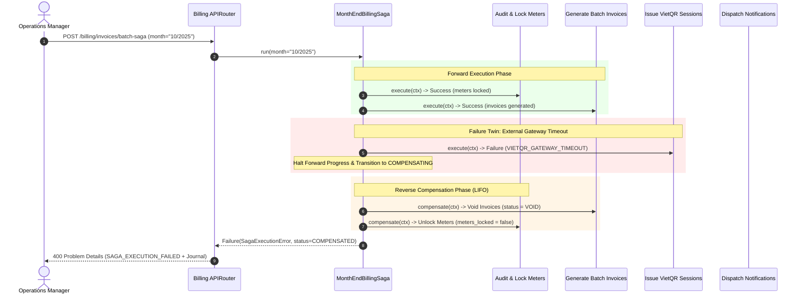

# ADR-0011: Saga Orchestration Engine with Reverse Compensations for Multi-Step Workflows

## Context and Problem Statement

In the ResidentHub building management ecosystem, certain business operations span multiple distinct subdomains and third-party boundaries. The prime example is **Month-End Batch Billing & Settlement (`MonthEndBillingSaga`)**, which involves:
1. Auditing utility meter readings (water, electricity) and locking them against concurrent modifications.
2. Calculating graduated tiered tariffs (water & power brackets), apartment maintenance quotas, and underground parking slot fees to generate batch invoice ledger records.
3. Invoking the VietQR NAPAS-247 gateway to issue dynamic payment sessions with cryptographic EMVCo payloads and 15-minute TTL expiration.
4. Dispatching multi-channel notifications (SMS, email, push notices) to apartment household heads.

In distributed and service-oriented architectures, attempting to wrap these heterogeneous operations inside a single synchronous ACID database transaction causes critical liabilities:
- **Long-Held Locks:** Network calls to external payment providers (VietQR) or notification dispatchers hold database rows/locks open for seconds, causing transaction pool exhaustion and deadlocks.
- **Partial Failure & Inconsistency:** If Step 3 (VietQR gateway timeout) or Step 4 (notification provider outage) fails, a standard partial database commit leaves resident accounts in an indeterminate state (e.g. invoices issued without payment QRs, or meters permanently locked).
- **Parity with FlowX Standards:** Modeled after `votrongdao/FlowX` architectural workflows, multi-step business transactions must provide explicit failure twins and deterministic backward compensation guarantees.

## Decision Drivers

* **Guaranteed Eventual Consistency:** Any intermediate failure must automatically roll back all previously committed side-effects.
* **Deterministic Reverse Compensation (LIFO):** Compensations must run in strict reverse order of execution ($k-1 \rightarrow k-2 \dots \rightarrow 1$) to prevent referential integrity violations.
* **First-Class Result Pattern Integration:** Native interop with ResidentHub's `Result[T, DomainError]` (ADR-0010); failures return typed `Failure` values rather than uncontrolled exceptions.
* **Durable Step Journaling & Auditability:** Every step state (`STARTED`, `COMPLETED`, `FAILED`, `COMPENSATING`, `COMPENSATED`) must be logged with timestamps and diagnostic metadata for auditing and post-mortem analysis.
* **Operational Testability:** Support simulation hooks (`simulateFailureStep`) to verify compensation pathways in automated test suites and operational chaos drills.

## Considered Options

* **Option 1: Two-Phase Commit (2PC) / Distributed Transactions**
* **Option 2: Choreography-Based Saga (Asynchronous Event Bus)**
* **Option 3: Orchestrated Saga Engine with Typed Steps and Reverse Compensation (FlowX Style)**

## Decision Outcome

Chosen option: **Option 3: Orchestrated Saga Engine with Typed Steps and Reverse Compensation**, because it provides explicit centralized coordination, zero external broker dependencies (such as Kafka/RabbitMQ) for local workflow execution, and direct deterministic testability.

### Positive Consequences

* **Explicit Workflow Visibility:** The sequence of steps and their respective compensations are clearly defined in a single file (`MonthEndBillingSaga`), rather than scattered across disparate event subscribers.
* **Automatic Rollback Guarantee:** If Step 3 (VietQR) fails, Step 2 voids generated invoices (`invoices_voided = True`) and Step 1 unlocks utility meters (`meters_locked = False`) automatically.
* **Audit Trail via Step Journal:** The `SagaContext` records an immutable audit log of each step's execution time, error codes, and compensation status.
* **RFC 7807 Integration:** When a saga aborts, the API presentation layer receives `SagaExecutionError` and transforms it into an RFC 7807 Problem Details payload with HTTP 400 and full compensation diagnostics.
* **Fast In-Memory & Async Performance:** The lightweight engine executes natively via Python `asyncio` with minimal overhead.

### Negative Consequences

* **Compensations Must Be Idempotent:** Step developers must ensure that `compensate(ctx)` can be executed safely even if partially run or re-invoked.
* **Orchestrator Centralization:** For workflows spanning separate microservices, the orchestrator becomes a point of coordination (appropriate for ResidentHub's current modular monolith).

---

## Workflow Mechanics & Failure Twins

### Happy Path vs. Step 3 Failure Twin

---

## Pros and Cons of the Options

### Option 1: Two-Phase Commit (2PC)
* Good: Strong ACID consistency across databases.
* Bad: Not supported across external HTTP APIs (VietQR, SMS gateways); blocking protocol susceptible to coordinator failure and thread exhaustion.

### Option 2: Choreography-Based Saga
* Good: Loosely coupled microservice architecture.
* Bad: Difficult to trace complete workflow state; complex debugging; requires standing message bus infrastructure (Kafka/RabbitMQ); difficult to test failure twins synchronously.

### Option 3: Orchestrated Saga Engine (Selected)
* Good: Clean typed abstraction; immediate feedback; deterministic LIFO reverse compensation; step journaling; zero message broker bloat; fully testable via pytest.
* Bad: Step dependencies are managed centrally within the orchestrator class.

---

## Validation

Verified via automated test suites in `backend/tests/test_saga_engine.py` (6 passed in 0.36s):
- **Happy Path:** All 4 steps complete $\rightarrow$ `status == COMPLETED`, 3 invoices generated, 3 VietQR sessions issued, notifications dispatched.
- **Failure Twin at Step 3:** VietQR timeout simulated $\rightarrow$ Step 2 marks invoices `VOID` $\rightarrow$ Step 1 unlocks meter readings $\rightarrow$ saga status reaches `COMPENSATED`.
- **Failure Twin at Step 1:** Audit failure $\rightarrow$ immediate abort with 0 compensations needed.
- **RFC 7807 API Endpoint:** `POST /api/v1/billing/invoices/batch-saga` returns HTTP 200 on success, and HTTP 400 with RFC 7807 problem details when simulated failure is triggered.

---

## Links

* [backend/app/core/saga.py](../../backend/app/core/saga.py)
* [backend/app/services/sagas/billing_batch_saga.py](../../backend/app/services/sagas/billing_batch_saga.py)
* [backend/tests/test_saga_engine.py](../../backend/tests/test_saga_engine.py)
* [ADR-0010: Result Pattern over Exceptions](ADR-0010-result-pattern-over-exceptions.md)
* [09-SYSTEM_WORKFLOWS_AND_SPECS.md](../09-SYSTEM_WORKFLOWS_AND_SPECS.md)
